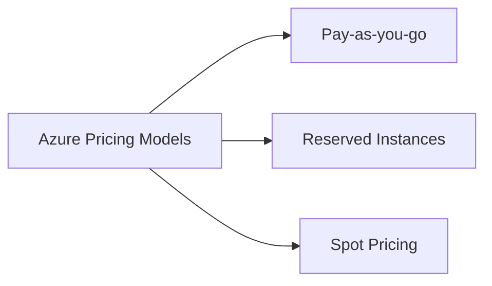
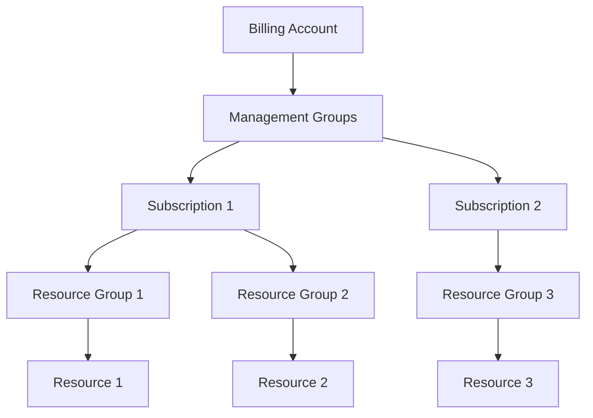

# Azure Costs Guide

## Index

1. [Introduction](#1-introduction)
    - [Overview of Azure Costs](#overview-of-azure-costs)
    - [Objectives of This Guide](#objectives-of-this-guide)
2. [Cost Management Fundamentals](#2-cost-management-fundamentals)
    - [Understanding Azure Pricing Models](#understanding-azure-pricing-models)
      - [Pay-as-you-go](#pay-as-you-go)
      - [Reserved Instances](#reserved-instances)
      - [Spot Pricing](#spot-pricing)
    - [Billing and Subscriptions Overview](#billing-and-subscriptions-overview)
      - [Billing Accounts](#billing-accounts)
      - [Subscriptions Structure and Hierarchy](#subscriptions-structure-and-hierarchy)
    - [Cost Management Toolset in Azure](#cost-management-toolset-in-azure)
      - [Azure Cost Management and Billing Service](#azure-cost-management-and-billing-service)
      - [Azure Pricing Calculator](#azure-pricing-calculator)
      - [Azure TCO (Total Cost of Ownership) Calculator](#azure-tco-total-cost-of-ownership-calculator)
3. [Budgeting and Cost Control](#3-budgeting-and-cost-control)
    - [Creating and Managing Budgets](#creating-and-managing-budgets)
      - [Setting Up Cost Alerts](#setting-up-cost-alerts)
      - [Monitoring Budgets through Azure Portal](#monitoring-budgets-through-azure-portal)
    - [Resource Tagging for Cost Allocation](#resource-tagging-for-cost-allocation)
      - [Best Practices for Tagging Resources](#best-practices-for-tagging-resources)
      - [Tag-based Cost Analysis](#tag-based-cost-analysis)
    - [Setting Spending Limits](#setting-spending-limits)
      - [Configuring Azure Spending Limits and Alerts](#configuring-azure-spending-limits-and-alerts)
4. [Optimizing Azure Costs](#4-optimizing-azure-costs)
    - [Right-Sizing Resources](#right-sizing-resources)
      - [Recommendations for Resizing Virtual Machines (VMs)](#recommendations-for-resizing-virtual-machines-vms)
      - [Optimizing Storage and Databases](#optimizing-storage-and-databases)
    - [Utilizing Azure Advisor](#utilizing-azure-advisor)
      - [How Azure Advisor Helps Reduce Costs](#how-azure-advisor-helps-reduce-costs)
    - [Identifying and Managing Idle Resources](#identifying-and-managing-idle-resources)
      - [Automating Shutdown/Start Schedules for VMs](#automating-shutdownstart-schedules-for-vms)
      - [Identifying Underutilized Resources Using Azure Monitor](#identifying-underutilized-resources-using-azure-monitor)
    - [Reserved Instances and Savings Plans](#reserved-instances-and-savings-plans)
      - [When and How to Use Reserved Instances](#when-and-how-to-use-reserved-instances)
      - [ROI Considerations for Long-term Projects](#roi-considerations-for-long-term-projects)
    - [Spot Instances and Low-Priority VMs](#spot-instances-and-low-priority-vms)
      - [Leveraging Spot VMs for Cost Savings](#leveraging-spot-vms-for-cost-savings)
5. [Monitoring and Reporting Costs](#5-monitoring-and-reporting-costs)
    - [Cost Analysis in the Azure Portal](#cost-analysis-in-the-azure-portal)
      - [Visualizing Costs with Charts and Tables](#visualizing-costs-with-charts-and-tables)
      - [Customizing Views for Resource Owners and Billing Periods](#customizing-views-for-resource-owners-and-billing-periods)
    - [Azure Cost Alerts](#azure-cost-alerts)
      - [Configuring Notifications for Unexpected Spending Spikes](#configuring-notifications-for-unexpected-spending-spikes)
    - [Automated Reporting](#automated-reporting)
      - [Using Azure Automation or Logic Apps to Send Cost Reports via Email](#using-azure-automation-or-logic-apps-to-send-cost-reports-via-email)
      - [Integrating Cost Data with Power BI for Deeper Analysis](#integrating-cost-data-with-power-bi-for-deeper-analysis)
6. [Cost Optimization Strategies for Specific Services](#6-cost-optimization-strategies-for-specific-services)
    - [Virtual Machines](#virtual-machines)
      - [Scaling Options](#scaling-options)
      - [Reserved Instances and Spot VMs](#reserved-instances-and-spot-vms)
    - [Azure App Services](#azure-app-services)
      - [Scaling Tiers](#scaling-tiers)
      - [Best Practices for Managing App Service Plans](#best-practices-for-managing-app-service-plans)
    - [Azure Storage](#azure-storage)
      - [Cool vs. Hot Storage](#cool-vs-hot-storage)
      - [Redundancy Settings](#redundancy-settings)
      - [Lifecycle Management](#lifecycle-management)
    - [Azure Networking](#azure-networking)
      - [Optimizing Bandwidth Costs](#optimizing-bandwidth-costs)
      - [VPN Usage](#vpn-usage)
      - [Network Design Considerations](#network-design-considerations)
7. [Governance and Policies for Cost Management](#7-governance-and-policies-for-cost-management)
    - [Azure Policies for Cost Management](#azure-policies-for-cost-management)
      - [Policy Enforcement to Prevent Expensive Resources](#policy-enforcement-to-prevent-expensive-resources)
    - [Role-Based Access Control (RBAC)](#role-based-access-control-rbac)
      - [Defining Roles to Prevent Unauthorized Deployments](#defining-roles-to-prevent-unauthorized-deployments)
    - [Cost Management Best Practices](#cost-management-best-practices)
      - [Tips for Team-Based Cost Control](#tips-for-team-based-cost-control)
      - [Recommended Governance Structures](#recommended-governance-structures)
8. [Tools and Integrations](#8-tools-and-integrations)
    - [Third-Party Cost Management Tools](#third-party-cost-management-tools)
      - [Popular Tools](#popular-tools)
         - [CloudHealth by VMware](#cloudhealth-by-vmware)
         - [Cloudability](#cloudability)
         - [Turbonomic](#turbonomic)
    - [Integration with Other Systems](#integration-with-other-systems)
      - [APIs for Pulling Cost Data into External Reporting Tools](#apis-for-pulling-cost-data-into-external-reporting-tools)
9. [Cost Case Studies and Scenarios](#9-cost-case-studies-and-scenarios)
    - [Real-World Examples](#real-world-examples)
      - [Example: SaaS Company Optimizes Azure Costs](#example-saas-company-optimizes-azure-costs)
    - [Cost-saving Tips from Enterprises](#cost-saving-tips-from-enterprises)
10. [Appendix](#10-appendix)
     - [Glossary of Terms](#glossary-of-terms)
     - [References and Links](#references-and-links)
11. [FAQs](#11-faqs)

## 1. Introduction

### Overview of Azure Costs

Managing cloud costs is a critical component of cloud governance. Microsoft Azure offers a vast array of services, each with its own pricing model and cost considerations. Without proper cost management, organizations may face unexpected expenses, inefficient resource utilization, and budget overruns. Understanding how Azure charges for services, and how to optimize these costs, is essential for maximizing the value of your cloud investment.

### Objectives of This Guide

This comprehensive guide aims to:

- **Demystify Azure's pricing models and billing structures**.
- **Provide actionable strategies for budgeting and cost control**.
- **Offer techniques for optimizing and reducing Azure costs**.
- **Explain how to monitor and report on Azure spending**.
- **Present cost optimization strategies tailored to specific Azure services**.
- **Detail governance practices and policies for effective cost management**.
- **Introduce tools and integrations to enhance cost management efforts**.

By the end of this guide, you should have a thorough understanding of how to manage, monitor, and optimize your Azure costs effectively.

---

## 2. Cost Management Fundamentals

### Understanding Azure Pricing Models

Azure provides flexible pricing models to suit different business needs and workloads.

#### Pay-as-you-go

- **Description**: Pay only for what you use, with no upfront commitment.
- **Use Cases**:
  - Ideal for unpredictable workloads.
  - Suitable for development and testing environments.
- **Advantages**:
  - Flexibility to scale resources up or down.
  - No long-term commitment.

#### Reserved Instances

- **Description**: Commit to a one-year or three-year term for certain resources like Virtual Machines (VMs) and receive significant discounts.
- **Use Cases**:
  - Predictable workloads with consistent usage.
  - Long-term projects where resource needs are known.
- **Advantages**:
  - Cost savings of up to 72% compared to pay-as-you-go pricing.
  - Reservation can be shared across subscriptions within a billing context.

#### Spot Pricing

- **Description**: Purchase unused Azure capacity at deep discounts for interruptible workloads.
- **Use Cases**:
  - Batch processing.
  - Stateless applications.
  - Testing and development workloads.
- **Advantages**:
  - Cost savings of up to 90%.
  - Access to high-end compute resources at lower costs.

**Mermaid Diagram: Azure Pricing Models**



### Billing and Subscriptions Overview

Understanding Azure's billing hierarchy is essential for managing and allocating costs.

#### Billing Accounts

- **Definition**: The top-level entity that represents your agreement with Microsoft to use Azure services.
- **Types**:
  - **Enterprise Agreement (EA)**: For larger organizations with significant Azure usage.
  - **Microsoft Customer Agreement (MCA)**: For organizations purchasing Azure directly.

#### Subscriptions Structure and Hierarchy

- **Subscription**: An Azure subscription is a logical container used to provision resources.
- **Hierarchy**:
  - **Management Groups**: Organize subscriptions into a hierarchy for policy and access management.
  - **Subscriptions**: Hold the resources and are associated with a billing account.
  - **Resource Groups**: Logical containers for resources within a subscription.

**Mermaid Diagram: Azure Billing Structure**



### Cost Management Toolset in Azure

Azure provides several tools to help you estimate, track, and optimize your cloud spending.

#### Azure Cost Management and Billing Service

- **Features**:
  - Monitor cloud spending across subscriptions.
  - Analyze spending patterns.
  - Set budgets and create spending alerts.
- **Benefits**:
  - Visibility into cost drivers.
  - Ability to forecast future spending.
  - Optimize resource usage.

#### Azure Pricing Calculator

- **Purpose**: Estimate the cost of Azure services before deployment.
- **Functionality**:
  - Add services to your estimate.
  - Configure service parameters.
  - View detailed pricing breakdowns.
- **Use**:
  - Planning budgets.
  - Comparing different service options.

#### Azure TCO (Total Cost of Ownership) Calculator

- **Purpose**: Estimate the cost savings of migrating workloads to Azure compared to an on-premises environment.
- **Functionality**:
  - Input details about your current infrastructure.
  - Adjust assumptions for power usage, IT labor, etc.
  - View a detailed TCO report.
- **Use**:
  - Building business cases for cloud migration.
  - Understanding long-term cost implications.

---

## 3. Budgeting and Cost Control

### Creating and Managing Budgets

Setting budgets helps you plan and track your Azure spending.

#### Setting Up Cost Alerts

- **Steps**:
  1. Navigate to the Azure Portal.
  2. Go to **Cost Management + Billing**.
  3. Select **Budgets** and create a new budget.
  4. Define the budget amount and time period.
  5. Set alert thresholds (e.g., 80%, 100% of the budget).
  6. Configure notification recipients and channels.

- **Benefits**:
  - Proactive notifications.
  - Prevent cost overruns.
  - Encourage accountability.

#### Monitoring Budgets through Azure Portal

- **Features**:
  - Visual budget tracking with charts.
  - Comparison of actual spend vs. budgeted amounts.
  - Forecasting tools to predict end-of-period spending.

- **Tips**:
  - Regularly review budget reports.
  - Adjust budgets as needed based on consumption trends.
  - Include relevant stakeholders in budget communications.

### Resource Tagging for Cost Allocation

Tags help organize resources and analyze costs.

#### Best Practices for Tagging Resources

- **Consistency**: Establish a standard tagging taxonomy.
- **Key Tags**:
  - `Department`: Identifies the department responsible (e.g., Finance, IT).
  - `Project`: Indicates the project or application.
  - `Environment`: Specifies the environment (e.g., Development, Testing, Production).
  - `Owner`: Points to the person or team responsible.

- **Implementation**:
  - Apply tags during resource creation.
  - Use policies to enforce mandatory tags.

#### Tag-based Cost Analysis

- **Functionality**:
  - Filter cost reports by tags.
  - Allocate costs to departments or projects.
  - Identify spending patterns across different tags.

- **Benefits**:
  - Improved cost transparency.
  - Easier chargeback and showback processes.
  - Enhanced decision-making abilities.

### Setting Spending Limits

Setting spending limits can prevent accidental overages.

#### Configuring Azure Spending Limits and Alerts

- **Spending Limits**:
  - Available for certain subscription types (e.g., Azure Free Account).
  - Automatically suspends services when the spending limit is reached.

- **Spending Alerts**:
  - Available for all subscription types.
  - Alert administrators when spending reaches defined thresholds.
  - Does not suspend services, allowing critical applications to continue running.

- **Implementation**:
  - Use the **Budgets** feature to set up alerts.
  - Integrate with Azure Monitor for advanced alerting.

---

## 4. Optimizing Azure Costs

### Right-Sizing Resources

Ensure that your resources are appropriately sized for their workloads.

#### Recommendations for Resizing Virtual Machines (VMs)

- **Analyze Performance Metrics**:
  - Use Azure Monitor to evaluate CPU, memory, and disk utilization.
  - Identify VMs with low utilization.

- **Adjust VM Sizes**:
  - Downgrade VMs to smaller sizes if underutilized.
  - Consider scaling out (using more smaller VMs) vs. scaling up.

- **Use Burstable VMs**:
  - For workloads with intermittent usage, consider B-series VMs that accrue credits during idle times.

#### Optimizing Storage and Databases

- **Storage**:
  - Use appropriate disk types (Standard HDD, Standard SSD, Premium SSD).
  - Delete unattached disks.

- **Databases**:
  - Configure auto-pause for Azure SQL Database Serverless.
  - Use elastic pools to share resources among databases.

### Utilizing Azure Advisor

Azure Advisor provides personalized recommendations to optimize costs.

#### How Azure Advisor Helps Reduce Costs

- **Cost Recommendations**:
  - Identifies idle VMs and suggests shutting them down.
  - Recommends purchasing reserved instances.

- **Accessing Azure Advisor**:
  - Navigate to **Advisor** in the Azure Portal.
  - Review recommendations under the **Cost** category.

- **Implementing Recommendations**:
  - Follow guided steps to implement changes.
  - Schedule modifications during maintenance windows if necessary.

### Identifying and Managing Idle Resources

Reduce costs by eliminating unnecessary resources.

#### Automating Shutdown/Start Schedules for VMs

- **Azure Automation**:
  - Create runbooks to schedule VM shutdowns during off-hours.
  - Use tags to identify VMs for shutdown.

- **Azure Logic Apps**:
  - Build workflows to power on/off resources.
  - Create HTTP triggers for manual control if needed.

- **Example**:

  ```powershell
  # Sample Azure Automation Runbook to Stop VMs
  Stop-AzVM -ResourceGroupName $ResourceGroup -Name $VMName -Force
  ```

#### Identifying Underutilized Resources Using Azure Monitor

- **Set Up Alerts**:
  - Define thresholds for low CPU or memory usage.
  - Receive notifications when resources are underutilized.

- **Analysis**:
  - Use collected data to identify trends.
  - Make informed decisions on resource resizing or decommissioning.

### Reserved Instances and Savings Plans

Commit to longer terms for predictable workloads.

#### When and How to Use Reserved Instances

- **Evaluation**:
  - Analyze usage patterns to identify consistent workloads.
  - Use the **Utilization** report in Cost Management.

- **Purchasing**:
  - Purchase reservations via the Azure Portal.
  - Choose between up-front or monthly payment options.

- **Sharing Reservations**:
  - Scope reservations to either a subscription or a shared scope across all eligible subscriptions.

#### ROI Considerations for Long-term Projects

- **Calculate Potential Savings**:
  - Compare reserved instance pricing vs. pay-as-you-go costs.

- **Assess Flexibility Needs**:
  - Consider the potential for workload changes.
  - Understand reservation cancellation and exchange policies.

### Spot Instances and Low-Priority VMs

Use spare capacity for cost-effective computing.

#### Leveraging Spot VMs for Cost Savings

- **Understanding Spot VMs**:
  - VMs can be evicted when Azure needs capacity.
  - Not suitable for critical workloads.

- **Use Cases**:
  - Batch processing.
  - High-performance computing (HPC).
  - CI/CD workloads.

- **Implementing Spot VMs**:
  - Select **Use Spot Instances** during VM creation.
  - Set a maximum price to control costs.

---

## 5. Monitoring and Reporting Costs

### Cost Analysis in the Azure Portal

Visual tools to analyze and understand spending.

#### Visualizing Costs with Charts and Tables

- **Access**:
  - Go to **Cost Management + Billing** > **Cost Analysis**.
- **Features**:
  - View costs over time.
  - Group costs by resource, resource group, or tags.
- **Customization**:
  - Change chart types (area, column, donut).
  - Apply filters to focus on specific services or regions.

#### Customizing Views for Resource Owners and Billing Periods

- **Saved Views**:
  - Save customized filters and views for reuse.
  - Share saved views with team members.

- **Resource Owners**:
  - Set up views grouped by owner tags.
  - Enable owners to monitor their own resource costs.

### Azure Cost Alerts

Stay informed about spending anomalies.

#### Configuring Notifications for Unexpected Spending Spikes

- **Anomaly Detection**:
  - Enable anomaly alerts in Cost Management.
  - Configure sensitivity levels for spike detection.

- **Notifications**:
  - Choose delivery methods (email, SMS).
  - Integrate with ITSM tools or webhook endpoints.

- **Response Plan**:
  - Establish procedures for investigating alerts.
  - Include relevant teams in notifications.

### Automated Reporting

Streamline cost reporting processes.

#### Using Azure Automation or Logic Apps to Send Cost Reports via Email

- **Azure Automation**:
  - Schedule PowerShell scripts to generate reports.
  - Use the `Get-AzConsumptionUsageDetail` cmdlet.

- **Logic Apps**:
  - Create workflows to extract cost data and send emails.
  - Integrate with Office 365 for email delivery.

- **Example Logic App Workflow**:

  ```mermaid
  graph LR
      Trigger[Scheduled Trigger] --> GetData[Get Cost Data]
      GetData --> Format[Format Report]
      Format --> Email[Send Email]
  ```

#### Integrating Cost Data with Power BI for Deeper Analysis

- **Connecting Data Sources**:
  - Use Azure Cost Management connector in Power BI.
  - Schedule data refreshes for up-to-date reporting.

- **Building Reports**:
  - Create interactive dashboards.
  - Use visuals to represent spending trends and forecasts.

- **Sharing Insights**:
  - Publish reports to Power BI service.
  - Share with stakeholders or embed in applications.

---

## 6. Cost Optimization Strategies for Specific Services

### Virtual Machines

#### Scaling Options

- **Vertical Scaling**:
  - Adjust VM size to increase or decrease resources.
- **Horizontal Scaling**:
  - Use Virtual Machine Scale Sets (VMSS) to add or remove VM instances.

#### Reserved Instances and Spot VMs

- **Combining Strategies**:
  - Use reserved instances for baseline capacity.
  - Use spot VMs for additional, non-critical capacity.

- **Monitoring Usage**:
  - Regularly review VM utilization.
  - Adjust reservations as workloads change.

### Azure App Services

#### Scaling Tiers

- **App Service Plans**:
  - Choose the right tier (Basic, Standard, Premium) based on features and performance needs.
- **Scaling**:
  - Configure auto-scaling rules.
  - Scale based on metrics like CPU usage or HTTP queue length.

#### Best Practices for Managing App Service Plans

- **Consolidation**:
  - Host multiple apps in a single App Service Plan if they share similar performance requirements.
- **Cleanup**:
  - Remove unused or stopped App Service Plans to avoid unnecessary charges.

### Azure Storage

#### Cool vs. Hot Storage

- **Hot Tier**:
  - Optimized for frequent access.
  - Higher storage costs, lower access costs.

- **Cool Tier**:
  - For infrequently accessed data.
  - Lower storage costs, higher access costs.

- **Archive Tier**:
  - For rarely accessed data.
  - Lowest storage costs, highest access latency.

#### Redundancy Settings

- **Options**:
  - **Locally Redundant Storage (LRS)**: Replicates data within a single datacenter.
  - **Zone-Redundant Storage (ZRS)**: Replicates data across multiple availability zones.
  - **Geo-Redundant Storage (GRS)**: Replicates data to a secondary region.

- **Cost Considerations**:
  - Higher redundancy options cost more.
  - Choose based on data durability and compliance needs.

#### Lifecycle Management

- **Policies**:
  - Define rules to transition blobs to cooler tiers based on last modified date.

- **Implementation**:
  - Use Azure Portal or ARM templates to configure policies.

- **Benefits**:
  - Automated cost optimization.
  - Reduced storage costs over time.

### Azure Networking

#### Optimizing Bandwidth Costs

- **Azure CDN**:
  - Cache content at edge locations to reduce data transfer costs.

- **Compression**:
  - Enable compression for data transfers.

#### VPN Usage

- **Choosing the Right VPN SKU**:
  - Match VPN Gateway SKU to bandwidth needs.

- **Alternatives**:
  - Use Azure Virtual WAN for simplified connectivity.

#### Network Design Considerations

- **Data Transfer Costs**:
  - Intra-region virtual network traffic is free.
  - Inter-region data transfers incur costs.

- **Network Peering**:
  - Use Virtual Network Peering to connect networks within a region.

- **Avoid Unnecessary Data Transfers**:
  - Keep resources that communicate frequently in the same region.

---

## 7. Governance and Policies for Cost Management

### Azure Policies for Cost Management

Implement policies to enforce cost controls.

#### Policy Enforcement to Prevent Expensive Resources

- **Examples**:
  - Deny creation of VMs larger than a specific size.
  - Restrict use of premium storage accounts.

- **Creating Policies**:
  - Use built-in policies or create custom definitions.
  - Assign policies to subscriptions or resource groups.

- **Sample Policy Definition**:

  ```json
  {
    "policyRule": {
      "if": {
        "field": "type",
        "equals": "Microsoft.Compute/virtualMachines"
      },
      "then": {
        "effect": "audit"
      }
    },
    "parameters": {},
    "metadata": {
      "version": "1.0.0",
      "category": "Cost Management"
    }
  }
  ```

### Role-Based Access Control (RBAC)

Control who can perform cost-impacting actions.

#### Defining Roles to Prevent Unauthorized Deployments

- **Built-in Roles**:
  - **Cost Management Contributor**: Can view costs and manage cost configuration.
  - **Virtual Machine Contributor**: Can manage VMs, but cannot access the virtual network or storage accounts.

- **Custom Roles**:
  - Create roles with specific permissions tailored to organizational needs.

- **Best Practices**:
  - Follow the principle of least privilege.
  - Regularly review access assignments.

### Cost Management Best Practices

#### Tips for Team-Based Cost Control

- **Education**:
  - Train teams on cloud cost awareness.
  - Share cost optimization tips and tools.

- **Accountability**:
  - Assign cost responsibilities to team leads.
  - Use chargeback or showback models.

#### Recommended Governance Structures

- **Cloud Center of Excellence (CCoE)**:
  - Establish a cross-functional team to oversee cloud governance.

- **Policies and Guidelines**:
  - Develop clear policies on resource provisioning and management.

- **Continuous Improvement**:
  - Regularly review policies and practices.
  - Adapt to changing business needs.

---

## 8. Tools and Integrations

### Third-Party Cost Management Tools

Consider external tools for enhanced capabilities.

#### Popular Tools

##### CloudHealth by VMware

- **Features**:
  - Multi-cloud cost management.
  - Right-sizing recommendations.
  - Policy enforcement.

- **Benefits**:
  - Consolidated view of costs across clouds.
  - Advanced reporting and dashboards.

##### Cloudability

- **Features**:
  - Real-time cost analytics.
  - Budgeting and forecasting tools.
  - Reserved instance management.

- **Benefits**:
  - Detailed cost breakdowns.
  - Customizable reports.

##### Turbonomic

- **Features**:
  - Automated resource optimization.
  - Performance and cost management.
  - Supports hybrid cloud environments.

- **Benefits**:
  - Proactive optimization.
  - Automated actions to adjust resources.

### Integration with Other Systems

#### APIs for Pulling Cost Data into External Reporting Tools

- **Azure Consumption APIs**:
  - Access detailed usage and cost data.
  - Supports integration with custom applications.

- **Using APIs**:
  - Authenticate using Azure AD.
  - Query cost data with parameters (e.g., time range, resource types).

- **Example Use Cases**:
  - Integrate with internal billing systems.
  - Create custom dashboards in tools like Splunk or Tableau.

---

## 9. Cost Case Studies and Scenarios

### Real-World Examples

#### Example: [Advanced analytics on big data](https://azure.com/e/14c58b2f552f4d259172b4de2879f894)

- **Discription**:
  - Transform your data into actionable insights using the best-in-class machine learning tools. This architecture allows you to combine any data at any scale, and to build and deploy custom machine learning models at scale.

- **Components**:

    <div style="display: flex; align-items: center; gap: 8px; margin-bottom: 8px;">
        <svg aria-hidden="true" aria-labelledby="svg-title-SynapseAnalytics-5de3a8ee-6b5a-4a07-863d-59f55d8d8323" id="svg-SynapseAnalytics-5de3a8ee-6b5a-4a07-863d-59f55d8d8323" viewBox="0 0 48 48" xmlns="http://www.w3.org/2000/svg" data-slug-id="synapse-analytics" role="img" width="24" height="24">
            <path d="M24.0616 1L4 12.4702V31.0999V32.323V35.3956L24.0616 47L44.1232 35.5298V12.5298L24.0616 1ZM40.4241 33.1284L24.0616 42.585L7.69909 33.2328V17.9144V14.7821V14.7374L24.0616 5.2808L40.4241 14.7672V33.1284Z" fill="#0078D1"></path>
            <path d="M31.9655 24.0002C31.6373 24.0002 31.3241 24.03 31.0258 24.0897C28.6691 21.0469 25.1937 19.0183 21.3753 18.4814L37.9168 8.92041L34.0686 6.71289L18.9441 15.4535C18.1685 14.8867 17.1989 14.5436 16.1548 14.5436C13.5446 14.5436 11.4266 16.6617 11.4266 19.2719C11.4266 21.8822 13.5446 24.0002 16.1548 24.0002C17.6613 24.0002 19.0187 23.2842 19.8838 22.1805C23.031 22.3595 25.9544 23.8809 27.8935 26.3121C27.4758 27.0131 27.2372 27.8335 27.2372 28.7135C27.2372 28.8776 27.2521 29.0566 27.267 29.2207L10.293 39.0352L14.1263 41.2427L29.1762 32.532C29.9519 33.0988 30.9214 33.4418 31.9655 33.4418C34.5757 33.4418 36.6937 31.3238 36.6937 28.7135C36.6937 26.1182 34.5757 24.0002 31.9655 24.0002Z" fill="#50E6FF"></path>
        </svg>
        <span>Azure Synapse Analytics</span>
    </div>

    <div style="display: flex; align-items: center; gap: 8px; margin-bottom: 8px;">
        <svg aria-hidden="true" aria-labelledby="svg-title-AnalysisServicesCustom-c42fb16c-243e-47ea-8069-d0b3761265e4" id="svg-AnalysisServicesCustom-c42fb16c-243e-47ea-8069-d0b3761265e4" viewBox="0 0 18 18" xmlns="http://www.w3.org/2000/svg" data-slug-id="analysis-services" role="img" width="24" height="24">
            <defs>
                <linearGradient id="svg-gradient1-AnalysisServicesCustom-c42fb16c-243e-47ea-8069-d0b3761265e4" x1="3.96" y1="2.52" x2="3.96" y2="7.82" gradientUnits="userSpaceOnUse"><stop offset="0" stop-color="#32d4f5"></stop><stop offset="1" stop-color="#198ab3"></stop></linearGradient>
                <linearGradient id="svg-gradient2-AnalysisServicesCustom-c42fb16c-243e-47ea-8069-d0b3761265e4" x1="14.04" y1="5.58" x2="14.04" y2="10.89" gradientUnits="userSpaceOnUse"><stop offset="0" stop-color="#32d4f5"></stop><stop offset="1" stop-color="#198ab3"></stop></linearGradient>
                <linearGradient id="svg-gradient3-AnalysisServicesCustom-c42fb16c-243e-47ea-8069-d0b3761265e4" x1="5.29" y1="10.18" x2="5.29" y2="15.48" gradientUnits="userSpaceOnUse"><stop offset="0" stop-color="#32d4f5"></stop><stop offset="1" stop-color="#198ab3"></stop></linearGradient>
            </defs>
            <rect x="0.5" y="2.52" width="6.92" height="5.31" rx="0.28" fill="url(#svg-gradient1-AnalysisServicesCustom-c42fb16c-243e-47ea-8069-d0b3761265e4)"></rect>
            <rect x="10.58" y="5.58" width="6.92" height="5.31" rx="0.28" fill="url(#svg-gradient2-AnalysisServicesCustom-c42fb16c-243e-47ea-8069-d0b3761265e4)"></rect>
            <rect x="1.82" y="10.18" width="6.92" height="5.31" rx="0.42" fill="url(#svg-gradient3-AnalysisServicesCustom-c42fb16c-243e-47ea-8069-d0b3761265e4)"></rect>
            <path d="M13.15,8.92l.23-.64L4.82,5.13l-.23.63Zm.53-.09-.32-.6L5.29,12.48l.31.6ZM5,13.37l.67-.12L4.31,5.54l-.67.12Z" fill="#773adc"></path>
            <circle cx="14.04" cy="8.23" r="1.08" transform="translate(-2.23 8.81) rotate(-32.41)" fill="#fff"></circle>
            <circle cx="3.96" cy="5.17" r="1.08" transform="translate(-2.15 2.93) rotate(-32.41)" fill="#fff"></circle>
            <circle cx="5.29" cy="12.83" r="1.08" transform="translate(-6.05 4.83) rotate(-32.41)" fill="#fff"></circle>
        </svg>
        <span>Azure Analysis Services</span>
    </div>

    <div style="display: flex; align-items: center; gap: 8px; margin-bottom: 8px;">
        <svg aria-hidden="true" aria-labelledby="svg-title-PowerBI-740eb46b-ed19-4f43-82c6-36fbc399cad3" id="svg-PowerBI-740eb46b-ed19-4f43-82c6-36fbc399cad3" viewBox="0 0 60 60" xmlns="http://www.w3.org/2000/svg" data-slug-id="power-bi" role="img" width="24" height="24">
            <defs>
                <linearGradient gradientUnits="userSpaceOnUse" id="svg-gradient1-PowerBI-740eb46b-ed19-4f43-82c6-36fbc399cad3" x1="28.667" y1="0" x2="55.041" y2="55.904"><stop stop-color="#E6AD10"></stop><stop offset="1" stop-color="#C87E0E"></stop></linearGradient>
                <linearGradient id="svg-gradient2-PowerBI-740eb46b-ed19-4f43-82c6-36fbc399cad3" x1="19.998" y1="15" x2="42.179" y2="58.016" gradientUnits="userSpaceOnUse"><stop stop-color="#F6D751"></stop><stop offset="1" stop-color="#E6AD10"></stop></linearGradient>
                <linearGradient id="svg-gradient3-PowerBI-740eb46b-ed19-4f43-82c6-36fbc399cad3" x1="7.998" y1="30" x2="20.255" y2="59.048" gradientUnits="userSpaceOnUse"><stop stop-color="#F9E589"></stop><stop offset="1" stop-color="#F6D751"></stop></linearGradient>
            </defs>
            <path d="M52 0v60H32V0h20z" fill="url(#svg-gradient1-PowerBI-740eb46b-ed19-4f43-82c6-36fbc399cad3)"></path>
            <path d="M40 17.5V60H20V15h17.5a2.5 2.5 0 012.5 2.5z" filter="url(#svg-gradient4-PowerBI-740eb46b-ed19-4f43-82c6-36fbc399cad3)" fill="url(#svg-gradient2-PowerBI-740eb46b-ed19-4f43-82c6-36fbc399cad3)"></path>
            <path d="M8 30v30h20V32.5a2.5 2.5 0 00-2.5-2.5H8z" fill="url(#svg-gradient3-PowerBI-740eb46b-ed19-4f43-82c6-36fbc399cad3)"></path>
        </svg>
        <span>Power BI Embedded</span>
    </div>

    <div style="display: flex; align-items: center; gap: 8px; margin-bottom: 8px;">
        <svg aria-hidden="true" aria-labelledby="svg-title-StorageCustom-6fe01a54-6946-411a-bc97-e9f2ae6b73ee" id="svg-StorageCustom-6fe01a54-6946-411a-bc97-e9f2ae6b73ee" viewBox="0 0 18 18" xmlns="http://www.w3.org/2000/svg" data-slug-id="storage" role="img" width="24" height="24">
            <defs>
                <linearGradient id="svg-gradient1-StorageCustom-6fe01a54-6946-411a-bc97-e9f2ae6b73ee" x1="9" y1="15.83" x2="9" y2="5.79" gradientUnits="userSpaceOnUse"><stop offset="0" stop-color="#b3b3b3"></stop><stop offset="0.26" stop-color="#c1c1c1"></stop><stop offset="1" stop-color="#e6e6e6"></stop></linearGradient>
            </defs>
            <path d="M.5,5.79h17a0,0,0,0,1,0,0v9.48a.57.57,0,0,1-.57.57H1.07a.57.57,0,0,1-.57-.57V5.79A0,0,0,0,1,.5,5.79Z" fill="url(#svg-gradient1-StorageCustom-6fe01a54-6946-411a-bc97-e9f2ae6b73ee)"></path>
            <path d="M1.07,2.17H16.93a.57.57,0,0,1,.57.57V5.79a0,0,0,0,1,0,0H.5a0,0,0,0,1,0,0V2.73A.57.57,0,0,1,1.07,2.17Z" fill="#37c2b1"></path>
            <path d="M2.81,6.89H15.18a.27.27,0,0,1,.26.27v1.4a.27.27,0,0,1-.26.27H2.81a.27.27,0,0,1-.26-.27V7.16A.27.27,0,0,1,2.81,6.89Z" fill="#fff"></path>
            <path d="M2.82,9.68H15.19a.27.27,0,0,1,.26.27v1.41a.27.27,0,0,1-.26.27H2.82a.27.27,0,0,1-.26-.27V10A.27.27,0,0,1,2.82,9.68Z" fill="#37c2b1"></path>
            <path d="M2.82,12.5H15.19a.27.27,0,0,1,.26.27v1.41a.27.27,0,0,1-.26.27H2.82a.27.27,0,0,1-.26-.27V12.77A.27.27,0,0,1,2.82,12.5Z" fill="#258277"></path>
        </svg>
        <span>Storage Accounts</span>
    </div>

    <div style="display: flex; align-items: center; gap: 8px; margin-bottom: 8px;">
        <svg aria-hidden="true" aria-labelledby="svg-title-CosmosDbCustom-d6219c30-d532-4ef9-af16-c7706c1b960f" id="svg-CosmosDbCustom-d6219c30-d532-4ef9-af16-c7706c1b960f" viewBox="0 0 18 18" xmlns="http://www.w3.org/2000/svg" data-slug-id="cosmos-db" role="img" width="24" height="24">
            <defs>
                <radialGradient id="svg-gradient1-CosmosDbCustom-d6219c30-d532-4ef9-af16-c7706c1b960f" cx="-105.006" cy="-10.409" r="5.954" gradientTransform="translate(117.739 19.644) scale(1.036 1.027)" gradientUnits="userSpaceOnUse"><stop offset="0.183" stop-color="#5ea0ef"></stop><stop offset="1" stop-color="#0078d4"></stop></radialGradient>
                <clipPath id="svg-gradient2-CosmosDbCustom-d6219c30-d532-4ef9-af16-c7706c1b960f"><path d="M14.969,7.53A6.137,6.137,0,1,1,7.574,2.987,6.137,6.137,0,0,1,14.969,7.53Z" fill="none"></path></clipPath>
            </defs>
            <path d="M2.954,5.266a.175.175,0,0,1-.176-.176h0A2.012,2.012,0,0,0,.769,3.081a.176.176,0,0,1-.176-.175h0a.176.176,0,0,1,.176-.176A2.012,2.012,0,0,0,2.778.72.175.175,0,0,1,2.954.544h0A.175.175,0,0,1,3.13.72h0A2.012,2.012,0,0,0,5.139,2.729a.175.175,0,0,1,.176.176h0a.175.175,0,0,1-.176.176h0A2.011,2.011,0,0,0,3.13,5.09.177.177,0,0,1,2.954,5.266Z" fill="#50e6ff"></path>
            <path d="M15.611,17.456a.141.141,0,0,1-.141-.141h0a1.609,1.609,0,0,0-1.607-1.607.141.141,0,0,1-.141-.14h0a.141.141,0,0,1,.141-.141h0a1.608,1.608,0,0,0,1.607-1.607.141.141,0,0,1,.141-.141h0a.141.141,0,0,1,.141.141h0a1.608,1.608,0,0,0,1.607,1.607.141.141,0,1,1,0,.282h0a1.609,1.609,0,0,0-1.607,1.607A.141.141,0,0,1,15.611,17.456Z" fill="#50e6ff"></path>
            <path d="M14.969,7.53A6.137,6.137,0,1,1,7.574,2.987,6.137,6.137,0,0,1,14.969,7.53Z" fill="url(#svg-gradient1-CosmosDbCustom-d6219c30-d532-4ef9-af16-c7706c1b960f)"></path>
            <g clip-path="url(#svg-gradient2-CosmosDbCustom-d6219c30-d532-4ef9-af16-c7706c1b960f)">
                <path d="M5.709,13.115A1.638,1.638,0,1,0,5.714,9.84,1.307,1.307,0,0,0,5.721,9.7,1.651,1.651,0,0,0,4.06,8.064H2.832a6.251,6.251,0,0,0,1.595,5.051Z" fill="#f2f2f2"></path>
                <path d="M15.045,7.815c0-.015,0-.03-.007-.044a5.978,5.978,0,0,0-1.406-2.88,1.825,1.825,0,0,0-.289-.09,1.806,1.806,0,0,0-2.3,1.663,2,2,0,0,0-.2-.013,1.737,1.737,0,0,0-.581,3.374,1.451,1.451,0,0,0,.541.1h2.03A13.453,13.453,0,0,0,15.045,7.815Z" fill="#f2f2f2"></path>
            </g>
            <path d="M17.191,3.832c-.629-1.047-2.1-1.455-4.155-1.149a14.606,14.606,0,0,0-2.082.452,6.456,6.456,0,0,1,1.528.767c.241-.053.483-.116.715-.151A7.49,7.49,0,0,1,14.3,3.662a2.188,2.188,0,0,1,1.959.725h0c.383.638.06,1.729-.886,3a16.723,16.723,0,0,1-4.749,4.051A16.758,16.758,0,0,1,4.8,13.7c-1.564.234-2.682,0-3.065-.636s-.06-1.73.886-2.995c.117-.157.146-.234.279-.392a6.252,6.252,0,0,1,.026-1.63A11.552,11.552,0,0,0,1.756,9.419C.517,11.076.181,12.566.809,13.613a3.165,3.165,0,0,0,2.9,1.249,8.434,8.434,0,0,0,1.251-.1,17.855,17.855,0,0,0,6.219-2.4,17.808,17.808,0,0,0,5.061-4.332C17.483,6.369,17.819,4.88,17.191,3.832Z" fill="#50e6ff"></path>
        </svg>
        <span>Azure Cosmos DB</span>
    </div>

- **Diagram**:
  <div>
  <svg xmlns="http://www.w3.org/2000/svg" viewBox="0 0 768.678 475.2" alt="Diagram of an advanced analytics architecture using Azure Synapse Analytics with Azure Data Lake Storage Gen2, Azure Analysis Services, Azure Cosmos DB and Power BI." style="width: 100%; height: auto;"><defs><linearGradient id="advanced-analytics-on-big-data_svg__a" x1="271.854" x2="271.854" y1="312.15" y2="207.05" data-name="Blue Gradient 2" gradientUnits="userSpaceOnUse"><stop offset="0" stop-color="#0078d4"></stop><stop offset="0.16" stop-color="#1380da"></stop><stop offset="0.53" stop-color="#3c91e5"></stop><stop offset="0.82" stop-color="#559cec"></stop><stop offset="1" stop-color="#5ea0ef"></stop></linearGradient><linearGradient id="advanced-analytics-on-big-data_svg__h" x1="422.99" x2="422.99" y1="312.15" y2="207.05" href="#advanced-analytics-on-big-data_svg__a"></linearGradient><linearGradient id="advanced-analytics-on-big-data_svg__i" x1="145.6" x2="145.6" y1="1247.755" y2="1273.755" gradientTransform="matrix(1 0 0 -1 0 1550.8)" gradientUnits="userSpaceOnUse"><stop offset="0" stop-color="#2e76bc"></stop><stop offset="0.16" stop-color="#347dc0"></stop><stop offset="0.53" stop-color="#4c8dcb"></stop><stop offset="0.82" stop-color="#6198d1"></stop><stop offset="1" stop-color="#699cd3"></stop></linearGradient><linearGradient id="advanced-analytics-on-big-data_svg__j" x1="149.344" x2="149.344" y1="1310.955" y2="1335.487" gradientTransform="matrix(1 0 0 -1 0 1550.8)" gradientUnits="userSpaceOnUse"><stop offset="0" stop-color="#2e76bc"></stop><stop offset="0.817" stop-color="#699cd3"></stop></linearGradient><linearGradient id="advanced-analytics-on-big-data_svg__c" x1="271.854" x2="271.854" y1="1322.333" y2="1331.3" gradientTransform="matrix(1 0 0 -1 0 1550.8)" gradientUnits="userSpaceOnUse"><stop offset="0.199" stop-color="#005ca1"></stop><stop offset="1" stop-color="#2e76bc"></stop></linearGradient><linearGradient id="advanced-analytics-on-big-data_svg__d" x1="271.854" x2="271.854" y1="1310.112" y2="1322.488" gradientTransform="matrix(1 0 0 -1 0 1550.8)" gradientUnits="userSpaceOnUse"><stop offset="0" stop-color="#1b8ab3"></stop><stop offset="0.172" stop-color="#33bedd"></stop><stop offset="0.5" stop-color="#74cfeb"></stop><stop offset="0.5" stop-color="#72cfea"></stop><stop offset="0.5" stop-color="#67cce8"></stop><stop offset="0.5" stop-color="#55c8e5"></stop><stop offset="0.5" stop-color="#3bc1e0"></stop><stop offset="0.5" stop-color="#2cabce"></stop><stop offset="0.5" stop-color="#1e90b8"></stop><stop offset="0.5" stop-color="#1b8ab3"></stop><stop offset="0.662" stop-color="#33bedd"></stop><stop offset="0.975" stop-color="#74cfeb"></stop></linearGradient><linearGradient id="advanced-analytics-on-big-data_svg__b" x1="695.551" x2="695.498" y1="1159.65" y2="1166.631" gradientTransform="matrix(1 0 0 -1 0 1550.8)" gradientUnits="userSpaceOnUse"><stop offset="0" stop-color="#cccccb"></stop><stop offset="0.12" stop-color="#d7d7d7"></stop><stop offset="0.42" stop-color="#ebebeb"></stop><stop offset="0.72" stop-color="#f8f8f8"></stop><stop offset="1" stop-color="#fdfefe"></stop></linearGradient><linearGradient id="advanced-analytics-on-big-data_svg__k" x1="705.677" x2="705.677" y1="1152.632" y2="1158.907" href="#advanced-analytics-on-big-data_svg__b"></linearGradient><linearGradient id="advanced-analytics-on-big-data_svg__l" x1="712.836" x2="712.836" y1="1160.233" y2="1166.897" href="#advanced-analytics-on-big-data_svg__b"></linearGradient><linearGradient id="advanced-analytics-on-big-data_svg__m" x1="719.139" x2="719.139" y1="1140.199" y2="1160.199" gradientTransform="matrix(1 0 0 -1 0 1550.8)" gradientUnits="userSpaceOnUse"><stop offset="0" stop-color="#5e9741"></stop><stop offset="0.01" stop-color="#5e9841"></stop><stop offset="0.35" stop-color="#6bab43"></stop><stop offset="0.68" stop-color="#72b844"></stop><stop offset="1" stop-color="#76bc43"></stop></linearGradient><linearGradient id="advanced-analytics-on-big-data_svg__n" x1="423.472" x2="422.686" y1="1332.519" y2="1301.13" gradientTransform="matrix(1 0 0 -1 0 1550.8)" gradientUnits="userSpaceOnUse"><stop offset="0" stop-color="#50c8e9"></stop><stop offset="0.23" stop-color="#49c7e8"></stop><stop offset="0.46" stop-color="#2ec3e6"></stop><stop offset="0.7" stop-color="#25afd3"></stop><stop offset="0.94" stop-color="#1c92ba"></stop><stop offset="1" stop-color="#1b8ab3"></stop></linearGradient><linearGradient id="advanced-analytics-on-big-data_svg__o" x1="573.226" x2="573.226" y1="312.15" y2="207.05" href="#advanced-analytics-on-big-data_svg__a"></linearGradient><linearGradient id="advanced-analytics-on-big-data_svg__p" x1="573.226" x2="573.226" y1="466.15" y2="361.05" href="#advanced-analytics-on-big-data_svg__a"></linearGradient><linearGradient id="advanced-analytics-on-big-data_svg__q" x1="573.226" x2="573.226" y1="1322.333" y2="1331.3" href="#advanced-analytics-on-big-data_svg__c"></linearGradient><linearGradient id="advanced-analytics-on-big-data_svg__r" x1="573.226" x2="573.226" y1="1310.112" y2="1322.488" href="#advanced-analytics-on-big-data_svg__d"></linearGradient><linearGradient id="advanced-analytics-on-big-data_svg__s" x1="708.894" x2="708.894" y1="312.15" y2="207.05" href="#advanced-analytics-on-big-data_svg__a"></linearGradient><linearGradient id="advanced-analytics-on-big-data_svg__t" x1="640.2" x2="640.2" y1="131.75" y2="26.65" href="#advanced-analytics-on-big-data_svg__a"></linearGradient><linearGradient id="advanced-analytics-on-big-data_svg__u" x1="573.226" x2="573.226" y1="1503.833" y2="1512.8" href="#advanced-analytics-on-big-data_svg__c"></linearGradient><linearGradient id="advanced-analytics-on-big-data_svg__v" x1="573.226" x2="573.226" y1="1491.612" y2="1503.988" href="#advanced-analytics-on-big-data_svg__d"></linearGradient><linearGradient id="advanced-analytics-on-big-data_svg__e" x1="699.18" x2="699.18" y1="1510.3" y2="1500.084" gradientTransform="matrix(1 0 0 -1 0 1550.8)" gradientUnits="userSpaceOnUse"><stop offset="0" stop-color="#50c8e9"></stop><stop offset="0.52" stop-color="#26b0d4"></stop><stop offset="1" stop-color="#1b8ab3"></stop></linearGradient><linearGradient id="advanced-analytics-on-big-data_svg__y" x1="718.609" x2="718.609" y1="1504.402" y2="1494.167" href="#advanced-analytics-on-big-data_svg__e"></linearGradient><linearGradient id="advanced-analytics-on-big-data_svg__z" x1="701.724" x2="701.724" y1="1495.535" y2="1485.319" href="#advanced-analytics-on-big-data_svg__e"></linearGradient><radialGradient id="advanced-analytics-on-big-data_svg__g" cx="18431.005" cy="-2336.568" r="100.233" gradientTransform="matrix(.15 0 0 -.15 -2061.005 36.28)" gradientUnits="userSpaceOnUse"><stop offset="0.18" stop-color="#699cd3"></stop><stop offset="1" stop-color="#2e76bc"></stop></radialGradient><radialGradient id="advanced-analytics-on-big-data_svg__f" cx="347.8" cy="237.102" r="9" gradientUnits="userSpaceOnUse"><stop offset="0.45" stop-color="#2e76bc"></stop><stop offset="0.79" stop-color="#0e64a9"></stop><stop offset="1" stop-color="#005ca1"></stop></radialGradient><radialGradient id="advanced-analytics-on-big-data_svg__w" cx="498.032" cy="237.102" href="#advanced-analytics-on-big-data_svg__f"></radialGradient><radialGradient id="advanced-analytics-on-big-data_svg__x" cx="512.48" cy="194.817" href="#advanced-analytics-on-big-data_svg__f"></radialGradient><radialGradient id="advanced-analytics-on-big-data_svg__A" cx="434.645" cy="1179.154" r="10.55" gradientTransform="matrix(1.04 0 0 -1.03 120.36 1605.582)" href="#advanced-analytics-on-big-data_svg__g"></radialGradient><radialGradient id="advanced-analytics-on-big-data_svg__C" cx="573.226" cy="336.856" href="#advanced-analytics-on-big-data_svg__f"></radialGradient><radialGradient id="advanced-analytics-on-big-data_svg__D" cx="573.226" cy="154.2" href="#advanced-analytics-on-big-data_svg__f"></radialGradient><radialGradient id="advanced-analytics-on-big-data_svg__E" cx="708.393" cy="154.2" href="#advanced-analytics-on-big-data_svg__f"></radialGradient><clipPath id="advanced-analytics-on-big-data_svg__B"><path fill="none" d="M583.863 388.593a10.852 10.852 0 1 1-.011-.046Z"></path></clipPath></defs><path fill="#fff" d="M0 0h768.678v475.2H0z"></path><path fill="#fff" d="M220.358 207.05h102.991v105.1H220.358z"></path><path fill="url(#advanced-analytics-on-big-data_svg__a)" d="M220.358 207.05h102.991v105.1H220.358z" opacity="0.15"></path><path fill="#fff" d="M323.1 207.3v104.6H220.608V207.3zm.5-.5H220.108v105.6H323.6zm47.894.25h102.992v105.1H371.494z"></path><path fill="url(#advanced-analytics-on-big-data_svg__h)" d="M371.494 207.05h102.992v105.1H371.494z" opacity="0.15"></path><path fill="#fff" d="M474.236 207.3v104.6H371.744V207.3zm.5-.5H371.244v105.6h103.492z"></path><path fill="url(#advanced-analytics-on-big-data_svg__i)" d="M141.7 295.245h7.8v7.8h-7.8Zm-9.1-10.4h7.8v-7.8h-6.711a1.09 1.09 0 0 0-1.089 1.089Zm1.089 18.2h6.711v-7.8h-7.8v6.711a1.09 1.09 0 0 0 1.089 1.089m-1.089-9.1h7.8v-7.8h-7.8Zm18.2 9.1h6.711a1.09 1.09 0 0 0 1.089-1.089v-6.711h-7.8Zm-9.1-9.1h7.8v-7.8h-7.8Zm9.1 0h7.8v-7.8h-7.8Zm0-16.9v7.8h7.8v-6.711a1.09 1.09 0 0 0-1.089-1.089zm-9.1 7.8h7.8v-7.8h-7.8Z"></path><path fill="#699cd3" d="M132.398 210.401h16.85v19.475h-16.85z"></path><path fill="#2e76bc" d="M149.248 230.433H132.4a.556.556 0 0 1-.556-.557V210.4a.554.554 0 0 1 .553-.556h16.853a.554.554 0 0 1 .555.555v19.475a.557.557 0 0 1-.557.559m-16.295-1.113h15.739v-18.362h-15.739Z"></path><path fill="#8bb6e1" d="M135.618 213.041h16.85v19.475h-16.85z"></path><path fill="#2e76bc" d="M152.468 233.073h-16.85a.56.56 0 0 1-.556-.557v-19.475a.557.557 0 0 1 .556-.556h16.85a.556.556 0 0 1 .557.556v19.47a.557.557 0 0 1-.552.562Zm-16.293-1.113h15.738V213.6h-15.738Z"></path><path fill="#fff" d="M150.738 215.5H140.3a.833.833 0 0 0-.825.833v22.517a.833.833 0 0 0 .825.833h18.094a.833.833 0 0 0 .823-.833v-14.91a.834.834 0 0 0-.823-.834h-6a.83.83 0 0 1-.825-.825v-5.955a.833.833 0 0 0-.831-.826"></path><path fill="url(#advanced-analytics-on-big-data_svg__j)" d="M150.357 216.55v5.655a2.076 2.076 0 0 0 2.078 2.075h5.7v14.333h-17.572V216.55zm.4-1.237h-10.594a.833.833 0 0 0-.833.833v22.865a.833.833 0 0 0 .833.834h18.362a.833.833 0 0 0 .833-.834V223.88a.834.834 0 0 0-.833-.834h-6.09a.833.833 0 0 1-.833-.833v-6.063a.834.834 0 0 0-.834-.834Z"></path><path fill="#2e76bc" d="m159.042 223.21-7.737-7.715v6.286a1.42 1.42 0 0 0 1.41 1.429Z"></path><rect width="13.628" height="1.828" x="142.53" y="226.481" fill="#699cd3" rx="0.822"></rect><rect width="13.628" height="1.828" x="142.53" y="229.758" fill="#699cd3" rx="0.822"></rect><rect width="8.59" height="1.828" x="142.53" y="233.033" fill="#699cd3" rx="0.822"></rect><path fill="#2e76bc" d="m271.854 219.5-13.083 7.483v14.95l13.083 7.567 13.084-7.483v-15Zm10.667 20.95-10.667 6.167-10.667-6.1v-12.05l10.667-6.167 10.667 6.183Z"></path><path fill="url(#advanced-analytics-on-big-data_svg__c)" d="m271.854 219.5-13.083 7.483 2.416 1.484 10.667-6.167 10.667 6.167 2.417-1.484z"></path><path fill="#74cfeb" d="M278.087 236.958a1.2 1.2 0 0 0-.538-.476 9.72 9.72 0 0 0-7.463-5.577l10.795-6.238-2.51-1.44-12.294 7.106a1.251 1.251 0 0 0 .627 2.334 1 1 0 0 0 .15-.039l.208.872a7.2 7.2 0 0 1 8.062 3.73l-12.248 7.078 2.5 1.444 12.255-7.085a1.2 1.2 0 0 0 .4-.394l.125-.03c-.012-.048-.03-.091-.042-.14a1.22 1.22 0 0 0-.027-1.145"></path><path fill="url(#advanced-analytics-on-big-data_svg__d)" d="M277.006 234.522a3.083 3.083 0 1 0 3.083 3.083 3.083 3.083 0 0 0-3.083-3.083m-10.3-6.244a3.084 3.084 0 1 0 3.084 3.084 3.084 3.084 0 0 0-3.09-3.084Z"></path><path fill="url(#advanced-analytics-on-big-data_svg__g)" d="M712.889 398.645a15.03 15.03 0 1 1-18.418-23.756l.159-.106a15.024 15.024 0 0 1 18.259 23.862"></path><path fill="#fff" d="M699.6 383.638a22.98 22.98 0 0 1 15.749-6.328 15 15 0 0 0-2.634-2.545 25.4 25.4 0 0 0-8.29 1.944 22.2 22.2 0 0 0-7.211 4.985 4.9 4.9 0 0 1 2.386 1.944m-7.445 6.045a32 32 0 0 0-1.467 4.631 14 14 0 0 0 1.1 1.627c.318.406.619.777.972 1.149a32 32 0 0 1 1.909-6.134 4.88 4.88 0 0 1-2.514-1.273" opacity="0.6" style="isolation: isolate;"></path><path fill="#f2f2f3" d="M693.888 381.659a21.2 21.2 0 0 1-1.22-5.2 14.4 14.4 0 0 0-1.944 2.563 22.5 22.5 0 0 0 1.007 4.207 4.74 4.74 0 0 1 2.157-1.57" opacity="0.55" style="isolation: isolate;"></path><circle cx="695.514" cy="386.201" r="4.825" fill="url(#advanced-analytics-on-big-data_svg__b)"></circle><path fill="#f2f2f3" d="M702.549 395.021a3.13 3.13 0 0 1 .954-2.244 21 21 0 0 1-4.472-3.288 4.84 4.84 0 0 1-2.633 1.467 23 23 0 0 0 2.563 2.263 21.4 21.4 0 0 0 3.623 2.209 3 3 0 0 1-.035-.407m11.136.372a21.2 21.2 0 0 1-4.879-.566.7.7 0 0 1 0 .194 3.1 3.1 0 0 1-.9 2.192 24.2 24.2 0 0 0 6.045.424 14.5 14.5 0 0 0 2.1-2.368 20 20 0 0 1-2.366.124" opacity="0.55" style="isolation: isolate;"></path><circle cx="705.677" cy="395.021" r="3.146" fill="url(#advanced-analytics-on-big-data_svg__k)"></circle><path fill="#f2f2f3" d="M709.548 386.643a3.23 3.23 0 0 1 1.079-1.767 45 45 0 0 1-7.884-7.318 30 30 0 0 1-3.535-5.161 13.5 13.5 0 0 0-1.927.742 32 32 0 0 0 3.8 5.621 46.8 46.8 0 0 0 8.467 7.883" opacity="0.7" style="isolation: isolate;"></path><circle cx="712.836" cy="387.244" r="3.341" fill="url(#advanced-analytics-on-big-data_svg__l)"></circle><path fill="#f2f2f3" d="m718.439 389.489-.618-.3-.531-.282h-.106l-.459-.372h-.125l-.548-.353a3.1 3.1 0 0 1-1.131 1.626c.212.142.442.265.672.389l.141.088.619.336 1.52.8a15 15 0 0 0 .512-1.962Z" opacity="0.55" style="isolation: isolate;"></path><circle cx="695.514" cy="386.201" r="4.825" fill="url(#advanced-analytics-on-big-data_svg__b)"></circle><circle cx="705.677" cy="395.021" r="3.146" fill="url(#advanced-analytics-on-big-data_svg__k)"></circle><path fill="url(#advanced-analytics-on-big-data_svg__m)" d="M716.139 404.6h6v6h-6Zm-7-8h6v-6h-5.162a.84.84 0 0 0-.838.838Zm.838 14h5.162v-6h-6v5.163a.84.84 0 0 0 .838.837m-.838-7h6v-6h-6Zm14 7h5.175a.837.837 0 0 0 .825-.837V404.6h-6Zm-7-7h6v-6h-6Zm7 0h6v-6h-6Zm0-13v6h6v-5.162a.84.84 0 0 0-.825-.838Zm-7 6h6v-6h-6Z"></path><path fill="#005ca1" d="M439.33 223.607h-14.949a.68.68 0 0 1-.443-.142l-4.277-2.844a.87.87 0 0 0-.444-.121h-12.568a.807.807 0 0 0-.806.787v26.426a.807.807 0 0 0 .806.787h32.681a.81.81 0 0 0 .807-.787v-23.3a.807.807 0 0 0-.807-.806"></path><rect width="7.787" height="1.553" x="408.969" y="222.033" fill="#fff" rx="0.323"></rect><rect width="1.553" height="1.553" x="408.969" y="222.033" fill="#1dc3f2" rx="0.222"></rect><path fill="url(#advanced-analytics-on-big-data_svg__n)" d="M439.33 223.566h-16.34a.73.73 0 0 0-.565.242l-2.724 2.623a.87.87 0 0 1-.564.222h-12.488a.806.806 0 0 0-.806.807v20.172a.807.807 0 0 0 .806.787h32.681a.81.81 0 0 0 .807-.787v-23.219a.807.807 0 0 0-.766-.846Z"></path><path fill="#fff" d="M425.37 227.843a.3.3 0 0 0-.161 0 .32.32 0 0 0-.263.141l-6.374 9.259a.32.32 0 0 0 0 .323.38.38 0 0 0 .3.2h3.773l-1.675 5.608a.26.26 0 0 0 .117.352l.024.011a.2.2 0 0 0 .142 0 .23.23 0 0 0 .262-.141l6.576-9.4V234a.34.34 0 0 0-.343-.323h-4.034l1.634-5.507a.26.26 0 0 0 .022-.327"></path><path fill="none" stroke="#3c3c41" stroke-miterlimit="10" d="M323.6 237.74h43.018"></path><path fill="#3c3c41" d="M365.524 241.479 372 237.74l-6.476-3.74z"></path><path fill="none" stroke="#3c3c41" stroke-miterlimit="10" d="M194 257.445h21.018"></path><path fill="#3c3c41" d="m213.924 261.185 6.476-3.74-6.476-3.74z"></path><path fill="#fff" d="M521.729 207.05h102.992v105.1H521.729z"></path><path fill="url(#advanced-analytics-on-big-data_svg__o)" d="M521.729 207.05h102.992v105.1H521.729z" opacity="0.15"></path><path fill="#fff" d="M624.471 207.3v104.6H521.98V207.3zm.5-.5H521.48v105.6h103.491zM521.729 361.05h102.992v105.1H521.729z"></path><path fill="url(#advanced-analytics-on-big-data_svg__p)" d="M521.729 361.05h102.992v105.1H521.729z" opacity="0.15"></path><path fill="#fff" d="M624.471 361.3v104.6H521.98V361.3zm.5-.5H521.48v105.6h103.491z"></path><path fill="none" stroke="#3c3c41" stroke-miterlimit="10" d="M473.832 237.74h43.018"></path><path fill="#3c3c41" d="m515.756 241.479 6.476-3.739-6.476-3.74z"></path><path fill="none" stroke="#3c3c41" stroke-miterlimit="10" d="M573.226 317.2v38.685"></path><path fill="#3c3c41" d="m569.486 318.294 3.74-6.476 3.739 6.476zm0 36.497 3.74 6.476 3.739-6.476z"></path><circle cx="347.8" cy="237.102" r="9" fill="url(#advanced-analytics-on-big-data_svg__f)"></circle><path fill="#fff" d="M348.989 232.813v8.59h-1.359v-6.926a4.3 4.3 0 0 1-.794.448 6.6 6.6 0 0 1-.97.326v-1.161q.341-.111.656-.234t.624-.275q.309-.153.622-.34a9 9 0 0 0 .647-.428Z"></path><path fill="#2e76bc" d="m573.226 219.5-13.084 7.483v14.95l13.084 7.567 13.083-7.483v-15Zm10.666 20.95-10.666 6.167-10.667-6.1v-12.05l10.667-6.167 10.666 6.183Z"></path><path fill="url(#advanced-analytics-on-big-data_svg__q)" d="m573.226 219.5-13.084 7.483 2.417 1.484 10.667-6.167 10.666 6.167 2.417-1.484z"></path><path fill="#74cfeb" d="M579.459 236.958a1.2 1.2 0 0 0-.538-.476 9.73 9.73 0 0 0-7.464-5.577l10.795-6.238-2.51-1.44-12.293 7.106a1.25 1.25 0 0 0 .627 2.334 1 1 0 0 0 .15-.039l.208.872a7.2 7.2 0 0 1 8.062 3.73l-12.249 7.078 2.5 1.444L579 238.667a1.2 1.2 0 0 0 .4-.394l.125-.03c-.012-.048-.03-.091-.042-.14a1.23 1.23 0 0 0-.024-1.145"></path><path fill="url(#advanced-analytics-on-big-data_svg__r)" d="M578.377 234.522a3.083 3.083 0 1 0 3.084 3.083 3.083 3.083 0 0 0-3.084-3.083m-10.3-6.244a3.084 3.084 0 1 0 3.083 3.084 3.083 3.083 0 0 0-3.086-3.084Z"></path><path fill="#fff" d="M673.151 207.05h71.485v105.1h-71.485z"></path><path fill="url(#advanced-analytics-on-big-data_svg__s)" d="M673.151 207.05h71.485v105.1h-71.485z" opacity="0.15"></path><path fill="#fff" d="M744.387 207.3v104.6H673.4V207.3h70.985m.5-.5H672.9v105.6h71.985z"></path><path fill="none" stroke="#3c3c41" stroke-miterlimit="10" d="M624.8 391.199h47.418"></path><path fill="#3c3c41" d="m671.124 394.939 6.476-3.74-6.476-3.739z"></path><path fill="#fff" d="M515.05 26.65h250.3v105.1h-250.3z"></path><path fill="url(#advanced-analytics-on-big-data_svg__t)" d="M515.05 26.65h250.3v105.1h-250.3z" opacity="0.15"></path><path fill="#fff" d="M765.1 26.9v104.6H515.3V26.9zm.5-.5H514.8V132h250.8z"></path><path fill="#2e76bc" d="m573.226 38-13.084 7.483v14.95L573.226 68l13.083-7.483v-15Zm10.666 20.95-10.666 6.167-10.667-6.1v-12.05l10.667-6.167 10.666 6.183Z"></path><path fill="url(#advanced-analytics-on-big-data_svg__u)" d="m573.226 38-13.084 7.483 2.417 1.484 10.667-6.167 10.666 6.167 2.417-1.484z"></path><path fill="#74cfeb" d="M579.459 55.458a1.2 1.2 0 0 0-.538-.476 9.73 9.73 0 0 0-7.464-5.577l10.795-6.238-2.51-1.44-12.293 7.106a1.25 1.25 0 0 0 .627 2.334 1 1 0 0 0 .15-.039l.208.872a7.2 7.2 0 0 1 8.062 3.73l-12.249 7.078 2.5 1.444L579 57.167a1.2 1.2 0 0 0 .4-.394l.125-.03c-.012-.048-.03-.091-.042-.14a1.23 1.23 0 0 0-.024-1.145"></path><path fill="url(#advanced-analytics-on-big-data_svg__v)" d="M578.377 53.022a3.083 3.083 0 1 0 3.084 3.083 3.083 3.083 0 0 0-3.084-3.083m-10.3-6.244a3.084 3.084 0 1 0 3.083 3.084 3.083 3.083 0 0 0-3.086-3.084Z"></path><circle cx="498.032" cy="237.102" r="9" fill="url(#advanced-analytics-on-big-data_svg__w)"></circle><path fill="#fff" d="M500.549 241.4h-5.274v-.65a2.5 2.5 0 0 1 .112-.748 3 3 0 0 1 .3-.656 3.7 3.7 0 0 1 .439-.58q.252-.273.539-.527c.287-.254.387-.334.586-.492s.395-.318.586-.478.344-.3.492-.448a3 3 0 0 0 .381-.454 2.1 2.1 0 0 0 .246-.5 1.8 1.8 0 0 0 .088-.566 1.5 1.5 0 0 0-.1-.583 1.1 1.1 0 0 0-.287-.416 1.2 1.2 0 0 0-.436-.252 1.7 1.7 0 0 0-.551-.085 2.54 2.54 0 0 0-1.049.24 3.6 3.6 0 0 0-1.025.721v-1.306a4 4 0 0 1 .521-.337 3.6 3.6 0 0 1 .545-.241 3.4 3.4 0 0 1 .592-.143 4.5 4.5 0 0 1 .662-.047 3.4 3.4 0 0 1 1.031.149 2.2 2.2 0 0 1 .791.44 1.9 1.9 0 0 1 .507.723 2.6 2.6 0 0 1 .179 1 3.1 3.1 0 0 1-.126.917 3 3 0 0 1-.357.758 4 4 0 0 1-.56.668q-.329.317-.732.651-.34.274-.677.536t-.607.51a3 3 0 0 0-.436.5.9.9 0 0 0-.167.5v.029h3.791Z"></path><circle cx="512.48" cy="194.817" r="9" fill="url(#advanced-analytics-on-big-data_svg__x)"></circle><path fill="#fff" d="M509.869 198.808v-1.277a2.9 2.9 0 0 0 1.852.65 2.16 2.16 0 0 0 1.339-.381 1.23 1.23 0 0 0 .5-1.031q0-1.43-2.186-1.43h-.65v-1.089h.621q1.939 0 1.939-1.348 0-1.242-1.512-1.242a2.48 2.48 0 0 0-1.587.6v-1.207a4.06 4.06 0 0 1 2.021-.48 2.7 2.7 0 0 1 1.793.562 1.8 1.8 0 0 1 .674 1.442 2.053 2.053 0 0 1-1.688 2.132v.024a2.2 2.2 0 0 1 1.436.636 1.9 1.9 0 0 1 .527 1.368 2.24 2.24 0 0 1-.849 1.825 3.43 3.43 0 0 1-2.239.694 3.8 3.8 0 0 1-1.991-.448"></path><path fill="none" stroke="#000" stroke-miterlimit="10" d="M172 226.645h18a4.01 4.01 0 0 1 4 4v58a4.01 4.01 0 0 1-4 4h-18"></path><rect width="13.338" height="10.235" x="692.51" y="40.5" fill="url(#advanced-analytics-on-big-data_svg__e)" rx="0.54"></rect><rect width="13.338" height="10.235" x="711.94" y="46.398" fill="url(#advanced-analytics-on-big-data_svg__y)" rx="0.54"></rect><rect width="13.338" height="10.235" x="695.055" y="55.265" fill="url(#advanced-analytics-on-big-data_svg__z)" rx="0.81"></rect><path fill="#6c53a3" d="m716.894 52.836.443-1.233-16.5-6.072-.443 1.214Zm1.021-.173-.617-1.157-15.555 8.194.6 1.157Zm-16.731 8.751 1.292-.232-2.622-14.861-1.291.231Z"></path><circle cx="718.598" cy="51.512" r="2.082" fill="#fff"></circle><circle cx="699.188" cy="45.612" r="2.082" fill="#fff"></circle><circle cx="701.748" cy="60.365" r="2.082" fill="#fff"></circle><path fill="none" stroke="#3c3c41" stroke-miterlimit="10" d="M598.4 53h73.818"></path><path fill="#3c3c41" d="M671.124 56.74 677.6 53l-6.476-3.74z"></path><path fill="none" stroke="#3c3c41" stroke-miterlimit="10" d="M422.4 180.4V84.2a5.015 5.015 0 0 1 5-5h82.018"></path><path fill="#3c3c41" d="m508.324 82.94 6.476-3.74-6.476-3.74z"></path><g fill="#020202" data-name="Layer 1-2"><path d="M720.356 243.382h-.605v-1.21h.605a2.333 2.333 0 0 0 2.333-2.334v-12.355a2.333 2.333 0 0 0-2.333-2.333h-22.923a2.334 2.334 0 0 0-2.334 2.333v12.36a2.334 2.334 0 0 0 2.334 2.334h.605v1.21h-.605a3.543 3.543 0 0 1-3.539-3.544v-12.36a3.54 3.54 0 0 1 3.539-3.538h22.923a3.54 3.54 0 0 1 3.538 3.538v12.36a3.54 3.54 0 0 1-3.538 3.539"></path><path d="M701.149 246.4a1.64 1.64 0 0 1-1.641-1.642v-3.785a1.64 1.64 0 0 1 1.64-1.643 1.64 1.64 0 0 1 1.642 1.642v3.785a1.64 1.64 0 0 1-1.64 1.643Zm5.164 0a1.64 1.64 0 0 1-1.642-1.642v-9.718a1.643 1.643 0 1 1 3.285 0v9.718a1.64 1.64 0 0 1-1.642 1.642m10.327-.047a1.64 1.64 0 0 1-1.641-1.641v-13.767a1.643 1.643 0 1 1 3.285 0v13.765a1.64 1.64 0 0 1-1.641 1.642m-5.168.048a1.64 1.64 0 0 1-1.642-1.642v-7.22a1.643 1.643 0 0 1 3.285 0v7.22a1.64 1.64 0 0 1-1.641 1.642"></path></g><path fill="none" stroke="#3c3c41" stroke-miterlimit="10" d="M708.894 118.8v82.618"></path><path fill="#3c3c41" d="m705.155 200.324 3.739 6.476 3.74-6.476z"></path><path fill="#74cfeb" d="M562.587 384.586a.32.32 0 0 1-.3-.319 3.545 3.545 0 0 0-3.546-3.546.32.32 0 0 1-.319-.3.32.32 0 0 1 .319-.319 3.546 3.546 0 0 0 3.546-3.546.32.32 0 0 1 .282-.353h.02a.32.32 0 0 1 .319.32 3.547 3.547 0 0 0 3.546 3.546.32.32 0 0 1 .319.319.32.32 0 0 1-.319.3 3.547 3.547 0 0 0-3.546 3.546.32.32 0 0 1-.282.353Zm22.358 21.614a.25.25 0 0 1-.248-.248 2.854 2.854 0 0 0-2.855-2.854.25.25 0 0 1-.248-.249.25.25 0 0 1 .248-.248 2.855 2.855 0 0 0 2.855-2.855.25.25 0 0 1 .248-.248.25.25 0 0 1 .248.248 2.855 2.855 0 0 0 2.855 2.855.249.249 0 0 1 0 .5 2.854 2.854 0 0 0-2.855 2.854.25.25 0 0 1-.248.248Z"></path><path fill="url(#advanced-analytics-on-big-data_svg__A)" d="M583.863 388.593a10.852 10.852 0 1 1-.011-.046Z"></path><g fill="#f2f2f3" clip-path="url(#advanced-analytics-on-big-data_svg__B)"><path d="M567.392 398.5a2.908 2.908 0 1 0 0-5.815 1.2 1.2 0 0 0 0-.249 2.926 2.926 0 0 0-2.926-2.907h-2.181a11.1 11.1 0 0 0 .3 4.042 11.2 11.2 0 0 0 2.624 4.929Zm16.471-9.411a10.63 10.63 0 0 0-2.5-5.106 2.5 2.5 0 0 0-.514-.16 3.19 3.19 0 0 0-3.956 2.177 3.2 3.2 0 0 0-.122.7h-.371a3.07 3.07 0 0 0-3 3.067 3.03 3.03 0 0 0 2.039 2.89 2.6 2.6 0 0 0 .958.195h3.546a22.6 22.6 0 0 0 3.92-3.763"></path></g><path fill="#74cfeb" d="M587.746 382.033c-1.117-1.862-3.723-2.571-7.358-2.039a28 28 0 0 0-3.617.8 12.2 12.2 0 0 1 2.713 1.365l1.277-.266a13 13 0 0 1 1.95-.16c1.773 0 2.979.444 3.546 1.3.674 1.117.106 3.067-1.56 5.319a32.67 32.67 0 0 1-18.919 11.17c-2.766.425-4.751 0-5.425-1.117s-.107-3.067 1.56-5.319c.213-.266.266-.408.5-.692a11.3 11.3 0 0 1 .053-2.961 19.5 19.5 0 0 0-2.075 2.518c-2.2 2.943-2.8 5.585-1.684 7.429a5.6 5.6 0 0 0 5.142 2.216 14 14 0 0 0 2.287-.177 34.2 34.2 0 0 0 19.929-11.986c2.196-2.897 2.798-5.539 1.681-7.4"></path><circle cx="573.226" cy="336.856" r="9" fill="url(#advanced-analytics-on-big-data_svg__C)"></circle><path fill="#fff" d="M576.116 338.457a3.1 3.1 0 0 1-.208 1.154 2.7 2.7 0 0 1-.577.9 2.6 2.6 0 0 1-.876.586 2.9 2.9 0 0 1-1.1.208 2.7 2.7 0 0 1-1.163-.246 2.5 2.5 0 0 1-.914-.732 3.5 3.5 0 0 1-.594-1.21 6 6 0 0 1-.211-1.679 7 7 0 0 1 .278-2.068 4.5 4.5 0 0 1 .765-1.512 3.3 3.3 0 0 1 1.142-.926 3.2 3.2 0 0 1 1.418-.316 5.3 5.3 0 0 1 .864.064 2.4 2.4 0 0 1 .624.176v1.225a4 4 0 0 0-.638-.258 2.7 2.7 0 0 0-.78-.106 2.1 2.1 0 0 0-.908.2 2 2 0 0 0-.718.583 2.9 2.9 0 0 0-.474.949 4.6 4.6 0 0 0-.179 1.3h.035a1.9 1.9 0 0 1 .73-.657 2.3 2.3 0 0 1 1.081-.24 2.6 2.6 0 0 1 .993.179 2.1 2.1 0 0 1 .756.515 2.3 2.3 0 0 1 .483.821 3.2 3.2 0 0 1 .171 1.09m-1.371.111a2.4 2.4 0 0 0-.085-.662 1.4 1.4 0 0 0-.258-.513 1.16 1.16 0 0 0-.433-.331 1.5 1.5 0 0 0-.613-.117 1.4 1.4 0 0 0-.618.126 1.35 1.35 0 0 0-.72.8 1.6 1.6 0 0 0-.091.539 2.3 2.3 0 0 0 .085.612 1.9 1.9 0 0 0 .26.571 1.5 1.5 0 0 0 .449.425 1.2 1.2 0 0 0 .647.167 1.36 1.36 0 0 0 .592-.123 1.2 1.2 0 0 0 .431-.34 1.5 1.5 0 0 0 .263-.512 2.2 2.2 0 0 0 .091-.642"></path><path fill="none" stroke="#3c3c41" stroke-miterlimit="10" d="M573.226 127.6v47.418"></path><path fill="#3c3c41" d="m569.486 173.924 3.74 6.476 3.739-6.476z"></path><circle cx="573.226" cy="154.2" r="9" fill="url(#advanced-analytics-on-big-data_svg__D)"></circle><path fill="#fff" d="M575.193 150.1v5.426h1.248v1.131h-1.248v1.843h-1.318v-1.846h-3.8v-1.143q.516-.579 1.058-1.257t1.043-1.382q.5-.707.929-1.415a13 13 0 0 0 .72-1.36Zm-1.318 5.426V152a20 20 0 0 1-1.263 2q-.624.855-1.169 1.523Z"></path><circle cx="708.393" cy="154.2" r="9" fill="url(#advanced-analytics-on-big-data_svg__E)"></circle><path fill="#fff" d="M705.97 158.308V157a2.97 2.97 0 0 0 1.676.557 2.07 2.07 0 0 0 1.376-.437 1.44 1.44 0 0 0 .522-1.163 1.31 1.31 0 0 0-.53-1.113 2.5 2.5 0 0 0-1.521-.4q-.339 0-1.377.071l.3-4.418h4.137v1.16h-3.006l-.141 2.1q.4-.022.733-.023a2.9 2.9 0 0 1 2.065.686 2.45 2.45 0 0 1 .73 1.875 2.56 2.56 0 0 1-.835 2 3.3 3.3 0 0 1-2.294.753 3.8 3.8 0 0 1-1.835-.34"></path><path d="M15.571 217.927h-4.36v-8.4h.989v7.512h3.375Zm3.668.141a2.78 2.78 0 0 1-2.124-.841 3.1 3.1 0 0 1-.794-2.227 3.25 3.25 0 0 1 .826-2.362 2.97 2.97 0 0 1 2.232-.849 2.69 2.69 0 0 1 2.095.826 3.28 3.28 0 0 1 .753 2.291 3.22 3.22 0 0 1-.811 2.3 2.85 2.85 0 0 1-2.177.862m.07-5.473a1.83 1.83 0 0 0-1.465.63 2.6 2.6 0 0 0-.539 1.737 2.45 2.45 0 0 0 .545 1.682 1.85 1.85 0 0 0 1.459.615 1.76 1.76 0 0 0 1.433-.6 2.62 2.62 0 0 0 .5-1.717 2.66 2.66 0 0 0-.5-1.734 1.75 1.75 0 0 0-1.433-.608Zm9.574 4.852q0 3.3-3.164 3.305a4.25 4.25 0 0 1-1.945-.422v-.961a4 4 0 0 0 1.934.562q2.214 0 2.214-2.355v-.656H27.9a2.427 2.427 0 0 1-3.864.348 3.2 3.2 0 0 1-.683-2.147 3.74 3.74 0 0 1 .735-2.432 2.46 2.46 0 0 1 2.013-.9 1.96 1.96 0 0 1 1.8.972h.023v-.832h.961Zm-.961-2.233v-.884a1.72 1.72 0 0 0-.483-1.225 1.6 1.6 0 0 0-1.2-.51 1.67 1.67 0 0 0-1.395.648 2.9 2.9 0 0 0-.5 1.813 2.5 2.5 0 0 0 .484 1.6 1.56 1.56 0 0 0 1.28.6 1.67 1.67 0 0 0 1.316-.574 2.15 2.15 0 0 0 .498-1.468m2.543 2.497v-1.032a2.84 2.84 0 0 0 1.729.58q1.266 0 1.265-.843a.74.74 0 0 0-.108-.408 1.1 1.1 0 0 0-.293-.3 2.3 2.3 0 0 0-.433-.231q-.25-.103-.537-.214a7 7 0 0 1-.7-.319 2.2 2.2 0 0 1-.5-.363 1.4 1.4 0 0 1-.3-.46 1.6 1.6 0 0 1-.1-.6 1.44 1.44 0 0 1 .193-.747 1.7 1.7 0 0 1 .516-.545 2.4 2.4 0 0 1 .735-.331 3.3 3.3 0 0 1 .853-.111 3.45 3.45 0 0 1 1.394.269v.973a2.7 2.7 0 0 0-1.523-.434 1.8 1.8 0 0 0-.486.062 1.2 1.2 0 0 0-.372.173.8.8 0 0 0-.241.266.7.7 0 0 0-.085.343.83.83 0 0 0 .085.393.9.9 0 0 0 .249.281 2 2 0 0 0 .4.223q.234.1.533.216a7 7 0 0 1 .715.314 2.4 2.4 0 0 1 .539.363 1.4 1.4 0 0 1 .343.466 1.5 1.5 0 0 1 .12.627 1.5 1.5 0 0 1-.2.773 1.7 1.7 0 0 1-.525.545 2.4 2.4 0 0 1-.756.322 3.7 3.7 0 0 1-.9.106 3.4 3.4 0 0 1-1.61-.357m6.335-1.12-.937 2.883h-.686l.686-2.883Zm7.974-6.703a1.3 1.3 0 0 0-.639-.158q-1.008 0-1.008 1.272v.925h1.407v.821h-1.407v5.179h-.955v-5.179h-1.025v-.821h1.025v-.972a2.03 2.03 0 0 1 .545-1.492 1.84 1.84 0 0 1 1.36-.547 1.9 1.9 0 0 1 .7.1Zm1.283.512a.6.6 0 0 1-.439-.176.6.6 0 0 1-.182-.445.616.616 0 0 1 .621-.627.62.62 0 0 1 .448.179.624.624 0 0 1 0 .887.62.62 0 0 1-.448.182m.469 7.523h-.961v-6h.961Zm2.906.004h-.961v-8.882h.961Zm6.768-2.759h-4.237a2.25 2.25 0 0 0 .539 1.546 1.86 1.86 0 0 0 1.418.545 2.95 2.95 0 0 0 1.864-.668v.9a3.5 3.5 0 0 1-2.092.574 2.53 2.53 0 0 1-2-.817 3.34 3.34 0 0 1-.727-2.3 3.28 3.28 0 0 1 .794-2.282 2.55 2.55 0 0 1 1.972-.882 2.26 2.26 0 0 1 1.822.761 3.18 3.18 0 0 1 .645 2.116Zm-.985-.815a1.95 1.95 0 0 0-.4-1.3 1.37 1.37 0 0 0-1.1-.463 1.55 1.55 0 0 0-1.154.487 2.2 2.2 0 0 0-.586 1.271Zm2.075 3.358v-1.032a2.84 2.84 0 0 0 1.728.58q1.266 0 1.266-.843a.73.73 0 0 0-.109-.408 1.1 1.1 0 0 0-.293-.3 2.3 2.3 0 0 0-.433-.231q-.25-.103-.536-.214a7 7 0 0 1-.7-.319 2.2 2.2 0 0 1-.5-.363 1.4 1.4 0 0 1-.3-.46 1.6 1.6 0 0 1-.1-.6 1.43 1.43 0 0 1 .194-.747 1.7 1.7 0 0 1 .515-.545 2.4 2.4 0 0 1 .736-.331 3.3 3.3 0 0 1 .852-.111 3.5 3.5 0 0 1 1.4.269v.973a2.72 2.72 0 0 0-1.524-.434 1.8 1.8 0 0 0-.486.062 1.2 1.2 0 0 0-.372.173.8.8 0 0 0-.24.266.7.7 0 0 0-.085.343.8.8 0 0 0 .085.393.85.85 0 0 0 .249.281 2 2 0 0 0 .4.223q.234.1.533.216a7 7 0 0 1 .715.314 2.4 2.4 0 0 1 .539.363 1.4 1.4 0 0 1 .343.466 1.5 1.5 0 0 1 .12.627 1.47 1.47 0 0 1-.2.773 1.7 1.7 0 0 1-.525.545 2.4 2.4 0 0 1-.755.322 3.7 3.7 0 0 1-.9.106 3.4 3.4 0 0 1-1.617-.357m6.334-1.12-.938 2.883H62l.686-2.883Zm9.304 1.336h-.961v-.937h-.023a2.01 2.01 0 0 1-1.846 1.078 1.97 1.97 0 0 1-1.4-.475 1.64 1.64 0 0 1-.507-1.259q0-1.683 1.98-1.957l1.8-.252q0-1.53-1.236-1.53a2.95 2.95 0 0 0-1.957.739v-.985a3.7 3.7 0 0 1 2.039-.562q2.115 0 2.115 2.238Zm-.961-3.035-1.447.2a2.4 2.4 0 0 0-1.008.331.96.96 0 0 0-.34.841.92.92 0 0 0 .314.718 1.2 1.2 0 0 0 .835.278 1.54 1.54 0 0 0 1.18-.5 1.79 1.79 0 0 0 .466-1.268Zm7.752 3.035h-.961v-3.422q0-1.909-1.394-1.91a1.52 1.52 0 0 0-1.193.542 2 2 0 0 0-.471 1.368v3.422h-.961v-6h.961v1h.023a2.17 2.17 0 0 1 1.969-1.136 1.84 1.84 0 0 1 1.506.635 2.84 2.84 0 0 1 .521 1.837Zm6.932 0h-.961v-1.019h-.023a2.22 2.22 0 0 1-2.063 1.16 2.24 2.24 0 0 1-1.808-.806 3.3 3.3 0 0 1-.676-2.194 3.6 3.6 0 0 1 .75-2.385 2.48 2.48 0 0 1 2-.9 1.92 1.92 0 0 1 1.8.972h.023v-3.714h.961Zm-.961-2.713v-.884a1.71 1.71 0 0 0-.481-1.231 1.6 1.6 0 0 0-1.218-.5 1.66 1.66 0 0 0-1.383.645 2.82 2.82 0 0 0-.5 1.781 2.54 2.54 0 0 0 .483 1.638 1.58 1.58 0 0 0 1.3.6 1.64 1.64 0 0 0 1.3-.58 2.16 2.16 0 0 0 .499-1.469m14.71 2.713h-.961v-3.445a2.6 2.6 0 0 0-.308-1.441 1.17 1.17 0 0 0-1.031-.441 1.28 1.28 0 0 0-1.046.563 2.15 2.15 0 0 0-.43 1.347v3.422h-.961v-3.562q0-1.77-1.366-1.77a1.26 1.26 0 0 0-1.043.531 2.2 2.2 0 0 0-.41 1.379v3.422h-.961v-6h.961v.95h.024a2.04 2.04 0 0 1 1.863-1.09 1.73 1.73 0 0 1 1.7 1.242 2.14 2.14 0 0 1 1.992-1.242q1.981 0 1.981 2.443Zm6.642-2.759h-4.237a2.24 2.24 0 0 0 .539 1.546 1.86 1.86 0 0 0 1.418.545 2.94 2.94 0 0 0 1.863-.668v.9a3.48 3.48 0 0 1-2.091.574 2.53 2.53 0 0 1-2-.817 3.34 3.34 0 0 1-.727-2.3 3.28 3.28 0 0 1 .794-2.282 2.55 2.55 0 0 1 1.972-.882 2.26 2.26 0 0 1 1.822.761 3.18 3.18 0 0 1 .645 2.116Zm-.985-.815a1.96 1.96 0 0 0-.4-1.3 1.37 1.37 0 0 0-1.1-.463 1.55 1.55 0 0 0-1.154.487 2.2 2.2 0 0 0-.586 1.271Zm7.559 3.574h-.961v-1.019h-.024a2.22 2.22 0 0 1-2.062 1.16 2.24 2.24 0 0 1-1.808-.806 3.3 3.3 0 0 1-.677-2.194 3.6 3.6 0 0 1 .75-2.385 2.48 2.48 0 0 1 2-.9 1.92 1.92 0 0 1 1.8.972h.024v-3.714h.961Zm-.961-2.713v-.884a1.71 1.71 0 0 0-.481-1.231 1.6 1.6 0 0 0-1.218-.5 1.66 1.66 0 0 0-1.383.645 2.82 2.82 0 0 0-.5 1.781 2.54 2.54 0 0 0 .483 1.638 1.58 1.58 0 0 0 1.3.6 1.64 1.64 0 0 0 1.3-.58 2.16 2.16 0 0 0 .499-1.469m3.398-4.814a.6.6 0 0 1-.439-.176.6.6 0 0 1-.182-.445.616.616 0 0 1 .621-.627.62.62 0 0 1 .448.179.624.624 0 0 1 0 .887.62.62 0 0 1-.448.182m.469 7.523h-.961v-6h.961Zm6.24.004h-.962v-.937h-.023a2.01 2.01 0 0 1-1.846 1.078 1.97 1.97 0 0 1-1.4-.475 1.64 1.64 0 0 1-.507-1.259q0-1.683 1.98-1.957l1.8-.252q0-1.53-1.236-1.53a2.95 2.95 0 0 0-1.957.739v-.985a3.7 3.7 0 0 1 2.039-.562q2.115 0 2.115 2.238Zm-.961-3.035-1.447.2a2.4 2.4 0 0 0-1.008.331.96.96 0 0 0-.34.841.92.92 0 0 0 .314.718 1.2 1.2 0 0 0 .835.278 1.54 1.54 0 0 0 1.18-.5 1.79 1.79 0 0 0 .466-1.268Zm-69.568 18.146h-.856a7.5 7.5 0 0 1-1.816-5.116 7.78 7.78 0 0 1 1.816-5.2h.868a7.9 7.9 0 0 0-1.84 5.186 7.76 7.76 0 0 0 1.828 5.13m5.953-1.91h-.961v-.95H57.2a1.97 1.97 0 0 1-1.852 1.09q-2.145 0-2.144-2.555v-3.585h.955v3.433q0 1.9 1.453 1.9a1.47 1.47 0 0 0 1.157-.519 1.98 1.98 0 0 0 .454-1.356v-3.457h.961Zm6.92 0h-.961v-3.422q0-1.911-1.395-1.91a1.51 1.51 0 0 0-1.192.541 2.01 2.01 0 0 0-.472 1.369v3.422h-.961v-6h.961v1h.024a2.17 2.17 0 0 1 1.969-1.137 1.83 1.83 0 0 1 1.505.636 2.83 2.83 0 0 1 .522 1.837Zm1.447-.217v-1.032a2.85 2.85 0 0 0 1.729.581q1.265 0 1.265-.844a.73.73 0 0 0-.108-.407 1.1 1.1 0 0 0-.293-.3 2.3 2.3 0 0 0-.434-.232 35 35 0 0 0-.536-.214 7 7 0 0 1-.7-.319 2.1 2.1 0 0 1-.5-.363 1.4 1.4 0 0 1-.3-.46 1.6 1.6 0 0 1-.1-.6 1.43 1.43 0 0 1 .193-.747 1.7 1.7 0 0 1 .516-.545 2.4 2.4 0 0 1 .735-.331 3.3 3.3 0 0 1 .853-.111 3.45 3.45 0 0 1 1.394.269v.973a2.7 2.7 0 0 0-1.523-.433 1.8 1.8 0 0 0-.486.061 1.2 1.2 0 0 0-.372.173.8.8 0 0 0-.241.266.7.7 0 0 0-.085.343.8.8 0 0 0 .085.393.9.9 0 0 0 .249.281 2 2 0 0 0 .4.223q.234.1.533.217a7 7 0 0 1 .715.313 2.5 2.5 0 0 1 .539.363 1.4 1.4 0 0 1 .343.466 1.5 1.5 0 0 1 .12.627 1.5 1.5 0 0 1-.2.774 1.7 1.7 0 0 1-.524.544 2.4 2.4 0 0 1-.756.323 3.8 3.8 0 0 1-.9.1 3.4 3.4 0 0 1-1.611-.352m8.239.158a1.86 1.86 0 0 1-.9.187q-1.576 0-1.576-1.757v-3.551h-1.028v-.82h1.031v-1.465l.961-.311v1.776h1.512v.82H73.28v3.381a1.4 1.4 0 0 0 .2.861.82.82 0 0 0 .68.258 1 1 0 0 0 .627-.2ZM79.2 226.1a1.18 1.18 0 0 0-.727-.193 1.23 1.23 0 0 0-1.028.58 2.68 2.68 0 0 0-.413 1.582v3.059h-.961v-6h.961v1.236h.023a2.1 2.1 0 0 1 .627-.987 1.43 1.43 0 0 1 .943-.355 1.6 1.6 0 0 1 .575.082Zm5.9 5.028h-.961v-.95h-.023a1.97 1.97 0 0 1-1.852 1.09q-2.144 0-2.144-2.555v-3.585h.955v3.433q0 1.9 1.453 1.9a1.47 1.47 0 0 0 1.157-.519 1.98 1.98 0 0 0 .454-1.356v-3.457h.961Zm6.027-.276a3.1 3.1 0 0 1-1.64.416 2.71 2.71 0 0 1-2.071-.835 3.02 3.02 0 0 1-.789-2.165 3.33 3.33 0 0 1 .85-2.382 2.97 2.97 0 0 1 2.268-.9 3.16 3.16 0 0 1 1.394.293v.984a2.45 2.45 0 0 0-1.43-.468 1.93 1.93 0 0 0-1.508.659 2.5 2.5 0 0 0-.589 1.731 2.38 2.38 0 0 0 .554 1.664 1.9 1.9 0 0 0 1.485.61 2.4 2.4 0 0 0 1.476-.522Zm4.237.217a1.86 1.86 0 0 1-.9.187q-1.575 0-1.576-1.757v-3.551H91.86v-.82h1.031v-1.465l.961-.311v1.776h1.512v.82h-1.512v3.381a1.4 1.4 0 0 0 .2.861.82.82 0 0 0 .68.258 1 1 0 0 0 .627-.2Zm6.136.059h-.961v-.95h-.024a1.97 1.97 0 0 1-1.851 1.09q-2.145 0-2.145-2.555v-3.585h.955v3.433q0 1.9 1.453 1.9a1.47 1.47 0 0 0 1.157-.519 1.98 1.98 0 0 0 .455-1.356v-3.457h.961Zm5.067-5.028a1.18 1.18 0 0 0-.727-.193 1.23 1.23 0 0 0-1.028.58 2.7 2.7 0 0 0-.413 1.582v3.059h-.961v-6h.961v1.236h.023a2.1 2.1 0 0 1 .627-.987 1.43 1.43 0 0 1 .944-.355 1.6 1.6 0 0 1 .574.082Zm5.865 2.268H108.2a2.24 2.24 0 0 0 .539 1.547 1.86 1.86 0 0 0 1.418.545 2.95 2.95 0 0 0 1.863-.668v.9a3.48 3.48 0 0 1-2.092.574 2.54 2.54 0 0 1-2-.817 3.35 3.35 0 0 1-.726-2.3 3.28 3.28 0 0 1 .794-2.282 2.54 2.54 0 0 1 1.971-.882 2.26 2.26 0 0 1 1.823.762 3.18 3.18 0 0 1 .644 2.115Zm-.984-.815a1.96 1.96 0 0 0-.4-1.295 1.37 1.37 0 0 0-1.1-.462 1.56 1.56 0 0 0-1.155.486 2.2 2.2 0 0 0-.585 1.271Zm7.558 3.575h-.961v-1.02h-.023a2.42 2.42 0 0 1-3.87.354 3.3 3.3 0 0 1-.677-2.194 3.6 3.6 0 0 1 .75-2.385 2.48 2.48 0 0 1 2-.9 1.92 1.92 0 0 1 1.8.973h.023v-3.715h.961Zm-.961-2.713v-.885a1.72 1.72 0 0 0-.48-1.231 1.61 1.61 0 0 0-1.219-.5 1.66 1.66 0 0 0-1.383.644 2.82 2.82 0 0 0-.5 1.781 2.54 2.54 0 0 0 .484 1.638 1.58 1.58 0 0 0 1.3.6 1.64 1.64 0 0 0 1.3-.581 2.16 2.16 0 0 0 .498-1.466m2.93 4.623h-.855a7.76 7.76 0 0 0 1.828-5.127 7.9 7.9 0 0 0-1.84-5.186h.867a7.74 7.74 0 0 1 1.828 5.2 7.46 7.46 0 0 1-1.828 5.113M7.655 286.083v-8.4h2.39a2.62 2.62 0 0 1 1.729.533 1.73 1.73 0 0 1 .639 1.389 2.04 2.04 0 0 1-.387 1.242 2.08 2.08 0 0 1-1.067.75v.024a2.14 2.14 0 0 1 1.36.641 1.98 1.98 0 0 1 .51 1.41 2.2 2.2 0 0 1-.774 1.746 2.88 2.88 0 0 1-1.951.668Zm.984-7.512v2.713h1.008a1.9 1.9 0 0 0 1.271-.39 1.36 1.36 0 0 0 .463-1.1q0-1.226-1.611-1.225Zm0 3.6v3.023h1.336a2 2 0 0 0 1.345-.41 1.4 1.4 0 0 0 .477-1.125q0-1.488-2.027-1.488Zm10.617 3.912H18.3v-.95h-.023a1.97 1.97 0 0 1-1.852 1.09q-2.144 0-2.144-2.554v-3.586h.955v3.433q0 1.9 1.453 1.9a1.47 1.47 0 0 0 1.157-.519 1.98 1.98 0 0 0 .454-1.356v-3.457h.961Zm1.577-.217v-1.031a2.85 2.85 0 0 0 1.728.58q1.266 0 1.266-.844a.73.73 0 0 0-.109-.407 1.1 1.1 0 0 0-.293-.3 2.3 2.3 0 0 0-.433-.232l-.536-.214a7 7 0 0 1-.7-.319 2.1 2.1 0 0 1-.5-.363 1.4 1.4 0 0 1-.3-.46 1.6 1.6 0 0 1-.1-.6 1.43 1.43 0 0 1 .194-.747 1.7 1.7 0 0 1 .515-.545 2.4 2.4 0 0 1 .736-.331 3.3 3.3 0 0 1 .852-.111 3.4 3.4 0 0 1 1.4.27v.972a2.72 2.72 0 0 0-1.524-.433 1.8 1.8 0 0 0-.486.061 1.2 1.2 0 0 0-.372.173.8.8 0 0 0-.24.267.7.7 0 0 0-.085.342.8.8 0 0 0 .085.393.85.85 0 0 0 .249.281 2 2 0 0 0 .4.223q.234.1.533.217a7 7 0 0 1 .715.313 2.5 2.5 0 0 1 .539.363 1.4 1.4 0 0 1 .343.466 1.5 1.5 0 0 1 .12.627 1.5 1.5 0 0 1-.2.774 1.7 1.7 0 0 1-.525.545 2.4 2.4 0 0 1-.756.322 3.8 3.8 0 0 1-.9.105 3.4 3.4 0 0 1-1.616-.357m5.947-7.307a.6.6 0 0 1-.44-.176.6.6 0 0 1-.181-.445.615.615 0 0 1 .621-.627.62.62 0 0 1 .448.179.625.625 0 0 1 0 .888.61.61 0 0 1-.448.181m.469 7.524h-.961v-6h.961Zm6.925 0h-.961v-3.422q0-1.911-1.394-1.91a1.51 1.51 0 0 0-1.193.542 2 2 0 0 0-.471 1.368v3.422h-.961v-6h.961v1h.023a2.17 2.17 0 0 1 1.969-1.137 1.84 1.84 0 0 1 1.506.636 2.84 2.84 0 0 1 .521 1.837Zm6.633-2.76h-4.236a2.24 2.24 0 0 0 .539 1.547 1.86 1.86 0 0 0 1.418.545 2.95 2.95 0 0 0 1.863-.668v.9a3.48 3.48 0 0 1-2.092.574 2.54 2.54 0 0 1-2-.817 3.35 3.35 0 0 1-.726-2.3 3.28 3.28 0 0 1 .794-2.282 2.54 2.54 0 0 1 1.971-.882 2.26 2.26 0 0 1 1.823.762 3.18 3.18 0 0 1 .644 2.115Zm-.984-.815a1.96 1.96 0 0 0-.4-1.295 1.37 1.37 0 0 0-1.1-.462 1.56 1.56 0 0 0-1.155.486 2.2 2.2 0 0 0-.585 1.271Zm2.077 3.358v-1.031a2.85 2.85 0 0 0 1.728.58q1.266 0 1.266-.844a.73.73 0 0 0-.108-.407 1.1 1.1 0 0 0-.293-.3 2.3 2.3 0 0 0-.434-.232l-.536-.214a7 7 0 0 1-.7-.319 2.1 2.1 0 0 1-.5-.363 1.4 1.4 0 0 1-.3-.46 1.6 1.6 0 0 1-.1-.6 1.43 1.43 0 0 1 .193-.747 1.7 1.7 0 0 1 .516-.545 2.4 2.4 0 0 1 .735-.331 3.3 3.3 0 0 1 .853-.111 3.4 3.4 0 0 1 1.394.27v.972a2.7 2.7 0 0 0-1.523-.433 1.8 1.8 0 0 0-.487.061 1.2 1.2 0 0 0-.372.173.8.8 0 0 0-.24.267.7.7 0 0 0-.085.342.8.8 0 0 0 .085.393.9.9 0 0 0 .249.281 2 2 0 0 0 .4.223q.235.099.534.217a8 8 0 0 1 .715.313 2.5 2.5 0 0 1 .539.363 1.4 1.4 0 0 1 .342.466 1.5 1.5 0 0 1 .12.627 1.5 1.5 0 0 1-.2.774 1.7 1.7 0 0 1-.524.545 2.4 2.4 0 0 1-.756.322 3.8 3.8 0 0 1-.9.105 3.4 3.4 0 0 1-1.611-.357m5.089 0v-1.031a2.85 2.85 0 0 0 1.728.58q1.266 0 1.266-.844a.73.73 0 0 0-.108-.407 1.1 1.1 0 0 0-.293-.3 2.3 2.3 0 0 0-.434-.232l-.536-.214a7 7 0 0 1-.7-.319 2 2 0 0 1-.5-.363 1.35 1.35 0 0 1-.3-.46 1.6 1.6 0 0 1-.1-.6 1.43 1.43 0 0 1 .194-.747 1.7 1.7 0 0 1 .515-.545 2.4 2.4 0 0 1 .736-.331 3.3 3.3 0 0 1 .852-.111 3.4 3.4 0 0 1 1.4.27v.972a2.7 2.7 0 0 0-1.524-.433 1.8 1.8 0 0 0-.486.061 1.2 1.2 0 0 0-.372.173.8.8 0 0 0-.24.267.7.7 0 0 0-.085.342.8.8 0 0 0 .085.393.85.85 0 0 0 .249.281 2 2 0 0 0 .4.223q.235.099.533.217a7 7 0 0 1 .715.313 2.5 2.5 0 0 1 .539.363 1.4 1.4 0 0 1 .343.466 1.5 1.5 0 0 1 .12.627 1.5 1.5 0 0 1-.2.774 1.7 1.7 0 0 1-.524.545 2.4 2.4 0 0 1-.756.322 3.8 3.8 0 0 1-.9.105 3.4 3.4 0 0 1-1.617-.357m9.246-8.186-4.031 9.8h-.9l4.02-9.8Zm4.974 8.127a3.1 3.1 0 0 1-1.64.416 2.71 2.71 0 0 1-2.071-.835 3.02 3.02 0 0 1-.789-2.165 3.33 3.33 0 0 1 .85-2.382 2.97 2.97 0 0 1 2.268-.9 3.16 3.16 0 0 1 1.394.293v.984a2.44 2.44 0 0 0-1.429-.468 1.93 1.93 0 0 0-1.509.659 2.5 2.5 0 0 0-.589 1.731 2.38 2.38 0 0 0 .554 1.664 1.9 1.9 0 0 0 1.485.61 2.4 2.4 0 0 0 1.476-.522Zm6.305.276h-.961v-.95h-.023a1.97 1.97 0 0 1-1.852 1.09q-2.143 0-2.144-2.554v-3.586h.955v3.433q0 1.9 1.453 1.9a1.47 1.47 0 0 0 1.158-.516 1.98 1.98 0 0 0 .454-1.356v-3.457h.961Zm1.576-.217v-1.031a2.85 2.85 0 0 0 1.729.58q1.266 0 1.265-.844a.73.73 0 0 0-.108-.407 1.1 1.1 0 0 0-.293-.3 2.3 2.3 0 0 0-.433-.232 40 40 0 0 0-.537-.214 7 7 0 0 1-.7-.319 2.1 2.1 0 0 1-.5-.363 1.4 1.4 0 0 1-.3-.46 1.6 1.6 0 0 1-.1-.6 1.44 1.44 0 0 1 .193-.747 1.7 1.7 0 0 1 .516-.545 2.4 2.4 0 0 1 .735-.331 3.3 3.3 0 0 1 .853-.111 3.4 3.4 0 0 1 1.394.27v.972a2.7 2.7 0 0 0-1.523-.433 1.8 1.8 0 0 0-.486.061 1.2 1.2 0 0 0-.372.173.8.8 0 0 0-.241.267.7.7 0 0 0-.085.342.8.8 0 0 0 .085.393.9.9 0 0 0 .249.281 2 2 0 0 0 .4.223q.234.1.533.217a7 7 0 0 1 .715.313 2.5 2.5 0 0 1 .539.363 1.4 1.4 0 0 1 .343.466 1.5 1.5 0 0 1 .12.627 1.5 1.5 0 0 1-.2.774 1.7 1.7 0 0 1-.525.545 2.4 2.4 0 0 1-.756.322 3.8 3.8 0 0 1-.9.105 3.4 3.4 0 0 1-1.61-.357m8.239.158a1.86 1.86 0 0 1-.9.188q-1.576 0-1.576-1.758V280.9h-1.028v-.82h1.031v-1.465l.961-.311v1.776h1.512v.82h-1.512v3.381a1.4 1.4 0 0 0 .205.861.82.82 0 0 0 .68.258 1 1 0 0 0 .627-.2Zm3.791.199a2.78 2.78 0 0 1-2.12-.841 3.1 3.1 0 0 1-.794-2.229 3.24 3.24 0 0 1 .826-2.361 2.97 2.97 0 0 1 2.232-.85 2.69 2.69 0 0 1 2.095.826 3.28 3.28 0 0 1 .753 2.291 3.22 3.22 0 0 1-.812 2.3 2.84 2.84 0 0 1-2.18.864m.07-5.472a1.83 1.83 0 0 0-1.465.629 2.6 2.6 0 0 0-.539 1.738 2.45 2.45 0 0 0 .545 1.681 1.85 1.85 0 0 0 1.459.616 1.76 1.76 0 0 0 1.433-.6 2.62 2.62 0 0 0 .5-1.717 2.66 2.66 0 0 0-.5-1.734 1.75 1.75 0 0 0-1.433-.613m12.973 5.332H93.2v-3.446a2.6 2.6 0 0 0-.308-1.441 1.17 1.17 0 0 0-1.034-.445 1.28 1.28 0 0 0-1.046.562 2.15 2.15 0 0 0-.431 1.348v3.422h-.961v-3.563q0-1.77-1.365-1.769a1.26 1.26 0 0 0-1.043.53 2.2 2.2 0 0 0-.41 1.38v3.422h-.961v-6h.959v.949h.023a2.04 2.04 0 0 1 1.864-1.09 1.734 1.734 0 0 1 1.7 1.242 2.14 2.14 0 0 1 1.992-1.242q1.98 0 1.981 2.443Zm9.398 0h-.961v-.938h-.023a2.01 2.01 0 0 1-1.846 1.078 1.97 1.97 0 0 1-1.4-.474 1.65 1.65 0 0 1-.507-1.26q0-1.681 1.98-1.957l1.8-.252q0-1.53-1.236-1.529a2.95 2.95 0 0 0-1.957.738v-.989a3.7 3.7 0 0 1 2.039-.562q2.115 0 2.115 2.238Zm-.961-3.036-1.447.2a2.35 2.35 0 0 0-1.008.331.95.95 0 0 0-.34.841.91.91 0 0 0 .314.717 1.2 1.2 0 0 0 .835.279 1.54 1.54 0 0 0 1.18-.5 1.8 1.8 0 0 0 .466-1.269Zm3.756 2.168h-.023v3.627h-.961v-8.759h.961v1.054h.023a2.27 2.27 0 0 1 2.074-1.195 2.2 2.2 0 0 1 1.811.806 3.34 3.34 0 0 1 .65 2.159 3.72 3.72 0 0 1-.732 2.411 2.44 2.44 0 0 1-2 .905 2.01 2.01 0 0 1-1.803-1.008m-.023-2.419v.837a1.79 1.79 0 0 0 .483 1.263 1.724 1.724 0 0 0 2.6-.149 3.07 3.07 0 0 0 .495-1.858 2.42 2.42 0 0 0-.463-1.57 1.53 1.53 0 0 0-1.254-.568 1.7 1.7 0 0 0-1.348.583 2.14 2.14 0 0 0-.513 1.466Zm7.078 2.419h-.024v3.627h-.961v-8.759h.961v1.054h.024a2.27 2.27 0 0 1 2.074-1.195 2.2 2.2 0 0 1 1.81.806 3.33 3.33 0 0 1 .651 2.159 3.7 3.7 0 0 1-.733 2.411 2.44 2.44 0 0 1-2 .905 2.01 2.01 0 0 1-1.802-1.008m-.024-2.419v.837a1.78 1.78 0 0 0 .484 1.263 1.723 1.723 0 0 0 2.595-.149 3.07 3.07 0 0 0 .5-1.858 2.42 2.42 0 0 0-.462-1.57 1.53 1.53 0 0 0-1.254-.568 1.7 1.7 0 0 0-1.348.583 2.14 2.14 0 0 0-.515 1.466Zm5.731 3.07v-1.031a2.85 2.85 0 0 0 1.728.58q1.266 0 1.266-.844a.73.73 0 0 0-.109-.407 1.1 1.1 0 0 0-.293-.3 2.3 2.3 0 0 0-.433-.232l-.536-.214a7 7 0 0 1-.7-.319 2 2 0 0 1-.5-.363 1.35 1.35 0 0 1-.305-.46 1.6 1.6 0 0 1-.1-.6 1.43 1.43 0 0 1 .194-.747 1.7 1.7 0 0 1 .515-.545 2.4 2.4 0 0 1 .736-.331 3.3 3.3 0 0 1 .852-.111 3.4 3.4 0 0 1 1.395.27v.972a2.7 2.7 0 0 0-1.524-.433 1.8 1.8 0 0 0-.486.061 1.2 1.2 0 0 0-.372.173.8.8 0 0 0-.24.267.7.7 0 0 0-.085.342.8.8 0 0 0 .085.393.85.85 0 0 0 .249.281 2 2 0 0 0 .4.223q.234.1.533.217a7 7 0 0 1 .715.313 2.5 2.5 0 0 1 .539.363 1.4 1.4 0 0 1 .343.466 1.5 1.5 0 0 1 .12.627 1.5 1.5 0 0 1-.2.774 1.7 1.7 0 0 1-.525.545 2.4 2.4 0 0 1-.755.322 3.8 3.8 0 0 1-.9.105 3.4 3.4 0 0 1-1.607-.357m-53.303 15.327h-.856a7.5 7.5 0 0 1-1.816-5.115 7.78 7.78 0 0 1 1.816-5.2h.868a7.9 7.9 0 0 0-1.84 5.186 7.76 7.76 0 0 0 1.828 5.129m.738-2.127v-1.031a2.85 2.85 0 0 0 1.729.58q1.265 0 1.265-.844a.73.73 0 0 0-.108-.407 1.1 1.1 0 0 0-.293-.3 2.2 2.2 0 0 0-.434-.231q-.248-.103-.536-.214a7 7 0 0 1-.7-.32 2.1 2.1 0 0 1-.5-.363 1.4 1.4 0 0 1-.3-.46 1.6 1.6 0 0 1-.1-.6 1.44 1.44 0 0 1 .193-.748 1.7 1.7 0 0 1 .516-.544 2.4 2.4 0 0 1 .735-.331 3.2 3.2 0 0 1 .853-.112 3.4 3.4 0 0 1 1.394.27v.972a2.7 2.7 0 0 0-1.523-.433 1.8 1.8 0 0 0-.486.061 1.2 1.2 0 0 0-.372.173.8.8 0 0 0-.241.267.7.7 0 0 0-.085.343.8.8 0 0 0 .085.392.9.9 0 0 0 .249.281 2 2 0 0 0 .4.223q.234.1.533.217a7 7 0 0 1 .715.313 2.5 2.5 0 0 1 .539.364 1.4 1.4 0 0 1 .343.465 1.5 1.5 0 0 1 .12.627 1.5 1.5 0 0 1-.2.774 1.7 1.7 0 0 1-.524.545 2.4 2.4 0 0 1-.756.322 3.8 3.8 0 0 1-.9.105 3.4 3.4 0 0 1-1.611-.356m8.239.158a1.86 1.86 0 0 1-.9.188q-1.576 0-1.576-1.758V294.1h-1.028v-.82h1.031v-1.465l.961-.311v1.776h1.512v.82H73.28v3.381a1.4 1.4 0 0 0 .2.861.82.82 0 0 0 .68.258 1 1 0 0 0 .627-.2Zm4.408-4.969a1.2 1.2 0 0 0-.727-.193 1.23 1.23 0 0 0-1.028.58 2.68 2.68 0 0 0-.413 1.582v3.059h-.961v-6h.961v1.236h.023a2.1 2.1 0 0 1 .627-.987 1.43 1.43 0 0 1 .943-.355 1.6 1.6 0 0 1 .575.082Zm5.9 5.028h-.961v-.949h-.023a1.98 1.98 0 0 1-1.852 1.089q-2.144 0-2.144-2.554v-3.586h.955v3.433q0 1.9 1.453 1.9a1.47 1.47 0 0 0 1.157-.519 1.98 1.98 0 0 0 .454-1.356v-3.457h.961Zm6.027-.276a3.1 3.1 0 0 1-1.64.416 2.71 2.71 0 0 1-2.071-.835 3.02 3.02 0 0 1-.789-2.165 3.33 3.33 0 0 1 .85-2.381 2.97 2.97 0 0 1 2.268-.9 3.16 3.16 0 0 1 1.394.293v.985a2.44 2.44 0 0 0-1.43-.469 1.93 1.93 0 0 0-1.508.659 2.5 2.5 0 0 0-.589 1.731 2.38 2.38 0 0 0 .554 1.664 1.9 1.9 0 0 0 1.485.61 2.4 2.4 0 0 0 1.476-.522Zm4.237.217a1.86 1.86 0 0 1-.9.188q-1.575 0-1.576-1.758V294.1H91.86v-.82h1.031v-1.465l.961-.311v1.776h1.512v.82h-1.512v3.381a1.4 1.4 0 0 0 .2.861.82.82 0 0 0 .68.258 1 1 0 0 0 .627-.2Zm6.136.059h-.961v-.949h-.024a1.97 1.97 0 0 1-1.851 1.089q-2.145 0-2.145-2.554v-3.586h.955v3.433q0 1.9 1.453 1.9a1.47 1.47 0 0 0 1.157-.519 1.98 1.98 0 0 0 .455-1.356v-3.457h.961Zm5.067-5.028a1.18 1.18 0 0 0-.727-.193 1.23 1.23 0 0 0-1.028.58 2.7 2.7 0 0 0-.413 1.582v3.059h-.961v-6h.961v1.236h.023a2.1 2.1 0 0 1 .627-.987 1.43 1.43 0 0 1 .944-.355 1.6 1.6 0 0 1 .574.082Zm5.865 2.268H108.2a2.24 2.24 0 0 0 .539 1.547 1.86 1.86 0 0 0 1.418.545 2.95 2.95 0 0 0 1.863-.668v.9a3.48 3.48 0 0 1-2.092.574 2.54 2.54 0 0 1-2-.817 3.35 3.35 0 0 1-.726-2.3 3.28 3.28 0 0 1 .794-2.282 2.54 2.54 0 0 1 1.971-.882 2.26 2.26 0 0 1 1.823.762 3.18 3.18 0 0 1 .644 2.115Zm-.984-.814a1.95 1.95 0 0 0-.4-1.3 1.36 1.36 0 0 0-1.1-.463 1.56 1.56 0 0 0-1.155.486 2.2 2.2 0 0 0-.585 1.272Zm7.558 3.574h-.961v-1.02h-.023a2.22 2.22 0 0 1-2.063 1.16 2.24 2.24 0 0 1-1.807-.805 3.3 3.3 0 0 1-.677-2.195 3.6 3.6 0 0 1 .75-2.384 2.47 2.47 0 0 1 2-.9 1.92 1.92 0 0 1 1.8.973h.023V290.4h.961Zm-.961-2.713v-.885a1.72 1.72 0 0 0-.48-1.23 1.61 1.61 0 0 0-1.219-.5 1.66 1.66 0 0 0-1.383.644 2.83 2.83 0 0 0-.5 1.782 2.54 2.54 0 0 0 .484 1.637 1.58 1.58 0 0 0 1.3.6 1.64 1.64 0 0 0 1.3-.58 2.16 2.16 0 0 0 .498-1.468m2.93 4.623h-.855a7.76 7.76 0 0 0 1.828-5.127 7.9 7.9 0 0 0-1.84-5.186h.867a7.74 7.74 0 0 1 1.828 5.2 7.46 7.46 0 0 1-1.828 5.113m120.065-28.31h-1.09l-.89-2.356h-3.56l-.838 2.356h-1.1l3.223-8.4h1.02Zm-2.3-3.24-1.318-3.58a3.5 3.5 0 0 1-.129-.563h-.023a3 3 0 0 1-.135.563l-1.307 3.58Zm7.591-2.485-3.551 4.9h3.52v.82h-4.928v-.3l3.551-4.881H241.7v-.82h4.629Zm6.094 5.725h-.961v-.949h-.024a1.97 1.97 0 0 1-1.851 1.09q-2.145 0-2.145-2.555v-3.586h.955v3.434q0 1.9 1.454 1.9a1.47 1.47 0 0 0 1.157-.519 1.98 1.98 0 0 0 .454-1.356v-3.457h.961Zm5.068-5.027a1.17 1.17 0 0 0-.726-.194 1.23 1.23 0 0 0-1.029.58 2.7 2.7 0 0 0-.413 1.582v3.059h-.961v-6h.961v1.236h.024a2.1 2.1 0 0 1 .627-.987 1.43 1.43 0 0 1 .943-.355 1.6 1.6 0 0 1 .574.082Zm5.865 2.267h-4.236a2.25 2.25 0 0 0 .539 1.547 1.86 1.86 0 0 0 1.418.545 2.95 2.95 0 0 0 1.863-.668v.9a3.48 3.48 0 0 1-2.091.575 2.54 2.54 0 0 1-2-.818 3.34 3.34 0 0 1-.727-2.3 3.28 3.28 0 0 1 .794-2.282 2.54 2.54 0 0 1 1.972-.882 2.26 2.26 0 0 1 1.822.762 3.17 3.17 0 0 1 .644 2.115Zm-.984-.814a1.96 1.96 0 0 0-.4-1.3 1.37 1.37 0 0 0-1.1-.463 1.55 1.55 0 0 0-1.154.486 2.2 2.2 0 0 0-.586 1.272Zm5.461 3.234v-1.16a2.2 2.2 0 0 0 .478.316 4 4 0 0 0 .585.238 5 5 0 0 0 .619.149 3.5 3.5 0 0 0 .574.053 2.25 2.25 0 0 0 1.356-.337 1.26 1.26 0 0 0 .3-1.562 1.7 1.7 0 0 0-.413-.46 4 4 0 0 0-.624-.4q-.36-.19-.776-.4-.44-.224-.821-.452a3.5 3.5 0 0 1-.662-.5 2.1 2.1 0 0 1-.442-.624 2.13 2.13 0 0 1 .091-1.816 2.15 2.15 0 0 1 .662-.7 3 3 0 0 1 .934-.41 4.3 4.3 0 0 1 1.07-.135 4.1 4.1 0 0 1 1.81.3v1.107a3.3 3.3 0 0 0-1.91-.515 3 3 0 0 0-.644.067 1.8 1.8 0 0 0-.575.22 1.3 1.3 0 0 0-.41.392 1.05 1.05 0 0 0-.158.586 1.2 1.2 0 0 0 .12.557 1.4 1.4 0 0 0 .355.428 3.6 3.6 0 0 0 .571.375q.336.18.776.4c.44.22.586.305.856.469a4 4 0 0 1 .709.545 2.4 2.4 0 0 1 .483.662 1.86 1.86 0 0 1 .179.832 2.1 2.1 0 0 1-.243 1.052 2 2 0 0 1-.657.7 2.9 2.9 0 0 1-.952.389 5.2 5.2 0 0 1-1.137.121 5 5 0 0 1-.492-.033q-.293-.031-.6-.093a5 5 0 0 1-.578-.153 1.8 1.8 0 0 1-.434-.208m11.065-5.66-2.759 6.961q-.738 1.863-2.075 1.863a2.2 2.2 0 0 1-.626-.076v-.861a1.8 1.8 0 0 0 .568.105 1.18 1.18 0 0 0 1.09-.867l.48-1.137-2.344-5.988h1.066l1.623 4.617q.029.088.123.457h.035q.03-.14.117-.445l1.7-4.629Zm6.009 6h-.961v-3.422q0-1.91-1.394-1.91a1.52 1.52 0 0 0-1.193.542 2 2 0 0 0-.471 1.368v3.422h-.961v-6h.961v1h.023a2.17 2.17 0 0 1 1.969-1.137 1.84 1.84 0 0 1 1.506.636 2.84 2.84 0 0 1 .521 1.837Zm6.106 0h-.961v-.938h-.024a2.01 2.01 0 0 1-1.845 1.079 1.98 1.98 0 0 1-1.4-.475 1.64 1.64 0 0 1-.507-1.26q0-1.681 1.981-1.957l1.8-.252q0-1.529-1.237-1.529a2.96 2.96 0 0 0-1.957.738v-.984a3.7 3.7 0 0 1 2.039-.563q2.116 0 2.116 2.239Zm-.961-3.035-1.448.2a2.34 2.34 0 0 0-1.007.331.95.95 0 0 0-.34.841.92.92 0 0 0 .313.718 1.22 1.22 0 0 0 .835.278 1.54 1.54 0 0 0 1.181-.5 1.8 1.8 0 0 0 .466-1.269Zm3.756 2.168h-.024v3.627h-.961v-8.76h.961v1.055h.024a2.27 2.27 0 0 1 2.074-1.2 2.2 2.2 0 0 1 1.81.806 3.34 3.34 0 0 1 .651 2.159 3.7 3.7 0 0 1-.733 2.411 2.44 2.44 0 0 1-2 .906 2 2 0 0 1-1.802-1.004m-.024-2.42v.838a1.78 1.78 0 0 0 .484 1.262 1.723 1.723 0 0 0 2.6-.149 3.06 3.06 0 0 0 .5-1.857 2.42 2.42 0 0 0-.463-1.571 1.53 1.53 0 0 0-1.253-.568 1.7 1.7 0 0 0-1.348.583 2.14 2.14 0 0 0-.52 1.466Zm5.731 3.07v-1.031a2.84 2.84 0 0 0 1.728.58q1.266 0 1.266-.844a.73.73 0 0 0-.109-.407 1.1 1.1 0 0 0-.293-.3 2.2 2.2 0 0 0-.433-.231l-.536-.214a7 7 0 0 1-.7-.32 2 2 0 0 1-.5-.363 1.35 1.35 0 0 1-.305-.46 1.6 1.6 0 0 1-.1-.6 1.43 1.43 0 0 1 .194-.747 1.7 1.7 0 0 1 .515-.545 2.4 2.4 0 0 1 .736-.331 3.2 3.2 0 0 1 .852-.112 3.4 3.4 0 0 1 1.4.27v.972a2.7 2.7 0 0 0-1.524-.433 1.8 1.8 0 0 0-.486.061 1.2 1.2 0 0 0-.372.173.8.8 0 0 0-.24.267.7.7 0 0 0-.085.343.8.8 0 0 0 .085.392.84.84 0 0 0 .249.281 2 2 0 0 0 .4.223q.234.1.533.217a7 7 0 0 1 .715.313 2.5 2.5 0 0 1 .539.364 1.4 1.4 0 0 1 .343.465 1.5 1.5 0 0 1 .12.627 1.5 1.5 0 0 1-.2.774 1.7 1.7 0 0 1-.525.545 2.4 2.4 0 0 1-.755.322 3.8 3.8 0 0 1-.9.106 3.4 3.4 0 0 1-1.612-.357m10.277-2.543h-4.236a2.24 2.24 0 0 0 .539 1.547 1.86 1.86 0 0 0 1.418.545 2.95 2.95 0 0 0 1.863-.668v.9a3.5 3.5 0 0 1-2.092.575 2.54 2.54 0 0 1-2-.818 3.35 3.35 0 0 1-.726-2.3 3.28 3.28 0 0 1 .793-2.282 2.55 2.55 0 0 1 1.972-.882 2.25 2.25 0 0 1 1.822.762 3.18 3.18 0 0 1 .645 2.115Zm-.984-.814a1.95 1.95 0 0 0-.4-1.3 1.37 1.37 0 0 0-1.1-.463 1.55 1.55 0 0 0-1.155.486 2.2 2.2 0 0 0-.586 1.272Zm-52.829 16.774h-1.089l-.892-2.355h-3.563l-.837 2.355h-1.1l3.223-8.4h1.019Zm-2.3-3.24-1.319-3.58a3.4 3.4 0 0 1-.129-.563h-.023a3 3 0 0 1-.135.563l-1.306 3.58Zm8.388 3.24h-.961v-3.422q0-1.91-1.394-1.91a1.52 1.52 0 0 0-1.193.542 2 2 0 0 0-.471 1.368v3.422h-.961v-6h.961v1h.023a2.17 2.17 0 0 1 1.969-1.137 1.84 1.84 0 0 1 1.506.636 2.83 2.83 0 0 1 .521 1.837Zm6.106 0h-.961v-.937h-.024a2.01 2.01 0 0 1-1.845 1.078 1.97 1.97 0 0 1-1.4-.475 1.65 1.65 0 0 1-.506-1.26q0-1.681 1.98-1.957l1.8-.252q0-1.528-1.236-1.529a2.95 2.95 0 0 0-1.957.738v-.984a3.7 3.7 0 0 1 2.039-.563q2.115 0 2.115 2.239Zm-.961-3.035-1.447.2a2.35 2.35 0 0 0-1.008.331.95.95 0 0 0-.34.841.92.92 0 0 0 .313.718 1.22 1.22 0 0 0 .835.278 1.54 1.54 0 0 0 1.181-.5 1.8 1.8 0 0 0 .466-1.268Zm3.732 3.035h-.961V277.2h.961Zm6.721-6-2.76 6.961q-.738 1.863-2.074 1.863a2.2 2.2 0 0 1-.627-.076v-.861a1.8 1.8 0 0 0 .568.1 1.18 1.18 0 0 0 1.09-.867l.481-1.137-2.345-5.983h1.066l1.623 4.617q.03.088.123.457h.036a6 6 0 0 1 .117-.445l1.7-4.629Zm3.814 5.942a1.85 1.85 0 0 1-.9.187q-1.576 0-1.576-1.758V280.9h-1.031v-.82h1.031v-1.465l.961-.31v1.775h1.511v.82h-1.507v3.381a1.4 1.4 0 0 0 .2.862.82.82 0 0 0 .679.257 1 1 0 0 0 .627-.2Zm1.776-7.465a.6.6 0 0 1-.44-.176.6.6 0 0 1-.181-.445.613.613 0 0 1 .621-.627.62.62 0 0 1 .448.178.625.625 0 0 1 0 .888.62.62 0 0 1-.448.182m.469 7.523h-.961v-6h.961Zm6.035-.275a3.13 3.13 0 0 1-1.641.416 2.72 2.72 0 0 1-2.071-.835 3.03 3.03 0 0 1-.788-2.165 3.33 3.33 0 0 1 .849-2.382 2.97 2.97 0 0 1 2.268-.9 3.16 3.16 0 0 1 1.394.293v.985a2.44 2.44 0 0 0-1.429-.469 1.93 1.93 0 0 0-1.509.659 2.5 2.5 0 0 0-.589 1.732 2.38 2.38 0 0 0 .554 1.664 1.9 1.9 0 0 0 1.485.609 2.4 2.4 0 0 0 1.477-.521Zm1.09.058v-1.031a2.84 2.84 0 0 0 1.728.58q1.266 0 1.266-.844a.73.73 0 0 0-.109-.407 1.1 1.1 0 0 0-.293-.3 2.2 2.2 0 0 0-.433-.231l-.536-.214a7 7 0 0 1-.7-.319 2.1 2.1 0 0 1-.5-.364 1.3 1.3 0 0 1-.305-.46 1.6 1.6 0 0 1-.1-.6 1.43 1.43 0 0 1 .194-.747 1.7 1.7 0 0 1 .515-.545 2.4 2.4 0 0 1 .736-.331 3.3 3.3 0 0 1 .852-.112 3.4 3.4 0 0 1 1.395.27v.973a2.72 2.72 0 0 0-1.524-.434 1.8 1.8 0 0 0-.486.062 1.2 1.2 0 0 0-.372.172.8.8 0 0 0-.24.267.7.7 0 0 0-.085.343.8.8 0 0 0 .085.392.85.85 0 0 0 .249.282 2 2 0 0 0 .4.222q.234.1.533.217a7 7 0 0 1 .715.314 2.4 2.4 0 0 1 .539.363 1.4 1.4 0 0 1 .343.466 1.5 1.5 0 0 1 .12.627 1.5 1.5 0 0 1-.2.773 1.7 1.7 0 0 1-.525.545 2.4 2.4 0 0 1-.755.322 3.7 3.7 0 0 1-.9.106 3.4 3.4 0 0 1-1.607-.357m-42.589 15.327h-.856a7.5 7.5 0 0 1-1.816-5.115 7.77 7.77 0 0 1 1.816-5.2h.867a7.9 7.9 0 0 0-1.839 5.186 7.76 7.76 0 0 0 1.828 5.129m2.215-5.086v3.176h-.985v-8.4h2.308a3.05 3.05 0 0 1 2.089.657 2.34 2.34 0 0 1 .741 1.851 2.55 2.55 0 0 1-.823 1.957 3.15 3.15 0 0 1-2.224.762Zm0-4.336v3.445h1.031a2.3 2.3 0 0 0 1.555-.465 1.65 1.65 0 0 0 .537-1.316q0-1.663-1.969-1.664Zm6.099-.012a.6.6 0 0 1-.439-.175.6.6 0 0 1-.182-.446.616.616 0 0 1 .621-.627.62.62 0 0 1 .448.179.625.625 0 0 1 0 .888.61.61 0 0 1-.448.181m.469 7.524h-.961v-6h.961Zm2.93-.867h-.024v3.627h-.961v-8.76h.961v1.054h.024a2.27 2.27 0 0 1 2.074-1.195 2.2 2.2 0 0 1 1.81.806 3.34 3.34 0 0 1 .651 2.159 3.7 3.7 0 0 1-.733 2.411 2.44 2.44 0 0 1-2 .905 2.01 2.01 0 0 1-1.802-1.007m-.024-2.42v.838a1.78 1.78 0 0 0 .484 1.262 1.723 1.723 0 0 0 2.595-.149 3.07 3.07 0 0 0 .5-1.858 2.42 2.42 0 0 0-.462-1.57 1.53 1.53 0 0 0-1.254-.568 1.7 1.7 0 0 0-1.348.583 2.14 2.14 0 0 0-.515 1.466Zm10.916.527h-4.236a2.24 2.24 0 0 0 .539 1.547 1.86 1.86 0 0 0 1.418.545 2.95 2.95 0 0 0 1.863-.668v.9a3.48 3.48 0 0 1-2.092.574 2.54 2.54 0 0 1-2-.817 3.35 3.35 0 0 1-.726-2.3 3.28 3.28 0 0 1 .794-2.282 2.54 2.54 0 0 1 1.971-.882 2.26 2.26 0 0 1 1.823.762 3.18 3.18 0 0 1 .644 2.115Zm-.984-.814a1.95 1.95 0 0 0-.4-1.3 1.36 1.36 0 0 0-1.1-.463 1.55 1.55 0 0 0-1.154.486 2.2 2.2 0 0 0-.586 1.272Zm3.398 3.574h-.961V290.4h.961Zm2.438-7.524a.6.6 0 0 1-.44-.175.6.6 0 0 1-.181-.446.615.615 0 0 1 .621-.627.62.62 0 0 1 .448.179.625.625 0 0 1 0 .888.61.61 0 0 1-.448.181m.469 7.524h-.961v-6h.961Zm6.925 0h-.961v-3.422q0-1.911-1.394-1.91a1.51 1.51 0 0 0-1.193.542 2 2 0 0 0-.471 1.368v3.422h-.961v-6h.961v1h.023a2.17 2.17 0 0 1 1.969-1.137 1.84 1.84 0 0 1 1.506.636 2.84 2.84 0 0 1 .521 1.837Zm6.633-2.76h-4.236a2.24 2.24 0 0 0 .539 1.547 1.86 1.86 0 0 0 1.418.545 2.95 2.95 0 0 0 1.863-.668v.9a3.5 3.5 0 0 1-2.092.574 2.54 2.54 0 0 1-2-.817 3.35 3.35 0 0 1-.726-2.3 3.28 3.28 0 0 1 .794-2.282 2.54 2.54 0 0 1 1.971-.882 2.26 2.26 0 0 1 1.823.762 3.18 3.18 0 0 1 .644 2.115Zm-.984-.814a1.95 1.95 0 0 0-.4-1.3 1.37 1.37 0 0 0-1.1-.463 1.56 1.56 0 0 0-1.155.486 2.2 2.2 0 0 0-.586 1.272Zm2.074 3.357v-1.031a2.85 2.85 0 0 0 1.728.58q1.266 0 1.266-.844a.73.73 0 0 0-.108-.407 1.1 1.1 0 0 0-.293-.3 2.2 2.2 0 0 0-.434-.231l-.536-.214a7 7 0 0 1-.7-.32 2.1 2.1 0 0 1-.5-.363 1.4 1.4 0 0 1-.305-.46 1.6 1.6 0 0 1-.1-.6 1.44 1.44 0 0 1 .193-.748 1.7 1.7 0 0 1 .516-.544 2.4 2.4 0 0 1 .735-.331 3.2 3.2 0 0 1 .853-.112 3.4 3.4 0 0 1 1.394.27v.972a2.7 2.7 0 0 0-1.523-.433 1.8 1.8 0 0 0-.487.061 1.2 1.2 0 0 0-.372.173.8.8 0 0 0-.24.267.7.7 0 0 0-.085.343.8.8 0 0 0 .085.392.9.9 0 0 0 .249.281 2 2 0 0 0 .4.223q.235.1.534.217a8 8 0 0 1 .715.313 2.5 2.5 0 0 1 .539.364 1.4 1.4 0 0 1 .342.465 1.5 1.5 0 0 1 .12.627 1.5 1.5 0 0 1-.2.774 1.7 1.7 0 0 1-.524.545 2.4 2.4 0 0 1-.756.322 3.8 3.8 0 0 1-.9.105 3.4 3.4 0 0 1-1.606-.356m5.478 2.127h-.855a7.76 7.76 0 0 0 1.828-5.127 7.9 7.9 0 0 0-1.84-5.186h.867a7.74 7.74 0 0 1 1.829 5.2 7.46 7.46 0 0 1-1.829 5.113"></path><path fill="#2f2f2f" d="M254.762 198h-2.208v-9.8h2.208Zm8.7 0h-2.153v-3.89q0-1.626-1.163-1.627a1.15 1.15 0 0 0-.922.431 1.64 1.64 0 0 0-.363 1.094V198H256.7v-7h2.16v1.108h.028a2.47 2.47 0 0 1 2.249-1.279q2.325 0 2.324 2.885Zm8.618-.8a3.96 3.96 0 0 1-1.128 3.018 4.57 4.57 0 0 1-3.267 1.07 5.2 5.2 0 0 1-2.243-.4v-1.818a4.3 4.3 0 0 0 2.181.628 2.35 2.35 0 0 0 1.695-.577 2.07 2.07 0 0 0 .6-1.569V197h-.027a2.41 2.41 0 0 1-2.181 1.176 2.62 2.62 0 0 1-2.126-.943 3.83 3.83 0 0 1-.786-2.53 4.26 4.26 0 0 1 .875-2.823 2.86 2.86 0 0 1 2.3-1.046 2.13 2.13 0 0 1 1.914.985h.027V191h2.16Zm-2.133-2.563v-.554a1.7 1.7 0 0 0-.393-1.131 1.27 1.27 0 0 0-1.022-.469 1.33 1.33 0 0 0-1.128.561 2.64 2.64 0 0 0-.41 1.579 2.22 2.22 0 0 0 .39 1.384 1.27 1.27 0 0 0 1.066.51 1.32 1.32 0 0 0 1.084-.516 2.12 2.12 0 0 0 .413-1.364m10.227.478h-4.567q.111 1.524 1.921 1.525a3.75 3.75 0 0 0 2.031-.547v1.558a5.3 5.3 0 0 1-2.523.52 3.258 3.258 0 0 1-3.568-3.562 3.75 3.75 0 0 1 1.011-2.761 3.37 3.37 0 0 1 2.489-1.019 3.06 3.06 0 0 1 2.369.909 3.5 3.5 0 0 1 .837 2.468Zm-2-1.326q0-1.5-1.217-1.5a1.16 1.16 0 0 0-.9.431 1.94 1.94 0 0 0-.462 1.073Zm2.988 4.027v-1.75a4.6 4.6 0 0 0 1.063.478 3.5 3.5 0 0 0 1 .157 2.15 2.15 0 0 0 .906-.157.51.51 0 0 0 .331-.478.44.44 0 0 0-.151-.342 1.4 1.4 0 0 0-.385-.24 5 5 0 0 0-.517-.184 6 6 0 0 1-.54-.185 5 5 0 0 1-.734-.338 2.1 2.1 0 0 1-.533-.42 1.6 1.6 0 0 1-.329-.554 2.2 2.2 0 0 1-.113-.745 1.93 1.93 0 0 1 .256-1.012 2.1 2.1 0 0 1 .684-.694 3.1 3.1 0 0 1 .978-.4 5 5 0 0 1 1.145-.127 6 6 0 0 1 .943.072 7 7 0 0 1 .943.208v1.668a3.4 3.4 0 0 0-.879-.358 3.7 3.7 0 0 0-.919-.12 2 2 0 0 0-.4.038 1.3 1.3 0 0 0-.332.109.6.6 0 0 0-.226.184.43.43 0 0 0-.082.257.47.47 0 0 0 .123.328 1.1 1.1 0 0 0 .322.236 3 3 0 0 0 .441.178q.242.078.482.16a6 6 0 0 1 .779.328 2.6 2.6 0 0 1 .6.417 1.6 1.6 0 0 1 .382.561 2.25 2.25 0 0 1-.136 1.828 2.2 2.2 0 0 1-.719.718 3.3 3.3 0 0 1-1.031.4 5.8 5.8 0 0 1-1.214.126 6.3 6.3 0 0 1-2.138-.347m10.807.102a3.2 3.2 0 0 1-1.443.253q-2.283 0-2.283-2.372v-3.206h-1.135V191h1.135v-1.511l2.153-.615V191h1.573v1.593H290.4v2.83q0 1.093.869 1.094a1.46 1.46 0 0 0 .7-.2Z"></path><path d="M401.4 272.882h-1.09l-.89-2.355h-3.563l-.838 2.355h-1.1l3.222-8.4h1.02Zm-2.3-3.24-1.319-3.58a3.4 3.4 0 0 1-.129-.562h-.023a3 3 0 0 1-.135.562l-1.307 3.58Zm7.6-2.484-3.55 4.9h3.515v.82h-4.928v-.3l3.551-4.881h-3.217v-.821h4.629Zm6.089 5.724h-.961v-.949h-.023a1.97 1.97 0 0 1-1.852 1.09q-2.145 0-2.144-2.555v-3.586h.955v3.434q0 1.9 1.453 1.9a1.47 1.47 0 0 0 1.157-.518 1.98 1.98 0 0 0 .454-1.357v-3.457h.961Zm5.068-5.027a1.17 1.17 0 0 0-.726-.193 1.23 1.23 0 0 0-1.028.58 2.68 2.68 0 0 0-.414 1.582v3.058h-.96v-6h.96v1.237h.024a2.1 2.1 0 0 1 .627-.988 1.43 1.43 0 0 1 .943-.354 1.6 1.6 0 0 1 .574.082Zm5.866 2.268h-4.237a2.25 2.25 0 0 0 .539 1.547 1.86 1.86 0 0 0 1.418.544 2.95 2.95 0 0 0 1.864-.668v.9a3.5 3.5 0 0 1-2.092.574 2.53 2.53 0 0 1-2-.817 3.34 3.34 0 0 1-.727-2.3 3.28 3.28 0 0 1 .794-2.282 2.55 2.55 0 0 1 1.972-.882 2.26 2.26 0 0 1 1.822.762 3.17 3.17 0 0 1 .645 2.115Zm-.985-.815a1.96 1.96 0 0 0-.4-1.3 1.37 1.37 0 0 0-1.1-.463 1.55 1.55 0 0 0-1.154.487 2.2 2.2 0 0 0-.586 1.271Zm5.854 3.574v-8.4h2.32q4.442 0 4.442 4.1a4.13 4.13 0 0 1-1.234 3.126 4.58 4.58 0 0 1-3.3 1.18Zm.984-7.511v6.621h1.254a3.56 3.56 0 0 0 2.572-.885 3.32 3.32 0 0 0 .92-2.508q0-3.228-3.433-3.228Zm11.596 7.511h-.961v-.937h-.023a2.01 2.01 0 0 1-1.846 1.078 1.97 1.97 0 0 1-1.4-.475 1.65 1.65 0 0 1-.506-1.259q0-1.681 1.98-1.957l1.8-.252q0-1.53-1.236-1.53a2.95 2.95 0 0 0-1.957.739v-.989a3.7 3.7 0 0 1 2.039-.562q2.115 0 2.115 2.238Zm-.961-3.035-1.447.2a2.34 2.34 0 0 0-1.008.332.95.95 0 0 0-.34.84.92.92 0 0 0 .313.718 1.2 1.2 0 0 0 .835.278 1.54 1.54 0 0 0 1.181-.5 1.79 1.79 0 0 0 .466-1.268Zm5.555 2.977a1.86 1.86 0 0 1-.9.187q-1.577 0-1.576-1.757V267.7h-1.031v-.821h1.031v-1.464l.961-.311v1.775h1.512v.821h-1.512v3.381a1.4 1.4 0 0 0 .2.861.82.82 0 0 0 .68.258 1 1 0 0 0 .627-.2Zm5.578.058h-.961v-.937h-.024a2.01 2.01 0 0 1-1.845 1.078 1.97 1.97 0 0 1-1.4-.475 1.64 1.64 0 0 1-.506-1.259q0-1.681 1.98-1.957l1.8-.252q0-1.53-1.237-1.53a2.95 2.95 0 0 0-1.957.739v-.989a3.7 3.7 0 0 1 2.04-.562q2.115 0 2.115 2.238Zm-.961-3.035-1.447.2a2.34 2.34 0 0 0-1.008.332.95.95 0 0 0-.34.84.92.92 0 0 0 .313.718 1.2 1.2 0 0 0 .835.278 1.54 1.54 0 0 0 1.181-.5 1.79 1.79 0 0 0 .466-1.268Zm-55.925 16.236H390.1v-8.4h.984v7.512h3.375Zm5.455 0h-.961v-.938h-.023a2.01 2.01 0 0 1-1.846 1.078 1.97 1.97 0 0 1-1.4-.474 1.65 1.65 0 0 1-.507-1.26q0-1.681 1.98-1.957l1.8-.252q0-1.53-1.236-1.529a2.95 2.95 0 0 0-1.957.738v-.989a3.7 3.7 0 0 1 2.039-.562q2.115 0 2.115 2.238Zm-.961-3.036-1.447.2a2.35 2.35 0 0 0-1.008.331.96.96 0 0 0-.34.841.91.91 0 0 0 .314.717 1.2 1.2 0 0 0 .835.279 1.54 1.54 0 0 0 1.18-.5 1.8 1.8 0 0 0 .466-1.269Zm7.748 3.036h-1.348l-2.648-2.883h-.023v2.883h-.961V277.2h.961v5.631h.023l2.52-2.748h1.259l-2.783 2.894Zm5.811-2.76h-4.237a2.25 2.25 0 0 0 .539 1.547 1.86 1.86 0 0 0 1.418.545 2.95 2.95 0 0 0 1.864-.668v.9a3.5 3.5 0 0 1-2.092.574 2.53 2.53 0 0 1-2-.817 3.35 3.35 0 0 1-.727-2.3 3.28 3.28 0 0 1 .794-2.282 2.55 2.55 0 0 1 1.972-.882 2.25 2.25 0 0 1 1.822.762 3.18 3.18 0 0 1 .645 2.115Zm-.985-.815a1.96 1.96 0 0 0-.4-1.295 1.37 1.37 0 0 0-1.1-.462 1.55 1.55 0 0 0-1.154.486 2.2 2.2 0 0 0-.586 1.271Zm5.461 3.235v-1.16a2.3 2.3 0 0 0 .478.316 4 4 0 0 0 .586.237 5 5 0 0 0 .618.15 3.5 3.5 0 0 0 .574.052A2.26 2.26 0 0 0 420.6 285a1.26 1.26 0 0 0 .3-1.562 1.7 1.7 0 0 0-.413-.46 4 4 0 0 0-.624-.4q-.36-.191-.776-.4-.44-.222-.82-.451a3.5 3.5 0 0 1-.662-.5 2.1 2.1 0 0 1-.443-.624 2.13 2.13 0 0 1 .091-1.816 2.2 2.2 0 0 1 .662-.7 3 3 0 0 1 .935-.411 4.3 4.3 0 0 1 1.069-.134 4.1 4.1 0 0 1 1.811.3v1.108a3.3 3.3 0 0 0-1.911-.516 3 3 0 0 0-.644.068 1.8 1.8 0 0 0-.574.219 1.3 1.3 0 0 0-.411.393 1.04 1.04 0 0 0-.158.586 1.2 1.2 0 0 0 .12.557 1.4 1.4 0 0 0 .355.427 3.5 3.5 0 0 0 .571.375q.337.181.777.4t.855.468a4 4 0 0 1 .709.545 2.4 2.4 0 0 1 .483.662 1.86 1.86 0 0 1 .179.833 2.1 2.1 0 0 1-.243 1.051 2 2 0 0 1-.656.7 2.9 2.9 0 0 1-.952.39 5.2 5.2 0 0 1-1.137.12 5 5 0 0 1-.492-.032 7 7 0 0 1-.6-.094 5 5 0 0 1-.577-.152 1.8 1.8 0 0 1-.437-.207m9.035.281a1.85 1.85 0 0 1-.9.188q-1.577 0-1.576-1.758V280.9h-1.031v-.82h1.031v-1.465l.961-.311v1.776h1.511v.82h-1.511v3.381a1.4 1.4 0 0 0 .2.861.82.82 0 0 0 .68.258 1 1 0 0 0 .626-.2Zm3.791.199a2.78 2.78 0 0 1-2.124-.841 3.11 3.11 0 0 1-.793-2.229 3.24 3.24 0 0 1 .826-2.361 2.97 2.97 0 0 1 2.232-.85 2.69 2.69 0 0 1 2.095.826 3.28 3.28 0 0 1 .753 2.291 3.22 3.22 0 0 1-.812 2.3 2.84 2.84 0 0 1-2.177.864m.071-5.472a1.83 1.83 0 0 0-1.465.629 2.6 2.6 0 0 0-.539 1.738 2.45 2.45 0 0 0 .545 1.681 1.85 1.85 0 0 0 1.459.616 1.76 1.76 0 0 0 1.432-.6 2.62 2.62 0 0 0 .5-1.717 2.66 2.66 0 0 0-.5-1.734 1.75 1.75 0 0 0-1.432-.613m7.582.304a1.18 1.18 0 0 0-.727-.193 1.23 1.23 0 0 0-1.028.58 2.7 2.7 0 0 0-.413 1.582v3.059h-.961v-6h.961v1.236h.023a2.1 2.1 0 0 1 .627-.987 1.43 1.43 0 0 1 .944-.355 1.6 1.6 0 0 1 .574.082Zm5.334 5.028h-.961v-.938h-.024a2.01 2.01 0 0 1-1.845 1.078 1.98 1.98 0 0 1-1.4-.474 1.65 1.65 0 0 1-.507-1.26q0-1.681 1.981-1.957l1.8-.252q0-1.53-1.237-1.529a2.96 2.96 0 0 0-1.957.738v-.989a3.7 3.7 0 0 1 2.039-.562q2.116 0 2.116 2.238Zm-.961-3.036-1.447.2a2.34 2.34 0 0 0-1.008.331.95.95 0 0 0-.34.841.91.91 0 0 0 .313.717 1.2 1.2 0 0 0 .835.279 1.54 1.54 0 0 0 1.181-.5 1.8 1.8 0 0 0 .466-1.269Zm7.896 2.553q0 3.3-3.164 3.305a4.25 4.25 0 0 1-1.945-.422v-.961a4 4 0 0 0 1.934.563q2.214 0 2.214-2.356v-.656h-.023a2.427 2.427 0 0 1-3.864.348 3.2 3.2 0 0 1-.683-2.147 3.74 3.74 0 0 1 .735-2.432 2.46 2.46 0 0 1 2.013-.9 1.96 1.96 0 0 1 1.8.973h.023v-.832h.961Zm-.961-2.232v-.885a1.72 1.72 0 0 0-.483-1.225 1.6 1.6 0 0 0-1.2-.509 1.67 1.67 0 0 0-1.395.647 2.9 2.9 0 0 0-.5 1.814 2.48 2.48 0 0 0 .484 1.6 1.56 1.56 0 0 0 1.28.6 1.67 1.67 0 0 0 1.316-.575 2.14 2.14 0 0 0 .498-1.465Zm7.726-.045h-4.236a2.24 2.24 0 0 0 .539 1.547 1.86 1.86 0 0 0 1.418.545 2.95 2.95 0 0 0 1.863-.668v.9a3.5 3.5 0 0 1-2.092.574 2.53 2.53 0 0 1-2-.817 3.35 3.35 0 0 1-.726-2.3 3.28 3.28 0 0 1 .793-2.282 2.55 2.55 0 0 1 1.972-.882 2.25 2.25 0 0 1 1.822.762 3.18 3.18 0 0 1 .645 2.115Zm-.984-.815a1.96 1.96 0 0 0-.4-1.295 1.37 1.37 0 0 0-1.1-.462 1.55 1.55 0 0 0-1.155.486 2.2 2.2 0 0 0-.586 1.271Z"></path><path fill="#2f2f2f" d="M406.251 197.624v-2.187a4.2 4.2 0 0 0 1.292.748 4.1 4.1 0 0 0 1.408.25 3 3 0 0 0 .728-.076 1.7 1.7 0 0 0 .519-.208.9.9 0 0 0 .312-.314.8.8 0 0 0 .1-.394.84.84 0 0 0-.164-.512 1.8 1.8 0 0 0-.447-.417 4.6 4.6 0 0 0-.674-.369q-.39-.179-.841-.363a4.3 4.3 0 0 1-1.712-1.169 2.55 2.55 0 0 1-.564-1.668 2.66 2.66 0 0 1 .308-1.316 2.6 2.6 0 0 1 .836-.905 3.8 3.8 0 0 1 1.228-.523 6.3 6.3 0 0 1 1.477-.168 9 9 0 0 1 1.356.093 5.3 5.3 0 0 1 1.091.283v2.044a3.3 3.3 0 0 0-.536-.3 4.4 4.4 0 0 0-.6-.215 4.5 4.5 0 0 0-.612-.126 4 4 0 0 0-.577-.041 3 3 0 0 0-.684.071 1.8 1.8 0 0 0-.519.2 1 1 0 0 0-.329.311.74.74 0 0 0-.116.407.77.77 0 0 0 .13.441 1.5 1.5 0 0 0 .369.369 4 4 0 0 0 .581.342q.342.167.773.345a8.5 8.5 0 0 1 1.055.523 3.8 3.8 0 0 1 .8.625 2.4 2.4 0 0 1 .513.8 3.18 3.18 0 0 1-.133 2.42 2.5 2.5 0 0 1-.845.9 3.7 3.7 0 0 1-1.241.5 7.2 7.2 0 0 1-1.493.15 8 8 0 0 1-1.534-.137 4.6 4.6 0 0 1-1.255-.414m12.097.294a3.2 3.2 0 0 1-1.443.253q-2.283 0-2.283-2.372v-3.206h-1.135V191h1.135v-1.511l2.153-.615V191h1.573v1.593h-1.573v2.83q0 1.093.869 1.094a1.46 1.46 0 0 0 .7-.2Zm4.533.253a3.76 3.76 0 0 1-2.751-.981 4.056 4.056 0 0 1 .037-5.38 3.93 3.93 0 0 1 2.81-.981 3.72 3.72 0 0 1 2.734.981 3.49 3.49 0 0 1 .991 2.594 3.7 3.7 0 0 1-1.021 2.755 3.8 3.8 0 0 1-2.8 1.012m.055-5.688a1.44 1.44 0 0 0-1.19.527 2.33 2.33 0 0 0-.424 1.49q0 2.016 1.627 2.017 1.551 0 1.552-2.072-.001-1.962-1.565-1.962m9.714.465a1.9 1.9 0 0 0-.909-.212 1.3 1.3 0 0 0-1.1.517 2.25 2.25 0 0 0-.4 1.4V198h-2.16v-7h2.16v1.3h.027a1.87 1.87 0 0 1 1.846-1.422 1.4 1.4 0 0 1 .533.082Zm7.373 2.167h-4.566q.109 1.524 1.921 1.525a3.75 3.75 0 0 0 2.03-.547v1.558a5.3 5.3 0 0 1-2.522.52 3.26 3.26 0 0 1-3.569-3.562 3.74 3.74 0 0 1 1.012-2.761 3.37 3.37 0 0 1 2.488-1.019 3.06 3.06 0 0 1 2.37.909 3.5 3.5 0 0 1 .836 2.468Zm-2-1.326q0-1.5-1.217-1.5a1.16 1.16 0 0 0-.9.431 1.95 1.95 0 0 0-.462 1.073Zm91.389.834V198H527.2v-9.8h3.459q3.705 0 3.705 3.124a3 3 0 0 1-1.062 2.39 4.22 4.22 0 0 1-2.841.912Zm0-4.73v3.055h.868q1.764 0 1.764-1.545 0-1.511-1.764-1.51Zm10.626 3.055a1.9 1.9 0 0 0-.909-.212 1.31 1.31 0 0 0-1.1.517 2.25 2.25 0 0 0-.4 1.4V198h-2.16v-7h2.16v1.3h.027a1.87 1.87 0 0 1 1.846-1.422 1.4 1.4 0 0 1 .533.082Zm7.372 2.167h-4.566q.11 1.524 1.921 1.525a3.75 3.75 0 0 0 2.03-.547v1.558a5.3 5.3 0 0 1-2.523.52 3.26 3.26 0 0 1-3.568-3.562 3.74 3.74 0 0 1 1.012-2.761 3.37 3.37 0 0 1 2.488-1.019 3.06 3.06 0 0 1 2.369.909 3.5 3.5 0 0 1 .837 2.468Zm-2-1.326q0-1.5-1.217-1.5a1.16 1.16 0 0 0-.9.431 1.95 1.95 0 0 0-.462 1.073Zm5.551 3.398h-.027v4.033h-2.161V191h2.161v1.053h.027a2.75 2.75 0 0 1 4.351-.291 3.97 3.97 0 0 1 .742 2.54 4.3 4.3 0 0 1-.866 2.809 2.82 2.82 0 0 1-2.3 1.06 2.18 2.18 0 0 1-1.927-.984m-.062-2.871v.56a1.78 1.78 0 0 0 .383 1.183 1.25 1.25 0 0 0 1 .458 1.33 1.33 0 0 0 1.146-.571 2.77 2.77 0 0 0 .406-1.617q0-1.845-1.436-1.846a1.35 1.35 0 0 0-1.084.5 2 2 0 0 0-.414 1.333ZM567.142 198H565.1v-1h-.028a2.28 2.28 0 0 1-2.085 1.176 2.17 2.17 0 0 1-1.6-.578 2.07 2.07 0 0 1-.585-1.541q0-2.037 2.413-2.352l1.9-.253q0-1.148-1.244-1.148a4.25 4.25 0 0 0-2.379.745v-1.627a5.4 5.4 0 0 1 1.235-.41 6.4 6.4 0 0 1 1.424-.178 2.644 2.644 0 0 1 3 2.988Zm-2.031-2.844v-.471l-1.271.164q-1.053.137-1.053.95a.79.79 0 0 0 .256.6 1 1 0 0 0 .694.236 1.28 1.28 0 0 0 .992-.421 1.52 1.52 0 0 0 .382-1.058M575.6 198h-2.154v-3.89q0-1.626-1.162-1.627a1.15 1.15 0 0 0-.923.431 1.64 1.64 0 0 0-.362 1.094V198h-2.16v-7H571v1.108h.027a2.48 2.48 0 0 1 2.249-1.279q2.325 0 2.325 2.885Zm8.582 0h-2.161v-.964h-.027a2.42 2.42 0 0 1-2.167 1.135 2.65 2.65 0 0 1-2.112-.926 3.84 3.84 0 0 1-.8-2.588 4.17 4.17 0 0 1 .882-2.782 2.88 2.88 0 0 1 2.31-1.046 1.97 1.97 0 0 1 1.887.971h.027v-4.163h2.161Zm-2.119-3.4v-.527a1.65 1.65 0 0 0-.4-1.134 1.4 1.4 0 0 0-2.153.112 2.62 2.62 0 0 0-.4 1.549 2.27 2.27 0 0 0 .39 1.422 1.383 1.383 0 0 0 2.15-.028 2.2 2.2 0 0 0 .413-1.394m12.031 3.318a3.2 3.2 0 0 1-1.443.253q-2.283 0-2.283-2.372v-3.206h-1.135V191h1.135v-1.511l2.153-.615V191h1.573v1.593h-1.573v2.83q0 1.093.869 1.094a1.46 1.46 0 0 0 .7-.2Zm5.916-4.97a1.9 1.9 0 0 0-.909-.212 1.31 1.31 0 0 0-1.1.517 2.25 2.25 0 0 0-.4 1.4V198h-2.161v-7h2.16v1.3h.027a1.87 1.87 0 0 1 1.846-1.422 1.4 1.4 0 0 1 .533.082Zm6.723 5.052h-2.044v-1h-.027a2.28 2.28 0 0 1-2.085 1.176 2.17 2.17 0 0 1-1.6-.578 2.07 2.07 0 0 1-.585-1.541q0-2.037 2.413-2.352l1.9-.253q0-1.148-1.244-1.148a4.25 4.25 0 0 0-2.379.745v-1.627a5.4 5.4 0 0 1 1.234-.41 6.5 6.5 0 0 1 1.425-.178 2.644 2.644 0 0 1 2.994 2.988Zm-2.03-2.844v-.471l-1.271.164q-1.054.137-1.053.95a.79.79 0 0 0 .256.6 1 1 0 0 0 .694.236 1.28 1.28 0 0 0 .991-.421 1.52 1.52 0 0 0 .38-1.058Zm4.797-5.263a1.27 1.27 0 0 1-.9-.325 1.05 1.05 0 0 1-.348-.8 1 1 0 0 1 .348-.793 1.46 1.46 0 0 1 1.8 0 1.01 1.01 0 0 1 .345.793 1.04 1.04 0 0 1-.345.806 1.28 1.28 0 0 1-.9.319m1.07 8.107h-2.16v-7h2.16Zm8.547 0h-2.153v-3.89q0-1.626-1.162-1.627a1.15 1.15 0 0 0-.923.431 1.64 1.64 0 0 0-.362 1.094V198h-2.161v-7h2.161v1.108h.027a2.48 2.48 0 0 1 2.249-1.279q2.325 0 2.324 2.885Z"></path><path d="M542.411 272.883h-1.09l-.89-2.356h-3.563l-.838 2.356h-1.1l3.222-8.4h1.02Zm-2.3-3.24-1.318-3.58a3.5 3.5 0 0 1-.129-.563h-.023a3 3 0 0 1-.135.563l-1.307 3.58Zm7.589-2.485-3.551 4.9h3.516v.82h-4.928v-.3l3.551-4.881h-3.217v-.82h4.629Zm6.1 5.725h-.961v-.949h-.023a1.98 1.98 0 0 1-1.852 1.09q-2.145 0-2.145-2.555v-3.586h.956v3.434q0 1.9 1.453 1.9a1.47 1.47 0 0 0 1.157-.519 1.98 1.98 0 0 0 .454-1.356v-3.457h.961Zm5.064-5.027a1.17 1.17 0 0 0-.726-.194 1.23 1.23 0 0 0-1.029.58 2.7 2.7 0 0 0-.413 1.582v3.059h-.961v-6h.961v1.236h.024a2.1 2.1 0 0 1 .627-.987 1.43 1.43 0 0 1 .943-.355 1.6 1.6 0 0 1 .574.082Zm5.865 2.267h-4.236a2.25 2.25 0 0 0 .539 1.547 1.86 1.86 0 0 0 1.418.545 2.95 2.95 0 0 0 1.863-.668v.9a3.48 3.48 0 0 1-2.091.575 2.54 2.54 0 0 1-2-.818 3.34 3.34 0 0 1-.727-2.3 3.28 3.28 0 0 1 .794-2.282 2.55 2.55 0 0 1 1.972-.882 2.26 2.26 0 0 1 1.822.762 3.17 3.17 0 0 1 .644 2.115Zm-.984-.814a1.96 1.96 0 0 0-.4-1.3 1.37 1.37 0 0 0-1.1-.463 1.55 1.55 0 0 0-1.154.486 2.2 2.2 0 0 0-.586 1.272Zm5.461 3.234v-1.16a2.2 2.2 0 0 0 .478.316 4 4 0 0 0 .586.238 5 5 0 0 0 .618.149 3.5 3.5 0 0 0 .574.053 2.25 2.25 0 0 0 1.356-.337 1.26 1.26 0 0 0 .3-1.562 1.7 1.7 0 0 0-.413-.46 4 4 0 0 0-.624-.4q-.36-.19-.776-.4-.44-.224-.821-.452a3.5 3.5 0 0 1-.662-.5 2.1 2.1 0 0 1-.442-.624 2.13 2.13 0 0 1 .091-1.816 2.15 2.15 0 0 1 .662-.7 3 3 0 0 1 .934-.41 4.3 4.3 0 0 1 1.07-.135 4.1 4.1 0 0 1 1.81.3v1.107a3.3 3.3 0 0 0-1.91-.515 3 3 0 0 0-.644.067 1.8 1.8 0 0 0-.575.22 1.3 1.3 0 0 0-.41.392 1.05 1.05 0 0 0-.158.586 1.2 1.2 0 0 0 .12.557 1.4 1.4 0 0 0 .355.428 3.6 3.6 0 0 0 .571.375q.337.18.776.4c.439.22.586.305.856.469a4 4 0 0 1 .709.545 2.4 2.4 0 0 1 .483.662 1.86 1.86 0 0 1 .179.832 2.1 2.1 0 0 1-.243 1.052 2 2 0 0 1-.657.7 2.9 2.9 0 0 1-.952.389 5.2 5.2 0 0 1-1.136.121 5 5 0 0 1-.493-.033q-.293-.031-.6-.093a5 5 0 0 1-.577-.153 1.8 1.8 0 0 1-.435-.208m11.063-5.66-2.76 6.961q-.738 1.863-2.074 1.863a2.2 2.2 0 0 1-.627-.076v-.861a1.8 1.8 0 0 0 .568.105 1.18 1.18 0 0 0 1.09-.867l.48-1.137-2.343-5.988h1.066l1.623 4.617q.03.088.123.457h.035q.03-.14.117-.445l1.705-4.629Zm6.011 6h-.961v-3.422q0-1.91-1.394-1.91a1.52 1.52 0 0 0-1.193.542 2 2 0 0 0-.471 1.368v3.422h-.961v-6h.961v1h.023a2.17 2.17 0 0 1 1.969-1.137 1.84 1.84 0 0 1 1.506.636 2.84 2.84 0 0 1 .521 1.837Zm6.106 0h-.961v-.938h-.025a2.01 2.01 0 0 1-1.845 1.079 1.98 1.98 0 0 1-1.4-.475 1.64 1.64 0 0 1-.506-1.26q0-1.681 1.98-1.957l1.8-.252q0-1.529-1.237-1.529a2.96 2.96 0 0 0-1.957.738v-.984a3.7 3.7 0 0 1 2.04-.563q2.115 0 2.115 2.239Zm-.961-3.035-1.447.2a2.34 2.34 0 0 0-1.008.331.95.95 0 0 0-.34.841.92.92 0 0 0 .313.718 1.22 1.22 0 0 0 .835.278 1.54 1.54 0 0 0 1.181-.5 1.8 1.8 0 0 0 .466-1.269Zm3.756 2.168h-.024v3.627h-.957v-8.76h.961v1.055h.024a2.27 2.27 0 0 1 2.074-1.2 2.2 2.2 0 0 1 1.81.806 3.34 3.34 0 0 1 .651 2.159 3.7 3.7 0 0 1-.733 2.411 2.44 2.44 0 0 1-2 .906 2.01 2.01 0 0 1-1.806-1.004m-.024-2.42v.838a1.78 1.78 0 0 0 .484 1.262 1.723 1.723 0 0 0 2.6-.149 3.06 3.06 0 0 0 .5-1.857 2.42 2.42 0 0 0-.462-1.571 1.53 1.53 0 0 0-1.254-.568 1.7 1.7 0 0 0-1.348.583 2.14 2.14 0 0 0-.52 1.466Zm5.731 3.07v-1.031a2.84 2.84 0 0 0 1.728.58q1.266 0 1.266-.844a.73.73 0 0 0-.109-.407 1.1 1.1 0 0 0-.293-.3 2.2 2.2 0 0 0-.433-.231l-.536-.214a7 7 0 0 1-.7-.32 2 2 0 0 1-.5-.363 1.35 1.35 0 0 1-.305-.46 1.6 1.6 0 0 1-.1-.6 1.43 1.43 0 0 1 .194-.747 1.7 1.7 0 0 1 .515-.545 2.4 2.4 0 0 1 .736-.331 3.2 3.2 0 0 1 .852-.112 3.4 3.4 0 0 1 1.395.27v.972a2.7 2.7 0 0 0-1.524-.433 1.8 1.8 0 0 0-.486.061 1.2 1.2 0 0 0-.372.173.8.8 0 0 0-.24.267.7.7 0 0 0-.085.343.8.8 0 0 0 .085.392.84.84 0 0 0 .249.281 2 2 0 0 0 .4.223q.234.1.533.217a7 7 0 0 1 .715.313 2.5 2.5 0 0 1 .539.364 1.4 1.4 0 0 1 .343.465 1.5 1.5 0 0 1 .12.627 1.5 1.5 0 0 1-.2.774 1.7 1.7 0 0 1-.524.545 2.4 2.4 0 0 1-.756.322 3.8 3.8 0 0 1-.9.106 3.4 3.4 0 0 1-1.607-.357m10.277-2.543h-4.236a2.24 2.24 0 0 0 .539 1.547 1.86 1.86 0 0 0 1.418.545 2.95 2.95 0 0 0 1.863-.668v.9a3.5 3.5 0 0 1-2.092.575 2.54 2.54 0 0 1-2-.818 3.35 3.35 0 0 1-.726-2.3 3.28 3.28 0 0 1 .794-2.282 2.54 2.54 0 0 1 1.971-.882 2.26 2.26 0 0 1 1.823.762 3.18 3.18 0 0 1 .644 2.115Zm-.984-.814a1.95 1.95 0 0 0-.4-1.3 1.37 1.37 0 0 0-1.1-.463 1.56 1.56 0 0 0-1.155.486 2.2 2.2 0 0 0-.586 1.272Zm-52.828 16.774h-1.09l-.891-2.355h-3.562l-.838 2.355h-1.1l3.223-8.4h1.019Zm-2.3-3.24-1.319-3.58a3.5 3.5 0 0 1-.128-.563h-.024a3 3 0 0 1-.135.563l-1.306 3.58Zm8.387 3.24h-.961v-3.422q0-1.91-1.394-1.91a1.51 1.51 0 0 0-1.192.542 2 2 0 0 0-.472 1.368v3.422h-.961v-6h.961v1h.023a2.17 2.17 0 0 1 1.969-1.137 1.84 1.84 0 0 1 1.506.636 2.83 2.83 0 0 1 .521 1.837Zm6.106 0h-.961v-.937h-.023a2.01 2.01 0 0 1-1.846 1.078 1.97 1.97 0 0 1-1.4-.475 1.64 1.64 0 0 1-.507-1.26q0-1.681 1.98-1.957l1.8-.252q0-1.528-1.236-1.529a2.95 2.95 0 0 0-1.957.738v-.984a3.7 3.7 0 0 1 2.039-.563q2.115 0 2.115 2.239Zm-.961-3.035-1.447.2a2.35 2.35 0 0 0-1.008.331.95.95 0 0 0-.34.841.92.92 0 0 0 .314.718 1.2 1.2 0 0 0 .834.278 1.54 1.54 0 0 0 1.181-.5 1.8 1.8 0 0 0 .466-1.268Zm3.732 3.035h-.961V277.2h.961Zm6.721-6-2.76 6.961q-.738 1.863-2.074 1.863a2.2 2.2 0 0 1-.627-.076v-.861a1.8 1.8 0 0 0 .569.1 1.18 1.18 0 0 0 1.089-.867l.481-1.137-2.344-5.988h1.066l1.624 4.617q.028.088.123.457h.035a6 6 0 0 1 .117-.445l1.705-4.629Zm3.815 5.942a1.86 1.86 0 0 1-.9.187q-1.577 0-1.576-1.758V280.9h-1.031v-.82h1.031v-1.465l.961-.31v1.775h1.512v.82h-1.512v3.381a1.4 1.4 0 0 0 .205.862.82.82 0 0 0 .68.257 1 1 0 0 0 .627-.2Zm1.775-7.465a.61.61 0 0 1-.44-.176.6.6 0 0 1-.181-.445.613.613 0 0 1 .621-.627.62.62 0 0 1 .448.178.625.625 0 0 1 0 .888.62.62 0 0 1-.448.182m.469 7.523h-.961v-6h.961Zm6.035-.275a3.13 3.13 0 0 1-1.641.416 2.72 2.72 0 0 1-2.071-.835 3.03 3.03 0 0 1-.788-2.165 3.33 3.33 0 0 1 .849-2.382 2.97 2.97 0 0 1 2.268-.9 3.2 3.2 0 0 1 1.395.293v.985a2.44 2.44 0 0 0-1.43-.469 1.94 1.94 0 0 0-1.509.659 2.5 2.5 0 0 0-.589 1.732 2.38 2.38 0 0 0 .554 1.664 1.9 1.9 0 0 0 1.485.609 2.4 2.4 0 0 0 1.477-.521Zm1.09.058v-1.031a2.84 2.84 0 0 0 1.728.58q1.266 0 1.266-.844a.73.73 0 0 0-.109-.407 1.1 1.1 0 0 0-.293-.3 2.2 2.2 0 0 0-.433-.231l-.536-.214a7 7 0 0 1-.7-.319 2.1 2.1 0 0 1-.5-.364 1.3 1.3 0 0 1-.3-.46 1.6 1.6 0 0 1-.1-.6 1.43 1.43 0 0 1 .194-.747 1.7 1.7 0 0 1 .515-.545 2.4 2.4 0 0 1 .736-.331 3.3 3.3 0 0 1 .852-.112 3.4 3.4 0 0 1 1.395.27v.973a2.7 2.7 0 0 0-1.524-.434 1.8 1.8 0 0 0-.486.062 1.2 1.2 0 0 0-.372.172.8.8 0 0 0-.24.267.7.7 0 0 0-.085.343.8.8 0 0 0 .085.392.85.85 0 0 0 .249.282 2 2 0 0 0 .4.222q.234.1.533.217a7 7 0 0 1 .715.314 2.4 2.4 0 0 1 .539.363 1.4 1.4 0 0 1 .343.466 1.5 1.5 0 0 1 .12.627 1.5 1.5 0 0 1-.2.773 1.7 1.7 0 0 1-.525.545 2.4 2.4 0 0 1-.755.322 3.7 3.7 0 0 1-.9.106 3.4 3.4 0 0 1-1.612-.357m-55.36 15.327h-.855a7.5 7.5 0 0 1-1.817-5.115 7.78 7.78 0 0 1 1.817-5.2h.867a7.9 7.9 0 0 0-1.84 5.186 7.76 7.76 0 0 0 1.828 5.129m7.738-1.91h-1.09l-.891-2.356h-3.562l-.838 2.356h-1.1l3.223-8.4h1.019Zm-2.3-3.24-1.318-3.581a3.4 3.4 0 0 1-.129-.562h-.024a3 3 0 0 1-.135.562l-1.306 3.581Zm4.388 2.373h-.023v3.627h-.965v-8.76h.961v1.054h.023a2.28 2.28 0 0 1 2.075-1.195 2.2 2.2 0 0 1 1.81.806 3.34 3.34 0 0 1 .651 2.159 3.72 3.72 0 0 1-.733 2.411 2.44 2.44 0 0 1-2 .905 2.01 2.01 0 0 1-1.799-1.007m-.023-2.42v.838a1.78 1.78 0 0 0 .483 1.262 1.724 1.724 0 0 0 2.6-.149 3.07 3.07 0 0 0 .5-1.858 2.42 2.42 0 0 0-.463-1.57 1.53 1.53 0 0 0-1.254-.568 1.7 1.7 0 0 0-1.347.583 2.14 2.14 0 0 0-.519 1.466Zm10.389 3.287h-.961v-.938h-.024a2.01 2.01 0 0 1-1.845 1.078 1.98 1.98 0 0 1-1.4-.474 1.65 1.65 0 0 1-.507-1.26q0-1.682 1.981-1.957l1.8-.252q0-1.529-1.237-1.529a2.96 2.96 0 0 0-1.957.738v-.984a3.7 3.7 0 0 1 2.039-.563q2.117 0 2.116 2.238Zm-.961-3.035-1.447.2a2.34 2.34 0 0 0-1.008.331.95.95 0 0 0-.34.841.92.92 0 0 0 .313.718 1.22 1.22 0 0 0 .835.278 1.54 1.54 0 0 0 1.181-.5 1.8 1.8 0 0 0 .466-1.269Zm6.861 2.759a3.1 3.1 0 0 1-1.641.416 2.72 2.72 0 0 1-2.071-.835 3.03 3.03 0 0 1-.788-2.165 3.32 3.32 0 0 1 .85-2.381 2.97 2.97 0 0 1 2.267-.9 3.2 3.2 0 0 1 1.395.293v.985a2.44 2.44 0 0 0-1.43-.469 1.94 1.94 0 0 0-1.509.659 2.5 2.5 0 0 0-.589 1.731 2.38 2.38 0 0 0 .554 1.664 1.9 1.9 0 0 0 1.486.61 2.4 2.4 0 0 0 1.476-.522Zm6.434.276h-.961v-3.457q0-1.875-1.395-1.875a1.52 1.52 0 0 0-1.183.542 2.02 2.02 0 0 0-.481 1.391v3.4h-.961V290.4h.961v3.879h.024a2.18 2.18 0 0 1 1.968-1.137q2.028 0 2.028 2.444Zm6.633-2.76h-4.237a2.25 2.25 0 0 0 .539 1.547 1.86 1.86 0 0 0 1.418.545 2.95 2.95 0 0 0 1.863-.668v.9a3.48 3.48 0 0 1-2.091.574 2.53 2.53 0 0 1-2-.817 3.34 3.34 0 0 1-.727-2.3 3.28 3.28 0 0 1 .794-2.282 2.55 2.55 0 0 1 1.972-.882 2.26 2.26 0 0 1 1.822.762 3.18 3.18 0 0 1 .645 2.115Zm-.985-.814a1.96 1.96 0 0 0-.4-1.3 1.37 1.37 0 0 0-1.1-.463 1.55 1.55 0 0 0-1.154.486 2.2 2.2 0 0 0-.586 1.272Zm5.464 3.234v-1.16a2.3 2.3 0 0 0 .478.316 4 4 0 0 0 .586.238 5 5 0 0 0 .618.149 3.5 3.5 0 0 0 .574.053 2.25 2.25 0 0 0 1.356-.337 1.26 1.26 0 0 0 .3-1.562 1.7 1.7 0 0 0-.413-.46 4 4 0 0 0-.624-.4q-.36-.19-.776-.4-.439-.222-.821-.451a3.6 3.6 0 0 1-.662-.5 2.1 2.1 0 0 1-.442-.624 2.13 2.13 0 0 1 .091-1.816 2.15 2.15 0 0 1 .662-.7 3 3 0 0 1 .934-.41 4.3 4.3 0 0 1 1.07-.135 4.1 4.1 0 0 1 1.81.3v1.107a3.3 3.3 0 0 0-1.91-.516 3 3 0 0 0-.644.068 1.8 1.8 0 0 0-.575.22 1.3 1.3 0 0 0-.41.392 1.05 1.05 0 0 0-.158.586 1.2 1.2 0 0 0 .12.557 1.35 1.35 0 0 0 .355.427 3.5 3.5 0 0 0 .571.375q.337.182.776.4c.439.218.586.305.856.469a4 4 0 0 1 .709.545 2.4 2.4 0 0 1 .483.662 1.86 1.86 0 0 1 .179.832 2.1 2.1 0 0 1-.243 1.051 2 2 0 0 1-.657.7 2.9 2.9 0 0 1-.952.389 5.2 5.2 0 0 1-1.136.12 5 5 0 0 1-.493-.032 7 7 0 0 1-.6-.094 5 5 0 0 1-.577-.152 1.8 1.8 0 0 1-.435-.207m7.62-.527h-.02v3.627h-.961v-8.76h.961v1.054h.023a2.27 2.27 0 0 1 2.074-1.195 2.2 2.2 0 0 1 1.811.806 3.34 3.34 0 0 1 .65 2.159 3.72 3.72 0 0 1-.732 2.411 2.44 2.44 0 0 1-2 .905 2.01 2.01 0 0 1-1.806-1.007M588.1 296v.838a1.78 1.78 0 0 0 .483 1.262 1.724 1.724 0 0 0 2.6-.149 3.07 3.07 0 0 0 .5-1.858 2.42 2.42 0 0 0-.463-1.57 1.53 1.53 0 0 0-1.254-.568 1.7 1.7 0 0 0-1.348.583A2.14 2.14 0 0 0 588.1 296m10.385 3.283h-.961v-.938h-.024a2.01 2.01 0 0 1-1.846 1.078 1.98 1.98 0 0 1-1.4-.474 1.65 1.65 0 0 1-.507-1.26q0-1.682 1.981-1.957l1.8-.252q0-1.529-1.236-1.529a2.95 2.95 0 0 0-1.957.738v-.984a3.7 3.7 0 0 1 2.039-.563q2.115 0 2.115 2.238Zm-.961-3.035-1.447.2a2.35 2.35 0 0 0-1.008.331.96.96 0 0 0-.34.841.92.92 0 0 0 .314.718 1.2 1.2 0 0 0 .835.278 1.55 1.55 0 0 0 1.181-.5 1.8 1.8 0 0 0 .465-1.269Zm5.901-1.993a1.18 1.18 0 0 0-.727-.193 1.23 1.23 0 0 0-1.028.58 2.7 2.7 0 0 0-.413 1.582v3.059h-.957v-6h.961v1.236h.023a2.1 2.1 0 0 1 .627-.987 1.43 1.43 0 0 1 .944-.355 1.6 1.6 0 0 1 .574.082Zm6.023 5.028H608.1l-2.649-2.883h-.023v2.883h-.961V290.4h.961v5.631h.023l2.52-2.748h1.259l-2.783 2.894Zm1.008 1.91h-.856a7.76 7.76 0 0 0 1.828-5.127 7.9 7.9 0 0 0-1.84-5.186h.867a7.74 7.74 0 0 1 1.828 5.2 7.46 7.46 0 0 1-1.827 5.113m-67.477 130.09h-1.089l-.89-2.356h-3.562l-.838 2.356h-1.1l3.223-8.4h1.019Zm-2.3-3.24-1.319-3.581a3.4 3.4 0 0 1-.129-.562h-.023a3 3 0 0 1-.135.562l-1.306 3.581Zm7.592-2.485-3.551 4.9h3.515v.821h-4.927v-.3l3.55-4.881h-3.216v-.82h4.629Zm6.093 5.725h-.964v-.949h-.023a1.98 1.98 0 0 1-1.852 1.089q-2.143 0-2.144-2.554v-3.586h.955v3.433q0 1.9 1.453 1.9a1.47 1.47 0 0 0 1.157-.519 1.98 1.98 0 0 0 .454-1.356v-3.457h.961Zm5.069-5.028a1.2 1.2 0 0 0-.727-.193 1.23 1.23 0 0 0-1.028.58 2.68 2.68 0 0 0-.413 1.582v3.059h-.965v-6h.961v1.236h.023a2.1 2.1 0 0 1 .627-.987 1.43 1.43 0 0 1 .943-.355 1.6 1.6 0 0 1 .575.082Zm5.867 2.268h-4.236a2.24 2.24 0 0 0 .539 1.547 1.86 1.86 0 0 0 1.418.545 2.95 2.95 0 0 0 1.863-.668v.9a3.5 3.5 0 0 1-2.092.574 2.53 2.53 0 0 1-2-.817 3.35 3.35 0 0 1-.727-2.3 3.28 3.28 0 0 1 .794-2.282 2.55 2.55 0 0 1 1.972-.882 2.25 2.25 0 0 1 1.822.762 3.18 3.18 0 0 1 .645 2.115Zm-.985-.814a1.95 1.95 0 0 0-.4-1.3 1.37 1.37 0 0 0-1.1-.463 1.55 1.55 0 0 0-1.154.486 2.2 2.2 0 0 0-.586 1.272Zm11.571 3.222a4.9 4.9 0 0 1-2.321.492 3.74 3.74 0 0 1-2.871-1.154 4.26 4.26 0 0 1-1.078-3.029 4.47 4.47 0 0 1 1.213-3.258 4.12 4.12 0 0 1 3.076-1.242 4.9 4.9 0 0 1 1.981.346v1.048a4 4 0 0 0-1.992-.5 3.06 3.06 0 0 0-2.347.967 3.64 3.64 0 0 0-.9 2.584 3.47 3.47 0 0 0 .841 2.447 2.86 2.86 0 0 0 2.206.911 4.14 4.14 0 0 0 2.192-.563Zm4.09.492a2.78 2.78 0 0 1-2.124-.84 3.11 3.11 0 0 1-.794-2.23 3.24 3.24 0 0 1 .826-2.361 2.97 2.97 0 0 1 2.232-.85 2.7 2.7 0 0 1 2.1.826 3.28 3.28 0 0 1 .753 2.291 3.22 3.22 0 0 1-.812 2.3 2.84 2.84 0 0 1-2.181.864m.07-5.472a1.83 1.83 0 0 0-1.465.63 2.6 2.6 0 0 0-.539 1.737 2.45 2.45 0 0 0 .545 1.682 1.85 1.85 0 0 0 1.459.615 1.76 1.76 0 0 0 1.433-.6 2.62 2.62 0 0 0 .5-1.716 2.67 2.67 0 0 0-.5-1.735 1.75 1.75 0 0 0-1.433-.613m4.09 5.115v-1.031a2.85 2.85 0 0 0 1.728.58q1.266 0 1.266-.844a.73.73 0 0 0-.109-.407 1.1 1.1 0 0 0-.292-.3 2.3 2.3 0 0 0-.434-.231l-.536-.214a7 7 0 0 1-.7-.32 2 2 0 0 1-.5-.363 1.35 1.35 0 0 1-.3-.46 1.6 1.6 0 0 1-.1-.6 1.44 1.44 0 0 1 .194-.748 1.7 1.7 0 0 1 .515-.544 2.4 2.4 0 0 1 .736-.331 3.2 3.2 0 0 1 .852-.112 3.4 3.4 0 0 1 1.4.27v.972a2.7 2.7 0 0 0-1.524-.433 1.8 1.8 0 0 0-.486.061 1.2 1.2 0 0 0-.372.173.8.8 0 0 0-.24.267.7.7 0 0 0-.085.343.8.8 0 0 0 .085.392.84.84 0 0 0 .249.281 2 2 0 0 0 .4.223q.235.1.533.217a7 7 0 0 1 .715.313 2.5 2.5 0 0 1 .539.364 1.4 1.4 0 0 1 .343.465 1.5 1.5 0 0 1 .12.627 1.5 1.5 0 0 1-.2.774 1.7 1.7 0 0 1-.524.545 2.4 2.4 0 0 1-.756.322 3.8 3.8 0 0 1-.9.105 3.4 3.4 0 0 1-1.617-.356m13.974.217h-.961v-3.446a2.6 2.6 0 0 0-.307-1.441 1.17 1.17 0 0 0-1.034-.445 1.28 1.28 0 0 0-1.046.562 2.15 2.15 0 0 0-.431 1.348v3.422h-.961v-3.563q0-1.769-1.365-1.769a1.26 1.26 0 0 0-1.043.53 2.2 2.2 0 0 0-.41 1.38v3.422h-.961v-6h.961v.949h.023a2.04 2.04 0 0 1 1.863-1.09 1.734 1.734 0 0 1 1.7 1.242 2.14 2.14 0 0 1 1.992-1.242q1.98 0 1.98 2.444Zm4.325.14a2.78 2.78 0 0 1-2.124-.84 3.11 3.11 0 0 1-.794-2.23 3.24 3.24 0 0 1 .826-2.361 2.97 2.97 0 0 1 2.232-.85 2.7 2.7 0 0 1 2.095.826 3.28 3.28 0 0 1 .753 2.291 3.22 3.22 0 0 1-.812 2.3 2.84 2.84 0 0 1-2.176.864m.07-5.472a1.83 1.83 0 0 0-1.465.63 2.6 2.6 0 0 0-.539 1.737 2.45 2.45 0 0 0 .545 1.682 1.85 1.85 0 0 0 1.459.615 1.76 1.76 0 0 0 1.433-.6 2.62 2.62 0 0 0 .5-1.716 2.67 2.67 0 0 0-.5-1.735 1.75 1.75 0 0 0-1.433-.613m4.095 5.115v-1.031a2.85 2.85 0 0 0 1.728.58q1.266 0 1.266-.844a.73.73 0 0 0-.109-.407 1.1 1.1 0 0 0-.292-.3 2.3 2.3 0 0 0-.434-.231l-.536-.214a7 7 0 0 1-.7-.32 2 2 0 0 1-.5-.363 1.35 1.35 0 0 1-.305-.46 1.6 1.6 0 0 1-.1-.6 1.44 1.44 0 0 1 .194-.748 1.7 1.7 0 0 1 .515-.544 2.4 2.4 0 0 1 .736-.331 3.2 3.2 0 0 1 .852-.112 3.4 3.4 0 0 1 1.395.27v.972a2.7 2.7 0 0 0-1.524-.433 1.8 1.8 0 0 0-.486.061 1.2 1.2 0 0 0-.372.173.8.8 0 0 0-.24.267.7.7 0 0 0-.085.343.8.8 0 0 0 .085.392.84.84 0 0 0 .249.281 2 2 0 0 0 .4.223q.234.1.533.217a7 7 0 0 1 .715.313 2.5 2.5 0 0 1 .539.364 1.4 1.4 0 0 1 .343.465 1.5 1.5 0 0 1 .12.627 1.5 1.5 0 0 1-.2.774 1.7 1.7 0 0 1-.524.545 2.4 2.4 0 0 1-.756.322 3.8 3.8 0 0 1-.9.105 3.4 3.4 0 0 1-1.607-.356m-39.919 13.417v-8.4H569q4.442 0 4.441 4.095a4.13 4.13 0 0 1-1.233 3.126 4.58 4.58 0 0 1-3.3 1.181Zm.984-7.512v6.621h1.254a3.56 3.56 0 0 0 2.572-.884 3.32 3.32 0 0 0 .92-2.508q0-3.229-3.433-3.229Zm7.435 7.512v-8.4h2.39a2.6 2.6 0 0 1 1.729.533 1.72 1.72 0 0 1 .639 1.389 2.04 2.04 0 0 1-.387 1.242 2.1 2.1 0 0 1-1.067.75v.023a2.14 2.14 0 0 1 1.36.642 1.97 1.97 0 0 1 .51 1.409 2.2 2.2 0 0 1-.774 1.746 2.88 2.88 0 0 1-1.951.668Zm.984-7.512v2.713h1.008a1.92 1.92 0 0 0 1.271-.389 1.36 1.36 0 0 0 .463-1.1q0-1.226-1.611-1.225Zm0 3.6v3.023h1.336a2 2 0 0 0 1.345-.41 1.4 1.4 0 0 0 .477-1.125q0-1.488-2.027-1.488Zm128.621-17.691-2.373 8.4h-1.154l-1.729-6.141a4 4 0 0 1-.135-.855h-.023a4.3 4.3 0 0 1-.152.843l-1.741 6.153h-1.142l-2.461-8.4h1.084l1.787 6.446a4.3 4.3 0 0 1 .141.844h.029a5 5 0 0 1 .182-.844l1.857-6.446h.943l1.782 6.493a5 5 0 0 1 .14.785h.024a4.6 4.6 0 0 1 .158-.809l1.717-6.469Zm5.473 5.643h-4.237a2.25 2.25 0 0 0 .539 1.547 1.86 1.86 0 0 0 1.418.545 2.95 2.95 0 0 0 1.864-.668v.9a3.5 3.5 0 0 1-2.092.574 2.53 2.53 0 0 1-2-.817 3.35 3.35 0 0 1-.727-2.3 3.28 3.28 0 0 1 .794-2.282 2.55 2.55 0 0 1 1.972-.882 2.25 2.25 0 0 1 1.822.762 3.18 3.18 0 0 1 .645 2.115Zm-.985-.814a1.95 1.95 0 0 0-.4-1.3 1.37 1.37 0 0 0-1.1-.463 1.55 1.55 0 0 0-1.154.486 2.2 2.2 0 0 0-.586 1.272Zm3.422 2.707h-.023v.867h-.961V422.4h.961v3.937h.023a2.27 2.27 0 0 1 2.074-1.195 2.2 2.2 0 0 1 1.808.806 3.32 3.32 0 0 1 .653 2.159 3.72 3.72 0 0 1-.732 2.411 2.44 2.44 0 0 1-2 .905 1.97 1.97 0 0 1-1.803-1.007m-.023-2.42v.838a1.78 1.78 0 0 0 .483 1.262 1.724 1.724 0 0 0 2.6-.149 3.07 3.07 0 0 0 .5-1.858 2.42 2.42 0 0 0-.463-1.57 1.53 1.53 0 0 0-1.254-.568 1.7 1.7 0 0 0-1.347.583 2.14 2.14 0 0 0-.519 1.466Zm-30.882 16.487h-.961v-.937h-.023a2.01 2.01 0 0 1-1.846 1.078 1.97 1.97 0 0 1-1.4-.475 1.64 1.64 0 0 1-.507-1.26q0-1.682 1.98-1.957l1.8-.252q0-1.529-1.236-1.529a2.95 2.95 0 0 0-1.957.738v-.984a3.7 3.7 0 0 1 2.039-.563q2.115 0 2.115 2.239Zm-.961-3.035-1.447.2a2.36 2.36 0 0 0-1.008.331.95.95 0 0 0-.34.841.92.92 0 0 0 .314.718 1.2 1.2 0 0 0 .835.278 1.54 1.54 0 0 0 1.18-.5 1.8 1.8 0 0 0 .466-1.268Zm3.756 2.168h-.024v3.627h-.96v-8.76h.96v1.055h.024a2.27 2.27 0 0 1 2.074-1.2 2.2 2.2 0 0 1 1.811.806 3.34 3.34 0 0 1 .65 2.159 3.72 3.72 0 0 1-.732 2.411 2.44 2.44 0 0 1-2 .906 2.01 2.01 0 0 1-1.803-1.004m-.024-2.42v.838a1.78 1.78 0 0 0 .484 1.262 1.724 1.724 0 0 0 2.6-.149 3.06 3.06 0 0 0 .5-1.857 2.42 2.42 0 0 0-.463-1.571 1.53 1.53 0 0 0-1.254-.568 1.7 1.7 0 0 0-1.348.583 2.14 2.14 0 0 0-.519 1.466Zm7.079 2.42h-.024v3.627h-.961v-8.76h.961v1.055h.024a2.27 2.27 0 0 1 2.074-1.2 2.2 2.2 0 0 1 1.81.806 3.34 3.34 0 0 1 .651 2.159 3.7 3.7 0 0 1-.733 2.411 2.44 2.44 0 0 1-2 .906 2 2 0 0 1-1.802-1.004m-.024-2.42v.838a1.78 1.78 0 0 0 .484 1.262 1.723 1.723 0 0 0 2.6-.149 3.06 3.06 0 0 0 .5-1.857 2.42 2.42 0 0 0-.463-1.571 1.53 1.53 0 0 0-1.253-.568 1.7 1.7 0 0 0-1.348.583 2.14 2.14 0 0 0-.52 1.466Zm7.055 3.287h-.961V435.6h.961Zm2.437-7.523a.6.6 0 0 1-.439-.176.6.6 0 0 1-.182-.446.615.615 0 0 1 .621-.626.62.62 0 0 1 .449.178.63.63 0 0 1 0 .888.62.62 0 0 1-.449.182m.469 7.523h-.961v-6h.961Zm6.035-.275a3.1 3.1 0 0 1-1.64.416 2.72 2.72 0 0 1-2.072-.835 3.03 3.03 0 0 1-.788-2.165 3.32 3.32 0 0 1 .85-2.382 2.97 2.97 0 0 1 2.267-.9 3.16 3.16 0 0 1 1.395.293v.985a2.44 2.44 0 0 0-1.43-.469 1.94 1.94 0 0 0-1.509.659 2.5 2.5 0 0 0-.588 1.732 2.38 2.38 0 0 0 .553 1.664 1.91 1.91 0 0 0 1.486.609 2.4 2.4 0 0 0 1.476-.521Zm5.748.275h-.961v-.937h-.019a2.01 2.01 0 0 1-1.846 1.078 1.98 1.98 0 0 1-1.4-.475 1.64 1.64 0 0 1-.507-1.26q0-1.682 1.981-1.957l1.8-.252q0-1.529-1.236-1.529a2.95 2.95 0 0 0-1.957.738v-.984a3.7 3.7 0 0 1 2.039-.563q2.115 0 2.115 2.239Zm-.961-3.035-1.447.2a2.4 2.4 0 0 0-1.008.331.96.96 0 0 0-.34.841.92.92 0 0 0 .314.718 1.2 1.2 0 0 0 .835.278 1.55 1.55 0 0 0 1.181-.5 1.8 1.8 0 0 0 .465-1.268Zm5.555 2.976a1.85 1.85 0 0 1-.9.188q-1.576 0-1.577-1.758V439.3h-1.027v-.82h1.03v-1.465l.961-.31v1.775h1.512v.82h-1.512v3.381a1.4 1.4 0 0 0 .205.862.82.82 0 0 0 .68.257 1 1 0 0 0 .627-.2Zm1.775-7.464a.6.6 0 0 1-.439-.176.6.6 0 0 1-.182-.446.615.615 0 0 1 .621-.626.62.62 0 0 1 .449.178.63.63 0 0 1 0 .888.62.62 0 0 1-.449.182m.469 7.523h-.961v-6h.961Zm4.453.141a2.79 2.79 0 0 1-2.124-.841 3.12 3.12 0 0 1-.794-2.23 3.25 3.25 0 0 1 .826-2.361 2.97 2.97 0 0 1 2.233-.85 2.7 2.7 0 0 1 2.1.827 3.27 3.27 0 0 1 .753 2.291 3.22 3.22 0 0 1-.812 2.3 2.84 2.84 0 0 1-2.182.864m.071-5.473a1.83 1.83 0 0 0-1.465.63 2.58 2.58 0 0 0-.539 1.737 2.44 2.44 0 0 0 .545 1.682 1.85 1.85 0 0 0 1.459.615 1.76 1.76 0 0 0 1.432-.6 2.62 2.62 0 0 0 .5-1.717 2.67 2.67 0 0 0-.5-1.735 1.75 1.75 0 0 0-1.432-.612m9.433 5.332h-.961v-3.422q0-1.909-1.394-1.91a1.52 1.52 0 0 0-1.193.542 2 2 0 0 0-.471 1.368v3.422h-.956v-6h.961v1h.023a2.17 2.17 0 0 1 1.969-1.137 1.84 1.84 0 0 1 1.506.636 2.84 2.84 0 0 1 .521 1.837Zm-45.987-174.776v3.175h-.988v-8.4h2.308a3.05 3.05 0 0 1 2.089.656 2.35 2.35 0 0 1 .741 1.852 2.55 2.55 0 0 1-.823 1.957 3.15 3.15 0 0 1-2.224.762Zm0-4.336v3.445h1.031a2.3 2.3 0 0 0 1.556-.466 1.65 1.65 0 0 0 .536-1.315q0-1.665-1.969-1.664Zm7.67 7.652a2.78 2.78 0 0 1-2.124-.841 3.1 3.1 0 0 1-.794-2.229 3.25 3.25 0 0 1 .826-2.362 2.97 2.97 0 0 1 2.232-.849 2.69 2.69 0 0 1 2.1.826 3.28 3.28 0 0 1 .753 2.291 3.22 3.22 0 0 1-.811 2.3 2.85 2.85 0 0 1-2.182.864m.07-5.473a1.83 1.83 0 0 0-1.465.63 2.6 2.6 0 0 0-.539 1.738 2.45 2.45 0 0 0 .545 1.681 1.85 1.85 0 0 0 1.459.615 1.76 1.76 0 0 0 1.433-.6 2.62 2.62 0 0 0 .5-1.717 2.66 2.66 0 0 0-.5-1.734 1.75 1.75 0 0 0-1.433-.613m12.012-.668-1.8 6h-1l-1.236-4.3a2.7 2.7 0 0 1-.094-.556h-.024a2.6 2.6 0 0 1-.123.545l-1.341 4.306h-.961l-1.817-6h1.008l1.242 4.512a2.7 2.7 0 0 1 .082.539h.047a2.5 2.5 0 0 1 .106-.551l1.382-4.5h.879l1.243 4.524a3 3 0 0 1 .087.539h.047a2.5 2.5 0 0 1 .1-.539l1.219-4.524Zm5.935 3.241h-4.236a2.25 2.25 0 0 0 .539 1.547 1.86 1.86 0 0 0 1.418.544 2.94 2.94 0 0 0 1.863-.668v.9a3.48 3.48 0 0 1-2.091.574 2.53 2.53 0 0 1-2-.817 3.34 3.34 0 0 1-.727-2.3 3.28 3.28 0 0 1 .794-2.282 2.54 2.54 0 0 1 1.972-.882 2.26 2.26 0 0 1 1.822.762 3.17 3.17 0 0 1 .644 2.115Zm-.984-.815a1.96 1.96 0 0 0-.4-1.3 1.37 1.37 0 0 0-1.1-.463 1.55 1.55 0 0 0-1.154.487 2.2 2.2 0 0 0-.586 1.271Zm5.566-1.453a1.17 1.17 0 0 0-.726-.193 1.23 1.23 0 0 0-1.028.58 2.68 2.68 0 0 0-.414 1.582v3.058h-.96v-6h.96v1.237h.024a2.1 2.1 0 0 1 .627-.988 1.43 1.43 0 0 1 .943-.354 1.6 1.6 0 0 1 .574.082Zm4.459 5.027v-8.4h2.391a2.62 2.62 0 0 1 1.729.533 1.73 1.73 0 0 1 .638 1.389 2.05 2.05 0 0 1-.386 1.242 2.1 2.1 0 0 1-1.067.75v.024a2.13 2.13 0 0 1 1.359.641 1.97 1.97 0 0 1 .51 1.409 2.2 2.2 0 0 1-.773 1.746 2.88 2.88 0 0 1-1.951.668Zm.985-7.511v2.713h1.008a1.9 1.9 0 0 0 1.271-.39 1.36 1.36 0 0 0 .463-1.1q0-1.224-1.611-1.224Zm0 3.6v3.024h1.336a2 2 0 0 0 1.344-.41 1.4 1.4 0 0 0 .478-1.125q0-1.49-2.027-1.489Zm6.879 3.911h-.98v-8.4h.985Z"></path><path fill="#2f2f2f" d="M529.581 17.6H527.4v-5.866q0-.949.082-2.1h-.054a11 11 0 0 1-.308 1.3l-2.3 6.665h-1.8L520.681 11a13 13 0 0 1-.308-1.367h-.061q.088 1.449.088 2.543V17.6h-1.989V7.8h3.234l2 5.811a8 8 0 0 1 .349 1.4h.041a14 14 0 0 1 .39-1.415l2-5.8h3.151Zm5.298.171a3.76 3.76 0 0 1-2.751-.981 3.56 3.56 0 0 1-1-2.663 3.56 3.56 0 0 1 1.039-2.717 3.93 3.93 0 0 1 2.81-.981 3.72 3.72 0 0 1 2.734.981A3.49 3.49 0 0 1 538.7 14a3.7 3.7 0 0 1-1.021 2.755 3.8 3.8 0 0 1-2.8 1.016m.055-5.688a1.44 1.44 0 0 0-1.19.526 2.33 2.33 0 0 0-.424 1.491q0 2.016 1.627 2.016 1.551 0 1.552-2.071.001-1.962-1.565-1.962m12.04 5.517h-2.161v-.964h-.027a2.42 2.42 0 0 1-2.167 1.135 2.65 2.65 0 0 1-2.112-.927 3.83 3.83 0 0 1-.8-2.587 4.17 4.17 0 0 1 .882-2.782 2.87 2.87 0 0 1 2.31-1.046 1.97 1.97 0 0 1 1.887.971h.027V7.236h2.161Zm-2.12-3.405v-.526a1.65 1.65 0 0 0-.4-1.135 1.4 1.4 0 0 0-2.153.113 2.6 2.6 0 0 0-.4 1.548 2.26 2.26 0 0 0 .39 1.422 1.384 1.384 0 0 0 2.15-.027 2.2 2.2 0 0 0 .413-1.39Zm10.227.52h-4.566q.109 1.524 1.921 1.524a3.75 3.75 0 0 0 2.03-.547v1.559a5.34 5.34 0 0 1-2.523.52 3.55 3.55 0 0 1-2.631-.94 3.56 3.56 0 0 1-.937-2.622 3.75 3.75 0 0 1 1.012-2.762 3.37 3.37 0 0 1 2.488-1.018 3.06 3.06 0 0 1 2.369.909 3.5 3.5 0 0 1 .837 2.468Zm-2-1.326q0-1.5-1.217-1.5a1.16 1.16 0 0 0-.9.431 1.95 1.95 0 0 0-.462 1.073ZM558.6 17.6h-2.161V7.236h2.161Zm11.5 0h-2.043v-1h-.028a2.28 2.28 0 0 1-2.085 1.176 2.18 2.18 0 0 1-1.6-.578 2.07 2.07 0 0 1-.585-1.542q0-2.035 2.413-2.351l1.9-.253q0-1.149-1.244-1.148a4.25 4.25 0 0 0-2.379.745v-1.632a5.3 5.3 0 0 1 1.235-.41 6.4 6.4 0 0 1 1.424-.178q2.994 0 2.994 2.987Zm-2.03-2.844v-.472l-1.271.164q-1.053.138-1.053.951a.79.79 0 0 0 .256.605 1 1 0 0 0 .694.235 1.28 1.28 0 0 0 .991-.42 1.52 1.52 0 0 0 .387-1.063Zm10.492 2.844h-2.154v-3.89q0-1.626-1.162-1.627a1.15 1.15 0 0 0-.923.431 1.64 1.64 0 0 0-.362 1.094V17.6H571.8v-7h2.16v1.107h.027a2.48 2.48 0 0 1 2.249-1.278q2.325 0 2.325 2.885Zm8.582 0h-2.161v-.964h-.027a2.42 2.42 0 0 1-2.167 1.135 2.65 2.65 0 0 1-2.112-.927 3.83 3.83 0 0 1-.8-2.587 4.17 4.17 0 0 1 .882-2.782 2.87 2.87 0 0 1 2.31-1.046 1.97 1.97 0 0 1 1.887.971h.027V7.236h2.161Zm-2.12-3.405v-.526a1.65 1.65 0 0 0-.4-1.135 1.4 1.4 0 0 0-2.153.113 2.6 2.6 0 0 0-.4 1.548 2.26 2.26 0 0 0 .39 1.422 1.384 1.384 0 0 0 2.15-.027 2.2 2.2 0 0 0 .413-1.39Zm7.342 3.22v-1.75a4.6 4.6 0 0 0 1.063.479 3.5 3.5 0 0 0 1 .157 2.15 2.15 0 0 0 .906-.157.51.51 0 0 0 .331-.479.45.45 0 0 0-.15-.342 1.4 1.4 0 0 0-.386-.239 4 4 0 0 0-.517-.184 7 7 0 0 1-.54-.185 5 5 0 0 1-.734-.338 2.1 2.1 0 0 1-.533-.421 1.6 1.6 0 0 1-.329-.554 2.2 2.2 0 0 1-.113-.745 1.9 1.9 0 0 1 .256-1.011 2.1 2.1 0 0 1 .684-.694 3.1 3.1 0 0 1 .978-.4 5 5 0 0 1 1.145-.126 6 6 0 0 1 .943.072 7 7 0 0 1 .943.208v1.668a3.4 3.4 0 0 0-.878-.359 3.7 3.7 0 0 0-.919-.119 2 2 0 0 0-.4.037 1.3 1.3 0 0 0-.332.11.6.6 0 0 0-.225.184.42.42 0 0 0-.082.256.48.48 0 0 0 .123.329 1.1 1.1 0 0 0 .321.235 3 3 0 0 0 .441.178q.242.078.482.161a6 6 0 0 1 .779.328 2.5 2.5 0 0 1 .6.417 1.65 1.65 0 0 1 .382.56 2.25 2.25 0 0 1-.136 1.829 2.2 2.2 0 0 1-.719.718 3.3 3.3 0 0 1-1.031.4 5.7 5.7 0 0 1-1.214.127 6.3 6.3 0 0 1-2.139-.35m12.949-2.7h-4.566q.11 1.524 1.921 1.524a3.75 3.75 0 0 0 2.03-.547v1.559a5.34 5.34 0 0 1-2.522.52 3.55 3.55 0 0 1-2.632-.94 3.56 3.56 0 0 1-.937-2.622 3.75 3.75 0 0 1 1.012-2.762 3.37 3.37 0 0 1 2.488-1.018 3.06 3.06 0 0 1 2.37.909 3.5 3.5 0 0 1 .836 2.468Zm-2-1.326q0-1.5-1.217-1.5a1.16 1.16 0 0 0-.9.431 1.95 1.95 0 0 0-.462 1.073Zm7.932-.841a1.9 1.9 0 0 0-.909-.212 1.31 1.31 0 0 0-1.1.516 2.26 2.26 0 0 0-.4 1.4V17.6h-2.16v-7h2.16v1.3h.027a1.87 1.87 0 0 1 1.846-1.422 1.4 1.4 0 0 1 .533.082Zm8.099-1.948-2.605 7h-2.461l-2.481-7h2.31l1.217 4.313a6.2 6.2 0 0 1 .239 1.244h.028a7 7 0 0 1 .253-1.2l1.244-4.357Zm6.988 4.115h-4.566q.11 1.524 1.92 1.524a3.75 3.75 0 0 0 2.031-.547v1.559a5.34 5.34 0 0 1-2.523.52 3.55 3.55 0 0 1-2.632-.94 3.55 3.55 0 0 1-.936-2.622 3.75 3.75 0 0 1 1.012-2.762 3.37 3.37 0 0 1 2.488-1.018 3.06 3.06 0 0 1 2.369.909 3.5 3.5 0 0 1 .837 2.468Zm-2-1.326q0-1.5-1.217-1.5a1.16 1.16 0 0 0-.9.431 1.95 1.95 0 0 0-.462 1.073Z"></path><path d="M542.411 92.483h-1.09l-.89-2.356h-3.563l-.838 2.356h-1.1l3.222-8.4h1.02Zm-2.3-3.241-1.318-3.58a3.4 3.4 0 0 1-.129-.562h-.023a3 3 0 0 1-.135.562l-1.307 3.58Zm7.589-2.484-3.551 4.9h3.516v.821h-4.928v-.3l3.553-4.879h-3.217v-.82h4.627Zm6.1 5.725h-.961v-.95h-.023a1.97 1.97 0 0 1-1.852 1.09q-2.145 0-2.145-2.555v-3.585h.956v3.433q0 1.9 1.453 1.9a1.47 1.47 0 0 0 1.157-.519 1.98 1.98 0 0 0 .454-1.356v-3.458h.961Zm5.064-5.028a1.17 1.17 0 0 0-.726-.193 1.23 1.23 0 0 0-1.029.58 2.7 2.7 0 0 0-.413 1.582v3.059h-.961v-6h.961v1.236h.024a2.1 2.1 0 0 1 .627-.987 1.43 1.43 0 0 1 .943-.355 1.6 1.6 0 0 1 .574.082Zm5.865 2.268h-4.236a2.25 2.25 0 0 0 .539 1.547 1.86 1.86 0 0 0 1.418.545 2.95 2.95 0 0 0 1.863-.668v.9a3.48 3.48 0 0 1-2.091.574 2.53 2.53 0 0 1-2-.817 3.34 3.34 0 0 1-.727-2.3 3.28 3.28 0 0 1 .794-2.282 2.55 2.55 0 0 1 1.972-.882 2.26 2.26 0 0 1 1.822.762 3.17 3.17 0 0 1 .644 2.115Zm-.984-.815a1.96 1.96 0 0 0-.4-1.3 1.37 1.37 0 0 0-1.1-.463 1.55 1.55 0 0 0-1.154.487 2.2 2.2 0 0 0-.586 1.271Zm5.461 3.235v-1.16a2.3 2.3 0 0 0 .478.316 4 4 0 0 0 .586.237 5 5 0 0 0 .618.15 3.5 3.5 0 0 0 .574.052 2.24 2.24 0 0 0 1.356-.337 1.26 1.26 0 0 0 .3-1.561 1.7 1.7 0 0 0-.413-.46 4 4 0 0 0-.624-.4q-.36-.19-.776-.4-.44-.222-.821-.451a3.5 3.5 0 0 1-.662-.5 2.1 2.1 0 0 1-.442-.624 2.13 2.13 0 0 1 .091-1.816 2.15 2.15 0 0 1 .662-.7 3 3 0 0 1 .934-.41 4.3 4.3 0 0 1 1.07-.134 4.1 4.1 0 0 1 1.81.3v1.108a3.3 3.3 0 0 0-1.91-.516 3 3 0 0 0-.644.068 1.8 1.8 0 0 0-.575.219 1.3 1.3 0 0 0-.41.393 1.04 1.04 0 0 0-.158.586 1.2 1.2 0 0 0 .12.556 1.35 1.35 0 0 0 .355.428 3.5 3.5 0 0 0 .571.375q.337.181.776.4c.439.219.586.3.856.468a4 4 0 0 1 .709.545 2.4 2.4 0 0 1 .483.662 1.9 1.9 0 0 1 .179.832 2.1 2.1 0 0 1-.243 1.052 2 2 0 0 1-.657.7 2.9 2.9 0 0 1-.952.39 5.2 5.2 0 0 1-1.136.12 5 5 0 0 1-.493-.032q-.293-.033-.6-.094a5 5 0 0 1-.577-.152 1.8 1.8 0 0 1-.435-.21m11.063-5.66-2.76 6.96q-.738 1.865-2.074 1.864a2.2 2.2 0 0 1-.627-.076v-.862a1.8 1.8 0 0 0 .568.106 1.18 1.18 0 0 0 1.09-.867l.48-1.137-2.346-5.988h1.066l1.623 4.617q.03.087.123.457h.035a8 8 0 0 1 .117-.446l1.705-4.628Zm6.011 6h-.961v-3.422q0-1.911-1.394-1.911a1.52 1.52 0 0 0-1.193.542 2.01 2.01 0 0 0-.471 1.369v3.422h-.961v-6h.961v1h.023a2.17 2.17 0 0 1 1.969-1.137 1.84 1.84 0 0 1 1.506.636 2.83 2.83 0 0 1 .521 1.837Zm6.106 0h-.961v-.938h-.025a2.01 2.01 0 0 1-1.845 1.078 1.98 1.98 0 0 1-1.4-.474 1.65 1.65 0 0 1-.506-1.26q0-1.681 1.98-1.957l1.8-.252q0-1.53-1.237-1.53a2.96 2.96 0 0 0-1.957.739V86.9a3.7 3.7 0 0 1 2.04-.562q2.115 0 2.115 2.238Zm-.961-3.036-1.447.2a2.3 2.3 0 0 0-1.008.331.95.95 0 0 0-.34.84.92.92 0 0 0 .313.718 1.2 1.2 0 0 0 .835.279 1.54 1.54 0 0 0 1.181-.5 1.8 1.8 0 0 0 .466-1.269Zm3.756 2.168h-.024v3.627h-.957v-8.759h.961v1.054h.024a2.27 2.27 0 0 1 2.074-1.2 2.2 2.2 0 0 1 1.81.806 3.33 3.33 0 0 1 .651 2.159 3.7 3.7 0 0 1-.733 2.411 2.44 2.44 0 0 1-2 .905 2.01 2.01 0 0 1-1.806-1.003m-.024-2.42v.838a1.78 1.78 0 0 0 .484 1.263 1.723 1.723 0 0 0 2.6-.149 3.07 3.07 0 0 0 .5-1.858 2.42 2.42 0 0 0-.462-1.57 1.53 1.53 0 0 0-1.254-.569 1.7 1.7 0 0 0-1.348.583 2.14 2.14 0 0 0-.52 1.467Zm5.731 3.071v-1.032a2.84 2.84 0 0 0 1.728.581q1.266 0 1.266-.844a.73.73 0 0 0-.109-.407 1.1 1.1 0 0 0-.293-.3 2.3 2.3 0 0 0-.433-.232l-.536-.214a7 7 0 0 1-.7-.319 2 2 0 0 1-.5-.363 1.35 1.35 0 0 1-.305-.46 1.6 1.6 0 0 1-.1-.6 1.43 1.43 0 0 1 .194-.747 1.7 1.7 0 0 1 .515-.545 2.4 2.4 0 0 1 .736-.331 3.3 3.3 0 0 1 .852-.111 3.5 3.5 0 0 1 1.395.269v.973a2.7 2.7 0 0 0-1.524-.434 1.8 1.8 0 0 0-.486.062 1.2 1.2 0 0 0-.372.173.8.8 0 0 0-.24.266.7.7 0 0 0-.085.343.8.8 0 0 0 .085.393.85.85 0 0 0 .249.281 2 2 0 0 0 .4.223q.234.1.533.217a7 7 0 0 1 .715.313 2.5 2.5 0 0 1 .539.363 1.4 1.4 0 0 1 .343.466 1.5 1.5 0 0 1 .12.627 1.47 1.47 0 0 1-.2.773 1.7 1.7 0 0 1-.524.545 2.4 2.4 0 0 1-.756.323 3.8 3.8 0 0 1-.9.105 3.4 3.4 0 0 1-1.607-.357m10.277-2.543h-4.236a2.24 2.24 0 0 0 .539 1.547 1.86 1.86 0 0 0 1.418.545 2.95 2.95 0 0 0 1.863-.668v.9a3.5 3.5 0 0 1-2.092.574 2.54 2.54 0 0 1-2-.817 3.35 3.35 0 0 1-.726-2.3 3.28 3.28 0 0 1 .794-2.282 2.54 2.54 0 0 1 1.971-.882 2.26 2.26 0 0 1 1.823.762 3.18 3.18 0 0 1 .644 2.115Zm-.984-.815a1.96 1.96 0 0 0-.4-1.3 1.37 1.37 0 0 0-1.1-.463 1.56 1.56 0 0 0-1.155.487 2.2 2.2 0 0 0-.586 1.271Zm-52.828 16.775h-1.09l-.891-2.356h-3.562l-.838 2.356h-1.1l3.223-8.4h1.019Zm-2.3-3.241-1.319-3.58a3.4 3.4 0 0 1-.128-.562h-.024a3 3 0 0 1-.135.562l-1.306 3.58Zm8.387 3.241h-.961v-3.422q0-1.911-1.394-1.91a1.5 1.5 0 0 0-1.192.542 2 2 0 0 0-.472 1.368v3.422h-.961v-6h.961v1h.023a2.17 2.17 0 0 1 1.969-1.137 1.84 1.84 0 0 1 1.506.636 2.83 2.83 0 0 1 .521 1.837Zm6.106 0h-.961v-.938h-.023a2.01 2.01 0 0 1-1.846 1.078 1.97 1.97 0 0 1-1.4-.474 1.65 1.65 0 0 1-.507-1.26q0-1.681 1.98-1.957l1.8-.252q0-1.53-1.236-1.529a2.95 2.95 0 0 0-1.957.738v-.984a3.7 3.7 0 0 1 2.039-.563q2.115 0 2.115 2.238Zm-.961-3.035-1.447.2a2.34 2.34 0 0 0-1.008.331.95.95 0 0 0-.34.841.91.91 0 0 0 .314.717 1.2 1.2 0 0 0 .834.279 1.54 1.54 0 0 0 1.181-.5 1.8 1.8 0 0 0 .466-1.269Zm3.732 3.035h-.961V96.8h.961Zm6.721-6-2.76 6.961q-.738 1.863-2.074 1.863a2.2 2.2 0 0 1-.627-.076v-.862a1.8 1.8 0 0 0 .569.106 1.18 1.18 0 0 0 1.089-.867l.481-1.137-2.344-5.988h1.066l1.624 4.617q.028.088.123.457h.035q.029-.14.117-.445l1.705-4.629Zm3.815 5.941a1.86 1.86 0 0 1-.9.188q-1.577 0-1.576-1.758V100.5h-1.031v-.82h1.031v-1.462l.961-.311v1.776h1.512v.82h-1.512v3.381a1.4 1.4 0 0 0 .205.861.82.82 0 0 0 .68.258 1 1 0 0 0 .627-.2Zm1.775-7.465a.6.6 0 0 1-.44-.176.6.6 0 0 1-.181-.445.615.615 0 0 1 .621-.627.62.62 0 0 1 .448.179.625.625 0 0 1 0 .888.61.61 0 0 1-.448.181m.469 7.524h-.961v-6h.961Zm6.035-.276a3.1 3.1 0 0 1-1.641.416 2.71 2.71 0 0 1-2.071-.835 3.03 3.03 0 0 1-.788-2.165 3.33 3.33 0 0 1 .849-2.381 2.97 2.97 0 0 1 2.268-.9 3.2 3.2 0 0 1 1.395.293v.984a2.45 2.45 0 0 0-1.43-.468 1.93 1.93 0 0 0-1.509.659 2.5 2.5 0 0 0-.589 1.731 2.38 2.38 0 0 0 .554 1.664 1.9 1.9 0 0 0 1.485.61 2.4 2.4 0 0 0 1.477-.522Zm1.09.059v-1.031a2.85 2.85 0 0 0 1.728.58q1.266 0 1.266-.844a.73.73 0 0 0-.109-.407 1.1 1.1 0 0 0-.293-.3 2.3 2.3 0 0 0-.433-.232l-.536-.213a7 7 0 0 1-.7-.32 2 2 0 0 1-.5-.363 1.35 1.35 0 0 1-.3-.46 1.6 1.6 0 0 1-.1-.6 1.43 1.43 0 0 1 .194-.747 1.7 1.7 0 0 1 .515-.545 2.4 2.4 0 0 1 .736-.331 3.3 3.3 0 0 1 .852-.111 3.4 3.4 0 0 1 1.395.27v.972a2.7 2.7 0 0 0-1.524-.433 1.8 1.8 0 0 0-.486.061 1.2 1.2 0 0 0-.372.173.8.8 0 0 0-.24.267.7.7 0 0 0-.085.342.8.8 0 0 0 .085.393.85.85 0 0 0 .249.281 2 2 0 0 0 .4.223q.234.1.533.217a7 7 0 0 1 .715.313 2.5 2.5 0 0 1 .539.363 1.4 1.4 0 0 1 .343.466 1.5 1.5 0 0 1 .12.627 1.5 1.5 0 0 1-.2.774 1.7 1.7 0 0 1-.525.545 2.4 2.4 0 0 1-.755.322 3.8 3.8 0 0 1-.9.1 3.4 3.4 0 0 1-1.612-.352m-52.878 15.327h-.856a7.5 7.5 0 0 1-1.816-5.116 7.77 7.77 0 0 1 1.816-5.2h.867a7.9 7.9 0 0 0-1.839 5.186 7.76 7.76 0 0 0 1.828 5.13m.838-2.25v-1.161a2.2 2.2 0 0 0 .477.317 4 4 0 0 0 .586.237 5 5 0 0 0 .618.15 3.5 3.5 0 0 0 .575.052 2.25 2.25 0 0 0 1.356-.337 1.264 1.264 0 0 0 .3-1.561 1.7 1.7 0 0 0-.413-.46 4 4 0 0 0-.624-.4q-.361-.19-.777-.4c-.416-.21-.566-.3-.82-.451a3.5 3.5 0 0 1-.662-.5 2.1 2.1 0 0 1-.443-.624 2.13 2.13 0 0 1 .091-1.816 2.2 2.2 0 0 1 .662-.7 3 3 0 0 1 .935-.41 4.3 4.3 0 0 1 1.069-.135 4.1 4.1 0 0 1 1.811.3v1.108a3.3 3.3 0 0 0-1.91-.516 3.2 3.2 0 0 0-.645.067 1.8 1.8 0 0 0-.574.22 1.3 1.3 0 0 0-.41.393 1.04 1.04 0 0 0-.158.586 1.2 1.2 0 0 0 .12.556 1.4 1.4 0 0 0 .354.428 3.5 3.5 0 0 0 .572.375q.336.181.776.4t.855.468a4 4 0 0 1 .709.545 2.4 2.4 0 0 1 .484.662 1.9 1.9 0 0 1 .178.832 2.1 2.1 0 0 1-.243 1.052 2 2 0 0 1-.656.7 2.9 2.9 0 0 1-.952.39 5.2 5.2 0 0 1-1.137.12 5 5 0 0 1-.492-.032 7 7 0 0 1-.6-.094 5 5 0 0 1-.577-.152 1.8 1.8 0 0 1-.435-.209m11.062-5.661-2.76 6.961q-.738 1.864-2.074 1.864a2.2 2.2 0 0 1-.627-.077v-.861a1.8 1.8 0 0 0 .569.106 1.18 1.18 0 0 0 1.089-.868l.481-1.136-2.344-5.989h1.067l1.623 4.618q.029.087.123.457h.035q.029-.141.117-.446l1.705-4.629Zm6.012 6h-.961v-3.421q0-1.911-1.395-1.911a1.51 1.51 0 0 0-1.192.542 2.01 2.01 0 0 0-.472 1.369v3.421h-.961v-6h.961v1h.024a2.17 2.17 0 0 1 1.969-1.137 1.83 1.83 0 0 1 1.5.636 2.83 2.83 0 0 1 .522 1.836Zm6.105 0h-.961v-.937h-.023a2.01 2.01 0 0 1-1.846 1.078 1.97 1.97 0 0 1-1.4-.475 1.64 1.64 0 0 1-.507-1.259q0-1.681 1.981-1.957l1.8-.252q0-1.53-1.236-1.53a2.95 2.95 0 0 0-1.957.739v-.989a3.7 3.7 0 0 1 2.039-.562q2.115 0 2.115 2.238Zm-.961-3.035-1.447.2a2.35 2.35 0 0 0-1.008.332.96.96 0 0 0-.34.84.92.92 0 0 0 .314.718 1.2 1.2 0 0 0 .835.278 1.55 1.55 0 0 0 1.181-.5 1.8 1.8 0 0 0 .465-1.268Zm3.756 2.168h-.023v3.627h-.961v-8.76h.961v1.055h.023a2.27 2.27 0 0 1 2.074-1.195 2.2 2.2 0 0 1 1.811.8 3.34 3.34 0 0 1 .65 2.16 3.72 3.72 0 0 1-.732 2.411 2.44 2.44 0 0 1-2 .905 2.01 2.01 0 0 1-1.803-1.003m-.023-2.42v.838a1.79 1.79 0 0 0 .483 1.263 1.725 1.725 0 0 0 2.6-.15 3.06 3.06 0 0 0 .5-1.857 2.42 2.42 0 0 0-.463-1.57 1.53 1.53 0 0 0-1.254-.569 1.7 1.7 0 0 0-1.347.583 2.14 2.14 0 0 0-.519 1.467Zm5.73 3.071v-1.032a2.84 2.84 0 0 0 1.729.58q1.266 0 1.265-.843a.74.74 0 0 0-.108-.408 1.1 1.1 0 0 0-.293-.295 2.2 2.2 0 0 0-.434-.232 27 27 0 0 0-.536-.214 7 7 0 0 1-.7-.319 2.1 2.1 0 0 1-.5-.363 1.3 1.3 0 0 1-.3-.46 1.6 1.6 0 0 1-.1-.6 1.43 1.43 0 0 1 .193-.747 1.7 1.7 0 0 1 .516-.545 2.4 2.4 0 0 1 .735-.331 3.3 3.3 0 0 1 .853-.111 3.45 3.45 0 0 1 1.394.269v.973a2.7 2.7 0 0 0-1.523-.434 1.8 1.8 0 0 0-.486.062 1.2 1.2 0 0 0-.372.173.8.8 0 0 0-.241.266.7.7 0 0 0-.085.343.83.83 0 0 0 .085.393.9.9 0 0 0 .249.281 2 2 0 0 0 .4.223q.234.1.533.216a7 7 0 0 1 .715.314 2.4 2.4 0 0 1 .539.363 1.4 1.4 0 0 1 .343.466 1.5 1.5 0 0 1 .12.627 1.5 1.5 0 0 1-.2.773 1.7 1.7 0 0 1-.525.545 2.4 2.4 0 0 1-.756.323 3.8 3.8 0 0 1-.9.1 3.4 3.4 0 0 1-1.61-.356m10.278-2.543H577.9a2.25 2.25 0 0 0 .539 1.547 1.86 1.86 0 0 0 1.418.544 2.95 2.95 0 0 0 1.864-.668v.9a3.5 3.5 0 0 1-2.092.574 2.53 2.53 0 0 1-2-.817 3.34 3.34 0 0 1-.727-2.3 3.28 3.28 0 0 1 .794-2.282 2.55 2.55 0 0 1 1.972-.882 2.26 2.26 0 0 1 1.822.762 3.17 3.17 0 0 1 .645 2.115Zm-.985-.815a1.96 1.96 0 0 0-.4-1.3 1.37 1.37 0 0 0-1.1-.463 1.55 1.55 0 0 0-1.154.487 2.2 2.2 0 0 0-.586 1.271Zm5.461 3.235v-1.161a2.2 2.2 0 0 0 .478.317 4 4 0 0 0 .586.237 5 5 0 0 0 .618.15 3.5 3.5 0 0 0 .574.052 2.24 2.24 0 0 0 1.356-.337 1.26 1.26 0 0 0 .3-1.561 1.7 1.7 0 0 0-.413-.46 4 4 0 0 0-.624-.4q-.361-.19-.776-.4-.44-.222-.82-.451a3.5 3.5 0 0 1-.663-.5 2.1 2.1 0 0 1-.442-.624 2.13 2.13 0 0 1 .091-1.816 2.2 2.2 0 0 1 .662-.7 3 3 0 0 1 .935-.41 4.3 4.3 0 0 1 1.069-.135 4.1 4.1 0 0 1 1.81.3v1.108a3.28 3.28 0 0 0-1.91-.516 3.2 3.2 0 0 0-.644.067 1.8 1.8 0 0 0-.574.22 1.3 1.3 0 0 0-.411.393 1.04 1.04 0 0 0-.158.586 1.2 1.2 0 0 0 .12.556 1.4 1.4 0 0 0 .355.428 3.5 3.5 0 0 0 .571.375q.337.181.776.4c.439.219.586.3.856.468a4 4 0 0 1 .709.545 2.4 2.4 0 0 1 .483.662 1.9 1.9 0 0 1 .179.832 2.1 2.1 0 0 1-.243 1.052 2 2 0 0 1-.656.7 2.9 2.9 0 0 1-.953.39 5.2 5.2 0 0 1-1.136.12 5 5 0 0 1-.492-.032q-.294-.033-.6-.094a5 5 0 0 1-.577-.152 1.8 1.8 0 0 1-.436-.209m10.154.48a3.71 3.71 0 0 1-2.865-1.178 4.37 4.37 0 0 1-1.072-3.064 4.61 4.61 0 0 1 1.1-3.235 3.84 3.84 0 0 1 2.982-1.207 3.6 3.6 0 0 1 2.8 1.172 4.38 4.38 0 0 1 1.066 3.065 4.64 4.64 0 0 1-1.09 3.252 3.2 3.2 0 0 1-.55.492l2.361 1.693h-1.787l-1.582-1.183a4.6 4.6 0 0 1-1.363.193m.071-7.793a2.7 2.7 0 0 0-2.151.955 3.7 3.7 0 0 0-.826 2.508 3.76 3.76 0 0 0 .8 2.5 2.64 2.64 0 0 0 2.1.943 2.76 2.76 0 0 0 2.18-.9 3.7 3.7 0 0 0 .8-2.525 3.84 3.84 0 0 0-.773-2.573 2.66 2.66 0 0 0-2.13-.908m9.949 7.652h-4.359v-8.4h.984v7.512h3.375Zm1.184 1.911h-.856a7.76 7.76 0 0 0 1.828-5.127 7.9 7.9 0 0 0-1.84-5.186h.868a7.75 7.75 0 0 1 1.828 5.2 7.46 7.46 0 0 1-1.828 5.113m70.46-28.31h-1.09l-.891-2.356h-3.562l-.838 2.356h-1.1l3.223-8.4h1.023Zm-2.3-3.241-1.319-3.58a3.5 3.5 0 0 1-.128-.562h-.024a3 3 0 0 1-.135.562l-1.306 3.58Zm7.591-2.484-3.551 4.9h3.515v.821h-4.927v-.3l3.55-4.881H679.1v-.82h4.629Zm6.093 5.725h-.961v-.95h-.023a1.97 1.97 0 0 1-1.852 1.09q-2.143 0-2.144-2.555v-3.585h.955v3.433q0 1.9 1.453 1.9a1.47 1.47 0 0 0 1.153-.516 1.98 1.98 0 0 0 .454-1.356v-3.461h.961Zm5.069-5.028a1.18 1.18 0 0 0-.727-.193 1.23 1.23 0 0 0-1.028.58 2.68 2.68 0 0 0-.413 1.582v3.059h-.961v-6h.961v1.236h.023a2.1 2.1 0 0 1 .627-.987 1.43 1.43 0 0 1 .943-.355 1.6 1.6 0 0 1 .575.082Zm5.865 2.268h-4.236a2.24 2.24 0 0 0 .539 1.547 1.86 1.86 0 0 0 1.418.545 2.95 2.95 0 0 0 1.863-.668v.9a3.5 3.5 0 0 1-2.092.574 2.53 2.53 0 0 1-2-.817 3.35 3.35 0 0 1-.726-2.3 3.28 3.28 0 0 1 .793-2.282 2.55 2.55 0 0 1 1.972-.882 2.25 2.25 0 0 1 1.822.762 3.17 3.17 0 0 1 .645 2.115Zm-.984-.815a1.96 1.96 0 0 0-.4-1.3 1.37 1.37 0 0 0-1.1-.463 1.56 1.56 0 0 0-1.155.487 2.2 2.2 0 0 0-.586 1.271Zm12.357 3.575h-1.09l-.89-2.356h-3.563l-.838 2.356h-1.1l3.223-8.4h1.02Zm-2.3-3.241-1.318-3.58a3.4 3.4 0 0 1-.129-.562h-.023a3 3 0 0 1-.135.562l-1.307 3.58Zm8.388 3.241h-.961v-3.422q0-1.911-1.4-1.911a1.51 1.51 0 0 0-1.192.542 2.01 2.01 0 0 0-.472 1.369v3.422h-.961v-6h.961v1h.024a2.17 2.17 0 0 1 1.969-1.137 1.83 1.83 0 0 1 1.5.636 2.83 2.83 0 0 1 .522 1.837Zm6.105 0h-.961v-.938h-.023a2.01 2.01 0 0 1-1.846 1.078 1.98 1.98 0 0 1-1.4-.474 1.65 1.65 0 0 1-.507-1.26q0-1.681 1.981-1.957l1.8-.252q0-1.53-1.236-1.53a2.96 2.96 0 0 0-1.957.739V86.9a3.7 3.7 0 0 1 2.039-.562q2.115 0 2.115 2.238Zm-.961-3.036-1.447.2a2.34 2.34 0 0 0-1.008.331.96.96 0 0 0-.34.84.92.92 0 0 0 .314.718 1.2 1.2 0 0 0 .835.279 1.55 1.55 0 0 0 1.181-.5 1.8 1.8 0 0 0 .465-1.269Zm3.733 3.036h-.961V83.6h.961Zm6.721-6-2.76 6.96q-.738 1.865-2.074 1.864a2.2 2.2 0 0 1-.627-.076v-.862a1.8 1.8 0 0 0 .568.106 1.18 1.18 0 0 0 1.09-.867l.48-1.137-2.343-5.988h1.066l1.623 4.617q.03.088.123.457h.035a8 8 0 0 1 .117-.446l1.705-4.628Zm.667 5.783v-1.032a2.85 2.85 0 0 0 1.729.581q1.266 0 1.266-.844a.73.73 0 0 0-.109-.407 1.1 1.1 0 0 0-.293-.3 2.3 2.3 0 0 0-.433-.232l-.536-.214a7 7 0 0 1-.7-.319 2.1 2.1 0 0 1-.5-.363 1.4 1.4 0 0 1-.3-.46 1.6 1.6 0 0 1-.1-.6 1.43 1.43 0 0 1 .194-.747 1.7 1.7 0 0 1 .515-.545 2.4 2.4 0 0 1 .736-.331 3.3 3.3 0 0 1 .852-.111 3.5 3.5 0 0 1 1.395.269v.973a2.72 2.72 0 0 0-1.524-.434 1.8 1.8 0 0 0-.486.062 1.2 1.2 0 0 0-.372.173.8.8 0 0 0-.24.266.7.7 0 0 0-.085.343.8.8 0 0 0 .085.393.85.85 0 0 0 .249.281 2 2 0 0 0 .4.223q.234.1.533.217a7 7 0 0 1 .715.313 2.5 2.5 0 0 1 .539.363 1.4 1.4 0 0 1 .343.466 1.5 1.5 0 0 1 .12.627 1.47 1.47 0 0 1-.2.773 1.7 1.7 0 0 1-.525.545 2.4 2.4 0 0 1-.756.323 3.8 3.8 0 0 1-.9.105 3.4 3.4 0 0 1-1.612-.357m5.948-7.307a.6.6 0 0 1-.44-.176.6.6 0 0 1-.181-.445.615.615 0 0 1 .621-.627.62.62 0 0 1 .448.179.624.624 0 0 1 0 .887.6.6 0 0 1-.448.182m.469 7.524h-.961v-6h.961Zm1.582-.217v-1.032a2.84 2.84 0 0 0 1.728.581q1.266 0 1.266-.844a.73.73 0 0 0-.109-.407 1.1 1.1 0 0 0-.293-.3 2.3 2.3 0 0 0-.433-.232l-.536-.214a7 7 0 0 1-.7-.319 2.1 2.1 0 0 1-.5-.363 1.4 1.4 0 0 1-.3-.46 1.6 1.6 0 0 1-.1-.6 1.43 1.43 0 0 1 .194-.747 1.7 1.7 0 0 1 .515-.545 2.4 2.4 0 0 1 .736-.331 3.3 3.3 0 0 1 .852-.111 3.5 3.5 0 0 1 1.4.269v.973a2.72 2.72 0 0 0-1.524-.434 1.8 1.8 0 0 0-.486.062 1.2 1.2 0 0 0-.372.173.8.8 0 0 0-.24.266.7.7 0 0 0-.085.343.8.8 0 0 0 .085.393.85.85 0 0 0 .249.281 2 2 0 0 0 .4.223q.234.1.533.217a7 7 0 0 1 .715.313 2.5 2.5 0 0 1 .539.363 1.4 1.4 0 0 1 .343.466 1.5 1.5 0 0 1 .12.627 1.47 1.47 0 0 1-.2.773 1.7 1.7 0 0 1-.525.545 2.4 2.4 0 0 1-.756.323 3.7 3.7 0 0 1-.9.105 3.4 3.4 0 0 1-1.616-.357m-54.068 13.077v-1.16a2.3 2.3 0 0 0 .478.316 4 4 0 0 0 .586.237 5 5 0 0 0 .618.15 3.5 3.5 0 0 0 .574.053 2.25 2.25 0 0 0 1.356-.337 1.26 1.26 0 0 0 .3-1.562 1.7 1.7 0 0 0-.413-.46 4 4 0 0 0-.624-.4q-.36-.191-.776-.4-.439-.222-.82-.451a3.5 3.5 0 0 1-.663-.5 2.1 2.1 0 0 1-.442-.624 2.13 2.13 0 0 1 .091-1.816 2.2 2.2 0 0 1 .662-.7 3 3 0 0 1 .935-.41 4.3 4.3 0 0 1 1.069-.135 4.1 4.1 0 0 1 1.81.3v1.107a3.28 3.28 0 0 0-1.91-.516 3 3 0 0 0-.644.068 1.8 1.8 0 0 0-.575.219 1.3 1.3 0 0 0-.41.393 1.05 1.05 0 0 0-.158.586 1.2 1.2 0 0 0 .12.557 1.4 1.4 0 0 0 .355.427 3.5 3.5 0 0 0 .571.375q.337.181.776.4c.439.219.586.3.856.469a4 4 0 0 1 .709.544 2.4 2.4 0 0 1 .483.663 1.86 1.86 0 0 1 .179.832 2.1 2.1 0 0 1-.243 1.051 2 2 0 0 1-.656.7 2.9 2.9 0 0 1-.953.389 5.2 5.2 0 0 1-1.136.12 5 5 0 0 1-.493-.032 7 7 0 0 1-.6-.094 5 5 0 0 1-.577-.152 1.8 1.8 0 0 1-.435-.207m11.461-2.42h-4.236a2.24 2.24 0 0 0 .539 1.547 1.86 1.86 0 0 0 1.418.545 2.95 2.95 0 0 0 1.863-.668v.9a3.5 3.5 0 0 1-2.092.574 2.54 2.54 0 0 1-2-.817 3.35 3.35 0 0 1-.726-2.3 3.28 3.28 0 0 1 .794-2.282 2.54 2.54 0 0 1 1.971-.882 2.26 2.26 0 0 1 1.823.762 3.18 3.18 0 0 1 .644 2.115Zm-.984-.815a1.95 1.95 0 0 0-.4-1.294 1.37 1.37 0 0 0-1.1-.463 1.56 1.56 0 0 0-1.155.486 2.2 2.2 0 0 0-.586 1.271Zm5.566-1.453a1.17 1.17 0 0 0-.726-.193 1.23 1.23 0 0 0-1.029.58 2.7 2.7 0 0 0-.413 1.582v3.059h-.961v-6h.961v1.236h.024a2.1 2.1 0 0 1 .627-.987 1.43 1.43 0 0 1 .943-.355 1.6 1.6 0 0 1 .574.082Zm5.76-.972-2.391 6h-.943l-2.274-6h1.055l1.524 4.359a4 4 0 0 1 .211.838h.023a4 4 0 0 1 .187-.814l1.594-4.383Zm1.523-1.524a.6.6 0 0 1-.439-.176.6.6 0 0 1-.182-.445.616.616 0 0 1 .621-.627.62.62 0 0 1 .449.179.63.63 0 0 1 0 .888.62.62 0 0 1-.449.181m.469 7.524h-.961v-6h.961Zm6.035-.276a3.1 3.1 0 0 1-1.64.416 2.72 2.72 0 0 1-2.072-.835 3.03 3.03 0 0 1-.788-2.165 3.32 3.32 0 0 1 .85-2.381 2.97 2.97 0 0 1 2.267-.9 3.16 3.16 0 0 1 1.395.293v.984a2.45 2.45 0 0 0-1.43-.468 1.93 1.93 0 0 0-1.509.659 2.5 2.5 0 0 0-.588 1.731 2.38 2.38 0 0 0 .553 1.664 1.9 1.9 0 0 0 1.486.61 2.4 2.4 0 0 0 1.476-.522Zm6.276-2.484h-4.237a2.25 2.25 0 0 0 .539 1.547 1.86 1.86 0 0 0 1.418.545 2.95 2.95 0 0 0 1.864-.668v.9a3.5 3.5 0 0 1-2.092.574 2.53 2.53 0 0 1-2-.817 3.34 3.34 0 0 1-.727-2.3 3.28 3.28 0 0 1 .794-2.282 2.55 2.55 0 0 1 1.972-.882 2.26 2.26 0 0 1 1.822.762 3.18 3.18 0 0 1 .645 2.115Zm-.985-.815a1.95 1.95 0 0 0-.4-1.294 1.37 1.37 0 0 0-1.1-.463 1.55 1.55 0 0 0-1.154.486 2.2 2.2 0 0 0-.586 1.271Zm2.074 3.358v-1.031a2.85 2.85 0 0 0 1.729.58q1.266 0 1.266-.844a.73.73 0 0 0-.109-.407 1.1 1.1 0 0 0-.293-.3 2.3 2.3 0 0 0-.433-.232l-.536-.213a7 7 0 0 1-.7-.32 2.1 2.1 0 0 1-.5-.363 1.4 1.4 0 0 1-.3-.46 1.6 1.6 0 0 1-.1-.6 1.43 1.43 0 0 1 .194-.747 1.7 1.7 0 0 1 .515-.545 2.4 2.4 0 0 1 .736-.331 3.3 3.3 0 0 1 .852-.111 3.4 3.4 0 0 1 1.395.27v.972a2.72 2.72 0 0 0-1.524-.433 1.8 1.8 0 0 0-.486.061 1.2 1.2 0 0 0-.372.173.8.8 0 0 0-.24.267.7.7 0 0 0-.085.342.8.8 0 0 0 .085.393.85.85 0 0 0 .249.281 2 2 0 0 0 .4.223q.234.1.533.217a7 7 0 0 1 .715.313 2.5 2.5 0 0 1 .539.363 1.4 1.4 0 0 1 .343.466 1.5 1.5 0 0 1 .12.627 1.5 1.5 0 0 1-.2.774 1.7 1.7 0 0 1-.525.545 2.4 2.4 0 0 1-.756.322 3.8 3.8 0 0 1-.9.1 3.4 3.4 0 0 1-1.612-.352"></path></svg>
  </div>

- **Cost**: $24,051.57
    <details>
    <summary>Advanced Analytics on Big Data cost breakdown </summary>

    
    [Customize](https://azure.com/e/14c58b2f552f4d259172b4de2879f894)

    </details>

### Cost-saving Tips from Enterprises

- **Automation**:
  - Use scripts and tools to automate resource management (e.g., shutdown/start schedules).

- **Governance**:
  - Implement strict policies to control resource creation.
  - Regular audits to ensure compliance.

- **Optimization Tools**:
  - Leverage both Azure-native and third-party tools for continuous optimization.

---

## 10. Appendix

### Glossary of Terms

- **Resource Group**: A container that holds related resources for an Azure solution.

- **Tags**: Key-value pairs that provide metadata for resources.

- **Pricing Tiers**: Different levels of service offerings with varying capabilities and costs (e.g., Basic, Standard, Premium).

- **DTU**: Database Transaction Unit, a measure of performance for Azure SQL Databases.

- **vCore**: Virtual Core, represents the logical CPU and memory resources for Azure SQL Database.

### References and Links

- [Azure Pricing Calculator](https://azure.microsoft.com/pricing/calculator/)
- [Azure Cost Management + Billing Documentation](https://docs.microsoft.com/azure/cost-management-billing/)
- [Azure Advisor](https://docs.microsoft.com/azure/advisor/)
- [Azure Policy Definition Structure](https://docs.microsoft.com/azure/governance/policy/concepts/definition-structure)
- [Azure Monitor](https://docs.microsoft.com/azure/azure-monitor/overview)

---

## 11. FAQs

### What are the best practices for managing Azure costs?

- Regularly monitor and analyze your spending using Cost Management tools.
- Implement resource tagging for better cost allocation.
- Optimize resources by right-sizing and eliminating idle resources.
- Use reserved instances for predictable workloads.
- Establish governance policies to control resource provisioning.

### How can I set up alerts for Azure spending?

- Use the **Budgets** feature in Azure Cost Management to set spending thresholds.
- Configure alerts to notify you when spending reaches certain percentages of your budget.
- Utilize Azure Monitor for advanced alerting capabilities.

### Can I get a detailed breakdown of costs by department or project?

- Yes, by using resource tags, you can filter and group costs in your reports.
- Apply consistent tags like `Department` or `Project` to resources.
- Use Cost Analysis in the Azure Portal to generate reports based on tags.

### What tools can I use to automate cost reporting?

- Azure Automation and Azure Logic Apps can be used to schedule and send cost reports.
- Power BI can connect to Azure Cost Management data for advanced reporting and visualization.

### How do reserved instances affect my billing?

- Reserved instances require an upfront or monthly commitment for a specified term.
- They provide significant cost savings over pay-as-you-go pricing.
- The reservation discount applies to matching resource usage and reduces your overall bill.

---

**Note**: Cloud services and pricing models are subject to change. Always refer to the official Azure documentation and pricing pages for the most up-to-date information.

---

By following this guide, you should be well-equipped to manage and optimize your Azure costs effectively, ensuring that you maximize the return on your cloud investments.
