# Azure Virtual Network Architecture Decision Guide

## Architecture Decision Flowchart

```mermaid
flowchart TD
    Start --> Q1["Q1: Do you need to create an isolated network in Azure?"]

    Q1 -->|Yes| Q2["Q2: Will you use Azure services that require dedicated subnets?"]
    Q1 -->|No| End["Consider other Azure services or configurations."]

    Q2 -->|Yes| Q3["Q3: Identify services requiring dedicated subnets and plan address space"]
    Q2 -->|No| Q3

    Q3 --> Q4["Q4: Plan VNet Address Space and Subnets"]

    Q4 --> Q5["Q5: Use RFC 1918 IP ranges and ensure non-overlapping address spaces"]

    Q5 --> Q6["Q6: Do you need to define a naming convention?"]

    Q6 -->|Yes| Q7["Q7: Establish a Naming Convention for Resources"]
    Q6 -->|No| Q8

    Q7 --> Q8["Q8: Consider Regions and Subscriptions for Deployment"]

    Q8 --> Q9["Q9: Do you require high availability within a region?"]

    Q9 -->|Yes| Q10["Q10: Leverage Azure Availability Zones"]
    Q9 -->|No| Q11

    Q10 --> Q11

    Q11 --> Q12["Q11: Do you need to segment your network into subnets?"]

    Q12 -->|Yes| Q13["Q12: Design Subnets Based on Workloads and Security Requirements"]
    Q12 -->|No| Q14

    Q13 --> Q14["Q13: Do you require subnet-level security and traffic control?"]

    Q14 -->|Yes| Q15["Q14: Implement NSGs and UDRs for Subnets"]
    Q14 -->|No| Q16["Q15: Proceed with default security configurations"]

    Q15 --> Q16

    Q16 --> Q17["Q16: Do you need to assign Public IP addresses to resources?"]

    Q17 -->|Yes| Q18["Q17: Choose Between Static and Dynamic Public IPs"]
    Q17 -->|No| Q20

    Q18 --> Q19["Q18: Select Appropriate Public IP SKU (Standard or Basic)"]

    Q19 --> Q20

    Q20 --> Q21["Q19: Do you need to use Custom IP Address Prefixes (BYOIP)?"]

    Q21 -->|Yes| Q22["Q20: Configure and Bring Your Own IP Address Prefixes"]
    Q21 -->|No| Q23

    Q22 --> Q23

    Q23 --> Q24["Q21: Do you need to resolve domain names within your VNet?"]

    Q24 -->|Yes| Q25["Q22: Choose a DNS Solution"]
    Q24 -->|No| Q31

    Q25 -->|Option A| Q26["Q23: Use Azure-provided DNS"]
    Q25 -->|Option B| Q27["Q24: Use Azure Private DNS Zones"]
    Q25 -->|Option C| Q28["Q25: Configure Custom DNS Servers"]

    Q26 --> Q29
    Q27 --> Q29
    Q28 --> Q29

    Q29 --> Q30["Q26: Do you need to integrate DNS with on-premises networks?"]

    Q30 -->|Yes| Q31["Q27: Configure DNS Forwarding and Conditional Forwarding"]
    Q30 -->|No| Q32

    Q31 --> Q32

    Q32 --> Q33["Q28: Do you need connectivity with on-premises networks or multiple regions?"]

    Q33 -->|Yes| Q34["Q29: Do you require large-scale branch connectivity or simplified management?"]
    Q33 -->|No| Q40

    Q34 -->|Yes| Q35["Q30: Implement Azure Virtual WAN (vWAN)"]
    Q34 -->|No| Q36

    Q35 --> VNet["Proceed with VNet Configuration"]

    Q36 --> Q37["Q31: Choose Connectivity Option"]

    Q37 -->|Option A| Q38["Q32: Implement ExpressRoute"]
    Q37 -->|Option B| Q39["Q33: Use Site-to-Site VPN Gateway"]

    Q38 --> VNet
    Q39 --> VNet

    VNet --> Q40["Q34: Do you need to expose services to the internet?"]

    Q40 -->|Yes| Q41["Q35: Do you require secure remote access to VMs?"]
    Q40 -->|No| End2["Your VNet configuration is complete"]

    Q41 -->|Yes| Q42["Q36: Use Azure Bastion"]
    Q41 -->|No| Q43["Q37: Assign Public IP or Use Load Balancer"]

    Q42 --> VNet
    Q43 --> VNet

    VNet --> Q44["Q38: Do you need load balancing for your applications?"]

    Q44 -->|Yes| Q45["Q39: Regional or Global Load Balancing?"]
    Q44 -->|No| End2

    Q45 -->|Regional| Q46["Q40: Layer 4 (TCP/UDP) or Layer 7 (HTTP/HTTPS)?"]
    Q45 -->|Global| Q49["Q41: DNS-based or HTTP-based Load Balancing?"]

    Q46 -->|Layer 4| Q47["Q42: Use Azure Load Balancer"]
    Q46 -->|Layer 7| Q48["Q43: Use Azure Application Gateway"]

    Q47 --> VNet
    Q48 --> VNet

    Q49 -->|DNS-based| Q50["Q44: Use Azure Traffic Manager"]
    Q49 -->|HTTP-based| Q51["Q45: Use Azure Front Door"]

    Q50 --> VNet
    Q51 --> VNet

    VNet --> End2
```

---

## Detailed Explanations

### Q1: Do you need to create an isolated network in Azure?

**Explanation:**

An isolated network in Azure, known as a **Virtual Network (VNet)**, allows you to securely communicate between Azure resources, the internet, and on-premises networks. If your workloads require network isolation, control over IP address ranges, or custom DNS settings, you should create a VNet.

- **Considerations:**
  - Security and compliance requirements.
  - Need for traffic control between resources.
  - Integration with on-premises networks.

---

### Q2: Will you use Azure services that require dedicated subnets?

**Explanation:**

Certain Azure services require dedicated subnets due to their networking requirements. These services need their own subnet to function correctly. Examples include:

- **Azure Kubernetes Service (AKS)**
- **Azure Spring Apps**
- **Azure Lab Services**
- **Azure API Management** (in Internal mode)
- **App Service Environment (ASE)**
- **Azure Logic Apps** (with integration service environment)
- **Azure Container Apps**
- **Azure Dedicated HSM**
- **Azure NetApp Files**

**Action:**

- **Identify** which services you plan to use that require dedicated subnets.
- **Plan** your address space to accommodate these subnets without overlapping with other subnets or networks.

---

### Q3: Identify services requiring dedicated subnets and plan address space

**Explanation:**

After identifying the services that need dedicated subnets:

- **Allocate sufficient IP addresses** in each subnet for the service and future growth.
- **Ensure non-overlapping subnets** within your VNet and with on-premises networks.
- **Consider subnet requirements** for services regarding size and address ranges.

---

### Q4: Plan VNet Address Space and Subnets

**Explanation:**

Planning your VNet address space is crucial:

- **Use private IP address ranges** as per RFC 1918.
- **Ensure address spaces do not overlap** with on-premises networks or other VNets.
- **Segment your VNet into subnets** based on workload and security requirements.

---

### Q5: Use RFC 1918 IP ranges and ensure non-overlapping address spaces

**Explanation:**

Use the following private IP ranges:

- **10.0.0.0 – 10.255.255.255** (10.0.0.0/8)
- **172.16.0.0 – 172.31.255.255** (172.16.0.0/12)
- **192.168.0.0 – 192.168.255.255** (192.168.0.0/16)

**Guidelines:**

- Plan for future growth by allocating larger address spaces if needed.
- Avoid IP address conflicts by coordinating with network teams.

---

### Q6: Do you need to define a naming convention?

**Explanation:**

A consistent naming convention helps in:

- **Resource management and organization**
- **Identification of resources quickly**
- **Automation scripts and policies**

---

### Q7: Establish a Naming Convention for Resources

**Explanation:**

Develop a naming convention that includes:

- **Type of resource** (e.g., vnet, subnet, vm)
- **Environment** (e.g., dev, test, prod)
- **Location or region** (e.g., eastus, westus)
- **Instance or sequence number**

**Example:**

- VNet: `vnet-prod-eastus-001`
- Subnet: `subnet-web-prod-eastus-001`

---

### Q8: Consider Regions and Subscriptions for Deployment

**Explanation:**

Decide on the Azure regions and subscriptions where you will deploy your VNets:

- **Regions:**
  - Consider proximity to users and on-premises resources.
  - Understand regional service availability.
  - Plan for disaster recovery with region pairs.

- **Subscriptions:**
  - Manage resources and limits.
  - Organize resources by department, environment, or project.

---

### Q9: Do you require high availability within a region?

**Explanation:**

If you need to ensure high availability and resiliency within a region:

- **Leverage Azure Availability Zones** to protect against datacenter failures.
- Deploy resources across multiple zones.

---

### Q10: Leverage Azure Availability Zones

**Explanation:**

Availability Zones are unique physical locations within an Azure region:

- Each zone is made up of one or more datacenters.
- They provide independent power, cooling, and networking.
- **Benefits:**
  - Enhance resiliency.
  - Protect applications from datacenter failures.

---

### Q11: Do you need to segment your network into subnets?

**Explanation:**

Segmenting your VNet into subnets allows you to:

- **Organize resources logically**
- **Apply network policies at the subnet level**
- **Control routing and traffic flow**

---

### Q12: Design Subnets Based on Workloads and Security Requirements

**Explanation:**

Design your subnets based on:

- **Application tiers** (e.g., web, app, database)
- **Security zones** (e.g., DMZ, internal)
- **Functionality** (e.g., management, services)

**Considerations:**

- Allocate sufficient IP addresses for each subnet.
- Plan for future expansion.

---

### Q13: Do you require subnet-level security and traffic control?

**Explanation:**

If you need to control traffic flow and secure your network at the subnet level:

- Implement **Network Security Groups (NSGs)**
- Use **User-Defined Routes (UDRs)** for custom routing

---

### Q14: Implement NSGs and UDRs for Subnets

**Explanation:**

- **Network Security Groups (NSGs):**
  - Control inbound and outbound traffic.
  - Define security rules based on IP addresses, ports, and protocols.

- **User-Defined Routes (UDRs):**
  - Customize routing tables.
  - Direct traffic through network virtual appliances or firewalls.

---

### Q15: Proceed with default security configurations

**Explanation:**

If subnet-level security is not required:

- Azure provides default routing and security.
- Resources within a VNet can communicate without additional configuration.

---

### Q16: Do you need to assign Public IP addresses to resources?

**Explanation:**

Assign public IP addresses if:

- Resources need to communicate directly with the internet.
- Services need to be accessible from the internet.

---

### Q17: Choose Between Static and Dynamic Public IPs

**Explanation:**

- **Static Public IPs:**
  - The IP address remains the same.
  - Use for DNS entries, SSL certificates, or firewall rules.

- **Dynamic Public IPs:**
  - The IP address may change upon resource restart.
  - Use for scenarios where a fixed IP is not required.

---

### Q18: Select Appropriate Public IP SKU (Standard or Basic)

**Explanation:**

- **Standard SKU:**
  - Secure by default (inbound traffic blocked).
  - Recommended for production workloads.
  - Supports availability zones.

- **Basic SKU:**
  - Open by default (inbound traffic allowed unless blocked).
  - Suitable for non-critical applications.

---

### Q19: Do you need to use Custom IP Address Prefixes (BYOIP)?

**Explanation:**

- **Bring Your Own IP (BYOIP):**
  - Use your organization's public IP address ranges in Azure.
  - Maintain consistent IP addresses across cloud and on-premises.

**Considerations:**

- Ensure compliance with Azure's requirements for BYOIP.
- Coordinate with Azure support for implementation.

---

### Q20: Configure and Bring Your Own IP Address Prefixes

**Explanation:**

Steps to configure BYOIP:

1. **Verify Eligibility**: Confirm that your IP ranges are eligible.
2. **Initiate Authorization**: Provide proof of ownership.
3. **Configure in Azure**: Import the IP ranges into your subscription.
4. **Assign to Resources**: Use the IP addresses with Azure services.

---

### Q21: Do you need to resolve domain names within your VNet?

**Explanation:**

If resources need to resolve domain names internally:

- Decide on a DNS solution that fits your requirements.
- Options include Azure-provided DNS, Azure Private DNS Zones, or custom DNS servers.

---

### Q22: Choose a DNS Solution

**Explanation:**

**Option A:** **Azure-provided DNS**

- Automatic registration of VMs.
- Suitable for basic scenarios.
- Limitations: Does not support custom domain names or cross-VNet name resolution.

**Option B:** **Azure Private DNS Zones**

- Custom domain names.
- Automatic registration with VM hostnames.
- Supports name resolution across linked VNets.

**Option C:** **Custom DNS Servers**

- Use if you have existing DNS infrastructure.
- Fully customizable and can integrate with on-premises DNS.

---

### Q23: Use Azure-provided DNS

**Explanation:**

- Default option with no configuration needed.
- Suitable for simple deployments.
- VM names are registered automatically.

---

### Q24: Use Azure Private DNS Zones

**Explanation:**

- Create private DNS zones for custom domains.
- Link VNets to the DNS zone for resolution.
- Supports advanced features like split-horizon DNS.

---

### Q25: Configure Custom DNS Servers

**Explanation:**

- Specify your own DNS servers at the VNet or network interface level.
- Integrate with on-premises DNS infrastructure.
- Provides full control over DNS resolution.

---

### Q26: Do you need to integrate DNS with on-premises networks?

**Explanation:**

If name resolution is needed between Azure and on-premises:

- Configure DNS forwarding.
- Use conditional forwarding rules.
- Ensure DNS servers are reachable from both environments.

---

### Q27: Configure DNS Forwarding and Conditional Forwarding

**Explanation:**

- **DNS Forwarding:**
  - Forward unresolved queries to specific DNS servers.
  - Allows on-premises DNS servers to resolve Azure hostnames.

- **Conditional Forwarding:**
  - Forward queries for certain domains to specific DNS servers.
  - Useful for multi-domain environments.

---

### Q28: Do you need connectivity with on-premises networks or multiple regions?

**Explanation:**

If your Azure resources need to communicate with on-premises networks or across regions:

- Choose appropriate connectivity options.

---

### Q29: Do you require large-scale branch connectivity or simplified management?

**Explanation:**

- If managing multiple connections:
  - Consider **Azure Virtual WAN (vWAN)** for centralized management.
- For simpler requirements:
  - Use **ExpressRoute** or **Site-to-Site VPN**.

---

### Q30: Implement Azure Virtual WAN (vWAN)

**Explanation:**

- **Azure Virtual WAN:**
  - Centralizes connectivity and security.
  - Supports large-scale branch connectivity.
  - Simplifies management of VPN and ExpressRoute connections.

---

### Q31: Choose Connectivity Option

**Explanation:**

**Option A:** **ExpressRoute**

- Private, dedicated connection.
- High bandwidth and low latency.
- Not routed over the public internet.

**Option B:** **Site-to-Site VPN Gateway**

- Encrypted connection over the internet.
- Cost-effective and quick to set up.
- Suitable for smaller workloads or as a backup connection.

---

### Q32: Implement ExpressRoute

**Explanation:**

- Provides a private connection between Azure datacenters and your on-premises infrastructure.
- Ideal for mission-critical workloads.
- Requires coordination with a connectivity provider.

---

### Q33: Use Site-to-Site VPN Gateway

**Explanation:**

- Establishes a secure tunnel over the internet.
- Uses IPsec/IKE protocols.
- Suitable for development, testing, or smaller scale production workloads.

---

### Q34: Do you need to expose services to the internet?

**Explanation:**

If your applications or services need to be accessible from the internet:

- Determine the appropriate method to expose them securely.

---

### Q35: Do you require secure remote access to VMs?

**Explanation:**

For secure remote administration of VMs:

- Use **Azure Bastion** to avoid exposing RDP/SSH ports to the internet.

---

### Q36: Use Azure Bastion

**Explanation:**

- Provides secure RDP and SSH access through the Azure portal.
- No public IP address needed on VMs.
- Protects against port scanning and other threats.

---

### Q37: Assign Public IP or Use Load Balancer

**Explanation:**

- **Assign Public IP:**
  - Directly expose the VM to the internet.
  - Use NSGs to control access.

- **Use Load Balancer:**
  - Load balance traffic across multiple VMs.
  - Provides a single public IP for multiple instances.

---

### Q38: Do you need load balancing for your applications?

**Explanation:**

Load balancing ensures:

- High availability
- Scalability
- Efficient resource utilization

---

### Q39: Regional or Global Load Balancing?

**Explanation:**

**Regional Load Balancing:**

- Distributes traffic within a region.
- Use for applications hosted in a single region.

**Global Load Balancing:**

- Distributes traffic across multiple regions.
- Use for applications requiring geo-redundancy.

---

### Q40: Layer 4 (TCP/UDP) or Layer 7 (HTTP/HTTPS)?

**Explanation:**

**Layer 4 Load Balancing:**

- Operates at the transport layer.
- Suitable for non-HTTP(S) protocols.
- Use **Azure Load Balancer**.

**Layer 7 Load Balancing:**

- Operates at the application layer.
- Supports HTTP(S) features like URL-based routing.
- Use **Azure Application Gateway**.

---

### Q41: DNS-based or HTTP-based Load Balancing?

**Explanation:**

**DNS-based Load Balancing:**

- Uses DNS to route client requests.
- Use **Azure Traffic Manager**.

**HTTP-based Load Balancing:**

- Provides global HTTP(S) load balancing with advanced features.
- Use **Azure Front Door**.

---

### Q42: Use Azure Load Balancer

**Explanation:**

- Provides high-performance, low-latency Layer 4 load balancing.
- Supports TCP and UDP protocols.
- Ideal for balancing non-HTTP(S) traffic.

---

### Q43: Use Azure Application Gateway

**Explanation:**

- Offers Layer 7 load balancing with features like:
  - SSL termination
  - Web Application Firewall (WAF)
  - URL-based routing
- Best suited for web applications.

---

### Q44: Use Azure Traffic Manager

**Explanation:**

- DNS-based traffic load balancer.
- Routes incoming requests based on:
  - Priority
  - Weighted round-robin
  - Performance (latency)
  - Geographic location

---

### Q45: Use Azure Front Door

**Explanation:**

- Provides global, scalable HTTP(S) load balancing.
- Features include:
  - SSL offloading
  - URL-based routing
  - Fast failover
  - Web Application Firewall (WAF)

---

### End of Decision Guide

You've completed the Azure Virtual Network architecture decision process. Based on your requirements and the decisions made at each step, you can now proceed to implement your Azure networking solution.

---

## Additional Considerations

- **Security:**
  - Implement **Azure Firewall** for centralized network security.
  - Use **Azure DDoS Protection** to safeguard against distributed denial-of-service attacks.

- **Monitoring:**
  - Utilize **Azure Monitor** and **Network Watcher** to monitor network performance and diagnose issues.

- **Compliance:**
  - Ensure your network design complies with industry and organizational standards.

- **Scalability:**
  - Design with future growth in mind.
  - Use scalable services and consider potential expansion.

---

Let me know if you need further assistance or have questions about any specific sections!