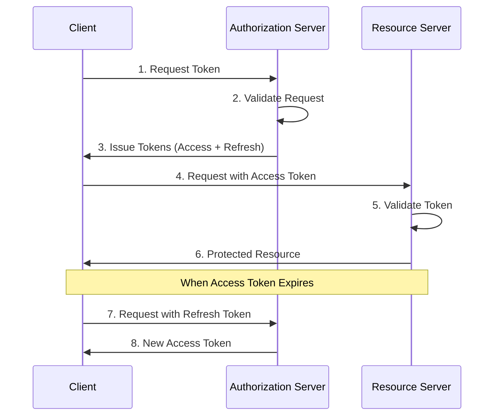
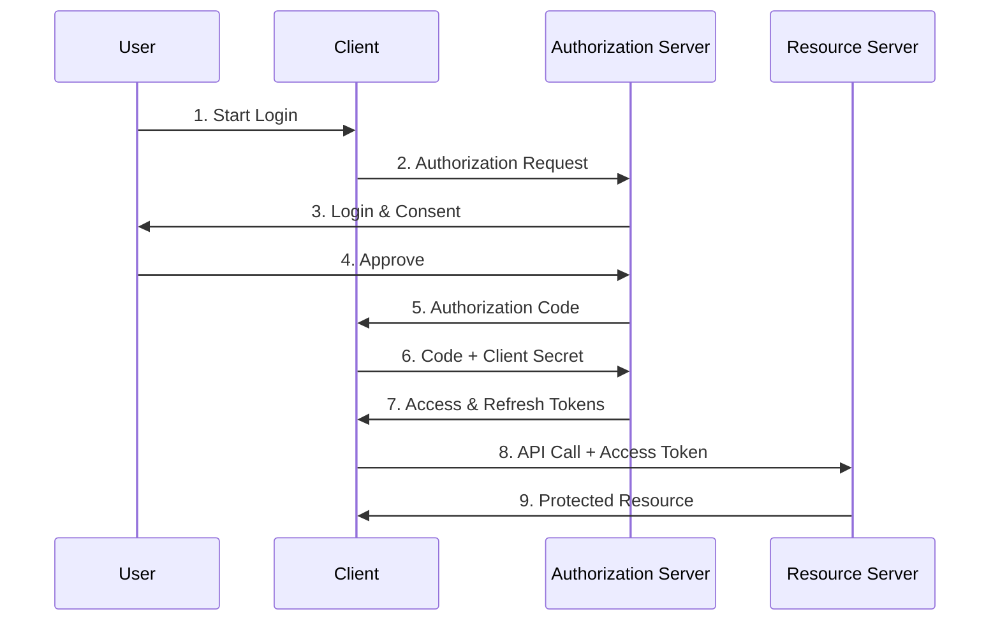
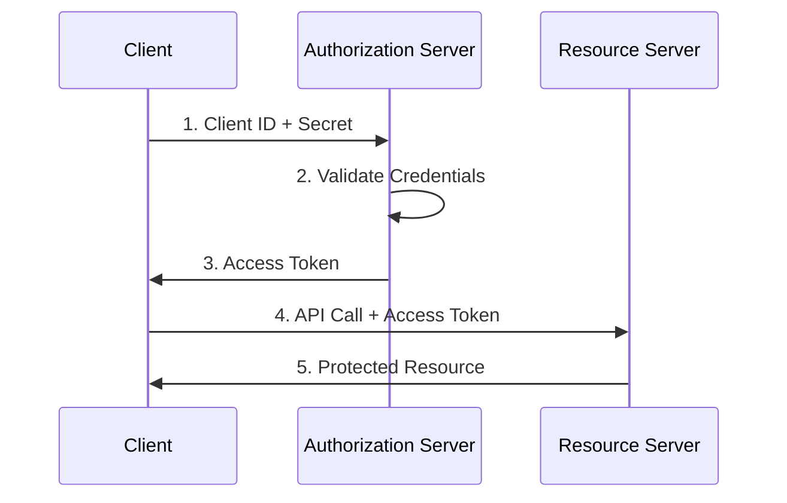
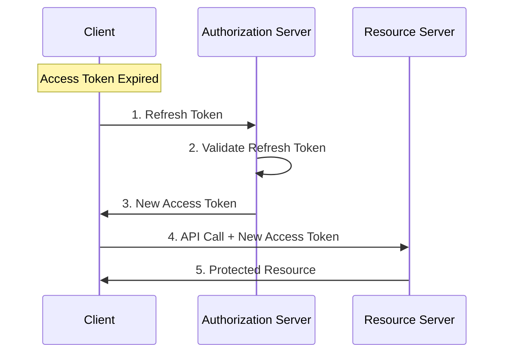

# OAuth Tokens: A Comprehensive Guide

[](http://makeapullrequest.com)
[](http://ansicolortags.readthedocs.io/?badge=latest)

This guide provides a comprehensive overview of OAuth tokens, their types, usage patterns, and best practices with code examples in multiple languages.

## Table of Contents

- [Introduction to OAuth Tokens](#introduction-to-oauth-tokens)
- [Types of OAuth Tokens](#types-of-oauth-tokens)
- [Token Lifecycle](#token-lifecycle)
- [Implementation Examples](#implementation-examples)
- [Security Considerations](#security-considerations)
- [Best Practices](#best-practices)
- [Common OAuth Flows](#common-oauth-flows)
- [Troubleshooting](#troubleshooting)

## Introduction to OAuth Tokens

OAuth tokens are the cornerstone of modern authentication and authorization protocols. They serve as digital credentials that allow applications to access resources on behalf of users without exposing their passwords.

### Key Concepts

- **Bearer Tokens**: The most common type of access token
- **Token Scopes**: Permissions associated with tokens
- **Token Claims**: Information embedded within tokens
- **Token Formats**: JWT, opaque tokens, etc.

## Types of OAuth Tokens

### Access Tokens

Access tokens are credentials used to access protected resources. They represent the authorization granted to the client.

> 💡 **Best Practice**: Keep access tokens short-lived (1 hour or less) to minimize the impact of token compromise.

#### Properties
- Short-lived (typically 1 hour)
- Used for API access
- Contains scopes and claims
- Usually in JWT format

### Refresh Tokens

Refresh tokens are credentials used to obtain new access tokens when they expire.

> 💡 **Best Practice**: Store refresh tokens in secure, encrypted storage and never expose them to the client-side code.
> 
> ⚠️ **Security Note**: Implement refresh token rotation to detect and prevent token theft.

#### Properties
- Long-lived (days to months)
- Never sent to resource servers
- Used only with authorization server
- Must be stored securely

### ID Tokens

ID tokens contain user identity information and are specific to OpenID Connect.

#### Properties
- Contains user information
- Used for authentication
- Always in JWT format
- Not meant for API access

## Token Lifecycle

Understanding the OAuth token lifecycle is crucial for implementing secure authentication and authorization.

> 💡 **Best Practice**: Implement proper token validation at every step:
> - Validate signature and claims
> - Check expiration time
> - Verify issuer and audience
> - Validate scopes before granting access

Access tokens are typically short-lived (usually 1 hour) security credentials that grant access to protected resources. When a client first authenticates, it receives both an access token and a refresh token. The access token is used for immediate API access, while the refresh token (which can live for days or months) serves as a credential to obtain new access tokens when they expire. This dual-token approach balances security with user experience - the short lifetime of access tokens limits the damage if they're compromised, while refresh tokens prevent users from having to re-authenticate frequently. Each token goes through distinct phases: issuance (after successful authentication), active use (for accessing resources), validation (checking signature and claims), expiration (becoming invalid after a set time), and potentially renewal (using refresh tokens to get new access tokens). Proper management of this lifecycle, including secure storage, regular rotation, and proper validation at each step, is essential for maintaining application security.

### Token Flow Diagram



1. **Token Request**
2. **Token Issuance**
3. **Token Usage**
4. **Token Refresh**
5. **Token Revocation**

## Implementation Examples

### Java Implementation

```java
import com.auth0.jwt.JWT;
import com.auth0.jwt.algorithms.Algorithm;

public class TokenManager {
    private static final String SECRET = "your-secret-key";
    private static final Algorithm ALGORITHM = Algorithm.HMAC256(SECRET);

    public String createAccessToken(String userId, List<String> scopes) {
        return JWT.create()
            .withSubject(userId)
            .withExpiresAt(new Date(System.currentTimeMillis() + 3600000)) // 1 hour
            .withClaim("scopes", scopes)
            .sign(ALGORITHM);
    }

    public String refreshToken(String refreshToken) {
        // Validate refresh token
        DecodedJWT jwt = JWT.decode(refreshToken);
        if (isValid(jwt)) {
            return createAccessToken(jwt.getSubject(), getScopes(jwt));
        }
        throw new TokenRefreshException("Invalid refresh token");
    }
}
```

### C# Implementation

```csharp
using Microsoft.IdentityModel.Tokens;
using System.IdentityModel.Tokens.Jwt;

public class TokenService
{
    private readonly string _secret;
    private readonly SymmetricSecurityKey _key;

    public TokenService(string secret)
    {
        _secret = secret;
        _key = new SymmetricSecurityKey(Encoding.UTF8.GetBytes(secret));
    }

    public string CreateAccessToken(string userId, IEnumerable<string> scopes)
    {
        var claims = new List<Claim>
        {
            new Claim(ClaimTypes.NameIdentifier, userId),
            new Claim("scopes", string.Join(" ", scopes))
        };

        var credentials = new SigningCredentials(_key, SecurityAlgorithms.HmacSha256);

        var token = new JwtSecurityToken(
            issuer: "your-issuer",
            audience: "your-audience",
            claims: claims,
            expires: DateTime.UtcNow.AddHours(1),
            signingCredentials: credentials
        );

        return new JwtSecurityTokenHandler().WriteToken(token);
    }
}
```

### JavaScript Implementation

```javascript
const jwt = require('jsonwebtoken');

class TokenManager {
    constructor(secret) {
        this.secret = secret;
    }

    createAccessToken(userId, scopes) {
        return jwt.sign(
            {
                sub: userId,
                scopes: scopes
            },
            this.secret,
            { 
                expiresIn: '1h',
                algorithm: 'HS256'
            }
        );
    }

    verifyToken(token) {
        try {
            return jwt.verify(token, this.secret);
        } catch (error) {
            throw new Error('Invalid token');
        }
    }

    refreshToken(refreshToken) {
        const decoded = this.verifyToken(refreshToken);
        return this.createAccessToken(decoded.sub, decoded.scopes);
    }
}
```

## Common OAuth Flows

### Authorization Code Flow

The Authorization Code Flow is the most secure and widely-used OAuth 2.0 grant type for web applications and native apps.

> 💡 **Best Practice**: For web applications:
> - Use PKCE (Proof Key for Code Exchange) even if not using a public client
> - Generate a cryptographically secure state parameter
> - Validate state parameter on return
> - Use short-lived authorization codes (max 5 minutes)
>
> ⚠️ **Security Note**: Never store client secrets in browser-accessible locations or client-side code.



#### Authorization Code Implementation

```java
public class AuthorizationCodeFlow {
    public String getAuthorizationUrl(String clientId, String redirectUri) {
        return String.format(
            "https://auth-server/authorize?client_id=%s&redirect_uri=%s&response_type=code",
            clientId,
            URLEncoder.encode(redirectUri, StandardCharsets.UTF_8)
        );
    }

    public TokenResponse exchangeCodeForToken(String code, String clientId, String clientSecret) {
        // Implementation of token exchange
    }
}
```

### Client Credentials Flow

The Client Credentials Flow represents the simplest OAuth 2.0 grant type, designed specifically for machine-to-machine (M2M) communication.

> 💡 **Best Practice**: For service-to-service communication:
> - Use certificates instead of client secrets when possible
> - Implement regular credential rotation
> - Use managed identities in cloud environments
> - Limit scope of service accounts to minimum required permissions
>
> ⚠️ **Security Note**: Store client credentials in secure vaults or environment variables, never in source code.



#### Client Credentials Implementation

```javascript
async function getClientCredentialsToken(clientId, clientSecret) {
    const response = await fetch('token-endpoint', {
        method: 'POST',
        headers: {
            'Content-Type': 'application/x-www-form-urlencoded'
        },
        body: new URLSearchParams({
            grant_type: 'client_credentials',
            client_id: clientId,
            client_secret: clientSecret
        })
    });
    return await response.json();
}
```

### Token Refresh Flow



## Security Considerations

### Token Storage

> 💡 **Best Practice**: Follow these storage guidelines:
> - Access Tokens: Store in memory only
> - Refresh Tokens: Use secure HTTP-only cookies or secure storage
> - Never store in localStorage or sessionStorage
> - Clear tokens on logout
>
> ⚠️ **Security Note**: Implement proper CORS policies and use SameSite cookie attributes.

### Token Validation

> 💡 **Best Practice**: Implement comprehensive token validation:
> - Use well-tested libraries for JWT validation
> - Validate all claims including nbf (not before) and exp (expiration)
> - Implement JWK rotation and caching
> - Use appropriate algorithms (prefer RS256 over HS256 for public clients)

```java
// Java Example
public boolean validateToken(String token) {
    try {
        DecodedJWT jwt = JWT.require(ALGORITHM)
            .withIssuer("your-issuer")
            .build()
            .verify(token);
        return !isTokenExpired(jwt);
    } catch (JWTVerificationException e) {
        return false;
    }
}
```

```csharp
// C# Example
public ClaimsPrincipal ValidateToken(string token)
{
    var tokenHandler = new JwtSecurityTokenHandler();
    try
    {
        return tokenHandler.ValidateToken(token, new TokenValidationParameters
        {
            ValidateIssuerSigningKey = true,
            IssuerSigningKey = _key,
            ValidateIssuer = true,
            ValidIssuer = "your-issuer",
            ValidateAudience = true,
            ValidAudience = "your-audience",
            ClockSkew = TimeSpan.Zero
        }, out SecurityToken validatedToken);
    }
    catch
    {
        return null;
    }
}
```

## Best Practices

### 1. Token Management

> 💡 **Best Practice**: Implement proper token lifecycle management:
> - Implement automatic token refresh before expiration
> - Handle token revocation on logout
> - Use token rotation for refresh tokens
> - Monitor token usage patterns for security anomalies

### 2. Error Handling

> 💡 **Best Practice**: Implement robust error handling:
> - Return standardized error responses
> - Log security events without exposing sensitive data
> - Implement rate limiting for token endpoints
> - Handle token revocation gracefully

### 3. Security Headers

> 💡 **Best Practice**: Implement security headers:
> ```http
> Strict-Transport-Security: max-age=31536000; includeSubDomains
> X-Frame-Options: DENY
> X-Content-Type-Options: nosniff
> Content-Security-Policy: default-src 'self'
> ```

## Troubleshooting

### Common Issues

1. **Token Expiration**
   - Implement automatic token refresh
   - Handle 401 responses appropriately
   - Use token expiration events

2. **Invalid Tokens**
   - Implement proper validation
   - Log validation failures
   - Provide clear error messages

### Debugging Tips

1. **Token Inspection**
   - Use jwt.io for JWT inspection
   - Log token lifecycle events
   - Implement token debugging endpoints in development

2. **Common Error Codes**
   - 401: Unauthorized (invalid or expired token)
   - 403: Forbidden (insufficient scope)
   - 400: Bad Request (malformed token)

---

## Additional Resources

- [OAuth 2.0 Specification](https://oauth.net/2/)
- [JWT Specification](https://jwt.io/)
- [OpenID Connect Specification](https://openid.net/connect/)
