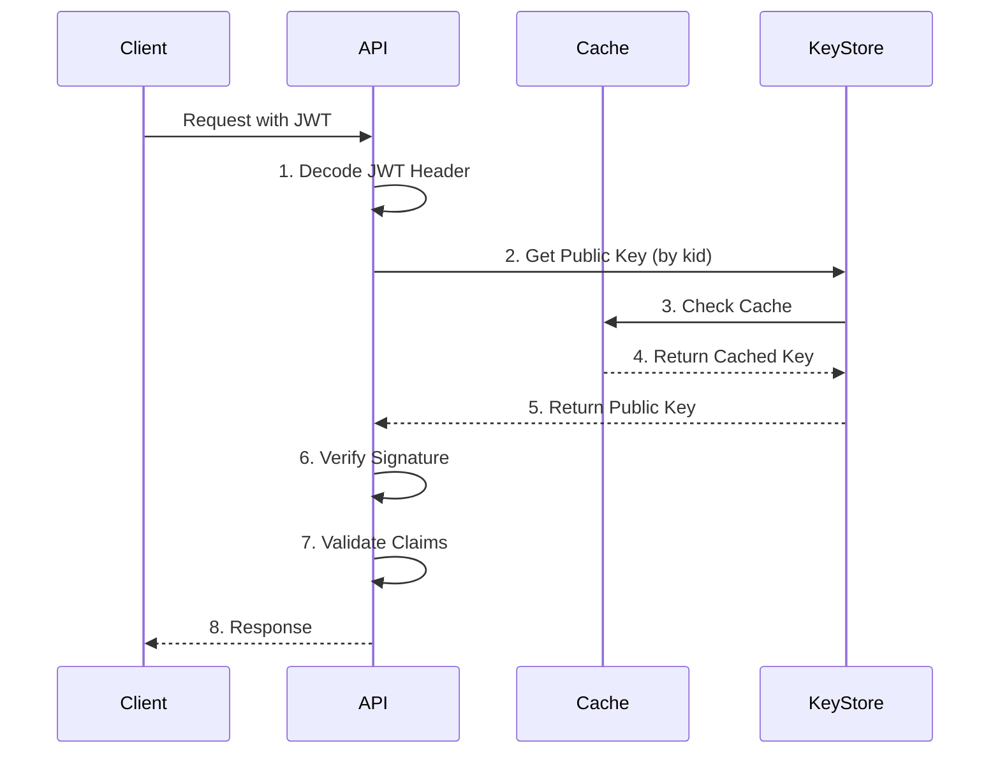
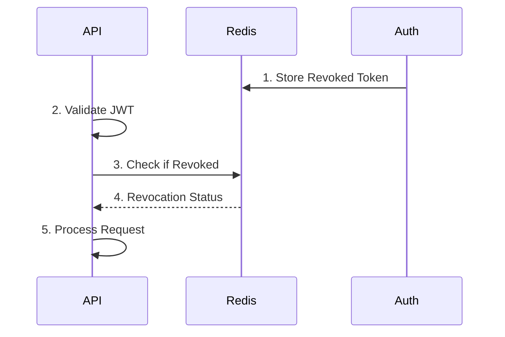

# OAuth Tokens: A Comprehensive Guide

[](http://makeapullrequest.com)
[](http://ansicolortags.readthedocs.io/?badge=latest)

This guide provides a comprehensive overview of OAuth tokens, their types, usage patterns, and best practices with code examples in multiple languages.

## Table of Contents

- [Introduction to OAuth Tokens](#introduction-to-oauth-tokens)
- [Types of OAuth Tokens](#types-of-oauth-tokens)
- [Token Lifecycle](#token-lifecycle)
- [Implementation Examples](#implementation-examples)
- [Security Considerations](#security-considerations)
- [Best Practices](#best-practices)
- [Common OAuth Flows](#common-oauth-flows)
- [Troubleshooting](#troubleshooting)
- [Development and Troubleshooting Tools](#development-and-troubleshooting-tools)
- [Azure Workload Identity Authentication](#azure-workload-identity-authentication)

## Introduction to OAuth Tokens

OAuth tokens are the cornerstone of modern authentication and authorization protocols. They serve as digital credentials that allow applications to access resources on behalf of users without exposing their passwords.

### Key Concepts

- **Bearer Tokens**: The most common type of access token
- **Token Scopes**: Permissions associated with tokens
- **Token Claims**: Information embedded within tokens
- **Token Formats**: JWT, opaque tokens, etc.

## Types of OAuth Tokens

### Access Tokens

Access tokens are credentials used to access protected resources. They represent the authorization granted to the client.

> **Best Practice**: Keep access tokens short-lived (1 hour or less) to minimize the impact of token compromise.

#### Properties
- Short-lived (typically 1 hour)
- Used for API access
- Contains scopes and claims
- Usually in JWT format

### Refresh Tokens

Refresh tokens are credentials used to obtain new access tokens when they expire.

> **Best Practice**: Store refresh tokens in secure, encrypted storage and never expose them to the client-side code.
> 
> **Security Note**: Implement refresh token rotation to detect and prevent token theft.

#### Properties
- Long-lived (days to months)
- Never sent to resource servers
- Used only with authorization server
- Must be stored securely

### ID Tokens

ID tokens contain user identity information and are specific to OpenID Connect.

#### Properties
- Contains user information
- Used for authentication
- Always in JWT format
- Not meant for API access

## Token Lifecycle

Understanding the OAuth token lifecycle is crucial for implementing secure authentication and authorization.

> **Best Practice**: Implement proper token validation at every step:
> - Validate signature and claims
> - Check expiration time
> - Verify issuer and audience
> - Validate scopes before granting access

Access tokens are typically short-lived (usually 1 hour) security credentials that grant access to protected resources. When a client first authenticates, it receives both an access token and a refresh token. The access token is used for immediate API access, while the refresh token (which can live for days or months) serves as a credential to obtain new access tokens when they expire. This dual-token approach balances security with user experience - the short lifetime of access tokens limits the damage if they're compromised, while refresh tokens prevent users from having to re-authenticate frequently. Each token goes through distinct phases: issuance (after successful authentication), active use (for accessing resources), validation (checking signature and claims), expiration (becoming invalid after a set time), and potentially renewal (using refresh tokens to get new access tokens). Proper management of this lifecycle, including secure storage, regular rotation, and proper validation at each step, is essential for maintaining application security.

### Token Flow Diagram


1. **Token Request**
2. **Token Issuance**
3. **Token Usage**
4. **Token Refresh**
5. **Token Revocation**

## Implementation Examples

### Java Implementation

```java
import com.auth0.jwt.JWT;
import com.auth0.jwt.algorithms.Algorithm;

public class TokenManager {
    private static final String SECRET = "your-secret-key";
    private static final Algorithm ALGORITHM = Algorithm.HMAC256(SECRET);

    public String createAccessToken(String userId, List<String> scopes) {
        return JWT.create()
            .withSubject(userId)
            .withExpiresAt(new Date(System.currentTimeMillis() + 3600000)) // 1 hour
            .withClaim("scopes", scopes)
            .sign(ALGORITHM);
    }

    public String refreshToken(String refreshToken) {
        // Validate refresh token
        DecodedJWT jwt = JWT.decode(refreshToken);
        if (isValid(jwt)) {
            return createAccessToken(jwt.getSubject(), getScopes(jwt));
        }
        throw new TokenRefreshException("Invalid refresh token");
    }
}
```

### C# Implementation

```csharp
using Microsoft.IdentityModel.Tokens;
using System.IdentityModel.Tokens.Jwt;

public class TokenService
{
    private readonly string _secret;
    private readonly SymmetricSecurityKey _key;

    public TokenService(string secret)
    {
        _secret = secret;
        _key = new SymmetricSecurityKey(Encoding.UTF8.GetBytes(secret));
    }

    public string CreateAccessToken(string userId, IEnumerable<string> scopes)
    {
        var claims = new List<Claim>
        {
            new Claim(ClaimTypes.NameIdentifier, userId),
            new Claim("scopes", string.Join(" ", scopes))
        };

        var credentials = new SigningCredentials(_key, SecurityAlgorithms.HmacSha256);

        var token = new JwtSecurityToken(
            issuer: "your-issuer",
            audience: "your-audience",
            claims: claims,
            expires: DateTime.UtcNow.AddHours(1),
            signingCredentials: credentials
        );

        return new JwtSecurityTokenHandler().WriteToken(token);
    }
}
```

### JavaScript Implementation

```javascript
const jwt = require('jsonwebtoken');

class TokenManager {
    constructor(secret) {
        this.secret = secret;
    }

    createAccessToken(userId, scopes) {
        return jwt.sign(
            {
                sub: userId,
                scopes: scopes
            },
            this.secret,
            { 
                expiresIn: '1h',
                algorithm: 'HS256'
            }
        );
    }

    verifyToken(token) {
        try {
            return jwt.verify(token, this.secret);
        } catch (error) {
            throw new Error('Invalid token');
        }
    }

    refreshToken(refreshToken) {
        const decoded = this.verifyToken(refreshToken);
        return this.createAccessToken(decoded.sub, decoded.scopes);
    }
}
```

## Common OAuth Flows

### Authorization Code Flow

The Authorization Code Flow is the most secure and widely-used OAuth 2.0 grant type for web applications and native apps.

> **Best Practice**: For web applications:
> - Use PKCE (Proof Key for Code Exchange) even if not using a public client
> - Generate a cryptographically secure state parameter
> - Validate state parameter on return
> - Use short-lived authorization codes (max 5 minutes)
>
> **Security Note**: Never store client secrets in browser-accessible locations or client-side code.


#### Authorization Code Implementation

```java
public class AuthorizationCodeFlow {
    public String getAuthorizationUrl(String clientId, String redirectUri) {
        return String.format(
            "https://auth-server/authorize?client_id=%s&redirect_uri=%s&response_type=code",
            clientId,
            URLEncoder.encode(redirectUri, StandardCharsets.UTF_8)
        );
    }

    public TokenResponse exchangeCodeForToken(String code, String clientId, String clientSecret) {
        // Implementation of token exchange
    }
}
```

### Client Credentials Flow

The Client Credentials Flow represents the simplest OAuth 2.0 grant type, designed specifically for machine-to-machine (M2M) communication.

> **Best Practice**: For service-to-service communication:
> - Use certificates instead of client secrets when possible
> - Implement regular credential rotation
> - Use managed identities in cloud environments
> - Limit scope of service accounts to minimum required permissions
>
> **Security Note**: Store client credentials in secure vaults or environment variables, never in source code.


#### Client Credentials Implementation

```javascript
async function getClientCredentialsToken(clientId, clientSecret) {
    const response = await fetch('token-endpoint', {
        method: 'POST',
        headers: {
            'Content-Type': 'application/x-www-form-urlencoded'
        },
        body: new URLSearchParams({
            grant_type: 'client_credentials',
            client_id: clientId,
            client_secret: clientSecret
        })
    });
    return await response.json();
}
```

### Token Refresh Flow


## Security Considerations

### Token Storage

> **Best Practice**: Follow these storage guidelines:
> - Access Tokens: Store in memory only
> - Refresh Tokens: Use secure HTTP-only cookies or secure storage
> - Never store in localStorage or sessionStorage
> - Clear tokens on logout
>
> **Security Note**: Implement proper CORS policies and use SameSite cookie attributes.

#### Secure Token Storage Examples

```javascript
// JavaScript - Express.js secure cookie setup
app.use(session({
    cookie: {
        secure: true,          // Only transmit over HTTPS
        httpOnly: true,        // Prevent JavaScript access
        sameSite: 'strict',    // CSRF protection
        maxAge: 3600000        // 1 hour
    },
    // Use secure session store like Redis
    store: new RedisStore({
        client: redisClient,
        prefix: "session:"
    })
}));
```

```csharp
// C# - ASP.NET Core secure cookie authentication
public void ConfigureServices(IServiceCollection services)
{
    services.Configure<CookiePolicyOptions>(options =>
    {
        options.MinimumSameSitePolicy = SameSiteMode.Strict;
        options.HttpOnly = HttpOnlyPolicy.Always;
        options.Secure = CookieSecurePolicy.Always;
    });

    services.AddAuthentication(options =>
    {
        options.DefaultAuthenticateScheme = CookieAuthenticationDefaults.AuthenticationScheme;
        options.DefaultSignInScheme = CookieAuthenticationDefaults.AuthenticationScheme;
    })
    .AddCookie(options =>
    {
        options.Cookie.Name = "Auth";
        options.Cookie.HttpOnly = true;
        options.Cookie.SecurePolicy = CookieSecurePolicy.Always;
        options.Cookie.SameSite = SameSiteMode.Strict;
        options.ExpireTimeSpan = TimeSpan.FromHours(1);
    });
}
```

```java
// Java - Spring Security secure cookie configuration
@Configuration
public class SecurityConfig extends WebSecurityConfigurerAdapter {
    @Override
    protected void configure(HttpSecurity http) throws Exception {
        http
            .sessionManagement()
                .sessionCreationPolicy(SessionCreationPolicy.IF_REQUIRED)
                .maximumSessions(1)
                .and()
            .and()
            .csrf()
                .csrfTokenRepository(CookieCsrfTokenRepository.withHttpOnlyFalse())
            .and()
            .cookies()
                .defaultCookieConfig()
                    .httpOnly(true)
                    .secure(true)
                    .sameSite("Strict");
    }
}
```

### Token Validation

> **Best Practice**: Implement comprehensive token validation:
> - Use well-tested libraries for JWT validation
> - Validate all claims including nbf (not before) and exp (expiration)
> - Implement JWK rotation and caching
> - Use appropriate algorithms (prefer RS256 over HS256 for public clients)

#### Token Validation Examples

```javascript
// JavaScript - Comprehensive JWT validation
const jwt = require('jsonwebtoken');
const jwksClient = require('jwks-rsa');

class TokenValidator {
    constructor() {
        this.client = jwksClient({
            jwksUri: 'https://your-auth-server/.well-known/jwks.json',
            cache: true,               // Enable caching
            rateLimit: true,           // Enable rate limiting
            jwksRequestsPerMinute: 5   // Limit requests to prevent abuse
        });
    }

    async validateToken(token) {
        try {
            const decodedToken = jwt.decode(token, { complete: true });
            const key = await this.getSigningKey(decodedToken.header.kid);
            
            const verified = jwt.verify(token, key.publicKey, {
                algorithms: ['RS256'],          // Restrict to specific algorithm
                issuer: 'https://your-issuer',  // Validate issuer
                audience: 'your-client-id',     // Validate audience
                clockTolerance: 30,             // Allow 30 seconds clock skew
            });

            return {
                valid: true,
                claims: verified
            };
        } catch (error) {
            return {
                valid: false,
                error: error.message
            };
        }
    }

    getSigningKey(kid) {
        return new Promise((resolve, reject) => {
            this.client.getSigningKey(kid, (err, key) => {
                if (err) return reject(err);
                resolve(key);
            });
        });
    }
}
```

```csharp
// C# - Comprehensive JWT validation
public class TokenValidator
{
    private readonly IConfiguration _configuration;
    private readonly TokenValidationParameters _validationParameters;
    private readonly IMemoryCache _cache;
    private const string JwksUri = "https://your-auth-server/.well-known/jwks.json";

    public TokenValidator(IConfiguration configuration, IMemoryCache cache)
    {
        _configuration = configuration;
        _cache = cache;
        _validationParameters = new TokenValidationParameters
        {
            ValidateIssuerSigningKey = true,
            ValidateIssuer = true,
            ValidateAudience = true,
            ValidateLifetime = true,
            ClockSkew = TimeSpan.FromSeconds(30),
            ValidIssuer = _configuration["Auth:Issuer"],
            ValidAudience = _configuration["Auth:Audience"],
            RequireSignedTokens = true,
            RequireExpirationTime = true
        };
    }

    public async Task<(bool isValid, ClaimsPrincipal? principal)> ValidateTokenAsync(string token)
    {
        try {
            var handler = new JwtSecurityTokenHandler();
            
            // Get signing keys from cache or fetch new ones
            var signingKeys = await GetSigningKeysAsync();
            _validationParameters.IssuerSigningKeys = signingKeys;

            var principal = handler.ValidateToken(
                token,
                _validationParameters,
                out SecurityToken validatedToken);

            return (true, principal);
        } catch (Exception ex)
        {
            // Log the error details
            return (false, null);
        }
    }

    private async Task<IEnumerable<SecurityKey>> GetSigningKeysAsync()
    {
        if (_cache.TryGetValue("JwksKeys", out IEnumerable<SecurityKey> keys))
        {
            return keys;
        }

        using var client = new HttpClient();
        var json = await client.GetStringAsync(JwksUri);
        var jwks = new JsonWebKeySet(json);
        
        // Cache the keys for 24 hours
        _cache.Set("JwksKeys", jwks.Keys, TimeSpan.FromHours(24));
        
        return jwks.Keys;
    }
}
```

```java
// Java - Comprehensive JWT validation with JWK support
@Service
public class TokenValidator {
    private final JwkProvider jwkProvider;
    private final String issuer;
    private final String audience;

    public TokenValidator(@Value("${auth.jwks-uri}") String jwksUri,
                         @Value("${auth.issuer}") String issuer,
                         @Value("${auth.audience}") String audience) {
        this.jwkProvider = new GuavaCachedJwkProvider(
            new UrlJwkProvider(jwksUri)
        );
        this.issuer = issuer;
        this.audience = audience;
    }

    public DecodedJWT validateToken(String token) throws JWTVerificationException {
        DecodedJWT jwt = JWT.decode(token);
        
        // Get the key id from the token header
        Jwk jwk = jwkProvider.get(jwt.getKeyId());
        
        Algorithm algorithm = Algorithm.RSA256((RSAPublicKey) jwk.getPublicKey(), null);
        
        JWTVerifier verifier = JWT.require(algorithm)
            .withIssuer(issuer)
            .withAudience(audience)
            .acceptLeeway(30)  // 30 seconds clock skew
            .build();
            
        return verifier.verify(token);
    }
}
```

### Best Practices Implementation

#### 1. Token Management

> **Best Practice**: Implement proper token lifecycle management
> ```typescript
> // TypeScript - Token Manager with automatic refresh
> class TokenManager {
>     private accessToken: string | null = null;
>     private refreshToken: string | null = null;
>     private expiresAt: number = 0;
>     private refreshThreshold = 5 * 60 * 1000; // 5 minutes
>
>     async getAccessToken(): Promise<string> {
>         if (this.shouldRefresh()) {
>             await this.refreshAccessToken();
>         }
>         return this.accessToken!;
>     }
>
>     private shouldRefresh(): boolean {
>         const now = Date.now();
>         return !this.accessToken || (this.expiresAt - now) < this.refreshThreshold;
>     }
>
>     private async refreshAccessToken(): Promise<void> {
>         if (!this.refreshToken) {
>             throw new Error('No refresh token available');
>         }
>
>         try {
>             const response = await fetch('/token', {
>                 method: 'POST',
>                 headers: {
>                     'Content-Type': 'application/json'
>                 },
>                 body: JSON.stringify({
>                     grant_type: 'refresh_token',
>                     refresh_token: this.refreshToken
>                 })
>             });
>
>             const data = await response.json();
>             this.updateTokens(data);
>         } catch (error) {
>             // Handle refresh failure
>             this.clearTokens();
>             throw error;
>         }
>     }
>
>     private updateTokens(data: any): void {
>         this.accessToken = data.access_token;
>         this.refreshToken = data.refresh_token;
>         this.expiresAt = Date.now() + (data.expires_in * 1000);
>     }
>
>     private clearTokens(): void {
>         this.accessToken = null;
>         this.refreshToken = null;
>         this.expiresAt = 0;
>     }
> }
> ```

#### 2. Error Handling

> **Best Practice**: Implement robust error handling
> ```java
> @ControllerAdvice
> public class TokenExceptionHandler {
>     private static final Logger logger = LoggerFactory.getLogger(TokenExceptionHandler.class);
>
>     @ExceptionHandler(TokenExpiredException.class)
>     public ResponseEntity<ErrorResponse> handleTokenExpired(TokenExpiredException ex) {
>         logger.warn("Token expired: {}", ex.getMessage());
>         return ResponseEntity
>             .status(HttpStatus.UNAUTHORIZED)
>             .body(new ErrorResponse("token_expired", "The access token has expired"));
>     }
>
>     @ExceptionHandler(InvalidTokenException.class)
>     public ResponseEntity<ErrorResponse> handleInvalidToken(InvalidTokenException ex) {
>         logger.error("Invalid token: {}", ex.getMessage());
>         return ResponseEntity
>             .status(HttpStatus.UNAUTHORIZED)
>             .body(new ErrorResponse("invalid_token", "The token is invalid"));
>     }
>
>     @ExceptionHandler(TokenRevokedError.class)
>     public ResponseEntity<ErrorResponse> handleTokenRevoked(TokenRevokedError ex) {
>         logger.warn("Revoked token used: {}", ex.getMessage());
>         return ResponseEntity
>             .status(HttpStatus.UNAUTHORIZED)
>             .body(new ErrorResponse("token_revoked", "The token has been revoked"));
>     }
>
>     // Rate limiting error handler
>     @ExceptionHandler(TooManyRequestsException.class)
>     public ResponseEntity<ErrorResponse> handleRateLimit(TooManyRequestsException ex) {
>         logger.warn("Rate limit exceeded: {}", ex.getMessage());
>         return ResponseEntity
>             .status(HttpStatus.TOO_MANY_REQUESTS)
>             .header("Retry-After", "60")
>             .body(new ErrorResponse("rate_limit_exceeded", "Too many requests"));
>     }
> }
> ```

#### 3. Security Headers

> **Best Practice**: Implement security headers
> ```java
> // Java - Spring Security headers configuration
> @Configuration
> public class SecurityHeadersConfig {
>     @Bean
>     public SecurityFilterChain filterChain(HttpSecurity http) throws Exception {
>         http
>             .headers()
>                 .xssProtection()
>                 .and()
>                 .contentSecurityPolicy("default-src 'self'; script-src 'self' 'unsafe-inline' 'unsafe-eval'; style-src 'self' 'unsafe-inline';")
>                 .and()
>                 .frameOptions().deny()
>                 .and()
>                 .httpStrictTransportSecurity()
>                     .includeSubDomains(true)
>                     .maxAgeInSeconds(31536000)
>                 .and()
>                 .contentTypeOptions()
>                 .and()
>                 .referrerPolicy(ReferrerPolicyHeaderWriter.ReferrerPolicy.STRICT_ORIGIN_WHEN_CROSS_ORIGIN);
>         
>         return http.build();
>     }
> }
> ```

## Troubleshooting

### Common Issues

1. **Token Expiration**
   - Implement automatic token refresh
   - Handle 401 responses appropriately
   - Use token expiration events

2. **Invalid Tokens**
   - Implement proper validation
   - Log validation failures
   - Provide clear error messages

### Debugging Tips

1. **Token Inspection**
   - Use jwt.io for JWT inspection
   - Log token lifecycle events
   - Implement token debugging endpoints in development

2. **Common Error Codes**
   - 401: Unauthorized (invalid or expired token)
   - 403: Forbidden (insufficient scope)
   - 400: Bad Request (malformed token)

---

## Development and Troubleshooting Tools

> **Best Practice**: Use specialized tools for debugging and testing OAuth flows to save time and reduce security risks.

### Token Inspection and Debugging

#### 1. JWT.io
- **Purpose**: Interactive JWT debugger and validator
- **Features**:
  - Decode JWT tokens
  - Verify signatures
  - Generate new tokens for testing
  - Supports multiple algorithms
- **Best Practices**:
  - Never paste production tokens
  - Use for development and testing only
  - Verify algorithm matches your implementation

#### 2. SAML-Tracer
- **Purpose**: Browser extension for SAML and OAuth debugging
- **Features**:
  - Capture SAML and OAuth traffic
  - Decode URL-encoded parameters
  - Export traces for analysis
  - Filter by protocol type
- **Installation**:
  - [Firefox Add-on](https://addons.mozilla.org/en-US/firefox/addon/saml-tracer/)
  - [Chrome Extension](https://chrome.google.com/webstore/detail/saml-tracer/mpdajninpobndbfcldcmbpnnbhibjmch)

#### 3. Fiddler Everywhere
- **Purpose**: Web debugging proxy
- **Features**:
  - Inspect OAuth redirects
  - Modify requests in real-time
  - Debug mobile apps
  - SSL/TLS inspection
- **Best Practices**:
  - Use separate profiles for different environments
  - Never intercept production traffic
  - Properly secure your Fiddler certificates

### API Testing Tools

#### 1. Postman
- **Purpose**: API development and testing
- **OAuth Features**:
  - Built-in OAuth 2.0 flow support
  - Token management
  - Environment variables for credentials
  - Automatic token refresh
- **Example Collection**:
```json
{
    "auth": {
        "type": "oauth2",
        "oauth2": {
            "accessTokenUrl": "https://auth-server/token",
            "authUrl": "https://auth-server/authorize",
            "clientId": "{{clientId}}",
            "clientSecret": "{{clientSecret}}",
            "scope": "read write",
            "tokenName": "access_token",
            "grant_type": "authorization_code"
        }
    }
}
```

#### 2. Thunder Client (VS Code Extension)
- **Purpose**: Lightweight API testing
- **Features**:
  - OAuth 2.0 support
  - Environment management
  - Request history
  - Collection sharing

### Browser Developer Tools

#### 1. Chrome DevTools
- **Purpose**: Network and storage inspection
- **Useful Features**:
  - Network tab for OAuth redirects
  - Application tab for token storage
  - Console for debugging
- **Tips**:
```javascript
// Console commands for token inspection
// List all cookies
document.cookie.split(';').forEach(cookie => console.log(cookie.trim()));

// Check localStorage tokens (if used)
Object.keys(localStorage).forEach(key => {
    if (key.includes('token')) {
        console.log(`${key}: ${localStorage.getItem(key)}`);
    }
});
```

#### 2. Firefox Developer Tools
- **Purpose**: Security testing and debugging
- **Features**:
  - Storage Inspector
  - Network Monitor
  - Security Panel

### Mock OAuth Servers

#### 1. MockOAuth
- **Purpose**: Local OAuth server for testing
- **Features**:
  - Configurable responses
  - Multiple grant types
  - Custom claims
- **Example Setup**:
```javascript
const MockOAuth = require('mock-oauth2-server');

const server = new MockOAuth({
    port: 8080,
    tokenEndpoint: '/oauth/token',
    authorizeEndpoint: '/oauth/authorize',
    tokens: {
        access_token: 'test-token',
        expires_in: 3600,
        token_type: 'Bearer'
    }
});
```

#### 2. Wiremock
- **Purpose**: Mock server with OAuth support
- **Features**:
  - Stub OAuth endpoints
  - Record and replay
  - Fault simulation
- **Example Configuration**:
```json
{
    "request": {
        "method": "POST",
        "url": "/oauth/token"
    },
    "response": {
        "status": 200,
        "headers": {
            "Content-Type": "application/json"
        },
        "jsonBody": {
            "access_token": "test-token",
            "token_type": "bearer",
            "expires_in": 3600
        }
    }
}
```

### Security Testing Tools

#### 1. OWASP ZAP
- **Purpose**: Security testing proxy
- **Features**:
  - OAuth scanner
  - Authentication tester
  - Automated security tests
- **Best Practices**:
  - Use authentication scripts
  - Configure session management
  - Test token replay attacks

#### 2. Burp Suite
- **Purpose**: Web security testing
- **Features**:
  - OAuth scanner
  - Session handling
  - Token analysis
- **Example Session Rules**:
```yaml
- name: "OAuth Token Refresh"
  enabled: true
  actions:
    - type: "check_session_validity"
      condition: "status_code == 401"
    - type: "refresh_access_token"
      endpoint: "/oauth/token"
      grant_type: "refresh_token"
```

> **Security Note**: Always use these tools in development or testing environments only. Never use them to inspect or modify production traffic.

## Azure Workload Identity Authentication

> **Best Practice**: Use Workload Identity Federation instead of service principals with secrets whenever possible to improve security and reduce secret management overhead.

### Overview

Workload Identity Federation allows applications and services to use federation with external identity providers (including other clouds, Kubernetes, and on-premises services) to access Azure resources without managing secrets. It supports OpenID Connect and SAML 2.0 protocols for federation.


### Implementation Examples

#### 1. Kubernetes to Azure Federation

```yaml
# Azure CLI commands to set up federation
az ad app create --display-name "my-k8s-app"
az ad sp create --id <app-id>
az ad app federated-credential create \
    --id <app-id> \
    --issuer "https://token.actions.githubusercontent.com" \
    --subject "system:serviceaccount:default:my-k8s-sa" \
    --name "kubernetes-federated-credential"
```

```yaml
# Kubernetes service account configuration
apiVersion: v1
kind: ServiceAccount
metadata:
  name: my-k8s-sa
  annotations:
    azure.workload.identity/client-id: <application-client-id>
    azure.workload.identity/tenant-id: <tenant-id>
---
apiVersion: v1
kind: Pod
metadata:
  name: quick-start
  namespace: default
spec:
  serviceAccountName: my-k8s-sa
  containers:
    - image: ghcr.io/azure/azure-workload-identity/msal-go
      name: oidc
      env:
      - name: AZURE_CLIENT_ID
        value: <application-client-id>
      - name: AZURE_TENANT_ID
        value: <tenant-id>
      - name: AZURE_FEDERATED_TOKEN_FILE
        value: /var/run/secrets/azure/tokens/azure-identity-token
```

#### 2. GitHub Actions to Azure Federation

```yaml
# GitHub Actions workflow with OIDC authentication
name: Run Azure Login with OIDC
on: [push]

permissions:
  id-token: write
  contents: read

jobs:
  build-and-deploy:
    runs-on: ubuntu-latest
    steps:
      - name: 'Az CLI login with OIDC'
        uses: azure/login@v1
        with:
          client-id: ${{ secrets.AZURE_CLIENT_ID }}
          tenant-id: ${{ secrets.AZURE_TENANT_ID }}
          subscription-id: ${{ secrets.AZURE_SUBSCRIPTION_ID }}

      - name: 'Run Azure CLI commands'
        run: |
          az account show
          az group list
```

#### 3. Application Code Examples

```csharp
// C# - Azure.Identity with Workload Identity
using Azure.Identity;
using Azure.Security.KeyVault.Secrets;

public class SecretManager
{
    private readonly SecretClient _secretClient;

    public SecretManager(string keyVaultUrl)
    {
        // DefaultAzureCredential will automatically use Workload Identity when available
        var credential = new DefaultAzureCredential(
            new DefaultAzureCredentialOptions
            {
                ManagedIdentityClientId = "<client-id>" // Optional
            });

        _secretClient = new SecretClient(
            new Uri(keyVaultUrl),
            credential);
    }

    public async Task<string> GetSecretAsync(string secretName)
    {
        var secret = await _secretClient.GetSecretAsync(secretName);
        return secret.Value.Value;
    }
}
```

```java
// Java - Azure Identity with Workload Identity
import com.azure.identity.DefaultAzureCredential;
import com.azure.identity.DefaultAzureCredentialBuilder;
import com.azure.security.keyvault.secrets.SecretClient;
import com.azure.security.keyvault.secrets.SecretClientBuilder;

public class SecretManager {
    private final SecretClient secretClient;

    public SecretManager(String keyVaultUrl) {
        DefaultAzureCredential credential = new DefaultAzureCredentialBuilder()
            .managedIdentityClientId("<client-id>") // Optional
            .build();

        secretClient = new SecretClientBuilder()
            .vaultUrl(keyVaultUrl)
            .credential(credential)
            .buildClient();
    }

    public String getSecret(String secretName) {
        return secretClient.getSecret(secretName).getValue();
    }
}
```

```javascript
// JavaScript/TypeScript - Azure Identity with Workload Identity
import { DefaultAzureCredential } from "@azure/identity";
import { SecretClient } from "@azure/keyvault-secrets";

class SecretManager {
    private secretClient: SecretClient;

    constructor(keyVaultUrl: string) {
        const credential = new DefaultAzureCredential({
            managedIdentityClientId: "<client-id>" // Optional
        });

        this.secretClient = new SecretClient(
            keyVaultUrl,
            credential
        );
    }

    async getSecret(secretName: string): Promise<string | undefined> {
        const secret = await this.secretClient.getSecret(secretName);
        return secret.value;
    }
}
```

### Best Practices for Workload Identity

> **Best Practice**: Follow these guidelines for secure workload identity implementation:
> - Use separate identities for different workloads
> - Implement least-privilege access
> - Regular credential rotation
> - Monitor identity usage

#### Security Configuration

```powershell
# PowerShell - Configure Conditional Access for Workload Identities
New-AzureADMSConditionalAccessPolicy `
    -Name "Workload Identity Policy" `
    -State "enabled" `
    -Conditions @{
        Applications = @{
            IncludeApplications = @("<app-id>")
        }
        Users = @{
            IncludeUsers = @("All")
        }
        Locations = @{
            IncludeLocations = @("All")
        }
    } `
    -GrantControls @{
        BuiltInControls = @("RequireCompliantDevice")
    }
```

#### Monitoring Setup

```bash
# Azure CLI - Set up monitoring for workload identities
az monitor diagnostic-settings create \
    --name "workload-identity-logs" \
    --resource "<resource-id>" \
    --logs '[{"category": "SignInLogs","enabled": true}]' \
    --workspace "<log-analytics-workspace-id>"
```

### Troubleshooting Workload Identity

> **Best Practice**: Common troubleshooting steps:
> 1. Verify federation setup
> 2. Check token claims
> 3. Validate RBAC assignments
> 4. Review audit logs

```bash
# Azure CLI - Check federation setup
az ad app federated-credential list --id "<app-id>"

# Check RBAC assignments
az role assignment list --assignee "<app-id>"

# View sign-in logs
az monitor log-analytics query \
    --workspace "<workspace-id>" \
    --query "SignInLogs | where AppId == '<app-id>'"
```

### Migration Checklist

> **Best Practice**: Follow this checklist when migrating from service principals to workload identity:
> 1. Update token endpoints
> 2. Convert resources to scopes
> 3. Update token validation logic
> 4. Update libraries (ADAL to MSAL)
> 5. Test token acquisition flows
> 6. Verify token claims handling
> 7. Update security policies

```powershell
# PowerShell - Check app registration version
Get-AzureADApplication -ObjectId "<app-id>" | Select-Object -ExpandProperty PublicClient

# Check if app is configured for v2.0
Get-AzureADApplication -ObjectId "<app-id>" | 
    Select-Object -ExpandProperty OAuth2AllowImplicitFlow
```

## Azure AD Endpoints: v1.0 vs v2.0

> **Best Practice**: Use v2.0 endpoints for new applications. Only use v1.0 if you have specific legacy requirements.

### Configuring Code Flow for v2.0 Tokens

> **Best Practice**: Always use v2.0 tokens with PKCE for new applications.

#### 1. Application Registration Configuration

```powershell
# PowerShell - Create v2.0 app registration
az ad app create --display-name "my-v2-app" `
    --sign-in-audience "AzureADandPersonalMicrosoftAccount" `
    --web-redirect-uris "https://myapp.com/callback" `
    --enable-id-token-issuance true

# Configure app for Code Flow
az ad app update --id "<app-id>" `
    --required-resource-accesses '[
        {
            "resourceAppId": "00000003-0000-0000-c000-000000000000",
            "resourceAccess": [
                {
                    "id": "e1fe6dd8-ba31-4d61-89e7-88639da4683d",
                    "type": "Scope"
                }
            ]
        }
    ]'
```

#### 2. Authentication Configuration

```csharp
// C# - MSAL configuration for v2.0 tokens
var config = new ConfidentialClientApplicationOptions
{
    Instance = "https://login.microsoftonline.com/",
    TenantId = "<tenant-id>",
    ClientId = "<client-id>",
    ClientSecret = "<client-secret>",
    RedirectUri = "https://myapp.com/callback"
};

var app = ConfidentialClientApplicationBuilder
    .CreateWithApplicationOptions(config)
    .Build();

// Define v2.0 scopes
var scopes = new[] { 
    "https://graph.microsoft.com/User.Read",
    "offline_access"  // For refresh tokens
};

// Authorization URL
var authUrl = await app.GetAuthorizationRequestUrl(scopes)
    .WithPkce()  // Add PKCE
    .WithPrompt(Prompt.SelectAccount)
    .ExecuteAsync();

// Handle callback and get v2.0 tokens
public async Task<AuthenticationResult> HandleCallbackAsync(string code)
{
    try
    {
        return await app.AcquireTokenByAuthorizationCode(
            scopes,
            code)
            .WithPkce()
            .ExecuteAsync();
    }
    catch (MsalException ex)
    {
        // Handle token acquisition errors
        throw;
    }
}
```

#### 3. Framework-Specific Configurations

##### ASP.NET Core

```csharp
// Startup.cs
public void ConfigureServices(IServiceCollection services)
{
    services.AddAuthentication(OpenIdConnectDefaults.AuthenticationScheme)
        .AddMicrosoftIdentityWebApp(options =>
        {
            Configuration.Bind("AzureAd", options);
            
            // Configure for v2.0 endpoint
            options.Authority = "https://login.microsoftonline.com/{tenant}/v2.0";
            
            // Configure scopes for v2.0 tokens
            options.Scope.Add("https://graph.microsoft.com/User.Read");
            options.Scope.Add("offline_access");
            
            // Response type for Code Flow
            options.ResponseType = OpenIdConnectResponseType.Code;
            
            // Enable PKCE
            options.UsePkce = true;
        });
}
```

##### Node.js with Passport

```javascript
// JavaScript - Passport.js configuration
const config = {
    auth: {
        clientId: "<client-id>",
        authority: "https://login.microsoftonline.com/<tenant>/v2.0",
        clientSecret: "<client-secret>",
        redirectUri: "http://localhost:3000/auth/callback"
    }
};

const strategy = new OIDCStrategy({
    identityMetadata: `${config.auth.authority}/.well-known/openid-configuration`,
    clientID: config.auth.clientId,
    clientSecret: config.auth.clientSecret,
    responseType: 'code',
    responseMode: 'form_post',
    redirectUrl: config.auth.redirectUri,
    scope: ['https://graph.microsoft.com/User.Read', 'offline_access'],
    usePKCE: true
}, async (iss, sub, profile, accessToken, refreshToken, done) => {
    try {
        // Token is already v2.0 format
        return done(null, {
            profile,
            accessToken,
            refreshToken
        });
    } catch (err) {
        return done(err);
    }
});
```

#### 4. Validating v2.0 Tokens

```typescript
// TypeScript - Token validation for v2.0
interface V2TokenValidationOptions {
    issuer: string;
    audience: string;
    clockSkew?: number;
}

class V2TokenValidator {
    constructor(private options: V2TokenValidationOptions) {}

    async validateToken(token: string): Promise<boolean> {
        try {
            const decoded = jwt.decode(token, { complete: true });
            
            // Check v2.0 specific claims
            if (decoded.payload.ver !== '2.0') {
                throw new Error('Not a v2.0 token');
            }

            // Validate issuer (v2.0 format)
            const expectedIssuer = 
                `https://login.microsoftonline.com/${this.options.issuer}/v2.0`;
            if (decoded.payload.iss !== expectedIssuer) {
                throw new Error('Invalid issuer');
            }

            // Validate scopes (v2.0 format)
            const scopes = decoded.payload.scp?.split(' ') || [];
            if (!this.validateScopes(scopes)) {
                throw new Error('Invalid scopes');
            }

            return true;
        } catch (error) {
            console.error('Token validation failed:', error);
            return false;
        }
    }

    private validateScopes(scopes: string[]): boolean {
        // Implement scope validation logic
        return scopes.length > 0;
    }
}
```

#### 5. Troubleshooting v2.0 Tokens

```powershell
# PowerShell - Check v2.0 endpoint configuration
az ad app show --id "<app-id>" --query "signInAudience"

# Check configured v2.0 scopes
az ad app show --id "<app-id>" --query "requiredResourceAccess[].resourceAccess[].{Type:type, Id:id}"
```

Common issues and solutions:

```text
Error: AADSTS70011: The provided request must include a 'scope' input parameter
Solution: Ensure you're using scope format for v2.0 (e.g., 'https://graph.microsoft.com/User.Read')

Error: AADSTS65001: The user or administrator has not consented to use the application
Solution: Admin consent may be required for some v2.0 scopes

Error: AADSTS700082: The refresh token has expired due to inactivity
Solution: Implement proper refresh token handling with the 'offline_access' scope
```

> **Best Practice**: When implementing v2.0 tokens:
> 1. Always use PKCE
> 2. Request minimum required scopes
> 3. Implement proper refresh token handling
> 4. Validate tokens according to v2.0 specifications
> 5. Use the correct scope format

### Overview of Differences

| Feature | v1.0 Endpoint | v2.0 Endpoint |
|---------|--------------|---------------|
| Token Endpoint | `https://login.microsoftonline.com/{tenant}/oauth2/token` | `https://login.microsoftonline.com/{tenant}/oauth2/v2.0/token` |
| Authorization Endpoint | `https://login.microsoftonline.com/{tenant}/oauth2/authorize` | `https://login.microsoftonline.com/{tenant}/oauth2/v2.0/authorize` |
| Token Format | JWT with specific claims | JWT with additional claims and modern formats |
| Scope Format | Resources (`https://graph.microsoft.com`) | Permission-based (`https://graph.microsoft.com/User.Read`) |
| App Registration | Azure Portal (App Registrations - Legacy) | Azure Portal (App Registrations) |
| Microsoft Account Support | No | Yes |
| Conditional Access | Limited | Full Support |

### Token Comparison

#### v1.0 Token Example
```json
{
    "aud": "https://service.contoso.com",
    "iss": "https://sts.windows.net/contoso.onmicrosoft.com/",
    "iat": 1524575731,
    "nbf": 1524575731,
    "exp": 1524579631,
    "ver": "1.0",
    "tid": "contoso.onmicrosoft.com",
    "amr": ["pwd"],
    "roles": ["Admin", "User"],
    "oid": "11111111-1111-1111-1111-111111111111"
}
```

#### v2.0 Token Example
```json
{
    "aud": "https://service.contoso.com",
    "iss": "https://login.microsoftonline.com/contoso.onmicrosoft.com/v2.0",
    "iat": 1524575731,
    "nbf": 1524575731,
    "exp": 1524579631,
    "ver": "2.0",
    "tid": "contoso.onmicrosoft.com",
    "azp": "application-id",
    "scp": "User.Read Directory.ReadWrite.All",
    "sub": "user-subject-id",
    "oid": "11111111-1111-1111-1111-111111111111",
    "preferred_username": "user@contoso.com",
    "groups": ["group1", "group2"],
    "roles": ["Admin", "User"]
}
```

### Implementation Examples

#### v1.0 Implementation

```csharp
// C# - ADAL (Azure AD v1.0)
using Microsoft.IdentityModel.Clients.ActiveDirectory;

public class AuthenticationService
{
    private readonly string _authority;
    private readonly string _clientId;
    private readonly string _resource;

    public AuthenticationService(string tenant)
    {
        _authority = $"https://login.microsoftonline.com/{tenant}";
        _clientId = "your-client-id";
        _resource = "https://graph.microsoft.com";
    }

    public async Task<AuthenticationResult> GetTokenAsync()
    {
        var authContext = new AuthenticationContext(_authority);
        var credential = new ClientCredential(_clientId, "client-secret");
        
        return await authContext.AcquireTokenAsync(
            _resource,
            credential);
    }
}
```

#### v2.0 Implementation

```csharp
// C# - MSAL (Microsoft Identity Platform v2.0)
using Microsoft.Identity.Client;

public class TokenService
{
    private readonly string _authority;
    private readonly string _clientId;
    private readonly string[] _scopes;

    public TokenService(string tenant)
    {
        _authority = $"https://login.microsoftonline.com/{tenant}/v2.0";
        _clientId = "your-client-id";
        _scopes = new[] { "https://graph.microsoft.com/.default" };
    }

    public async Task<AuthenticationResult> GetTokenAsync()
    {
        var app = ConfidentialClientApplicationBuilder
            .Create(_clientId)
            .WithAuthority(_authority)
            .WithClientSecret("client-secret")
            .Build();
        
        return await app.AcquireTokenForClient(_scopes)
            .ExecuteAsync();
    }
}
```

### Migration Examples

#### From v1.0 to v2.0

```javascript
// JavaScript - Migrating from ADAL.js to MSAL.js
// Old v1.0 code
const adalConfig = {
    clientId: "your-client-id",
    tenant: "your-tenant",
    endpoints: {
        graphApiEndpoint: "https://graph.microsoft.com"
    }
};
const authContext = new AuthenticationContext(adalConfig);

// New v2.0 code
const msalConfig = {
    auth: {
        clientId: "your-client-id",
        authority: "https://login.microsoftonline.com/your-tenant/v2.0",
        redirectUri: "your-redirect-uri"
    }
};
const msalInstance = new PublicClientApplication(msalConfig);

// Old v1.0 token acquisition
authContext.acquireToken(
    "https://graph.microsoft.com",
    (error, token) => {
        if (!error) {
            // Use token
        }
    }
);

// New v2.0 token acquisition
const result = await msalInstance.acquireTokenSilent({
    scopes: ["https://graph.microsoft.com/User.Read"]
});
```

### Best Practices for Version Selection

> **Best Practice**: Consider these factors when choosing between v1.0 and v2.0:
> - Use v2.0 for new applications
> - Use v2.0 if you need Microsoft Account support
> - Use v2.0 for better security features
> - Consider v1.0 only if you have legacy dependencies

### Common Issues and Solutions

#### v1.0 Issues
```text
AADSTS70001: Application with identifier 'client_id' was not found
Solution: Verify the application is registered in the correct Azure AD tenant
```

#### v2.0 Issues
```text
AADSTS65001: The user or administrator has not consented to use the application
Solution: Ensure all required scopes are consented to during authorization
```

### Migration Checklist

> **Best Practice**: Follow this checklist when migrating from v1.0 to v2.0:
> 1. Update token endpoints
> 2. Convert resources to scopes
> 3. Update token validation logic
> 4. Update libraries (ADAL to MSAL)
> 5. Test token acquisition flows
> 6. Verify token claims handling
> 7. Update security policies

```powershell
# PowerShell - Check app registration version
Get-AzureADApplication -ObjectId "<app-id>" | Select-Object -ExpandProperty PublicClient

# Check if app is configured for v2.0
Get-AzureADApplication -ObjectId "<app-id>" | 
    Select-Object -ExpandProperty OAuth2AllowImplicitFlow
```

## Token Validation Without Introspection

> **Best Practice**: Implement a comprehensive validation strategy that includes signature verification, claims validation, and revocation checking.

### JWT Validation Approaches

#### 1. Local Token Validation



#### 2. Distributed Cache for Revocation



### Implementation Examples

#### Basic JWT Validation

```csharp
// C# - Complete JWT validation
public class TokenValidator
{
    private readonly IMemoryCache _cache;
    private readonly HttpClient _httpClient;
    private readonly string _issuer;
    private readonly string _audience;

    public async Task<bool> ValidateTokenAsync(string token)
    {
        try
        {
            // 1. Basic JWT format validation
            var handler = new JwtSecurityTokenHandler();
            var jwt = handler.ReadJwtToken(token);

            // 2. Check expiration
            if (jwt.ValidTo < DateTime.UtcNow)
                return false;

            // 3. Get signing keys
            var signingKeys = await GetSigningKeysAsync(jwt.Header.Kid);

            // 4. Validate signature and claims
            var parameters = new TokenValidationParameters
            {
                ValidateIssuerSigningKey = true,
                IssuerSigningKeys = signingKeys,
                ValidateIssuer = true,
                ValidIssuer = _issuer,
                ValidateAudience = true,
                ValidAudience = _audience,
                ValidateLifetime = true,
                ClockSkew = TimeSpan.FromMinutes(2)
            };

            handler.ValidateToken(token, parameters, out _);

            // 5. Check revocation
            if (await IsTokenRevokedAsync(jwt.Id))
                return false;

            return true;
        } catch
        {
            return false;
        }
    }

    private async Task<bool> IsTokenRevokedAsync(string tokenId)
    {
        // Check distributed cache for revocation
        return await _cache.GetOrDefaultAsync<bool>($"revoked_token_{tokenId}");
    }
}
```

#### Distributed Revocation Check

```java
// Java - Redis-based revocation check
@Service
public class TokenRevocationService {
    private final RedisTemplate<String, String> redisTemplate;
    private static final String REVOKED_PREFIX = "revoked_token:";
    
    public void revokeToken(String tokenId, long expirationInSeconds) {
        String key = REVOKED_PREFIX + tokenId;
        redisTemplate.opsForValue().set(key, "revoked", 
            Duration.ofSeconds(expirationInSeconds));
    }
    
    public boolean isTokenRevoked(String tokenId) {
        String key = REVOKED_PREFIX + tokenId;
        return Boolean.TRUE.equals(redisTemplate.hasKey(key));
    }
    
    // Cleanup expired entries
    @Scheduled(fixedRate = 3600000) // Run every hour
    public void cleanupExpiredTokens() {
        Set<String> keys = redisTemplate.keys(REVOKED_PREFIX + "*");
        if (keys != null) {
            keys.forEach(key -> {
                if (!redisTemplate.hasKey(key)) {
                    redisTemplate.delete(key);
                }
            });
        }
    }
}
```

#### Public Key Caching

```typescript
// TypeScript - JWKS caching implementation
interface JwksCache {
    keys: JsonWebKey[];
    lastUpdated: number;
}

class JwksProvider {
    private cache: JwksCache | null = null;
    private readonly cacheTimeMs = 24 * 60 * 60 * 1000; // 24 hours
    private readonly jwksUri: string;

    constructor(jwksUri: string) {
        this.jwksUri = jwksUri;
    }

    async getSigningKey(kid: string): Promise<JsonWebKey> {
        const keys = await this.getKeys();
        const key = keys.find(k => k.kid === kid);
        if (!key) {
            throw new Error(`No signing key found for kid: ${kid}`);
        }
        return key;
    }

    private async getKeys(): Promise<JsonWebKey[]> {
        if (this.shouldRefreshCache()) {
            await this.refreshCache();
        }
        return this.cache!.keys;
    }

    private shouldRefreshCache(): boolean {
        return !this.cache || 
            Date.now() - this.cache.lastUpdated > this.cacheTimeMs;
    }

    private async refreshCache(): Promise<void> {
        try {
            const response = await fetch(this.jwksUri);
            const jwks = await response.json();
            this.cache = {
                keys: jwks.keys,
                lastUpdated: Date.now()
            };
        } catch (error) {
            if (this.cache) {
                // Use expired cache if refresh fails
                console.warn('Failed to refresh JWKS cache', error);
            } else {
                throw error;
            }
        }
    }
}
```

### Best Practices for Token Validation

> **Best Practice**: Implement these validation steps:
> 1. Verify token format and signature
> 2. Validate standard claims (exp, nbf, iss, aud)
> 3. Check custom claims and scopes
> 4. Implement revocation checking
> 5. Cache validation results
> 6. Handle clock skew

### Performance Optimization

```csharp
// C# - Cached token validation
public class CachedTokenValidator
{
    private readonly IMemoryCache _cache;
    private readonly TimeSpan _validationCacheDuration = TimeSpan.FromMinutes(5);

    public async Task<bool> ValidateTokenAsync(string token)
    {
        // Generate cache key (careful with token size)
        var cacheKey = $"token_validation_{ComputeHash(token)}";

        return await _cache.GetOrCreateAsync(cacheKey, async entry =>
        {
            entry.AbsoluteExpirationRelativeToNow = _validationCacheDuration;

            // Perform full validation
            var isValid = await PerformFullValidation(token);
            
            // Cache duration should not exceed token expiration
            var jwt = new JwtSecurityTokenHandler().ReadJwtToken(token);
            var timeToExpiration = jwt.ValidTo - DateTime.UtcNow;
            if (timeToExpiration < _validationCacheDuration)
            {
                entry.AbsoluteExpirationRelativeToNow = timeToExpiration;
            }

            return isValid;
        });
    }

    private string ComputeHash(string token)
    {
        using var sha = SHA256.Create();
        var hash = sha.ComputeHash(Encoding.UTF8.GetBytes(token));
        return Convert.ToBase64String(hash);
    }
}
```

### Handling Token Revocation

> **Best Practice**: Implement these revocation strategies:
> 1. Use short token expiration times
> 2. Maintain a distributed revocation list
> 3. Implement token versioning
> 4. Use token binding when possible

```java
// Java - Token versioning example
@Service
public class TokenVersionManager {
    private final RedisTemplate<String, Integer> redisTemplate;
    private static final String VERSION_PREFIX = "token_version:";

    public void incrementUserTokenVersion(String userId) {
        String key = VERSION_PREFIX + userId;
        redisTemplate.opsForValue().increment(key);
    }

    public boolean isValidTokenVersion(String userId, int tokenVersion) {
        String key = VERSION_PREFIX + userId;
        Integer currentVersion = redisTemplate.opsForValue().get(key);
        return currentVersion != null && tokenVersion >= currentVersion;
    }
}
```

### Error Handling

```typescript
// TypeScript - Comprehensive token validation error handling
class TokenValidationError extends Error {
    constructor(
        public readonly code: string,
        message: string,
        public readonly details?: any
    ) {
        super(message);
        this.name = 'TokenValidationError';
    }
}

async function validateToken(token: string): Promise<void> {
    try {
        const decoded = jwt.decode(token, { complete: true });
        if (!decoded) {
            throw new TokenValidationError(
                'INVALID_FORMAT',
                'Token is not in valid JWT format'
            );
        }

        // Signature verification
        try {
            await verifySignature(decoded);
        } catch (error) {
            throw new TokenValidationError(
                'INVALID_SIGNATURE',
                'Token signature is invalid',
                error
            );
        }

        // Claims validation
        const now = Math.floor(Date.now() / 1000);
        if (decoded.payload.exp && decoded.payload.exp < now) {
            throw new TokenValidationError(
                'TOKEN_EXPIRED',
                'Token has expired',
                { expiry: new Date(decoded.payload.exp * 1000) }
            );
        }

        // Additional validations...
    } catch (error) {
        if (error instanceof TokenValidationError) {
            throw error;
        }
        throw new TokenValidationError(
            'VALIDATION_FAILED',
            'Token validation failed',
            error
        );
    }
}
```

```
{{ ... }}
