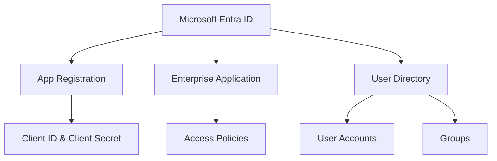
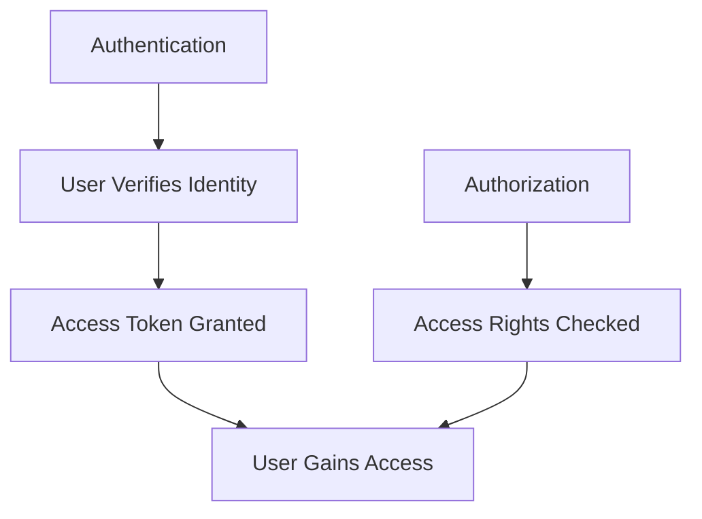
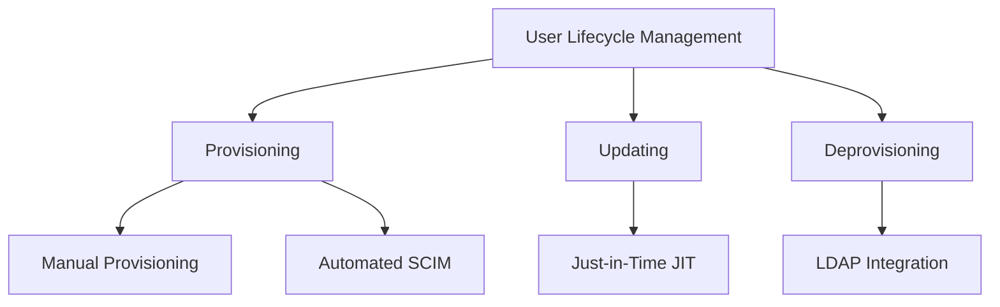
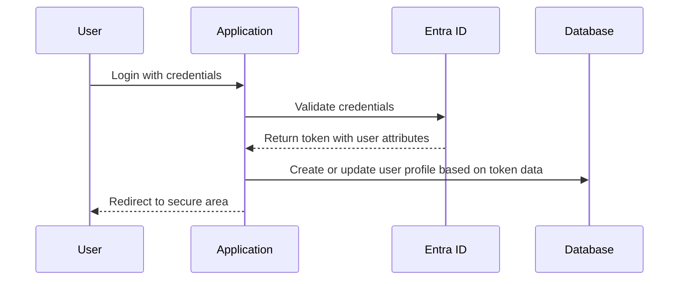
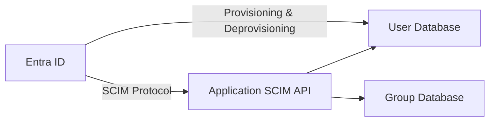
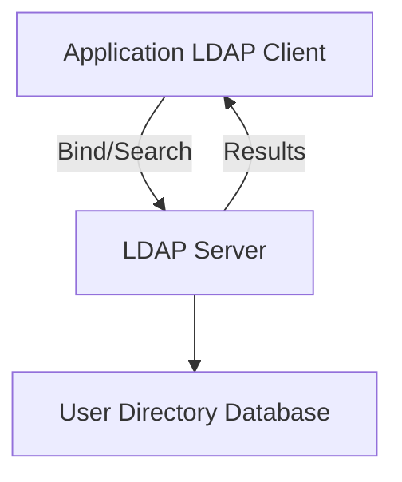
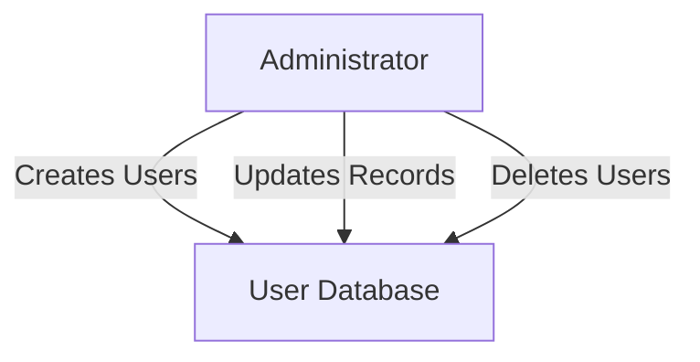
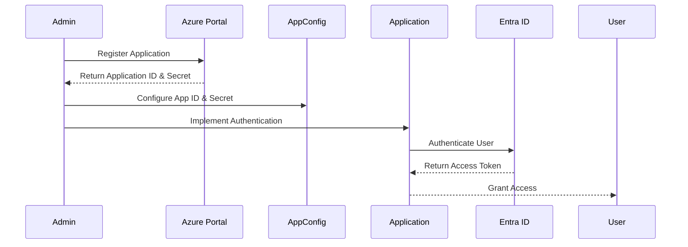
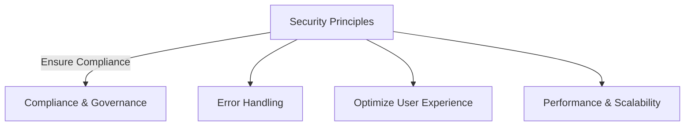

# Microsoft Entra ID Integration Guide

[](http://makeapullrequest.com)
[](http://ansicolortags.readthedocs.io/?badge=latest)
[](https://github.com/your/repo/graphs/commit-activity)

This repository provides comprehensive guides and sample applications to help development teams integrate their applications with **Microsoft Entra ID** (formerly Azure Active Directory) using various authentication protocols.

---

## Table of Contents

- [Microsoft Entra ID Integration Guide](#microsoft-entra-id-integration-guide)
  - [Table of Contents](#table-of-contents)
  - [Introduction to Microsoft Identity](#introduction-to-microsoft-identity)
  - [Prerequisites](#prerequisites)
  - [Entra ID Terms and Definitions](#entra-id-terms-and-definitions)
    - [Enterprise Applications vs. App Registrations](#enterprise-applications-vs-app-registrations)
  - [Authentication vs. Authorization](#authentication-vs-authorization)
  - [Authentication Patterns](#authentication-patterns)
    - [Common Authentication Patterns](#common-authentication-patterns)
    - [OpenID Connect (OIDC) Integration](#openid-connect-oidc-integration)
      - [Steps to Integrate with OIDC](#steps-to-integrate-with-oidc)
      - [Java OIDC Integration Example](#java-oidc-integration-example)
      - [C# OIDC Integration Example](#c-oidc-integration-example)
      - [JavaScript OIDC Integration Example](#javascript-oidc-integration-example)
      - [Python OIDC Integration Example](#python-oidc-integration-example)
    - [SAML Integration](#saml-integration)
      - [Steps to Integrate with SAML](#steps-to-integrate-with-saml)
      - [Java SAML Integration Example](#java-saml-integration-example)
      - [C# SAML Integration Example](#c-saml-integration-example)
      - [JavaScript SAML Integration Example](#javascript-saml-integration-example)
      - [Python SAML Integration Example](#python-saml-integration-example)
    - [Header-Based Authentication](#header-based-authentication)
      - [Implementation Examples](#implementation-examples)
  - [Authorization Patterns](#authorization-patterns)
    - [Common Authorization Strategies](#common-authorization-strategies)
    - [Implementing Authorization](#implementing-authorization)
    - [Examples](#examples)
      - [Java (Spring Boot)](#java-spring-boot)
      - [C# (ASP.NET Core)](#c-aspnet-core)
      - [JavaScript (Node.js with Express)](#javascript-nodejs-with-express)
  - [User Lifecycle Management](#user-lifecycle-management)
    - [Common User Lifecycle Management Methods](#common-user-lifecycle-management-methods)
    - [Just-in-Time (JIT) Provisioning](#just-in-time-jit-provisioning)
    - [SCIM (System for Cross-domain Identity Management)](#scim-system-for-cross-domain-identity-management)
    - [LDAP Integration](#ldap-integration)
    - [Manual Provisioning](#manual-provisioning)
  - [Onboarding Your Application](#onboarding-your-application)
    - [Steps to Onboard Your Application](#steps-to-onboard-your-application)
  - [Best Practices for Integrating with Microsoft Entra ID](#best-practices-for-integrating-with-microsoft-entra-id)
    - [1. Utilize Official Libraries and SDKs](#1-utilize-official-libraries-and-sdks)
    - [2. Securely Manage Secrets and Certificates](#2-securely-manage-secrets-and-certificates)
    - [3. Adhere to Security Principles](#3-adhere-to-security-principles)
    - [4. Implement Robust Error Handling](#4-implement-robust-error-handling)
    - [5. Optimize User Experience](#5-optimize-user-experience)
    - [6. Compliance and Governance](#6-compliance-and-governance)
    - [7. Testing and Validation](#7-testing-and-validation)
    - [8. Leverage Entra ID Features](#8-leverage-entra-id-features)
    - [9. Scalability and Performance](#9-scalability-and-performance)
    - [10. Use Managed Identities](#10-use-managed-identities)
  - [Samples](#samples)
    - [Plain JavaScript Application using MSAL.js](#plain-javascript-application-using-msaljs)
    - [React Application using MSAL React](#react-application-using-msal-react)
    - [Java Application using MSAL4J](#java-application-using-msal4j)
  - [Additional Resources](#additional-resources)
  - [Acknowledgments](#acknowledgments)

---

## Introduction to Microsoft Identity

**Microsoft Identity Platform** provides identity and access management (IAM) services in the cloud. It offers developers a unified approach to manage identities and secure access. **Microsoft Entra ID** is at the core of this platform, allowing applications to authenticate users and obtain access tokens for securing API calls.

This guide aims to help you understand how to integrate your applications with Microsoft Entra ID, leveraging its features for authentication, authorization, and user management.

---

## Prerequisites

- **Microsoft Entra ID Tenant**: Access to an Entra ID tenant where you can register your application.
- **Application Registration**: Your application must be registered in Entra ID.
- **Development Environment**: Set up for C#, JavaScript, Python, or Java.
- **Basic Knowledge**: Understanding of authentication protocols and the programming language you're using.

---

## Entra ID Terms and Definitions

Understanding the key terms in Microsoft Entra ID is crucial for successful integration.



- **Tenant**: A dedicated instance of Entra ID that an organization receives when it signs up for a Microsoft cloud service.
- **Directory**: Contains all of the organization's user accounts, groups, and app registrations.
- **App Registration**: An identity configuration for your application, allowing it to authenticate and request resources.
- **Enterprise Application**: Represents an instance of an application within your directory. Used to manage access and single sign-on settings.
- **Client ID**: Also known as Application ID; a unique identifier for your app registration.
- **Client Secret**: A secret string that the application uses to prove its identity when requesting a token.
- **Redirect URI**: The endpoint where the authentication response is sent after successful authentication.
- **Scopes/Permissions**: Define the level of access the application is requesting.
- **Claims**: Pieces of information asserted about a user, such as name, email, or role.

### Enterprise Applications vs. App Registrations

#### App Registration

- Represents the application's identity configuration.
- Configured by developers.
- Defines how the application integrates with Entra ID.

#### Enterprise Application

- Represents an instance of the application within a tenant.
- Used for managing access, single sign-on, and user assignments.
- Configured by IT administrators.

---

## Authentication vs. Authorization



- **Authentication**: The process of verifying the identity of a user or system. It’s about ensuring that the entity is who they claim to be.
  - **Example**: Logging in with a username and password or via single sign-on using Entra ID.

- **Authorization**: The process of determining whether an authenticated user has access to specific resources or actions.
  - **Example**: Checking if a user has the 'Admin' role before allowing access to an admin dashboard.

In the context of Entra ID:

- **Authentication** is handled via protocols like OAuth 2.0, OpenID Connect, or SAML.
- **Authorization** leverages roles, permissions, and policies defined in Entra ID and enforced within your application.

---

## Authentication Patterns

Microsoft Entra ID supports several authentication patterns to accommodate various application types and scenarios.

### Common Authentication Patterns

- **OpenID Connect (OIDC)**: Suitable for modern web applications and APIs, providing authentication and authorization in a simple and standardized way.
- **SAML (Security Assertion Markup Language)**: Often used in enterprise applications for single sign-on (SSO) scenarios.
- **Header-Based Authentication**: Used in scenarios where a trusted intermediary handles authentication and passes user information via HTTP headers.

---

### OpenID Connect (OIDC) Integration

OIDC is a simple identity layer on top of the OAuth 2.0 protocol. It allows clients to verify the identity of the end-user based on the authentication performed by an authorization server.

#### Steps to Integrate with OIDC

1. **Register your application in Entra ID**.
2. **Configure application settings**.
3. **Implement authentication logic**.

#### Java OIDC Integration Example

**Using MSAL4J**

1. **Add MSAL4J to your project**:

   ```xml
   <!-- Add this dependency in your pom.xml -->
   <dependency>
       <groupId>com.microsoft.azure</groupId>
       <artifactId>msal4j</artifactId>
       <version>1.10.1</version>
   </dependency>
   ```

2. **Configure OIDC settings**:

   ```java
   public class AuthConfig {
       private static final String CLIENT_ID = "your-client-id";
       private static final String CLIENT_SECRET = "your-client-secret";
       private static final String AUTHORITY = "https://login.microsoftonline.com/your-tenant-id";
       private static final String REDIRECT_URI = "http://localhost:8080/auth";

       // Add your configuration methods here
   }
   ```

3. **Implement Authentication Logic**:

   ```java
   import com.microsoft.aad.msal4j.*;

   public class OIDCAuthExample {

       public static void main(String[] args) throws Exception {
           ConfidentialClientApplication app = ConfidentialClientApplication.builder(CLIENT_ID,
                   ClientCredentialFactory.createFromSecret(CLIENT_SECRET))
                   .authority(AUTHORITY)
                   .build();

           IAuthenticationResult result = app.acquireToken(AuthorizationCodeParameters
                   .builder("authorization-code", new URI(REDIRECT_URI))
                   .build()).get();

           System.out.println("Access Token: " + result.accessToken());
       }
   }
   ```

#### C# OIDC Integration Example

**Using ASP.NET Core and `Microsoft.Identity.Web`**

1. **Install NuGet Packages**:

   ```bash
   dotnet add package Microsoft.Identity.Web
   dotnet add package Microsoft.Identity.Web.UI
   ```

2. **Configure `appsettings.json`**:

   ```json
   {
     "AzureAd": {
       "Instance": "https://login.microsoftonline.com/",
       "Domain": "yourdomain.onmicrosoft.com",
       "TenantId": "your-tenant-id",
       "ClientId": "your-client-id",
       "CallbackPath": "/signin-oidc"
     }
   }
   ```

3. **Update `Startup.cs`**:

   ```csharp
   using Microsoft.Identity.Web;
   using Microsoft.Identity.Web.UI;
   using Microsoft.AspNetCore.Authentication.OpenIdConnect;

   public void ConfigureServices(IServiceCollection services)
   {
       services.AddAuthentication(OpenIdConnectDefaults.AuthenticationScheme)
               .AddMicrosoftIdentityWebApp(Configuration.GetSection("AzureAd"));

       services.AddControllersWithViews()
               .AddMicrosoftIdentityUI();
   }

   public void Configure(IApplicationBuilder app, IWebHostEnvironment env)
   {
       app.UseAuthentication();
       app.UseAuthorization();

       app.UseEndpoints(endpoints =>
       {
           endpoints.MapControllers();
           endpoints.MapRazorPages();
       });
   }
   ```

4. **Protect Your Controllers**:

   ```csharp
   using Microsoft.AspNetCore.Authorization;

   [Authorize]
   public class SecureController : Controller
   {
       public IActionResult Index()
       {
           return View();
       }
   }
   ```

#### JavaScript OIDC Integration Example

**Using Node.js and Passport.js**

1. **Install Dependencies**:

   ```bash
   npm install express passport passport-azure-ad express-session
   ```

2. **Configure `app.js`**:

   ```javascript
   const express = require('express');
   const session = require('express-session');
   const passport = require('passport');
   const OIDCStrategy = require('passport-azure-ad').OIDCStrategy;

   const app = express();

   // Session middleware
   app.use(session({ secret: 'your_secret_value', resave: false, saveUninitialized: false }));

   // Passport initialization
   app.use(passport.initialize());
   app.use(passport.session());

   // OIDC Strategy
   passport.use(new OIDCStrategy(
     {
       identityMetadata: 'https://login.microsoftonline.com/your-tenant-id/v2.0/.well-known/openid-configuration',
       clientID: 'your-client-id',
       responseType: 'code',
       responseMode: 'form_post',
       redirectUrl: 'http://localhost:3000/auth/openid/return',
       allowHttpForRedirectUrl: true, // Set to false in production
       clientSecret: 'your-client-secret',
       scope: ['profile', 'email']
     },
     function (iss, sub, profile, accessToken, refreshToken, done) {
       return done(null, profile);
     }
   ));

   // Serialization
   passport.serializeUser((user, done) => {
     done(null, user);
   });
   passport.deserializeUser((obj, done) => {
     done(null, obj);
   });

   // Routes
   app.get('/login', passport.authenticate('azuread-openidconnect', { failureRedirect: '/' }));

   app.post('/auth/openid/return',
     passport.authenticate('azuread-openidconnect', { failureRedirect: '/' }),
     function (req, res) {
       res.redirect('/secure');
     }
   );

   app.get('/secure', ensureAuthenticated, (req, res) => {
     res.send(`Hello, ${req.user.displayName}`);
   });

   function ensureAuthenticated(req, res, next) {
     if (req.isAuthenticated()) { return next(); }
     res.redirect('/');
   }

   app.listen(3000, () => console.log('App listening on port 3000'));
   ```

---

#### Python OIDC Integration Example

**Using Flask and MSAL**

1. **Install Dependencies**

   ```bash
   pip install Flask msal
   ```

2. **Create `app.py`**

   ```python
   from flask import Flask, redirect, url_for, session, request
   import msal

   app = Flask(__name__)
   app.config['SECRET_KEY'] = 'your_secret_key'

   CLIENT_ID = "your-client-id"
   CLIENT_SECRET = "your-client-secret"
   AUTHORITY = "https://login.microsoftonline.com/your-tenant-id"
   REDIRECT_PATH = "/getAToken"
   ENDPOINT = 'https://graph.microsoft.com/v1.0/users'
   SCOPE = ["User.Read"]

   @app.route("/")
   def index():
       if not session.get("user"):
           return redirect(url_for("login"))
       return f"Hello, {session['user']['name']}"

   @app.route("/login")
   def login():
       session["flow"] = _build_auth_code_flow()
       return redirect(session["flow"]["auth_uri"])

   @app.route("/getAToken")
   def authorized():
       cache = msal.SerializableTokenCache()
       result = _build_msal_app(cache=cache).acquire_token_by_auth_code_flow(
           session.get("flow", {}), request.args)
       if "error" in result:
           return f"Error: {result['error']}"
       session["user"] = result.get("id_token_claims")
       return redirect(url_for("index"))

   def _build_auth_code_flow():
       return _build_msal_app().initiate_auth_code_flow(
           SCOPE,
           redirect_uri=url_for("authorized", _external=True))

   def _build_msal_app(cache=None):
       return msal.ConfidentialClientApplication(
           CLIENT_ID, authority=AUTHORITY,
           client_credential=CLIENT_SECRET, token_cache=cache)

   if __name__ == "__main__":
       app.run()
   ```

---

#### Java OIDC Integration Example

**Using MSAL for Java (MSAL4J)**

A detailed Java example is provided in the [Samples](#samples) section.

---

### SAML Integration

SAML allows service providers and identity providers to securely exchange user authentication and authorization data.

#### Steps to Integrate with SAML

1. **Register your application for SAML in Entra ID**.
2. **Configure the SAML settings in your application**.
3. **Implement the SAML authentication flow**.

#### Java SAML Integration Example

**Using `java-saml` library**

1. **Add Dependency**:

   ```xml
   <dependency>
       <groupId>com.onelogin</groupId>
       <artifactId>java-saml</artifactId>
       <version>2.5.0</version>
   </dependency>
   ```

2. **Configure SAML Settings**:

   ```java
   import com.onelogin.saml2.Auth;
   import com.onelogin.saml2.settings.Saml2Settings;
   import com.onelogin.saml2.util.Util;

   public class SamlConfig {
       private static final String IDP_METADATA_URL = "https://login.microsoftonline.com/your-tenant-id/federationmetadata/2007-06/federationmetadata.xml";

       public static Saml2Settings configureSaml() throws Exception {
           // Configure SAML settings
           Saml2Settings settings = Util.loadSettings(IDP_METADATA_URL);
           return settings;
       }
   }
   ```

3. **Implement SAML Authentication**:

   ```java
   public class SamlAuthExample {
       public static void main(String[] args) throws Exception {
           Saml2Settings settings = SamlConfig.configureSaml();
           Auth auth = new Auth(settings);

           // Process SAML response
           if (auth.isAuthenticated()) {
               System.out.println("User authenticated with SAML");
           } else {
               System.out.println("SAML authentication failed");
           }
       }
   }
   ```

---

#### C# SAML Integration Example

**Using `Sustainsys.Saml2`**

1. **Install NuGet Package**:

   ```bash
   dotnet add package Sustainsys.Saml2.AspNetCore2
   ```

2. **Configure `Startup.cs`**:

   ```csharp
   using Sustainsys.Saml2;
   using Sustainsys.Saml2.Metadata;
   using Microsoft.AspNetCore.Authentication.Cookies;

   public void ConfigureServices(IServiceCollection services)
   {
       services.AddAuthentication(options =>
       {
           options.DefaultScheme = CookieAuthenticationDefaults.AuthenticationScheme;
           options.DefaultSignInScheme = CookieAuthenticationDefaults.AuthenticationScheme;
       })
       .AddCookie()
       .AddSaml2(options =>
       {
           options.SPOptions.EntityId = new EntityId("https://yourapp.example.com/SAML");
           options.IdentityProviders.Add(
               new IdentityProvider(
                   new EntityId("https://sts.windows.net/your-tenant-id/"),
                   options.SPOptions)
               {
                   MetadataLocation = "https://login.microsoftonline.com/your-tenant-id/federationmetadata/2007-06/federationmetadata.xml",
                   LoadMetadata = true
               });
       });
   }
   ```

---

#### JavaScript SAML Integration Example

**Using `saml2-js`**

1. **Install Dependencies**:

   ```bash
   npm install saml2-js express express-session
   ```

2. **Configure SAML in `app.js`**:

   ```javascript
   const saml2 = require('saml2-js');
   const express = require('express');
   const session = require('express-session');
   const fs = require('fs');

   const app = express();
   app.use(session({ secret: 'your_secret_value', resave: false, saveUninitialized: false }));
   app.use(express.urlencoded({ extended: true }));

   // Create service provider
   const sp_options = {
     entity_id: "https://yourapp.example.com/metadata.xml",
     private_key: fs.readFileSync("key.pem").toString(),
     certificate: fs.readFileSync("cert.pem").toString(),
     assert_endpoint: "https://yourapp.example.com/assert"
   };
   const sp = new saml2.ServiceProvider(sp_options);

   // Create identity provider
   const idp_options = {
     sso_login_url: "https://login.microsoftonline.com/your-tenant-id/saml2",
     certificates: ["MIIDdzCCAl+gAwIBAgIE..."]
   };
   const idp = new saml2.IdentityProvider(idp_options);

   // Endpoint to retrieve metadata
   app.get("/metadata.xml", function(req, res) {
     res.type('application/xml');
     res.send(sp.create_metadata());
   });

   // Starting point for login
   app.get("/login", function(req, res) {
     sp.create_login_request_url(idp, {}, function(err, login_url) {
       if (err != null) return res.status(500).send(err);
       res.redirect(login_url);
     });
   });

   // Assert endpoint for when login completes
   app.post("/assert", function(req, res) {
     const options = { request_body: req.body };
     sp.post_assert(idp, options, function(err, response) {
       if (err != null) return res.status(500).send(err);
       req.session.user = response.user;
       res.redirect("/secure");
     });
   });

   app.get("/secure", ensureAuthenticated, function(req, res) {
     res.send(`Hello ${req.session.user.name_id}`);
   });

   function ensureAuthenticated(req, res, next) {
     if (req.session.user) { return next(); }
     res.redirect('/login');
   }

   app.listen(3000);
   ```

   **Note**: Replace the `certificates` value in `idp_options` with the certificate from Entra ID.

---

#### Python SAML Integration Example

**Using `python3-saml`**

1. **Install Dependencies**:

   ```bash
   pip install python3-saml Flask
   ```

2. **Create `settings.json`**:

   ```json
   {
     "sp": {
       "entityId": "https://yourapp.example.com/metadata/",
       "assertionConsumerService": {
         "url": "https://yourapp.example.com/?acs",
         "binding": "urn:oasis:names:tc:SAML:2.0:bindings:HTTP-POST"
       }
     },
     "idp": {
       "entityId": "https://sts.windows.net/your-tenant-id/",
       "singleSignOnService": {
         "url": "https://login.microsoftonline.com/your-tenant-id/saml2",
         "binding": "urn:oasis:names:tc:SAML:2.0:bindings:HTTP-Redirect"
       },
       "x509cert": "MIIC8DCC...="
     }
   }
   ```

3. **Implement in Flask (`app.py`)**:

   ```python
   from flask import Flask, request, redirect, session
   from onelogin.saml2.auth import OneLogin_Saml2_Auth
   import os

   app = Flask(__name__)
   app.secret_key = 'your_secret_key'

   def init_saml_auth(req):
       auth = OneLogin_Saml2_Auth(req, custom_base_path=os.path.join(os.getcwd(), 'saml'))
       return auth

   @app.route('/')
   def index():
       if 'samlUserdata' in session:
           return 'Logged in as ' + session['samlNameId']
       else:
           return redirect('/saml/login')

   @app.route('/saml/login')
   def saml_login():
       req = prepare_flask_request(request)
       auth = init_saml_auth(req)
       return redirect(auth.login())

   @app.route('/saml/acs', methods=['POST'])
   def saml_acs():
       req = prepare_flask_request(request)
       auth = init_saml_auth(req)
       auth.process_response()
       errors = auth.get_errors()
       if not errors:
           session['samlUserdata'] = auth.get_attributes()
           session['samlNameId'] = auth.get_nameid()
           return redirect('/')
       else:
           return ', '.join(errors)

   def prepare_flask_request(request):
       import urllib
       url_data = request.get_data().decode('utf-8')
       return {
           'https': 'on' if request.scheme == 'https' else 'off',
           'http_host': request.host,
           'server_port': request.environ.get('SERVER_PORT'),
           'script_name': request.path,
           'get_data': request.args.copy(),
           'post_data': request.form.copy(),
           'query_string': request.query_string.decode('utf-8'),
           'body': url_data,
       }

   if __name__ == '__main__':
       app.run()
   ```

---

### Header-Based Authentication

Header-based authentication involves passing user identity information in HTTP headers. This method is generally used in secure, internal networks or when fronted by a trusted proxy that handles authentication.

#### Implementation Examples


**Java (Spring Boot Middleware)**

1. **Add Middleware for Header Authentication**:

   ```java
   import org.springframework.stereotype.Component;
   import javax.servlet.*;
   import javax.servlet.http.HttpServletRequest;
   import java.io.IOException;

   @Component
   public class HeaderAuthenticationFilter implements Filter {

       @Override
       public void doFilter(ServletRequest request, ServletResponse response, FilterChain chain)
               throws IOException, ServletException {

           HttpServletRequest httpRequest = (HttpServletRequest) request;
           String userHeader = httpRequest.getHeader("X-User");
           if (userHeader != null) {
               // Example: Set the user in the security context
               System.out.println("User authenticated: " + userHeader);
           }
           chain.doFilter(request, response);
       }
   }
   ```

**C# (ASP.NET Core Middleware)**

1. **Configure `Startup.cs`**:

   ```csharp
   using Microsoft.AspNetCore.Http;
   using System.Threading.Tasks;

   public class HeaderAuthMiddleware
   {
       private readonly RequestDelegate _next;

       public HeaderAuthMiddleware(RequestDelegate next)
       {
           _next = next;
       }

       public async Task Invoke(HttpContext context)
       {
           if (context.Request.Headers.ContainsKey("X-User"))
           {
               var username = context.Request.Headers["X-User"];
               // Add custom authentication logic here
               Console.WriteLine($"Authenticated user: {username}");
           }
           await _next(context);
       }
   }
   ```

2. **Register Middleware**:

   ```csharp
   public void Configure(IApplicationBuilder app, IWebHostEnvironment env)
   {
       app.UseMiddleware<HeaderAuthMiddleware>();
       app.UseRouting();
       app.UseAuthorization();
       app.UseEndpoints(endpoints => { endpoints.MapControllers(); });
   }
   ```

**JavaScript (Express.js Middleware)**

1. **Create Middleware for Header-Based Authentication**:

   ```javascript
   app.use((req, res, next) => {
     if (req.headers['x-user']) {
       req.user = { name: req.headers['x-user'] };
       console.log("User authenticated:", req.user.name);
     }
     next();
   });

   app.get('/secure', (req, res) => {
     if (req.user) {
       res.send(`Hello, ${req.user.name}`);
     } else {
       res.status(401).send('Unauthorized');
     }
   });
   ```

**Python (Flask Middleware)**

1. **Use `before_request` for Header-Based Authentication**:

   ```python
   from flask import Flask, request, g

   app = Flask(__name__)

   @app.before_request
   def before_request():
       if 'X-User' in request.headers:
           g.user = request.headers.get('X-User')

   @app.route('/secure')
   def secure():
       user = getattr(g, 'user', None)
       if user:
           return f'Hello, {user}'
       else:
           return 'Unauthorized', 401
   ```

---

## Authorization Patterns

Authorization determines what authenticated users are allowed to do within an application. Microsoft Entra ID can provide user and group information, roles, and permissions that your application can use to enforce authorization policies.

### Common Authorization Strategies

1. **Role-Based Access Control (RBAC)**:
   - Assign roles to users or groups.
   - Use roles to control access to resources or functionalities within the application.
   - Roles can be defined in Entra ID and assigned via application registration.

2. **Claims-Based Access Control**:
   - Use claims in the authentication token to make authorization decisions.
   - Claims can include user attributes, groups, roles, or custom data.
   - Application reads claims from the token and enforces policies accordingly.

3. **Policy-Based Access Control**:
   - Define policies that determine access based on conditions (e.g., user attributes, environmental context).
   - Policies can be enforced within the application or using a policy engine like Azure AD Conditional Access.

4. **Attribute-Based Access Control (ABAC)**:
   - Decisions are made based on attributes of the user, resource, and environment.
   - Provides fine-grained access control.

### Implementing Authorization

- **In Code**: Check user roles or claims within your application code before performing actions or displaying content.
- **Using Middleware**: Employ middleware to enforce authorization rules globally or on specific routes.
- **Using Entra ID Groups**:
  - Synchronize Entra ID groups into your application.
  - Use group membership to control access.

### Examples

#### Java (Spring Boot)

1. **Add Role-Based Authorization**:

   ```java
   import org.springframework.security.access.prepost.PreAuthorize;
   import org.springframework.web.bind.annotation.GetMapping;
   import org.springframework.web.bind.annotation.RestController;

   @RestController
   public class SecureController {

       @PreAuthorize("hasRole('ROLE_ADMIN')")
       @GetMapping("/admin")
       public String adminAccess() {
           return "Welcome Admin!";
       }
   }
   ```

2. **Enable Method Security**:

   Add the following to your main application class:

   ```java
   import org.springframework.security.config.annotation.method.configuration.EnableGlobalMethodSecurity;

   @EnableGlobalMethodSecurity(prePostEnabled = true)
   public class Application {}
   ```

#### C# (ASP.NET Core)

1. **Add Policy-Based Authorization**:

   ```csharp
   // Startup.cs
   services.AddAuthorization(options =>
   {
       options.AddPolicy("AdminOnly", policy => policy.RequireRole("Admin"));
   });

   // Controller
   [Authorize(Policy = "AdminOnly")]
   public IActionResult AdminOnlyAction()
   {
       return View();
   }
   ```

#### JavaScript (Node.js with Express)

1. **Implement Role-Based Access Control**:

   ```javascript
   function ensureAdmin(req, res, next) {
     if (req.user && req.user.roles.includes('Admin')) {
       return next();
     }
     res.status(403).send('Forbidden');
   }

   app.get('/admin', ensureAuthenticated, ensureAdmin, (req, res) => {
     res.send('Welcome Admin');
   });
   ```

---

## User Lifecycle Management

User lifecycle management involves handling user accounts from creation to deletion, including updates and provisioning. Effective user management ensures that the right users have appropriate access at the right time.



### Common User Lifecycle Management Methods

1. **Just-in-Time (JIT) Provisioning**: Automatically provisions users upon login.
2. **SCIM (System for Cross-domain Identity Management)**: Automates user and group management using a standard protocol.
3. **LDAP Integration**: Connects applications to directories that support LDAP for user information and authentication.
4. **Manual Provisioning**: Administrators manually create and manage user accounts.

---

### Just-in-Time (JIT) Provisioning

**Overview**

- JIT provisioning automatically creates user accounts in your application upon successful authentication.
- Eliminates the need for pre-provisioning users in the application database.
- User attributes are extracted from the authentication token and used to create the user profile.




**Implementation Steps**

1. **Extract User Attributes**: Configure your application to extract user attributes from the authentication token (e.g., email, name, roles).

2. **Implement Account Creation Logic**:
   - During authentication, check if the user exists in your application database.
   - If not, create a new user record with the extracted attributes.
   - If the user exists, update their information as needed.

3. **Map Attributes**: Ensure that the claims in the token are mapped correctly to your application's user model.

**Advantages**

- Simplifies user onboarding.
- Reduces administrative overhead.
- Ensures user information is up-to-date.

**Considerations**

- **Security**: Verify that only authorized users can be provisioned.
- **Mandatory Attributes**: Ensure that the token includes all necessary attributes.
- **Data Validation**: Validate and sanitize all user data extracted from tokens.

---

### SCIM (System for Cross-domain Identity Management)

**Overview**

- SCIM is an open standard for automating the exchange of user identity information between identity domains or IT systems.
- SCIM 2.0 is supported by Microsoft Entra ID for user and group provisioning.



**Implementation Steps**

1. **Implement SCIM Endpoint**:
   - Develop a RESTful API in your application that complies with SCIM specifications.
   - Support user creation, updates, deletions, and querying.

2. **Secure the Endpoint**:
   - Implement authentication (e.g., OAuth 2.0 client credentials) to protect the SCIM API.
   - Ensure proper authorization and input validation.

3. **Configure Entra ID Provisioning**:
   - In Entra ID, navigate to **Enterprise Applications** > **Your Application** > **Provisioning**.
   - Set **Provisioning Mode** to **Automatic**.
   - Provide the SCIM endpoint URL and authentication details.

4. **Define Attribute Mappings**:
   - Map Entra ID user attributes to your application's user schema.
   - Customize mappings to include necessary attributes.

**Advantages**

- Automates user provisioning and deprovisioning.
- Keeps user data synchronized between Entra ID and your application.
- Supports group management.

**Considerations**

- **Error Handling**: Implement robust error handling and logging.
- **Scalability**: Ensure your SCIM API can handle the expected load.
- **Testing**: Thoroughly test the provisioning process in a non-production environment.

**Resources**

- [SCIM API Guidelines](https://docs.microsoft.com/azure/active-directory/app-provisioning/use-scim-to-provision-users-and-groups)

---

### LDAP Integration

**Overview**

- LDAP (Lightweight Directory Access Protocol) is a protocol for accessing directory services.
- Microsoft Entra ID Domain Services provides LDAP and Kerberos authentication for Azure resources.



1. **Enable Entra ID Domain Services**:
   - Set up Entra ID Domain Services in your Azure environment.
   - Synchronize Entra ID users and groups.

2. **Configure Secure LDAP**:
   - Enable secure LDAP (LDAPS) to encrypt communication.
   - Obtain and install TLS certificates if needed.

3. **Connect Your Application**:
   - Configure your application to connect to the LDAP directory.
   - Authenticate users and query directory information as required.

**Advantages**

- Supports legacy applications requiring LDAP or Kerberos.
- Provides compatibility with on-premises Active Directory-based applications.

**Considerations**

- **Cost**: Entra ID Domain Services incurs additional charges.
- **Network Requirements**: Applications must have network access to the managed domain.
- **Maintenance**: Managed domains require monitoring and maintenance.

**Resources**

- [Azure Active Directory Domain Services](https://docs.microsoft.com/azure/active-directory-domain-services/overview)

---

### Manual Provisioning

**Overview**

- Involves manually creating and managing user accounts within your application.
- Suitable for small-scale applications or where automated provisioning is not practical.



**Implementation Steps**

1. **Administrative Tools**:
   - Develop interfaces or tools for administrators to manage user accounts.
   - Include functionalities for creating, updating, and deleting users.

2. **Data Import/Export**:
   - Allow importing user data from Entra ID exports.
   - Regularly synchronize data manually or via scheduled tasks.

3. **Documentation**:
   - Document procedures for administrators to follow.
   - Ensure that processes are well-defined and accessible.

**Advantages**

- Full control over user data and provisioning processes.
- Simplicity in implementation.

**Considerations**

- **Resource Intensive**: Requires manual effort and can be error-prone.
- **Scalability**: Not suitable for organizations with large user bases.
- **Timeliness**: User data may become outdated between syncs.

---

## Onboarding Your Application

Integrating your application with Microsoft Entra ID involves several steps to ensure secure and efficient authentication and authorization.



1. **Plan Your Integration**

   - **Determine Authentication Protocol**: Choose between OIDC, SAML, or header-based authentication based on your application's needs.
   - **Define Authorization Strategy**: Plan how you'll handle user roles, permissions, and access control.

2. **Register Your Application**

   - Access the **Azure Portal** and navigate to **Azure Active Directory** > **App registrations**.
   - Click **New registration** and provide application details.
   - Configure redirect URIs, supported account types, and other settings.

3. **Configure Application Settings**

   - **Authentication Settings**: Set redirect URIs, logout URLs, and token configurations.
   - **Certificates & Secrets**: Generate client secrets or upload certificates for application authentication.
   - **API Permissions**: Specify the resources and scopes your application needs access to.
   - **Token Configuration**: Define which claims and group memberships are included in tokens.

4. **Develop and Test Your Application**

   - Implement authentication logic using appropriate libraries (e.g., MSAL).
   - Test the authentication flows in a development environment.
   - Handle errors and edge cases.

5. **Implement Authorization Logic**

   - Use roles, groups, or claims to enforce access control within your application.
   - Secure APIs and resources appropriately.

6. **Prepare for Deployment**

   - **Security Review**: Ensure secrets are securely managed.
   - **Compliance Checks**: Verify that your application meets organizational and regulatory compliance requirements.

7. **Monitor and Maintain**

   - Set up logging and monitoring for authentication events.
   - Keep libraries and dependencies up to date.
   - Regularly review security practices.

---

## Best Practices for Integrating with Microsoft Entra ID

When integrating applications with Microsoft Entra ID, following best practices ensures secure, efficient, and maintainable solutions. Below are recommended practices your development teams should consider:



### 1. Utilize Official Libraries and SDKs

- Use officially supported libraries and SDKs instead of building your own library. List of officially supported libraries in use include:
  - **MSAL (Microsoft Authentication Library)**: A collection of libraries for acquiring access tokens to call protected APIs.
  - **Microsoft.Identity.Web**: A set of ASP.NET Core libraries helping with integrating with Microsoft Entra ID.
  - **Azure.Identity**: Simplifies authentication across Azure SDKs using Managed Identity, Service Principal, and other mechanisms.
  - **Active Directory Authentication Library (ADAL)**: Older library for authentication with Azure Active Directory, primarily for legacy applications (consider migrating to MSAL).

- **Avoid Deprecated APIs**: Use the latest APIs and protocols (e.g., OIDC over OAuth 2.0) and avoid using deprecated ones.

- **Stay Updated**: Regularly update libraries and dependencies to benefit from security patches and new features.
- **Avoid Deprecated APIs**: Use the latest APIs and protocols (e.g., OIDC over OAuth 2.0) and avoid using deprecated ones.

### 2. Securely Manage Secrets and Certificates

- **Never Hardcode Secrets**: Do not store client secrets, certificates, or keys in source code or configuration files checked into source control.
- **Use Secure Secret Storage**:
  - **Azure Key Vault**: Store secrets, keys, and certificates securely.
  - **Environment Variables**: Use secured environment variables in deployment environments.
- **Rotate Secrets Regularly**: Implement a process for regularly rotating secrets and certificates.

### 3. Adhere to Security Principles

- **Principle of Least Privilege**: Assign the minimal necessary permissions to applications and users.
- **Validate Tokens**:
  - Verify token signatures and issuer.
  - Check token expiration (`exp` claim).
  - Validate token audience (`aud` claim).
- **Protect Against Common Threats**:
  - Implement CSRF protection.
  - Validate all inputs to prevent injection attacks.
  - Ensure redirect URIs are properly validated.

### 4. Implement Robust Error Handling

- **User-Friendly Messages**: Display generic error messages to end-users without exposing sensitive details.
- **Logging**:
  - Log errors and exceptions with sufficient detail for troubleshooting.
  - Avoid logging sensitive information like access tokens or personal data.
- **Monitoring**: Use logging and monitoring tools to detect and respond to authentication issues.

### 5. Optimize User Experience

- **Single Sign-On (SSO)**: Implement SSO to provide seamless access across multiple applications.
- **Session Management**:
  - Properly manage session timeouts.
  - Handle session revocation appropriately.

### 6. Compliance and Governance

- **Regulatory Compliance**: Ensure your authentication implementation complies with data protection regulations like GDPR or HIPAA.
- **Documentation**: Maintain up-to-date documentation of authentication flows, configurations, and dependencies.

### 7. Testing and Validation

- **Automated Testing**: Include authentication flows in your automated testing.
- **Security Testing**:
  - Conduct regular security assessments and penetration testing.
  - Use tools to scan for vulnerabilities in your authentication implementation.

### 8. Leverage Entra ID Features

- **Conditional Access**:
  - Implement Conditional Access policies for enhanced security.
- **Multi-Factor Authentication (MFA)**:
  - Require MFA for sensitive operations or roles.
- **Identity Protection**:
  - Utilize Entra ID's identity protection features to detect and remediate identity-based risks.

### 9. Scalability and Performance

- **Token Caching**: Cache tokens appropriately to reduce latency and network calls.
- **Asynchronous Calls**: Use asynchronous programming models where applicable.
- **Load Testing**: Perform load testing to ensure the authentication system can handle expected traffic.

### 10. Use Managed Identities

- **Azure Managed Identities**:
  - Use Managed Service Identity (MSI) to let Azure manage the identity of applications, avoiding manual secret management.
  - This is particularly useful when accessing Azure resources like Key Vault, Storage Accounts, etc.

---

## Samples

The `Samples` folder contains sample applications demonstrating how to integrate with Microsoft Entra ID using various languages and frameworks.

- ### Plain JavaScript Application using MSAL.js

  - **Folder**: [`Samples/JavaScriptSinglePageApp`](Samples/JavaScriptSinglePageApp)
  - **Description**: A simple single-page application using vanilla JavaScript and the MSAL.js library to authenticate users with Microsoft Entra ID.

- ### React Application using MSAL React

  - **Folder**: [`Samples/ReactSinglePageApp`](Samples/ReactSinglePageApp)
  - **Description**: A React application that utilizes the MSAL React library for authenticating users with Microsoft Entra ID.

- ### Java Application using MSAL4J

  - **Folder**: [`Samples/JavaWebAppMSAL`](Samples/JavaWebAppMSAL)
  - **Description**: A Java Spring Boot application demonstrating authentication with Microsoft Entra ID using MSAL4J.

---

## Additional Resources

- **Microsoft Entra ID Documentation**:
  - [Microsoft Identity Platform](https://docs.microsoft.com/azure/active-directory/develop/)

- **MSAL Libraries**:
  - [MSAL Overview](https://docs.microsoft.com/azure/active-directory/develop/msal-overview)
  - [MSAL for Java (MSAL4J)](https://github.com/AzureAD/microsoft-authentication-library-for-java)

- **SAML Authentication with Entra ID**:
  - [Azure Active Directory Single Sign-On (SSO) Integration](https://docs.microsoft.com/azure/active-directory/saas-apps/saml-toolkit-tutorial)

- **OIDC Implementation Samples**:
  - [Microsoft.Identity.Web Samples](https://github.com/AzureAD/microsoft-identity-web/tree/master/samples)
  - [Passport-Azure-AD Samples](https://github.com/AzureAD/passport-azure-ad/tree/master/samples)
- **Azure Hosting Scenarios**:
  - [App Service Authentication](https://docs.microsoft.com/azure/app-service/overview-authentication-authorization)
  - [Azure Functions Authentication](https://docs.microsoft.com/azure/azure-functions/functions-secure-your-function)
  - [Azure API Management Authentication Policies](https://docs.microsoft.com/azure/api-management/api-management-access-restriction-policies#ValidateJWT)

---

## Acknowledgments

- Microsoft Documentation
- Community Contributions

---

**Maintainers**:

- [James Bisiar](mailto:James.Bisiar@journeyteam.com)
- [JourneyTeam]

Feel free to contribute to this guide by submitting a pull request or opening an issue.

---

