# Claudia Integration Guide for Azure WAF Agents

## Overview
This document describes the integration of Azure WAF & Audit Readiness agents into Claudia, a desktop GUI application for managing Claude Code agents.

## Installation Summary

### 1. Claudia Installation
Claudia was successfully installed from https://github.com/getAsterisk/claudia

**Installation Steps:**
```bash
# Clone repository
git clone https://github.com/getAsterisk/claudia.git ~/claudia

# Install dependencies
curl --proto '=https' --tlsv1.2 -sSf https://sh.rustup.rs | sh -s -- -y
curl -fsSL https://bun.sh/install | bash

# Build and run
cd ~/claudia
bun install
bun run tauri dev
```

### 2. Agent Integration Method
Due to a broken export/import feature in Claudia, agents were directly inserted into the SQLite database.

**Database Location:** `~/Library/Application Support/claudia.asterisk.so/agents.db`

## Integrated Agents

### 1. Code Quality Agent
- **Icon:** code
- **Model:** Claude 4 Sonnet
- **Purpose:** Enforce code quality standards and security compliance
- **Key Features:**
  - OWASP Top 10 vulnerability scanning
  - Code coverage analysis (target >80%)
  - Cyclomatic complexity assessment
  - Integration with SonarQube, Azure DevOps

### 2. WAF Documentation Agent
- **Icon:** book
- **Model:** Claude 4 Sonnet
- **Purpose:** Generate Microsoft Well-Architected Framework aligned documentation
- **Key Features:**
  - Auto-detects Azure specialization from README
  - Generates 6-10 core documents (ARCHITECTURE.md, SECURITY.md, etc.)
  - Ensures all 5 WAF pillars coverage
  - Creates audit evidence files

### 3. Architecture Enforcement Agent
- **Icon:** build
- **Model:** Claude 4 Sonnet
- **Purpose:** Validate and enforce onion architecture patterns
- **Key Features:**
  - Blocks ViewModels in Application layer
  - Prevents external dependencies in Domain layer
  - Validates project references
  - Provides refactoring guidance

### 4. Azure Infrastructure Agent
- **Icon:** cloud
- **Model:** Claude 4 Sonnet
- **Purpose:** Generate Azure infrastructure with proper naming conventions
- **Key Features:**
  - Enforces Microsoft naming standards (rg-, app-, st, kv-, etc.)
  - Generates Bicep templates for `azd up`
  - Creates azure.yaml configuration
  - Validates globally unique names

### 5. Audit Orchestration Agent
- **Icon:** target
- **Model:** Claude 4 Sonnet
- **Purpose:** Coordinate audit readiness for Azure Advanced Specializations
- **Key Features:**
  - Detects specialization type automatically
  - Maps documents to audit controls
  - Tracks timeline (30/14/7 days before audit)
  - Generates evidence files with proper naming

## Database Integration Commands

```sql
-- Add WAF Documentation Agent
INSERT INTO agents (name, icon, system_prompt, default_task, model) 
VALUES ('WAF Documentation Agent', 'book', '[system_prompt]', 'Generate WAF-aligned documentation for Azure projects', 'sonnet');

-- Add Architecture Enforcement Agent  
INSERT INTO agents (name, icon, system_prompt, default_task, model)
VALUES ('Architecture Enforcement Agent', 'build', '[system_prompt]', 'Validate onion architecture compliance', 'sonnet');

-- Add Azure Infrastructure Agent
INSERT INTO agents (name, icon, system_prompt, default_task, model)
VALUES ('Azure Infrastructure Agent', 'cloud', '[system_prompt]', 'Generate Azure infrastructure with proper naming', 'sonnet');

-- Add Audit Orchestration Agent
INSERT INTO agents (name, icon, system_prompt, default_task, model)
VALUES ('Audit Orchestration Agent', 'target', '[system_prompt]', 'Orchestrate audit readiness for Azure specializations', 'sonnet');
```

## Usage Instructions

### Running Agents in Claudia
1. Open Claudia application
2. Navigate to "Agents" tab
3. Select the desired agent from the list
4. Click "Run" and specify:
   - Project path (your Azure project directory)
   - Specific task (optional, uses default if not specified)
5. Agent executes in a separate process with full logging

### Agent Coordination Workflow

```mermaid
graph LR
    A[Code Change] --> B[Architecture Agent]
    B --> C[Validate Structure]
    C --> D[Documentation Agent]
    D --> E[Update WAF Docs]
    E --> F[Infrastructure Agent]
    F --> G[Generate Bicep]
    G --> H[Audit Agent]
    H --> I[Check Compliance]
    I --> J[Generate Evidence]
```


## MCP Server Integration
All agents are designed to work with:
- **SherpAI DevOps MCP**: Create work items for gaps, track tasks
- **Context7 MCP**: Persist context and progress across sessions

## File Locations

### Original Agent Definitions (Markdown)
```
/Users/james/Source/bisiar.github.com/JourneyTeam-Azure/claude-agents/
├── documentation-agent.md
├── architecture-enforcement-agent.md
├── azure-infrastructure-agent.md
├── audit-orchestration-agent.md
└── README.md
```

### Claudia Format Attempts (JSON)
```
/Users/james/Source/bisiar.github.com/JourneyTeam-Azure/claude-agents/claudia-format/
├── waf-documentation.claudia.json
├── architecture-enforcement.claudia.json
├── azure-infrastructure.claudia.json
├── audit-orchestration.claudia.json
└── code-quality.claudia.json
```

### Claudia Database
```
~/Library/Application Support/claudia.asterisk.so/agents.db
```

## Troubleshooting

### Issue: Import Feature Not Working
**Problem:** The import button in Claudia fails to import .claudia.json files.

**Solution:** Directly insert agents into the SQLite database using the commands provided above.

### Issue: Agents Not Appearing
**Problem:** After adding agents to database, they don't show in UI.

**Solution:** Refresh the Claudia app (Cmd+R) or restart it completely.

### Issue: Export Feature Broken
**Problem:** Cannot export agents from Claudia UI.

**Solution:** Query the database directly:
```bash
sqlite3 ~/Library/Application\ Support/claudia.asterisk.so/agents.db \
  "SELECT * FROM agents WHERE name='[Agent Name]';"
```

## Key Learnings

1. **Icon Format:** Icons must be text strings (e.g., "book", "shield", "code"), not emoji characters
2. **Model Options:** Available models are "opus", "sonnet", and "haiku"
3. **Database Structure:** Agents stored in SQLite with fields: name, icon, system_prompt, default_task, model, permissions, hooks
4. **File Permissions:** Default permissions are file_read=1, file_write=1, network=0

## Future Improvements

1. Fix the import/export functionality in Claudia
2. Add batch agent execution capabilities
3. Create agent templates for common Azure scenarios
4. Implement agent chaining for complex workflows
5. Add visual agent workflow designer

## Support & Resources

- **Claudia Repository:** https://github.com/getAsterisk/claudia
- **Azure Agents:** https://github.com/Bisiar/JourneyTeam-Azure/tree/main/claude-agents
- **Claude Code:** https://claude.ai/code

---

*Document created: August 16, 2025*
*Integration performed by: Claude Code Assistant*
*Environment: macOS, Claudia v0.1.0, Claude Code agents for Azure WAF compliance*