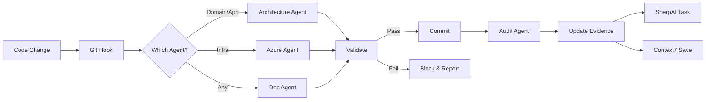

# Claude Code Subagents for Azure WAF & Audit Readiness

## Overview
This suite of Claude Code subagents ensures your Azure projects are audit-ready, WAF-aligned, and architecturally sound. The agents work with your existing orchestrator and MCP servers (SherpAI DevOps, Context7).

## Agent Architecture

```
┌─────────────────────────────────────────────┐
│         Your Existing Orchestrator          │
│         (Main Coordination Layer)           │
└─────────────┬───────────────────────────────┘
              │
    ┌─────────┴─────────┬──────────┬──────────┬──────────┐
    ▼               ▼          ▼          ▼          ▼
┌──────────┐ ┌──────────┐ ┌────────┐ ┌────────┐ ┌────────┐
│   WAF    │ │  Arch.   │ │ Azure  │ │ Audit  │ │  Code  │
│   Doc    │ │ Enforce  │ │ Infra  │ │ Orch.  │ │Quality │
│  Agent   │ │  Agent   │ │ Agent  │ │ Agent  │ │ Agent  │
└──────────┘ └──────────┘ └────────┘ └────────┘ └────────┘
     │            │           │          │           │
     └────────────┴───────────┴──────────┴───────────┘
                          │
              ┌───────────┴───────────┐
              ▼                       ▼
        ┌──────────┐           ┌──────────┐
        │ SherpAI  │           │ Context7 │
        │   MCP    │           │   MCP    │
        └──────────┘           └──────────┘
```

## Agents Summary

### 1. WAF Documentation Agent (`documentation-agent.md`)
- **Trigger**: File changes, git hooks
- **Output**: 6-10 markdown documents aligned with 5 WAF pillars
- **Specialization**: Auto-fetches from GitHub based on README

### 2. Architecture Enforcement Agent (`architecture-enforcement-agent.md`)
- **Purpose**: Enforce onion architecture patterns
- **Blocks**: ViewModels in Application layer, external deps in Domain
- **Integration**: Pre-commit hooks, CI/CD validation

### 3. Azure Infrastructure Agent (`azure-infrastructure-agent.md`)
- **Purpose**: Enforce Azure naming conventions
- **Generates**: Bicep templates for `azd up`
- **Validates**: Resource names per Microsoft standards

### 4. Audit Orchestration Agent (`audit-orchestration-agent.md`)
- **Purpose**: Coordinate audit readiness with existing orchestrator
- **Tracks**: Module A & B requirements
- **Generates**: Evidence files with proper naming

### 5. Code Quality Agent (existing)
- **Purpose**: Enforce quality standards
- **Checks**: Security, coverage, complexity
- **Integration**: Your existing quality tools

## ⚠️ IMPORTANT: Why Agents Don't Work Automatically

**Claude Code doesn't know about your agents unless you activate them!**

Your agents will NOT help if they're not running. Here's the quickest fix:

```bash
# Install the wrapper (one-time setup)
chmod +x ./claude-agents/claude-wrapper.sh
./claude-agents/claude-wrapper.sh --install
source ~/.zshrc

# Now 'claude' automatically starts agents!
claude "Create infrastructure"  # Agents validate automatically
```

See [ACTIVATION_GUIDE.md](./ACTIVATION_GUIDE.md) for all activation methods.

## Quick Start

### 1. Initial Setup
```bash
# Add to your project
cp -r claude-agents /your/project/

# Update README with specialization
echo "Specialization: AI Platform on Microsoft Azure" >> README.md
```

### 2. Trigger Documentation Generation
```bash
claude "As the WAF Documentation Agent, analyze this codebase and generate the core 10 documents aligned with our Azure specialization"
```

### 3. Validate Architecture
```bash
claude "As the Architecture Enforcement Agent, validate our onion architecture and flag any violations"
```

### 4. Generate Infrastructure
```bash
claude "As the Azure Infrastructure Agent, create Bicep templates for project 'customer-portal' with proper naming conventions"
```

### 5. Check Audit Readiness
```bash
claude "As the Audit Orchestration Agent, validate our readiness for the specialization audit and identify gaps"
```

## Document Structure (Lean 6-10 Files)

| Document | Purpose | WAF Pillars | Size |
|----------|---------|-------------|------|
| ARCHITECTURE.md | Solution overview, onion layers | Reliability, Security, Performance | 2-3 pages |
| OPERATIONS.md | Deployment (azd up), monitoring | Operational Excellence | 2 pages |
| SECURITY.md | Auth, data protection, compliance | Security | 2-3 pages |
| PERFORMANCE.md | Targets, scaling, caching | Performance Efficiency | 1-2 pages |
| COST.md | Sizing, estimates, optimization | Cost Optimization | 1-2 pages |
| TESTING.md | Strategy, coverage, results | Reliability, Security | 2 pages |
| DEPLOYMENT.md | IaC, CI/CD, environments | Operational Excellence | 2 pages |
| AUDIT_EVIDENCE.md | Specialization alignment, controls | All | 3-4 pages |
| README.md | Overview, quick start, specialization | Operational Excellence | 1-2 pages |
| RUNBOOK.md | Operations, troubleshooting | Operational Excellence, Reliability | 2 pages |

**Total: ~20 pages maximum**

## Integration with MCP Servers

### SherpAI DevOps MCP
- Creates work items for documentation gaps
- Tracks audit tasks in Azure DevOps
- Multi-tenant support (JTOP, NCNP, ORDS)

### Context7 MCP
- Persists documentation context
- Remembers audit progress
- Maintains session continuity

## Workflow Example



## Best Practices

### 1. Keep Documentation Lean
- Maximum 10 documents
- Each document 1-4 pages
- Focus on audit requirements

### 2. Automate Everything
- Use git hooks for triggers
- CI/CD integration mandatory
- No manual documentation

### 3. Enforce Continuously
- Architecture validation on every commit
- Naming convention checks in PR
- Audit readiness dashboard

### 4. Use Existing Tools
- Leverage your orchestrator
- Integrate with MCP servers
- Don't duplicate functionality

## Troubleshooting

### Agent Not Triggering
```bash
# Check git hooks
ls -la .git/hooks/
# Ensure executable
chmod +x .git/hooks/pre-commit
```

### Documentation Out of Sync
```bash
# Force regeneration
claude "As the WAF Documentation Agent, regenerate all documentation from current codebase"
```

### Architecture Violations
```bash
# Get detailed report
claude "As the Architecture Enforcement Agent, provide detailed violation report with fixes"
```

### Naming Convention Issues
```bash
# Validate all resources
claude "As the Azure Infrastructure Agent, validate all resource names in /infra folder"
```

## Specialization Support

Currently supports audit requirements for:
- AI Platform on Microsoft Azure
- Web Applications Modernization
- Azure Virtual Desktop
- Data Platform on Microsoft Azure
- Infrastructure on Microsoft Azure

Auto-detection from README.md or manual specification.

## Contact & Support

- **Specializations Repo**: https://github.com/Bisiar/JourneyTeam-Azure
- **MCP Servers**: SherpAI DevOps, Context7
- **Primary Contact**: Via Azure DevOps work items

---

*Last Updated: January 2025*
*Version: 1.0*