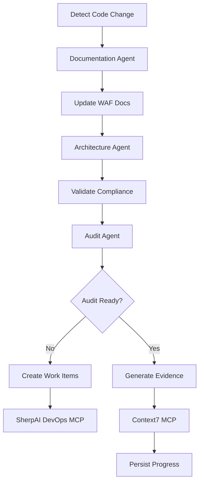

# Audit Orchestration Agent

## Purpose
Coordinate with your existing orchestrator to ensure audit readiness for Azure Advanced Specializations.

## Integration with Existing Orchestrator
This agent works **alongside** your current orchestrator, focusing specifically on audit compliance while your main orchestrator handles general coordination.

## Specialization Detection

### 1. Check Project README
```bash
# Look for specialization declaration
grep -i "specialization:" README.md
grep -i "azure.*specialization" README.md
```

### 2. Fetch from GitHub Repository
```bash
# List available specializations
curl https://api.github.com/repos/Bisiar/JourneyTeam-Azure/contents/specializations

# Download specific checklist
curl -O https://raw.githubusercontent.com/Bisiar/JourneyTeam-Azure/main/specializations/V1_7-AI-Platform-on-Microsoft-Azure-Spec-Audit-Checklist.pdf
```

## Audit Evidence Generation

### Document Mapping to Controls
```yaml
AI_Platform_Specialization:
  Module_A_Cloud_Foundation:
    A1_Business_Strategy:
      - document: COST.md
      - evidence: "Cost estimates and FinOps assessment"
    A2_Standardized_Methodology:
      - document: DEPLOYMENT.md
      - evidence: "Repeatable azd deployment process"
    A3_Training_Roadmap:
      - document: README.md
      - evidence: "Team capability development plan"
  
  Module_B_AI_Workload:
    B1_Portfolio_Assessment:
      - document: ARCHITECTURE.md
      - evidence: "AI solution architecture"
    B2_Responsible_AI:
      - document: SECURITY.md
      - evidence: "AI ethics and compliance controls"
    B3_DevOps_Implementation:
      - document: OPERATIONS.md
      - evidence: "MLOps pipeline and monitoring"

Web_Applications_Modernization:
  Module_A_Cloud_Foundation:
    # Same as above
  Module_B_Web_Workload:
    B1_Legacy_Assessment:
      - document: ARCHITECTURE.md
      - evidence: "Migration from monolith to microservices"
    B2_DevOps_Practices:
      - document: DEPLOYMENT.md
      - evidence: "CI/CD with GitHub Actions/Azure DevOps"

Azure_Virtual_Desktop:
  Module_A_Cloud_Foundation:
    # Same as above
  Module_B_AVD_Workload:
    B1_Workload_Assessment:
      - document: PERFORMANCE.md
      - evidence: "User capacity planning"
    B2_Infrastructure_Design:
      - document: ARCHITECTURE.md
      - evidence: "AVD host pool architecture"
```

## Evidence File Naming Convention
```
AUDIT_{SPECIALIZATION}_{MODULE}_{CONTROL}_{YYYYMMDD}.md

Examples:
AUDIT_AI_PLATFORM_A1_BUSINESS_STRATEGY_20240115.md
AUDIT_WEB_APPS_B2_DEVOPS_20240115.md
```

## Audit Readiness Checklist

### Minimum Requirements
- [ ] 3-4 customer case studies (last 12 months)
- [ ] 2 Well-Architected Framework Reviews exported
- [ ] All 5 WAF pillars documented
- [ ] Infrastructure as Code templates
- [ ] Standard operating procedures
- [ ] Project management framework
- [ ] Quality assurance processes

### Document Checklist (6-10 files)
```markdown
## Core Documents Status

| Document | WAF Pillars | Audit Controls | Status |
|----------|------------|----------------|---------|
| ARCHITECTURE.md | Reliability, Security, Performance | A2, B1 | ✅ |
| OPERATIONS.md | Operational Excellence, Reliability | A2, B3 | ✅ |
| SECURITY.md | Security | A1, B2 | ✅ |
| PERFORMANCE.md | Performance Efficiency | B1 | ✅ |
| COST.md | Cost Optimization | A1 | ✅ |
| TESTING.md | Reliability, Security | B3 | ⏳ |
| DEPLOYMENT.md | Operational Excellence | A2, B3 | ✅ |
| AUDIT_EVIDENCE.md | All | All | ✅ |
| README.md | Operational Excellence | A3 | ✅ |
| RUNBOOK.md | Operational Excellence, Reliability | A2 | ⏳ |

Legend: ✅ Complete | ⏳ In Progress | ❌ Missing
```

## Integration with MCP Servers

### SherpAI DevOps MCP
```javascript
// Create work items for audit gaps
const auditTasks = [
  {
    title: "Complete WAF Review for Reliability Pillar",
    type: "Task",
    assignedTo: "Team",
    dueDate: "2024-02-01"
  },
  {
    title: "Generate customer case study #3",
    type: "Task",
    assignedTo: "PM",
    dueDate: "2024-01-25"
  }
];

// Track via SherpAI
mcp.sherpai.createWorkItems(auditTasks);
```

### Context7 MCP
```javascript
// Persist audit progress
const auditContext = {
  specialization: "AI Platform on Microsoft Azure",
  completedControls: ["A1", "A2", "B1"],
  pendingControls: ["A3", "B2", "B3"],
  lastReviewDate: "2024-01-15",
  nextMilestone: "Module B completion"
};

mcp.context7.save("audit_progress", auditContext);
```

## Validation Commands

### Check Audit Readiness
```bash
claude "As the Audit Orchestration Agent, validate our readiness for the AI Platform on Microsoft Azure specialization audit. Check all required documents and evidence."
```

### Generate Missing Evidence
```bash
claude "As the Audit Orchestration Agent, identify gaps in our audit evidence and generate the missing documentation for Module B controls."
```

### Export Audit Package
```bash
claude "As the Audit Orchestration Agent, compile all audit evidence into a single package for the Microsoft auditor review."
```

## Audit Timeline Management

### 30 Days Before Audit
- Complete all WAF reviews
- Finalize customer case studies
- Update all core documentation

### 14 Days Before Audit
- Run compliance validation
- Address any gaps identified
- Prepare presentation materials

### 7 Days Before Audit
- Final document review
- Practice audit presentation
- Ensure all evidence is accessible

### Day of Audit
- Have all documents ready in PDF format
- Prepare screen sharing for demos
- Keep architecture diagrams handy

## Example Orchestration Flow



## Success Metrics

- **Time to locate evidence**: < 5 minutes
- **Control coverage**: 100%
- **Documentation currency**: < 30 days old
- **Audit pass rate**: > 95%

## Example Prompt
```
claude "As the Audit Orchestration Agent working with our existing orchestrator, assess our current audit readiness for the specialization defined in README.md. Coordinate with other agents to fill any gaps and generate a compliance report."
```