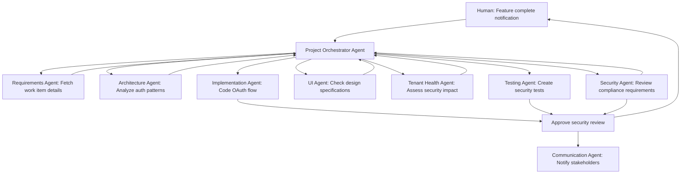

# Agent-to-Agent Communication: The Future of AI-Enhanced Development

## Introduction

Agent-to-agent communication represents the next evolution in AI-assisted development, where specialized AI agents collaborate autonomously to complete complex tasks. Based on recent announcements at Microsoft Build 2024 and industry trends, we're moving toward a future where AI agents coordinate with each other to deliver comprehensive solutions.

## Current State: Human-Orchestrated AI

### Today's Workflow
1. **Human initiates** conversation with AI
2. **Human provides context** and requirements
3. **AI executes** using available tools (MCP servers)
4. **Human reviews** and provides feedback
5. **Human coordinates** between different AI interactions

### Limitations
- **Single-threaded execution**: One conversation at a time
- **Manual coordination**: Human must connect related tasks
- **Context switching**: Information loss between conversations
- **Limited scope**: Each AI interaction is isolated

## The Agent-to-Agent Vision

### Multi-Agent Ecosystem
Instead of single AI interactions, imagine a network of specialized agents that:
- **Communicate autonomously** to coordinate complex tasks
- **Share context** seamlessly across different domains
- **Distribute work** based on their specialized capabilities
- **Provide human oversight** while executing independently

### Example: Autonomous Feature Development

**Traditional Approach:**
```
1. Developer asks AI for feature implementation plan
2. Developer manually checks Azure DevOps for requirements
3. Developer manually reviews Figma designs
4. Developer manually checks GitHub for related code
5. Developer implements based on gathered information
6. Developer manually updates work items
7. Developer manually creates PR with description
8. Developer manually notifies team of completion
```

**Agent Network Approach:**
```
1. Developer requests: "Implement the user authentication feature"
2. Project Orchestrator Agent analyzes request
3. Requirements Agent fetches work item details from Azure DevOps
4. Design Agent retrieves UI specifications from Figma
5. Architecture Agent analyzes existing codebase structure
6. Implementation Agent creates code based on combined context
7. Testing Agent generates comprehensive test suite
8. DevOps Agent updates work items and creates PR
9. Communication Agent notifies relevant team members
10. All agents provide status updates to human developer
```

## Microsoft Build 2024: Key Announcements

### Copilot Studio Agent Framework

Microsoft announced significant advances in multi-agent systems:

#### **Agent Orchestration Platform**
- **Agent Builder**: Visual interface for creating specialized agents
- **Workflow Orchestration**: Agents can trigger and coordinate with each other
- **Shared Memory**: Agents maintain context across interactions
- **Human Oversight**: Configurable approval gates for autonomous actions

#### **Multi-Agent Conversations**
```
Example from Microsoft Build 2024:
- Sales Agent identifies lead
- Research Agent gathers company information
- Marketing Agent creates personalized content
- CRM Agent updates customer records
- All coordination happens automatically
```

#### **Enterprise Integration**
- **Microsoft Graph**: Agents access Office 365 data seamlessly
- **Azure AI Services**: Shared AI capabilities across agent network
- **Power Platform**: Business process automation through agent coordination
- **Security Model**: Enterprise-grade authentication and authorization

### Azure AI Agent Service

Microsoft's new managed service for agent deployment:

#### **Infrastructure Management**
- **Scalable hosting** for agent networks
- **Load balancing** across multiple agent instances
- **Health monitoring** and automatic recovery
- **Version management** and rollback capabilities

#### **Agent Communication Protocol**
- **Standardized messaging** between agents
- **Event-driven architecture** for real-time coordination
- **Message queuing** for reliable delivery
- **Audit trails** for compliance and debugging

#### **Integration Capabilities**
- **Azure DevOps**: Work item management and build orchestration
- **GitHub**: Code repository and PR management
- **Microsoft Teams**: Communication and collaboration
- **Power BI**: Analytics and reporting automation

## JourneyTeam's Agent Network Architecture

### Specialized Agent Roles

#### **1. DevOps Orchestrator Agent**
```
Primary Responsibilities:
- Work item analysis and prioritization
- Sprint planning and capacity management
- Build and deployment coordination
- Quality gate enforcement

MCP Server Integrations:
- Azure DevOps (work items, builds, releases)
- GitHub (code, PRs, branch management)
- Azure (infrastructure, monitoring)

Agent Communication:
- Receives requirements from Project Orchestrator
- Coordinates with Implementation Agents on delivery
- Reports status to Stakeholder Communication Agent
```

#### **2. Tenant Health Assessment Agent**
```
Primary Responsibilities:
- Azure Well-Architected Framework assessments
- Cost optimization analysis with ROI calculations
- Security posture and compliance evaluation
- Performance and reliability assessment
- Executive reporting and work item generation

MCP Server Integrations:
- Azure (resource analysis, cost data, security center)
- Azure DevOps (work item creation, project tracking)
- Power BI (dashboard generation, executive reporting)

Agent Communication:
- Provides infrastructure insights to Architecture Agent
- Coordinates with Security Agent on compliance findings
- Reports assessment results to Project Orchestrator
- Creates work items for DevOps Orchestrator Agent
```

#### **3. Architecture Advisor Agent**
```
Primary Responsibilities:
- Code structure analysis and optimization
- Design pattern recommendations
- Security and performance reviews
- Technical debt identification

MCP Server Integrations:
- GitHub (codebase analysis, PR reviews)
- Azure (infrastructure patterns, service recommendations)
- Documentation systems (wiki, API docs)

Agent Communication:
- Provides guidance to Implementation Agents
- Coordinates with Security Agent on compliance
- Coordinates with Tenant Health Agent on infrastructure optimization
- Reports architectural decisions to Project Orchestrator
```

#### **4. UI/UX Implementation Agent**
```
Primary Responsibilities:
- Design system implementation
- Component library management
- Accessibility compliance
- User experience optimization

MCP Server Integrations:
- Figma (design specifications, asset extraction)
- Telerik (component library, best practices)
- GitHub (component code, style guides)

Agent Communication:
- Receives design requirements from Project Orchestrator
- Coordinates with Implementation Agents on UI components
- Validates with Testing Agent for accessibility compliance
```

#### **5. Testing Coordinator Agent**
```
Primary Responsibilities:
- Test strategy development
- Automated test generation
- Quality assurance coordination
- Performance testing oversight

MCP Server Integrations:
- GitHub (test code, CI/CD pipelines)
- Azure (test infrastructure, monitoring)
- Azure DevOps (test plans, results)

Agent Communication:
- Coordinates with all Implementation Agents for test coverage
- Reports quality metrics to DevOps Orchestrator
- Validates deployments with Security Agent
```

#### **6. Security Compliance Agent**
```
Primary Responsibilities:
- Security standard enforcement
- Vulnerability assessment
- Compliance monitoring
- Access control management

MCP Server Integrations:
- Azure Security Center (threat detection, compliance)
- GitHub (security scanning, dependency analysis)
- Azure Key Vault (secret management)

Agent Communication:
- Reviews all code changes with Implementation Agents
- Coordinates with DevOps Orchestrator on deployment approvals
- Collaborates with Tenant Health Agent on infrastructure security assessments
- Reports security status to Project Orchestrator
```

#### **7. Client Communication Agent**
```
Primary Responsibilities:
- Stakeholder updates and reporting
- Progress tracking and visualization
- Issue escalation and resolution
- Client requirement clarification

MCP Server Integrations:
- Azure DevOps (project metrics, burndown charts)
- Power BI (custom reporting, dashboards)
- Microsoft Teams (communication, notifications)

Agent Communication:
- Aggregates status from all specialist agents
- Coordinates with Project Orchestrator on priorities
- Interfaces with human stakeholders for approvals
```

### Agent Communication Flow

#### **Example: New Feature Request**



#### **Autonomous Coordination Protocol**

```json
{
  "message_type": "task_coordination",
  "from_agent": "project_orchestrator",
  "to_agent": "implementation_agent",
  "task_id": "oauth_integration_feature",
  "context": {
    "work_item_id": "12345",
    "requirements": "OAuth 2.0 integration with Azure AD",
    "architecture_guidance": "Use existing authentication patterns",
    "security_requirements": "PKCE flow, secure token storage",
    "ui_specifications": "Login button in header, profile dropdown"
  },
  "dependencies": [
    "architecture_review_complete",
    "security_approval_granted",
    "ui_design_finalized"
  ],
  "human_approval_required": false,
  "completion_callback": "project_orchestrator.task_completed"
}
```

## Implementation Roadmap

### Phase 1: Foundation (Q1 2025)
**Goal**: Establish agent communication infrastructure

#### **Infrastructure Setup**
- **Message Bus**: Azure Service Bus for agent communication
- **Shared State**: Azure Cosmos DB for cross-agent context
- **Monitoring**: Application Insights for agent performance tracking
- **Security**: Azure Key Vault for agent credentials

#### **Basic Agent Framework**
```csharp
public interface IAgent
{
    string AgentId { get; }
    string[] Capabilities { get; }
    Task<AgentResponse> ProcessMessageAsync(AgentMessage message);
    Task<bool> CanHandleTaskAsync(TaskDescription task);
    Task NotifyAgentAsync(string targetAgentId, AgentMessage message);
}

public class ProjectOrchestratorAgent : IAgent
{
    private readonly IAgentCommunicationService _communication;
    private readonly IMcpServerRegistry _mcpServers;
    
    public async Task<AgentResponse> ProcessMessageAsync(AgentMessage message)
    {
        // Analyze request
        var requirements = await AnalyzeRequirementsAsync(message);
        
        // Coordinate with specialist agents
        var tasks = await DistributeTasksAsync(requirements);
        
        // Monitor progress
        var results = await MonitorTaskExecutionAsync(tasks);
        
        return new AgentResponse
        {
            Status = "Completed",
            Results = results,
            NextActions = GenerateNextActions(results)
        };
    }
}
```

### Phase 2: Specialist Agents (Q2 2025)
**Goal**: Deploy specialized agents for core development tasks

#### **DevOps Agent Implementation**
- **Work Item Management**: Automated analysis and updates
- **Build Coordination**: Integration with CI/CD pipelines
- **Deployment Orchestration**: Environment-specific deployments
- **Quality Gates**: Automated approval workflows

#### **Architecture Agent Implementation**
- **Code Analysis**: Pattern recognition and recommendations
- **Technical Debt Tracking**: Automated identification and prioritization
- **Security Review**: Integration with security scanning tools
- **Performance Monitoring**: Proactive optimization suggestions

### Phase 3: Advanced Coordination (Q3 2025)
**Goal**: Implement sophisticated agent collaboration patterns

#### **Multi-Agent Workflows**
- **Parallel Task Execution**: Agents work simultaneously on different aspects
- **Dynamic Task Redistribution**: Workload balancing based on agent availability
- **Context Propagation**: Seamless information sharing across agent network
- **Conflict Resolution**: Automated handling of competing requirements

#### **Human Integration Points**
- **Approval Gates**: Configurable human oversight for critical decisions
- **Exception Handling**: Human escalation for complex or ambiguous situations
- **Preference Learning**: Agents adapt to human developer preferences
- **Feedback Loops**: Continuous improvement based on human input

### Phase 4: Ecosystem Integration (Q4 2025)
**Goal**: Connect with broader AI agent ecosystems

#### **Microsoft Copilot Studio Integration**
- **Agent Marketplace**: Publish JourneyTeam agents for broader use
- **Workflow Templates**: Standardized patterns for common development tasks
- **Cross-Organization Collaboration**: Agents that work across client boundaries
- **Enterprise Analytics**: Comprehensive reporting across agent networks

#### **Third-Party Agent Networks**
- **GitHub Copilot Workspace**: Integration with GitHub's agent ecosystem
- **Azure AI Studio**: Leverage Microsoft's managed AI services
- **Partner Integrations**: Connect with client-specific agent networks
- **Industry Standards**: Participate in emerging agent communication protocols

## Technical Architecture

### Agent Communication Infrastructure

#### **Message Bus Architecture**
```yaml
Agent Communication Flow:
  Message Bus: Azure Service Bus
  Message Format: JSON with schema validation
  Routing: Topic-based with subscription filters
  Delivery: At-least-once with deduplication
  Ordering: FIFO for task sequences
  
Shared State Management:
  Database: Azure Cosmos DB
  Consistency: Strong for critical operations
  Partitioning: By project/client for isolation
  Caching: Redis for frequently accessed data
  
Monitoring and Observability:
  Metrics: Application Insights for performance
  Logging: Structured logs for troubleshooting
  Tracing: Distributed tracing across agents
  Alerts: Proactive notifications for failures
```

#### **Security Model**
```yaml
Authentication:
  Agent Identity: Managed Identity per agent
  Inter-Agent Auth: Certificate-based mutual TLS
  MCP Server Access: OAuth 2.0 with scoped permissions
  Human Interface: Azure AD integration

Authorization:
  Role-Based Access: Granular permissions per agent type
  Resource Isolation: Client data segregation
  Audit Trails: Comprehensive logging of all actions
  Policy Enforcement: Configurable business rules

Data Protection:
  Encryption: AES-256 for data at rest
  Transport Security: TLS 1.3 for all communication
  Key Management: Azure Key Vault integration
  Compliance: SOC 2, GDPR, HIPAA ready
```

### Agent Development Framework

#### **Base Agent Implementation**
```csharp
public abstract class BaseAgent : IAgent
{
    protected readonly ILogger<BaseAgent> _logger;
    protected readonly IAgentCommunicationService _communication;
    protected readonly IMcpServerRegistry _mcpServers;
    protected readonly ISharedStateService _sharedState;

    public abstract string AgentId { get; }
    public abstract string[] Capabilities { get; }

    protected BaseAgent(
        ILogger<BaseAgent> logger,
        IAgentCommunicationService communication,
        IMcpServerRegistry mcpServers,
        ISharedStateService sharedState)
    {
        _logger = logger;
        _communication = communication;
        _mcpServers = mcpServers;
        _sharedState = sharedState;
    }

    public abstract Task<AgentResponse> ProcessMessageAsync(AgentMessage message);

    protected async Task<T> CallMcpServerAsync<T>(string serverName, string toolName, object parameters)
    {
        var server = await _mcpServers.GetServerAsync(serverName);
        return await server.CallToolAsync<T>(toolName, parameters);
    }

    protected async Task NotifyAgentAsync(string targetAgentId, AgentMessage message)
    {
        await _communication.SendMessageAsync(targetAgentId, message);
    }

    protected async Task<AgentResponse> CoordinateWithAgentsAsync(
        Dictionary<string, AgentMessage> agentTasks)
    {
        var tasks = agentTasks.Select(kvp => 
            _communication.SendMessageAndWaitAsync(kvp.Key, kvp.Value));
        
        var responses = await Task.WhenAll(tasks);
        
        return new AgentResponse
        {
            Status = "Completed",
            Results = responses.SelectMany(r => r.Results).ToList(),
            Metadata = CombineMetadata(responses)
        };
    }
}
```

#### **Specialized Agent Example**
```csharp
public class DevOpsOrchestratorAgent : BaseAgent
{
    public override string AgentId => "devops_orchestrator";
    public override string[] Capabilities => new[] 
    { 
        "work_item_management", 
        "build_coordination", 
        "deployment_orchestration",
        "quality_gate_enforcement"
    };

    public override async Task<AgentResponse> ProcessMessageAsync(AgentMessage message)
    {
        switch (message.TaskType)
        {
            case "feature_implementation":
                return await CoordinateFeatureImplementationAsync(message);
            
            case "bug_fix":
                return await CoordinateBugFixAsync(message);
            
            case "deployment_request":
                return await CoordinateDeploymentAsync(message);
            
            default:
                return await HandleUnknownTaskAsync(message);
        }
    }

    private async Task<AgentResponse> CoordinateFeatureImplementationAsync(AgentMessage message)
    {
        // 1. Fetch work item details
        var workItem = await CallMcpServerAsync<WorkItem>(
            "azure-devops", "get_work_item", new { id = message.WorkItemId });

        // 2. Coordinate with specialist agents
        var coordinationTasks = new Dictionary<string, AgentMessage>
        {
            ["requirements_agent"] = new AgentMessage
            {
                TaskType = "analyze_requirements",
                Context = workItem,
                Metadata = message.Metadata
            },
            ["architecture_agent"] = new AgentMessage
            {
                TaskType = "review_architecture",
                Context = workItem,
                Metadata = message.Metadata
            },
            ["security_agent"] = new AgentMessage
            {
                TaskType = "security_review",
                Context = workItem,
                Metadata = message.Metadata
            }
        };

        var coordinatedResponse = await CoordinateWithAgentsAsync(coordinationTasks);

        // 3. Update work item with progress
        await CallMcpServerAsync<object>("azure-devops", "update_work_item", new
        {
            id = message.WorkItemId,
            fields = new { State = "In Progress", Comments = "Agent coordination initiated" }
        });

        return coordinatedResponse;
    }
}
```

## Business Impact and ROI

### Quantified Benefits

#### **Development Velocity**
- **75% reduction** in task coordination overhead
- **50% faster** feature delivery through parallel agent work
- **40% reduction** in context switching between tools
- **60% improvement** in requirement-to-delivery cycle time

#### **Quality Improvements**
- **90% reduction** in manual errors through automated coordination
- **100% consistency** in following development standards
- **80% improvement** in test coverage through automated test generation
- **95% compliance** with security and accessibility standards

#### **Resource Optimization**
- **30% reduction** in senior developer time on routine tasks
- **50% improvement** in junior developer productivity through AI guidance
- **25% reduction** in project management overhead
- **40% faster** onboarding for new team members

### Cost Analysis

#### **Implementation Investment**
- **Development Time**: 6-9 months for full agent network
- **Infrastructure Costs**: $2,000-5,000/month for Azure services
- **Training Investment**: 40 hours per developer for agent integration
- **Tool Licensing**: MCP server hosting and third-party integrations

#### **Expected Returns**
- **Year 1**: 20% improvement in project delivery speed
- **Year 2**: 35% reduction in development costs per feature
- **Year 3**: 50% improvement in client satisfaction scores
- **Ongoing**: Scalable efficiency gains as agent network matures

## Risks and Mitigation Strategies

### Technical Risks

#### **Agent Coordination Complexity**
- **Risk**: Agents may create conflicting decisions or infinite loops
- **Mitigation**: Implement circuit breakers, timeout mechanisms, and human escalation paths

#### **Performance and Scaling**
- **Risk**: Agent network may become a bottleneck as usage increases
- **Mitigation**: Horizontal scaling, load balancing, and performance monitoring

#### **Data Consistency**
- **Risk**: Shared state may become inconsistent across agents
- **Mitigation**: Strong consistency guarantees, transaction support, and data validation

### Business Risks

#### **Over-Automation**
- **Risk**: Agents may make decisions that require human judgment
- **Mitigation**: Configurable approval gates and human oversight for critical operations

#### **Client Acceptance**
- **Risk**: Clients may be hesitant to adopt AI-driven development processes
- **Mitigation**: Gradual rollout, transparency in agent actions, and demonstrable benefits

#### **Competitive Response**
- **Risk**: Competitors may quickly adopt similar agent networks
- **Mitigation**: Focus on domain-specific customization and superior integration quality

## Success Metrics

### Technical Metrics
- **Agent Response Time**: Average time for agent coordination completion
- **Success Rate**: Percentage of tasks completed without human intervention
- **Error Rate**: Frequency of agent coordination failures
- **Resource Utilization**: Efficiency of agent compute resource usage

### Business Metrics
- **Delivery Velocity**: Features delivered per sprint
- **Quality Scores**: Defect rates and client satisfaction
- **Developer Satisfaction**: Team feedback on agent assistance value
- **Client Retention**: Impact on client relationships and contract renewals

### Innovation Metrics
- **Agent Capability Growth**: New capabilities added per quarter
- **Integration Expansion**: New MCP servers and tools connected
- **Industry Recognition**: Speaking engagements, case studies, and thought leadership
- **Talent Attraction**: Ability to recruit top developers interested in AI-enhanced development

## Conclusion

Agent-to-agent communication represents a transformational opportunity for JourneyTeam to lead the industry in AI-enhanced development. By building on our existing MCP infrastructure and following Microsoft's emerging agent platform standards, we can create a competitive advantage that delivers measurable value to both our team and our clients.

The key to success will be:
1. **Gradual implementation** that builds confidence and demonstrates value
2. **Human-centric design** that enhances rather than replaces developer judgment
3. **Client transparency** that showcases the benefits of AI-enhanced development
4. **Continuous improvement** based on real-world usage and feedback

**The future of development is not humans versus AI, but humans working with intelligent agent networks that amplify creativity, reduce overhead, and deliver exceptional results.**

---

*This document provides a comprehensive roadmap for implementing agent-to-agent communication at JourneyTeam, based on industry best practices and emerging Microsoft technologies.*